# 代理服务器模块

<cite>
**本文档引用的文件**
- [server.go](file://src/fnproxy/server.go)
- [main.go](file://src/main.go)
- [manager.go](file://src/config/manager.go)
- [models.go](file://src/models/models.go)
- [process_control.go](file://src/process_control.go)
- [api.go](file://src/handlers/api.go)
</cite>

## 目录
1. [简介](#简介)
2. [项目结构](#项目结构)
3. [核心组件](#核心组件)
4. [架构概览](#架构概览)
5. [详细组件分析](#详细组件分析)
6. [依赖关系分析](#依赖关系分析)
7. [性能考虑](#性能考虑)
8. [故障排除指南](#故障排除指南)
9. [结论](#结论)

## 简介

代理服务器模块是一个高性能的反向代理系统，基于 Go 语言开发，提供了完整的 Web 代理解决方案。该模块实现了单例模式、动态路由配置、热重载机制，并支持多种服务类型的处理器创建，包括反向代理、静态文件、重定向、URL 跳转和文本输出等。

该系统采用优雅的架构设计，支持 WebSocket 代理、OAuth 认证、证书管理和监控统计等功能，适用于企业级应用部署和管理后台服务。

## 项目结构

代理服务器模块位于 `src/fnproxy` 目录下，主要包含以下核心文件：

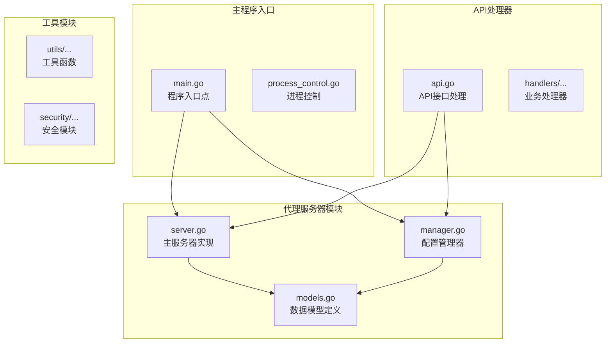

**图表来源**
- [server.go:1-50](file://src/fnproxy/server.go#L1-L50)
- [main.go:1-50](file://src/main.go#L1-L50)
- [manager.go:1-50](file://src/config/manager.go#L1-L50)

**章节来源**
- [server.go:1-100](file://src/fnproxy/server.go#L1-L100)
- [main.go:1-100](file://src/main.go#L1-L100)
- [manager.go:1-100](file://src/config/manager.go#L1-L100)

## 核心组件

### 服务器架构

代理服务器采用单例模式实现，确保整个应用程序中只有一个服务器实例。服务器核心结构如下：

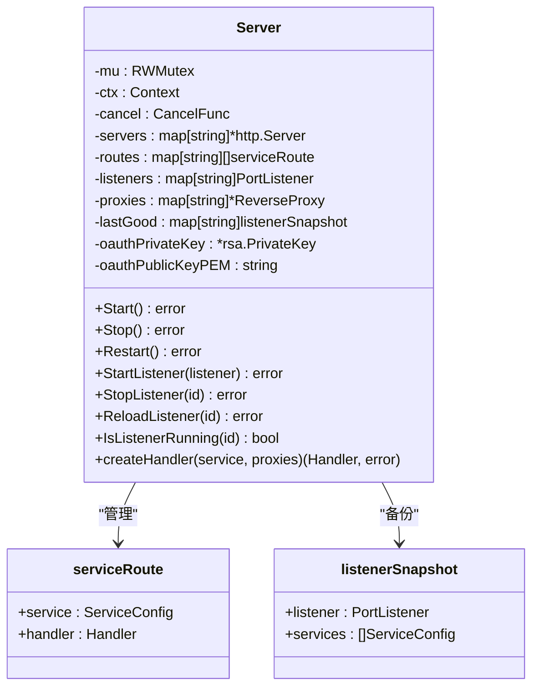

**图表来源**
- [server.go:37-59](file://src/fnproxy/server.go#L37-L59)

### 数据模型

系统使用强类型的数据模型来定义配置结构：

```mermaid
classDiagram
class AppConfig {
+Global : GlobalConfig
+Listeners : []PortListener
+Services : []ServiceConfig
+Certs : []CertificateConfig
+Users : []User
+SSH : []SSHConnection
+Firewall : *FirewallConfig
}
class ServiceConfig {
+ID : string
+PortID : string
+Name : string
+Type : ServiceType
+Domain : string
+SortOrder : int
+CertificateID : string
+Enabled : bool
+Config : interface{}
+RequireAuth : bool
+CreatedAt : time.Time
+UpdatedAt : time.Time
}
class PortListener {
+ID : string
+Port : int
+Protocol : string
+Enabled : bool
+CreatedAt : time.Time
+UpdatedAt : time.Time
}
class GlobalConfig {
+AdminPort : int
+DefaultAuth : bool
+LogLevel : string
+LogFile : string
+LogRetentionDays : int
+MaxAccessLogEntries : int
+MaxSecurityLogEntries : int
+CertificateConfigPath : string
+CertificateSyncIntervalSeconds : int
}
AppConfig --> ServiceConfig : "包含"
AppConfig --> PortListener : "包含"
AppConfig --> GlobalConfig : "包含"
```

**图表来源**
- [models.go:72-107](file://src/models/models.go#L72-L107)
- [models.go:283-394](file://src/models/models.go#L283-L394)

**章节来源**
- [server.go:37-59](file://src/fnproxy/server.go#L37-L59)
- [models.go:72-107](file://src/models/models.go#L72-L107)
- [models.go:283-394](file://src/models/models.go#L283-L394)

## 架构概览

代理服务器采用分层架构设计，实现了清晰的关注点分离：

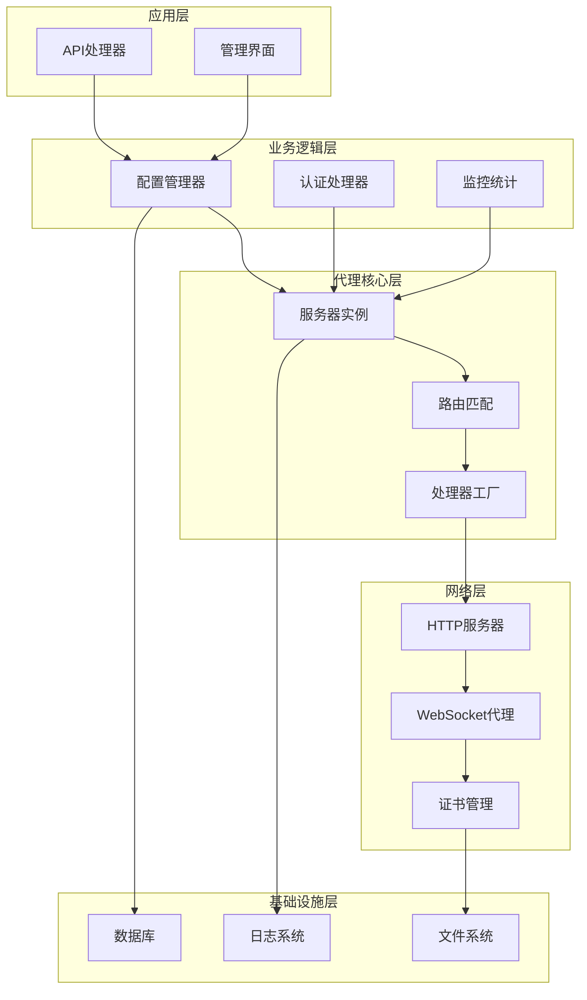

**图表来源**
- [server.go:183-226](file://src/fnproxy/server.go#L183-L226)
- [main.go:105-120](file://src/main.go#L105-L120)

## 详细组件分析

### 单例模式实现

服务器采用标准的单例模式实现，确保全局唯一性：

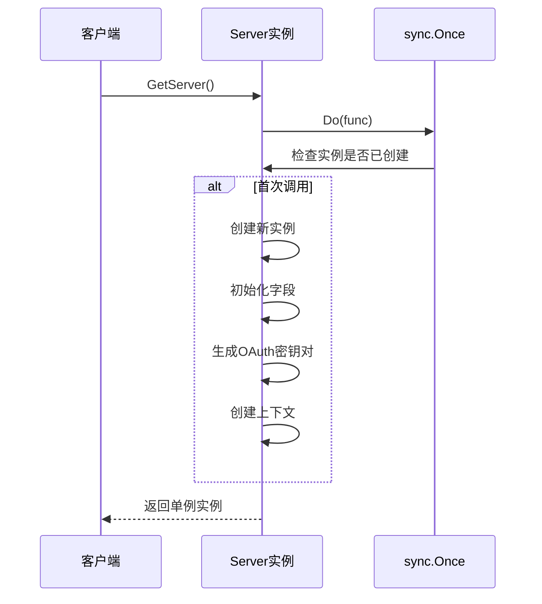

**图表来源**
- [server.go:163-181](file://src/fnproxy/server.go#L163-L181)

### 监听器管理机制

系统支持动态监听器管理，包括启动、停止和热重载：

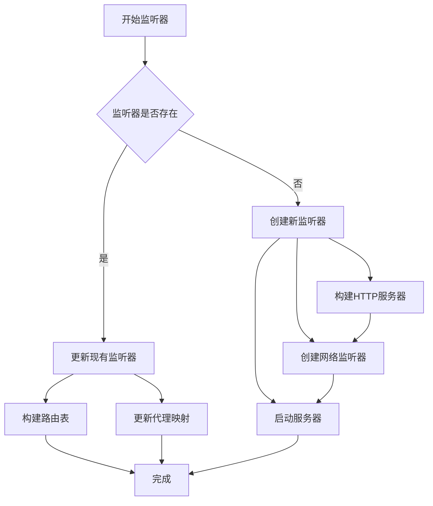

**图表来源**
- [server.go:370-425](file://src/fnproxy/server.go#L370-L425)

**章节来源**
- [server.go:163-181](file://src/fnproxy/server.go#L163-L181)
- [server.go:370-425](file://src/fnproxy/server.go#L370-L425)

### 动态路由配置

路由系统支持域名匹配和通配符支持：

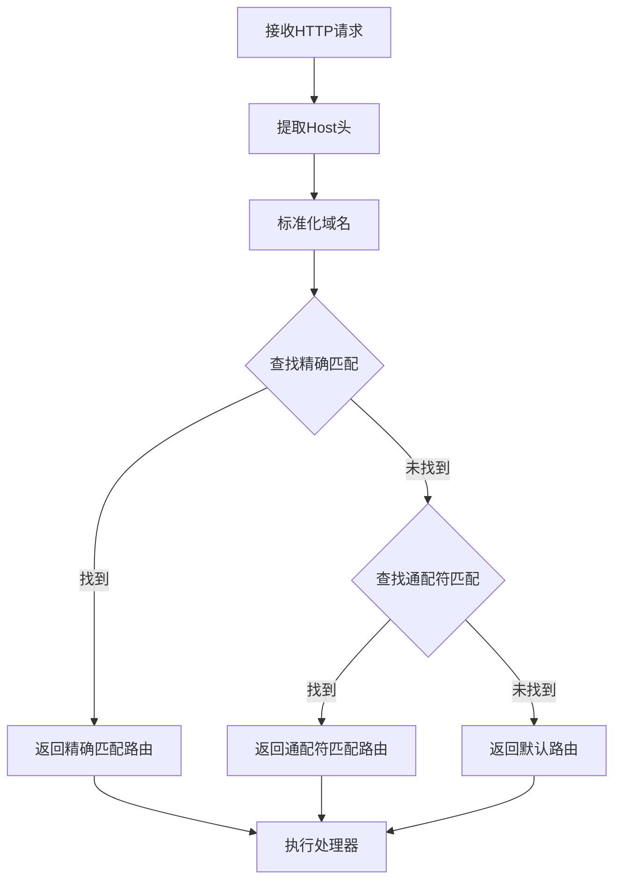

**图表来源**
- [server.go:1277-1321](file://src/fnproxy/server.go#L1277-L1321)

**章节来源**
- [server.go:1277-1321](file://src/fnproxy/server.go#L1277-L1321)

### 服务器启动和停止流程

系统实现了优雅的启动和停止流程：

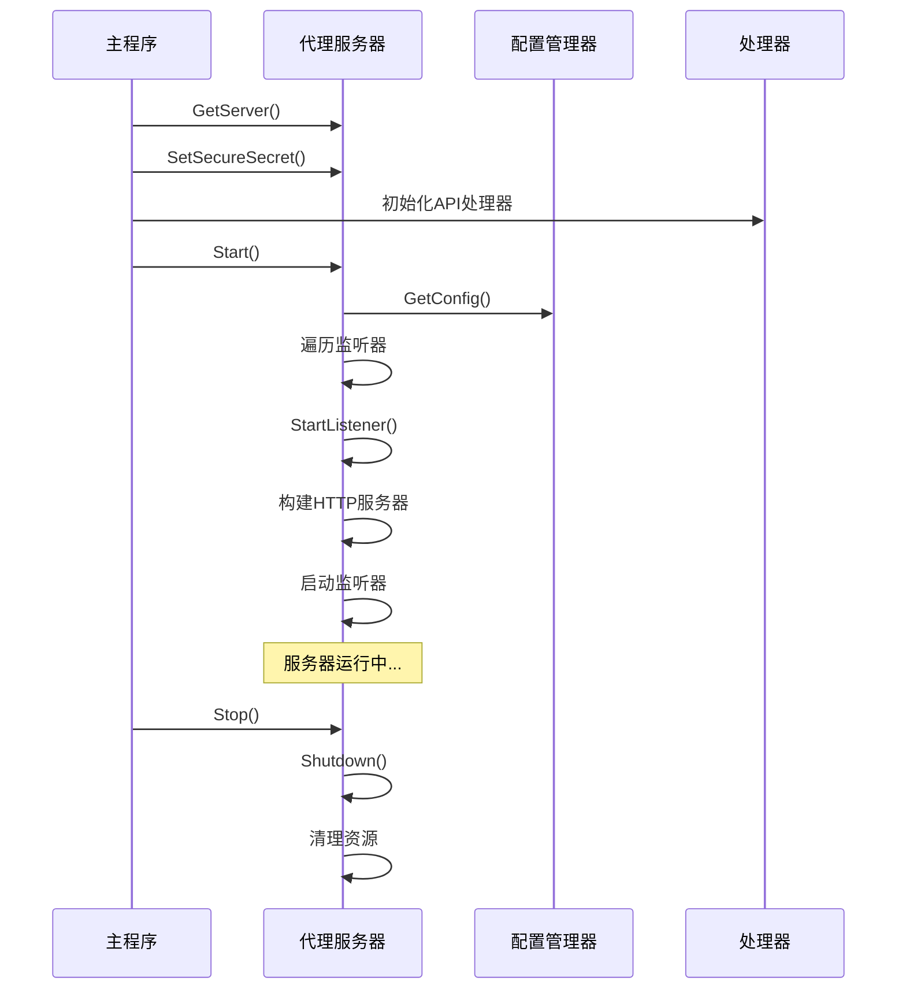

**图表来源**
- [main.go:475-496](file://src/main.go#L475-L496)
- [server.go:183-218](file://src/fnproxy/server.go#L183-L218)

**章节来源**
- [main.go:475-496](file://src/main.go#L475-L496)
- [server.go:183-218](file://src/fnproxy/server.go#L183-L218)

### 热重载机制实现原理

系统支持配置热重载，无需重启进程：

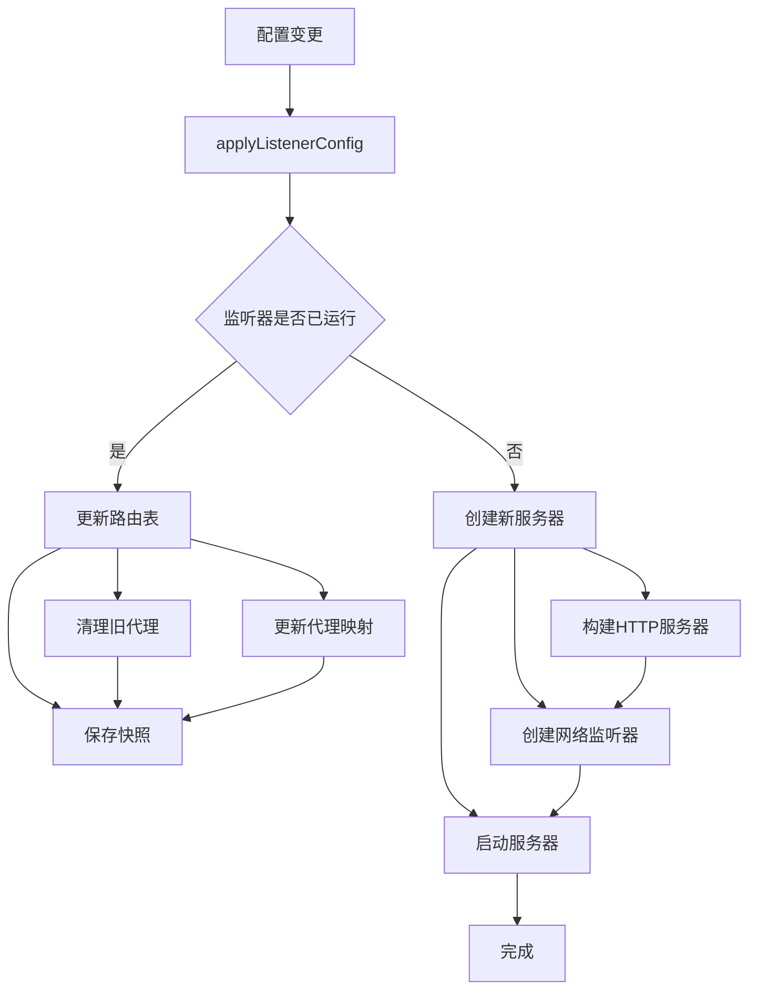

**图表来源**
- [server.go:370-425](file://src/fnproxy/server.go#L370-L425)

**章节来源**
- [server.go:370-425](file://src/fnproxy/server.go#L370-L425)

### 不同服务类型的处理器创建

系统支持五种不同的服务类型处理器：

#### 反向代理处理器

反向代理处理器是最复杂的处理器，支持多种高级配置：

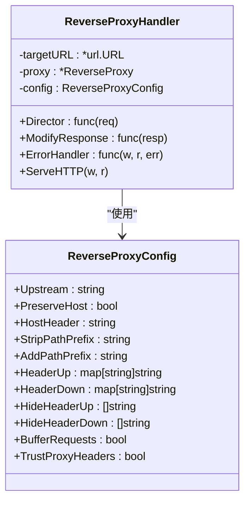

**图表来源**
- [server.go:460-584](file://src/fnproxy/server.go#L460-L584)
- [models.go:109-130](file://src/models/models.go#L109-L130)

#### 静态文件处理器

静态文件处理器提供目录浏览和文件服务功能：

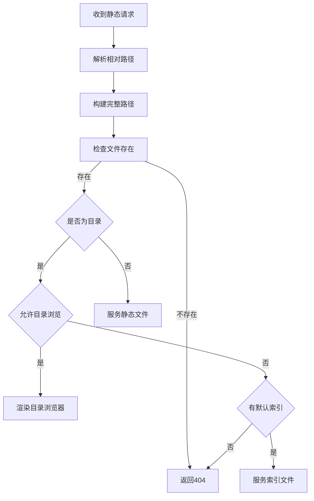

**图表来源**
- [server.go:804-852](file://src/fnproxy/server.go#L804-L852)

#### 重定向处理器

重定向处理器支持简单的 URL 重定向：

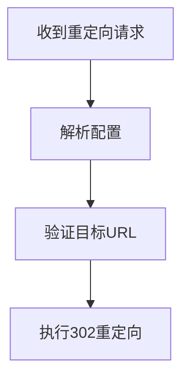

**图表来源**
- [server.go:1043-1063](file://src/fnproxy/server.go#L1043-L1063)

#### URL跳转处理器

URL跳转处理器支持路径保留的跳转：

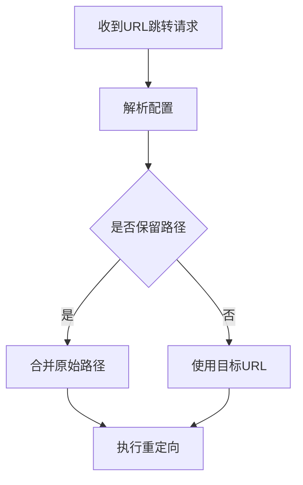

**图表来源**
- [server.go:1065-1089](file://src/fnproxy/server.go#L1065-L1089)

#### 文本输出处理器

文本输出处理器提供简单的内容输出：

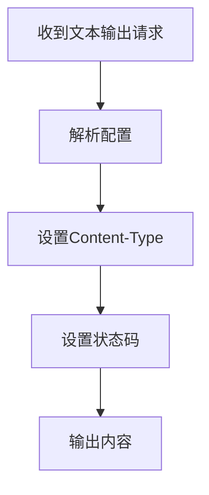

**图表来源**
- [server.go:1091-1117](file://src/fnproxy/server.go#L1091-L1117)

**章节来源**
- [server.go:442-458](file://src/fnproxy/server.go#L442-L458)
- [server.go:460-584](file://src/fnproxy/server.go#L460-L584)
- [server.go:804-852](file://src/fnproxy/server.go#L804-L852)
- [server.go:1043-1063](file://src/fnproxy/server.go#L1043-L1063)
- [server.go:1065-1089](file://src/fnproxy/server.go#L1065-L1089)
- [server.go:1091-1117](file://src/fnproxy/server.go#L1091-L1117)

### WebSocket 代理实现

WebSocket 代理实现了完整的双向消息转发：

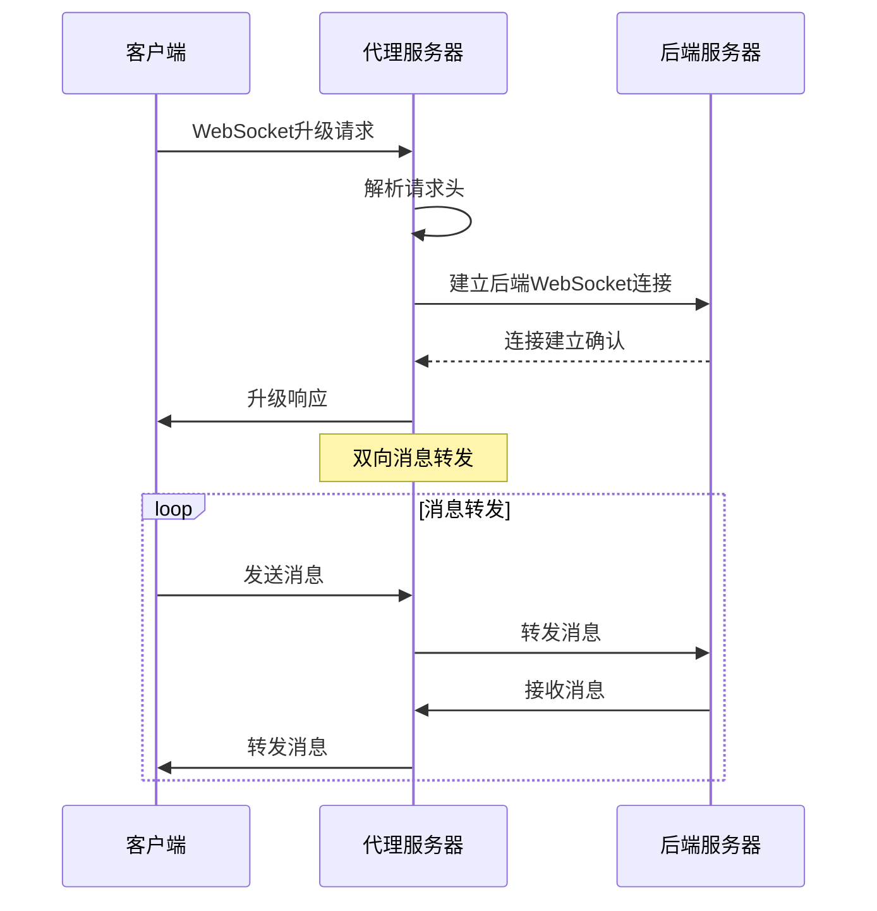

**图表来源**
- [server.go:639-781](file://src/fnproxy/server.go#L639-L781)

WebSocket 代理的关键特性包括：

1. **升级处理**: 使用 `gorilla/websocket` 库处理 WebSocket 升级
2. **消息转发**: 实现双向消息转发，支持文本和二进制消息
3. **连接管理**: 管理客户端和后端的连接生命周期
4. **头部处理**: 正确处理 WebSocket 特定的头部信息
5. **错误处理**: 提供完善的错误处理和日志记录

**章节来源**
- [server.go:639-781](file://src/fnproxy/server.go#L639-L781)

## 依赖关系分析

代理服务器模块的依赖关系如下：

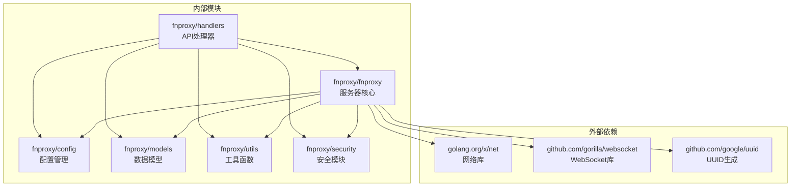

**图表来源**
- [server.go:3-35](file://src/fnproxy/server.go#L3-L35)
- [main.go:3-22](file://src/main.go#L3-L22)

**章节来源**
- [server.go:3-35](file://src/fnproxy/server.go#L3-L35)
- [main.go:3-22](file://src/main.go#L3-L22)

## 性能考虑

### 连接复用优化

系统使用全局共享的 HTTP Transport，启用了连接复用以提高性能：

- **最大空闲连接数**: 200
- **每主机最大空闲连接数**: 50  
- **每个主机最大连接数**: 100
- **空闲连接超时**: 90 秒
- **TLS 握手超时**: 10 秒
- **响应头超时**: 60 秒

### 内存管理

- 使用 `sync.RWMutex` 实现读写锁，平衡并发读写性能
- 采用快照机制进行配置热重载，避免配置切换时的竞态条件
- 实现响应记录器，跟踪请求处理状态和字节数

### 监控和统计

系统内置监控功能，提供实时性能指标：

- 请求计数和速率统计
- 连接数监控
- 网络流量统计
- 服务运行时状态

## 故障排除指南

### 常见问题诊断

#### 服务器启动失败

**症状**: 服务器无法启动或启动后立即退出

**可能原因**:
1. 端口被占用
2. 配置文件格式错误
3. 证书文件缺失或权限不足

**解决方法**:
1. 检查端口占用情况
2. 验证配置文件 JSON 格式
3. 确认证书文件路径和权限

#### 代理连接错误

**症状**: 反向代理请求失败

**可能原因**:
1. 上游服务器不可达
2. 代理配置错误
3. TLS 证书验证失败

**解决方法**:
1. 测试上游服务器连通性
2. 检查代理配置参数
3. 验证 TLS 证书设置

#### WebSocket 连接问题

**症状**: WebSocket 连接建立失败

**可能原因**:
1. 后端 WebSocket 服务器不支持
2. 代理头部处理错误
3. 防火墙阻止 WebSocket 连接

**解决方法**:
1. 验证后端 WebSocket 支持
2. 检查代理头部配置
3. 配置防火墙规则

### 日志分析

系统提供详细的日志记录功能：

1. **访问日志**: 记录所有请求的详细信息
2. **安全日志**: 记录认证和安全相关的事件
3. **代理错误日志**: 记录代理过程中的错误信息

**章节来源**
- [server.go:557-572](file://src/fnproxy/server.go#L557-L572)
- [server.go:1178-1251](file://src/fnproxy/server.go#L1178-L1251)

## 结论

代理服务器模块是一个功能完整、性能优异的企业级代理解决方案。其核心优势包括：

1. **架构设计**: 采用分层架构，职责分离清晰
2. **单例模式**: 确保全局唯一性和资源管理
3. **动态配置**: 支持热重载，无需停机维护
4. **多协议支持**: HTTP、HTTPS、WebSocket 全面支持
5. **安全机制**: OAuth 认证、证书管理、访问控制
6. **监控统计**: 实时性能监控和日志记录

该模块适合用于构建复杂的企业级应用代理系统，提供了丰富的扩展点和配置选项，能够满足各种代理场景的需求。