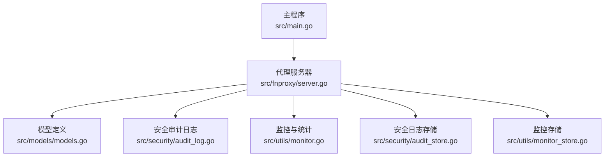
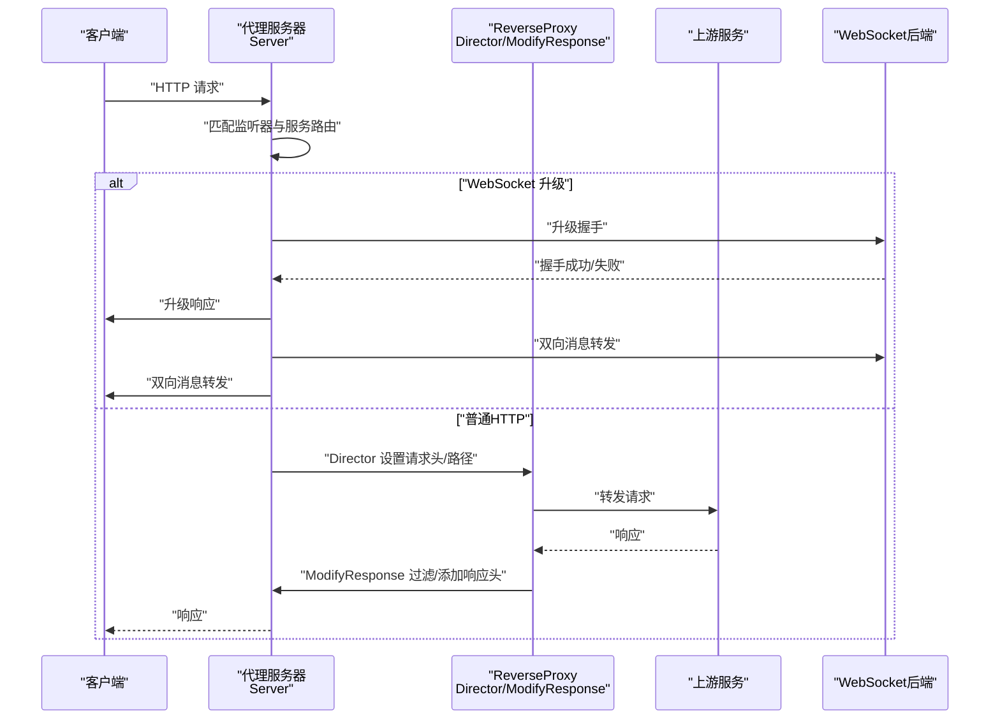
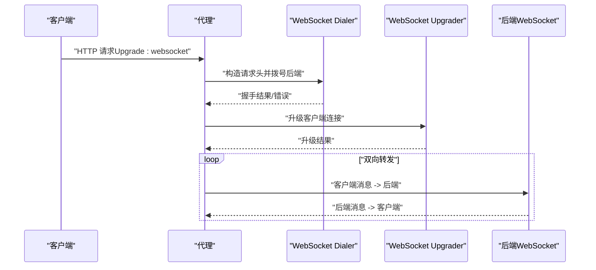
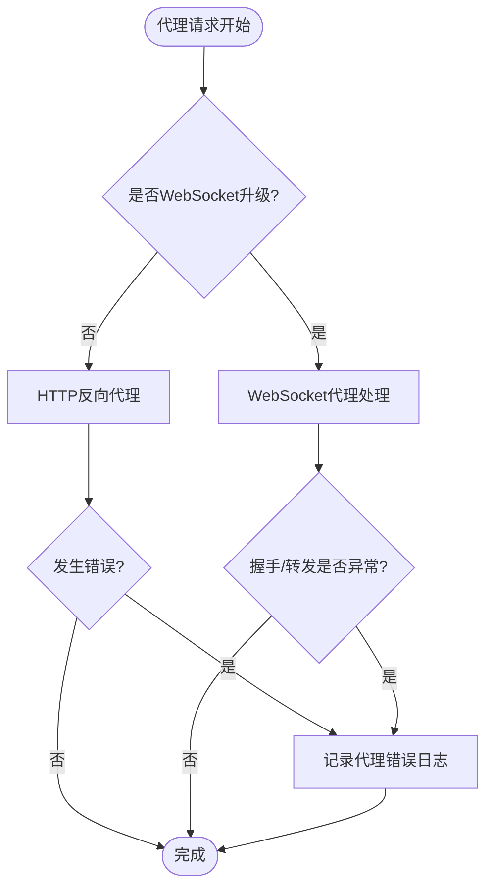
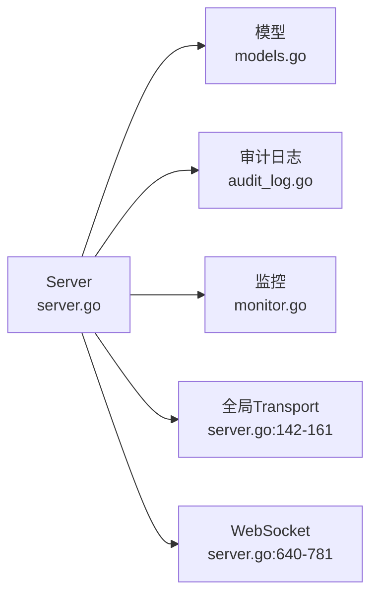

# 反向代理处理器

<cite>
**本文引用的文件**
- [server.go](file://src/fnproxy/server.go)
- [models.go](file://src/models/models.go)
- [main.go](file://src/main.go)
- [audit_log.go](file://src/security/audit_log.go)
- [audit_store.go](file://src/security/audit_store.go)
- [monitor.go](file://src/utils/monitor.go)
- [monitor_store.go](file://src/utils/monitor_store.go)
- [README.md](file://README.md)
</cite>

## 目录
1. [简介](#简介)
2. [项目结构](#项目结构)
3. [核心组件](#核心组件)
4. [架构总览](#架构总览)
5. [详细组件分析](#详细组件分析)
6. [依赖关系分析](#依赖关系分析)
7. [性能考量](#性能考量)
8. [故障排除指南](#故障排除指南)
9. [结论](#结论)

## 简介
本文件面向反向代理处理器的技术文档，系统性阐述基于 Go 标准库 httputil.ReverseProxy 的实现机制，覆盖请求头处理、路径前缀处理、隐藏头部、响应头过滤与自定义响应头、真实IP转发头策略（X-Real-IP、X-Forwarded-For、X-Forwarded-Host、X-Forwarded-Proto）、WebSocket 代理（升级处理与双向消息转发）、错误处理与日志记录、性能优化与故障排除建议。文档同时结合项目实际代码实现，提供可视化图示与定位到具体源码位置的路径，便于读者快速理解与落地实践。

## 项目结构
反向代理能力集中在 fnproxy 子模块，核心入口由主程序启动并驱动代理服务器运行。整体结构如下：

图表来源
- [main.go:475-480](file://src/main.go#L475-L480)
- [server.go:163-181](file://src/fnproxy/server.go#L163-L181)
- [models.go:109-130](file://src/models/models.go#L109-L130)
- [audit_log.go:25-31](file://src/security/audit_log.go#L25-L31)
- [monitor.go:53-65](file://src/utils/monitor.go#L53-L65)

章节来源
- [README.md:20-42](file://README.md#L20-L42)
- [main.go:475-480](file://src/main.go#L475-L480)

## 核心组件
- 代理服务器 Server：负责监听器生命周期管理、动态路由构建、反向代理处理器创建与热更新。
- ReverseProxyConfig：反向代理服务的配置模型，包含 Host 头策略、路径前缀处理、请求/响应头过滤与自定义、信任上游代理头等。
- 全局共享 Transport：统一的 http.Transport 实例，启用连接复用与超时控制，提升代理性能与稳定性。
- WebSocket 代理：基于 gorilla/websocket 的升级处理与双向消息转发。
- 安全审计日志与监控：代理错误日志记录与访问统计持久化。

章节来源
- [server.go:37-49](file://src/fnproxy/server.go#L37-L49)
- [models.go:109-130](file://src/models/models.go#L109-L130)
- [server.go:142-161](file://src/fnproxy/server.go#L142-L161)
- [server.go:630-637](file://src/fnproxy/server.go#L630-L637)

## 架构总览
反向代理的请求处理流程如下：

图表来源
- [server.go:298-324](file://src/fnproxy/server.go#L298-L324)
- [server.go:482-556](file://src/fnproxy/server.go#L482-L556)
- [server.go:640-781](file://src/fnproxy/server.go#L640-L781)

## 详细组件分析

### 反向代理核心实现（httputil.ReverseProxy）
- 配置与创建
  - 通过服务配置反序列化为 ReverseProxyConfig，解析上游地址并规范化（支持 ws/wss 自动转换为 http/https）。
  - 使用 NewSingleHostReverseProxy 创建代理实例，并注入全局共享 Transport。
- Director 请求头与路径处理
  - Host 头策略：支持保留原始 Host、自定义 Host、或使用目标 Host。
  - 路径前缀处理：支持去除前缀与添加前缀，确保最终转发路径符合上游期望。
  - 请求头过滤：根据 HideHeaderUp 隐藏敏感头，支持 HeaderUp 自定义/覆盖。
  - 真实IP转发头：在未信任上游代理头时，设置 X-Real-IP、X-Forwarded-For、X-Forwarded-Host、X-Forwarded-Proto。
- ModifyResponse 响应头处理
  - 根据 HideHeaderDown 隐藏响应头，支持 HeaderDown 自定义/覆盖。
- ErrorHandler 错误处理
  - 记录代理错误日志（含客户端IP、方法与路径），返回标准 Bad Gateway 响应。

章节来源
- [server.go:460-584](file://src/fnproxy/server.go#L460-L584)
- [server.go:783-802](file://src/fnproxy/server.go#L783-L802)
- [models.go:109-130](file://src/models/models.go#L109-L130)

### 请求头处理逻辑
- Host 头设置
  - PreserveHost=true：保留客户端原始 Host。
  - HostHeader 非空：使用自定义 Host。
  - 否则：使用目标 Host。
- 路径前缀处理
  - StripPathPrefix：若请求路径以指定前缀开头则去除。
  - AddPathPrefix：在路径前添加指定前缀。
- 隐藏头部（发送给上游）
  - HideHeaderUp：逐项删除指定头。
- 自定义请求头（发送给上游）
  - HeaderUp：支持变量替换 {host}/{remote}/{scheme}。
- 真实IP转发头策略
  - TrustProxyHeaders=false 时设置：
    - X-Real-IP：客户端直连IP。
    - X-Forwarded-For：追加到已有链。
    - X-Forwarded-Host：原始请求 Host。
    - X-Forwarded-Proto：原始请求协议（http/https）。

章节来源
- [server.go:482-539](file://src/fnproxy/server.go#L482-L539)
- [server.go:601-628](file://src/fnproxy/server.go#L601-L628)

### 响应头处理机制
- HideHeaderDown：隐藏发送给客户端的响应头。
- HeaderDown：添加或覆盖响应头键值对。
- ModifyResponse 在响应返回前统一处理，保证一致性。

章节来源
- [server.go:542-556](file://src/fnproxy/server.go#L542-L556)

### WebSocket 代理实现
- 升级检测：通过 Upgrade 头识别 WebSocket 请求。
- 后端 URL 构造：根据目标 Scheme 决定 ws/wss。
- 请求头处理：
  - 排除 hop-by-hop 与握手相关头（Connection、Upgrade、Sec-WebSocket-* 等）。
  - 保留其他头并设置 Host、X-Real-IP、X-Forwarded-For、X-Forwarded-Host、X-Forwarded-Proto。
  - Subprotocols 透传。
- 连接后端：使用 gorilla/websocket.Dialer，握手超时与 TLS 配置。
- 升级客户端：使用 gorilla/websocket Upgrader。
- 双向消息转发：两个方向各一个 goroutine，任一方向出错即终止。

图表来源
- [server.go:586-589](file://src/fnproxy/server.go#L586-L589)
- [server.go:640-781](file://src/fnproxy/server.go#L640-L781)

章节来源
- [server.go:586-589](file://src/fnproxy/server.go#L586-L589)
- [server.go:640-781](file://src/fnproxy/server.go#L640-L781)

### 代理错误处理与日志记录
- ErrorHandler：捕获代理过程中的错误，打印日志并记录安全审计日志（类型：proxy_error）。
- 审计日志字段：目标服务名、客户端IP、动作与消息、成功标记等。
- 监控统计：WrapServiceHandler 中记录请求耗时、字节数、状态码、用户名与访问日志开关。

图表来源
- [server.go:557-572](file://src/fnproxy/server.go#L557-L572)
- [audit_log.go:101-113](file://src/security/audit_log.go#L101-L113)
- [server.go:1119-1140](file://src/fnproxy/server.go#L1119-L1140)

章节来源
- [server.go:557-572](file://src/fnproxy/server.go#L557-L572)
- [audit_log.go:101-113](file://src/security/audit_log.go#L101-L113)
- [server.go:1119-1140](file://src/fnproxy/server.go#L1119-L1140)

### 性能优化要点
- 全局共享 Transport：启用连接复用、限制空闲连接数、设置超时，减少连接建立开销。
- 连接池参数：MaxIdleConns、MaxIdleConnsPerHost、MaxConnsPerHost、IdleConnTimeout。
- 禁用自动压缩：避免重复压缩，让客户端与后端直接协商。
- TLS 配置：InsecureSkipVerify 用于后端证书跳过校验（生产环境建议完善证书链）。
- 请求/响应头过滤：减少不必要的头传输，降低带宽与解析成本。
- 路径前缀处理：合理使用前缀去除/添加，避免上游路径歧义导致额外处理。

章节来源
- [server.go:142-161](file://src/fnproxy/server.go#L142-L161)
- [server.go:541](file://src/fnproxy/server.go#L541)

## 依赖关系分析
- Server 依赖模型定义（ReverseProxyConfig）与安全审计日志、监控模块。
- ReverseProxyConfig 作为配置载体，贯穿 Director、ModifyResponse、ErrorHandler。
- WebSocket 代理依赖 gorilla/websocket，与标准库 httputil 形成互补。

图表来源
- [server.go:460-584](file://src/fnproxy/server.go#L460-L584)
- [models.go:109-130](file://src/models/models.go#L109-L130)
- [audit_log.go:25-31](file://src/security/audit_log.go#L25-L31)
- [monitor.go:53-65](file://src/utils/monitor.go#L53-L65)

章节来源
- [server.go:460-584](file://src/fnproxy/server.go#L460-L584)
- [models.go:109-130](file://src/models/models.go#L109-L130)

## 性能考量
- 连接复用：全局 Transport 提升吞吐与降低延迟。
- 超时控制：ResponseHeaderTimeout、TLSHandshakeTimeout、ExpectContinueTimeout。
- 空闲连接管理：IdleConnTimeout 与 MaxIdleConns 控制资源占用。
- 压缩策略：禁用自动压缩，避免重复压缩。
- 头过滤：HideHeaderUp/HideHeaderDown 减少冗余头传输。
- 路径处理：合理使用前缀处理，避免上游路径歧义。

章节来源
- [server.go:142-161](file://src/fnproxy/server.go#L142-L161)

## 故障排除指南
- 代理错误日志
  - 通过审计日志类型 proxy_error 定位上游不可达、超时、握手失败等问题。
  - 日志包含目标服务名、客户端IP、动作与消息。
- WebSocket 问题
  - 检查 Upgrade 头与子协议透传。
  - 关注 X-Real-IP、X-Forwarded-* 头是否正确设置。
  - 注意后端证书校验（InsecureSkipVerify）与握手超时。
- 真实IP转发
  - 若上游已正确设置 X-Forwarded-*，可在服务配置中启用 TrustProxyHeaders，避免重复设置。
- 性能问题
  - 检查连接池参数与超时设置，确认是否存在大量短连接。
  - 关注 HideHeaderUp/Down 是否过度过滤导致上游行为异常。

章节来源
- [audit_log.go:101-113](file://src/security/audit_log.go#L101-L113)
- [server.go:601-628](file://src/fnproxy/server.go#L601-L628)
- [server.go:640-781](file://src/fnproxy/server.go#L640-L781)

## 结论
本反向代理处理器以 httputil.ReverseProxy 为核心，结合全局 Transport 与完善的请求/响应头处理、路径前缀处理、真实IP转发头策略，实现了稳定高效的代理能力。WebSocket 代理通过 gorilla/websocket 提供完整的升级与双向转发支持。配合安全审计日志与监控统计，能够有效支撑运维与排障。建议在生产环境中完善上游证书校验、合理配置连接池与超时参数，并根据业务场景调整路径前缀与头过滤策略，以获得最佳性能与安全性平衡。