# 服务器生命周期管理

<cite>
**本文引用的文件**
- [main.go](file://src/main.go)
- [server.go](file://src/fnproxy/server.go)
- [process_control.go](file://src/process_control.go)
- [api.go](file://src/handlers/api.go)
- [manager.go](file://src/config/manager.go)
- [models.go](file://src/models/models.go)
- [system.go](file://src/utils/system.go)
- [README.md](file://README.md)
</cite>

## 目录
1. [简介](#简介)
2. [项目结构](#项目结构)
3. [核心组件](#核心组件)
4. [架构总览](#架构总览)
5. [详细组件分析](#详细组件分析)
6. [依赖关系分析](#依赖关系分析)
7. [性能考虑](#性能考虑)
8. [故障排查指南](#故障排查指南)
9. [结论](#结论)
10. [附录](#附录)

## 简介
本文件系统性阐述代理服务器的生命周期管理机制，重点覆盖：
- 单例模式实现与 GetServer() 获取流程
- 服务器启动（Start）、停止（Stop）、重启（Restart）的实现原理
- 服务器状态管理（IsListenerRunning）与错误恢复策略
- 监听器动态启停、热加载与回滚机制
- 代码示例路径与最佳实践
- 常见问题排查与性能优化建议

## 项目结构
项目采用模块化组织，核心入口在 main.go，代理服务器逻辑集中在 fnproxy/server.go，进程控制与 API 路由在主程序中完成，配置管理在 config/manager.go，模型定义在 models.go，系统状态工具在 utils/system.go。

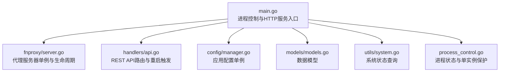

图表来源
- [main.go:24-516](file://src/main.go#L24-L516)
- [server.go:163-181](file://src/fnproxy/server.go#L163-L181)
- [api.go:777-785](file://src/handlers/api.go#L777-L785)
- [manager.go:35-72](file://src/config/manager.go#L35-L72)
- [models.go:72-107](file://src/models/models.go#L72-L107)
- [system.go:19-82](file://src/utils/system.go#L19-L82)
- [process_control.go:129-139](file://src/process_control.go#L129-L139)

章节来源
- [main.go:24-516](file://src/main.go#L24-L516)
- [README.md:20-42](file://README.md#L20-L42)

## 核心组件
- 代理服务器单例：通过 GetServer() 提供全局唯一实例，内部使用 sync.Once 保证线程安全初始化。
- 生命周期管理：Start/Stop/Restart 方法负责监听器的启动、停止与重启。
- 状态管理：IsListenerRunning 提供监听器运行状态检查。
- 热加载与回滚：applyListenerConfig 实现监听器配置的热加载与失败回滚。
- 进程控制：main.go 中 status/stop/restart 子命令与 PID 文件单实例保护。

章节来源
- [server.go:163-181](file://src/fnproxy/server.go#L163-L181)
- [server.go:183-226](file://src/fnproxy/server.go#L183-L226)
- [server.go:435-440](file://src/fnproxy/server.go#L435-L440)
- [server.go:370-425](file://src/fnproxy/server.go#L370-L425)
- [process_control.go:17-28](file://src/process_control.go#L17-L28)
- [process_control.go:129-139](file://src/process_control.go#L129-L139)

## 架构总览
代理服务器以单例形式贯穿整个应用，对外暴露统一的生命周期接口；管理后台通过 API 触发重启，主程序负责进程级的优雅关闭与资源清理。

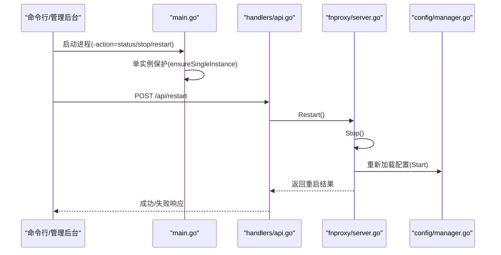

图表来源
- [main.go:24-77](file://src/main.go#L24-L77)
- [api.go:777-785](file://src/handlers/api.go#L777-L785)
- [server.go:220-226](file://src/fnproxy/server.go#L220-L226)
- [server.go:183-199](file://src/fnproxy/server.go#L183-L199)

## 详细组件分析

### 单例模式与初始化
- 单例实现：使用 sync.Once 保证 GetServer() 仅初始化一次，内部创建 Server 实例并注入上下文、映射表与 OAuth 密钥对。
- 初始化要点：设置 servers/routes/listeners/proxies/lastGood 字段，初始化 OAuth 公私钥对，建立共享的 http.Transport。

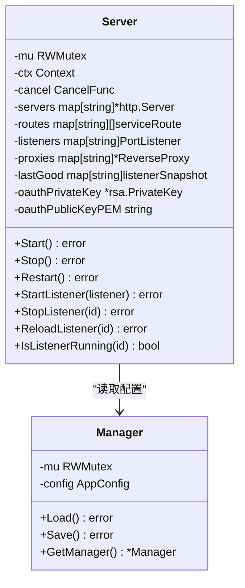

图表来源
- [server.go:37-49](file://src/fnproxy/server.go#L37-L49)
- [server.go:163-181](file://src/fnproxy/server.go#L163-L181)
- [manager.go:18-21](file://src/config/manager.go#L18-L21)

章节来源
- [server.go:163-181](file://src/fnproxy/server.go#L163-L181)
- [manager.go:35-72](file://src/config/manager.go#L35-L72)

### 启动流程（Start）
- 遍历配置中的监听器，过滤 Enabled=true 的监听器。
- 对每个监听器调用 StartListener，内部通过 applyListenerConfig 构建路由与代理，创建 http.Server 并启动监听。
- 若启动过程中出现错误，收集错误并返回聚合错误，不影响已成功启动的监听器。

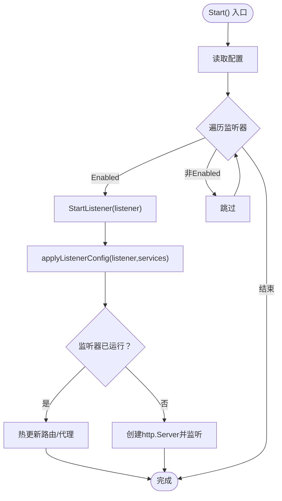

图表来源
- [server.go:183-199](file://src/fnproxy/server.go#L183-L199)
- [server.go:228-233](file://src/fnproxy/server.go#L228-L233)
- [server.go:370-425](file://src/fnproxy/server.go#L370-L425)

章节来源
- [server.go:183-199](file://src/fnproxy/server.go#L183-L199)
- [server.go:228-233](file://src/fnproxy/server.go#L228-L233)
- [server.go:370-425](file://src/fnproxy/server.go#L370-L425)

### 停止流程（Stop）
- 加锁保护，取消上下文，逐个调用 http.Server.Shutdown() 优雅关闭。
- 清空 servers/routes/listeners/proxies/lastGood 映射，释放资源。

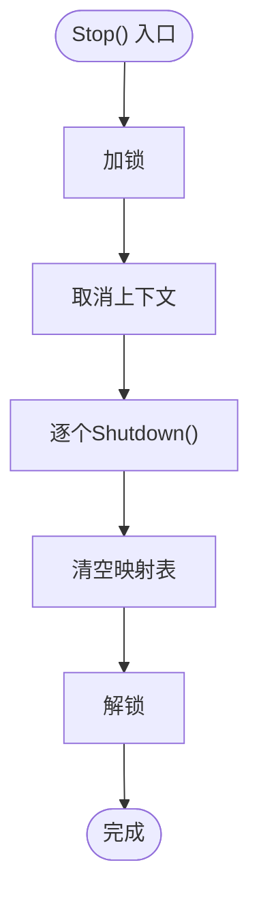

图表来源
- [server.go:201-218](file://src/fnproxy/server.go#L201-L218)

章节来源
- [server.go:201-218](file://src/fnproxy/server.go#L201-L218)

### 重启流程（Restart）
- 调用 Stop() 停止所有监听器。
- 调用 Start() 重新加载配置并启动监听器。

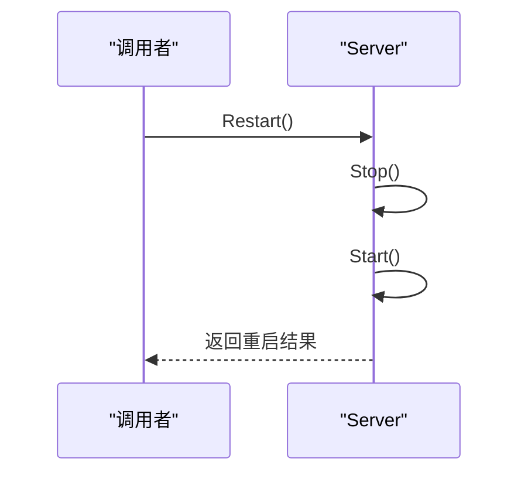

图表来源
- [server.go:220-226](file://src/fnproxy/server.go#L220-L226)

章节来源
- [server.go:220-226](file://src/fnproxy/server.go#L220-L226)

### 监听器状态管理（IsListenerRunning）
- 通过读锁检查 servers 映射中是否存在指定 listenerID，返回运行状态。

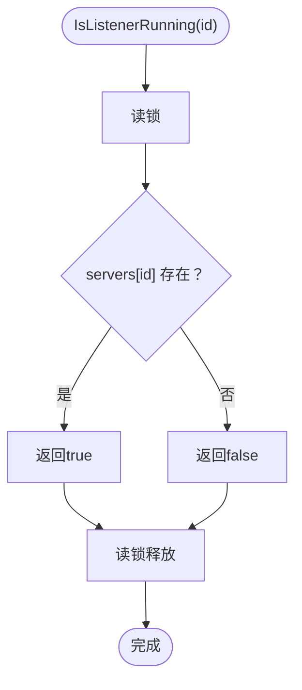

图表来源
- [server.go:435-440](file://src/fnproxy/server.go#L435-L440)

章节来源
- [server.go:435-440](file://src/fnproxy/server.go#L435-L440)

### 监听器动态启停与热加载
- 热加载：若监听器已运行，仅更新路由表与代理，不重启服务器，实现零停机热更新。
- 新建监听器：若监听器不存在，创建 http.Server、net.Listener，并启动 goroutine 执行 Serve()。
- 回滚机制：applyListenerConfig 在创建新监听器失败时，尝试从 lastGood 快照恢复，确保配置一致性。

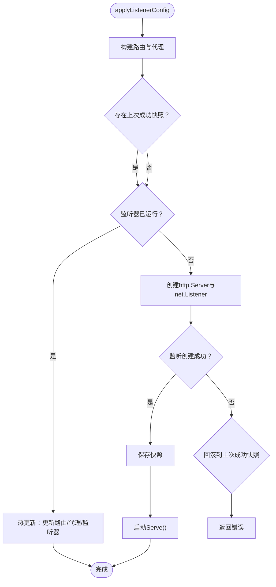

图表来源
- [server.go:370-425](file://src/fnproxy/server.go#L370-L425)
- [server.go:349-368](file://src/fnproxy/server.go#L349-L368)

章节来源
- [server.go:370-425](file://src/fnproxy/server.go#L370-L425)
- [server.go:349-368](file://src/fnproxy/server.go#L349-L368)

### 进程控制与单实例保护
- 子命令解析：status/stop/restart 支持，结合 PID 文件进行进程状态判断。
- 单实例保护：ensureSingleInstance 读取 PID 文件并检查进程是否仍在运行，避免重复启动。
- 优雅关闭：main.go 中注册信号处理，收到 SIGINT/SIGTERM 后优雅关闭代理服务器与 HTTP 服务。

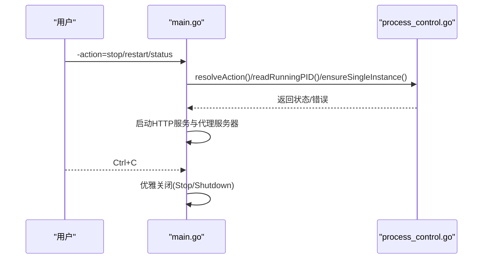

图表来源
- [process_control.go:17-28](file://src/process_control.go#L17-L28)
- [process_control.go:46-65](file://src/process_control.go#L46-L65)
- [process_control.go:129-139](file://src/process_control.go#L129-L139)
- [main.go:482-514](file://src/main.go#L482-L514)

章节来源
- [process_control.go:17-28](file://src/process_control.go#L17-L28)
- [process_control.go:46-65](file://src/process_control.go#L46-L65)
- [process_control.go:129-139](file://src/process_control.go#L129-L139)
- [main.go:482-514](file://src/main.go#L482-L514)

### API 触发重启
- /api/restart 接口调用 RestartServerHandler，内部委托 Server.Restart()，返回统一 JSON 响应。

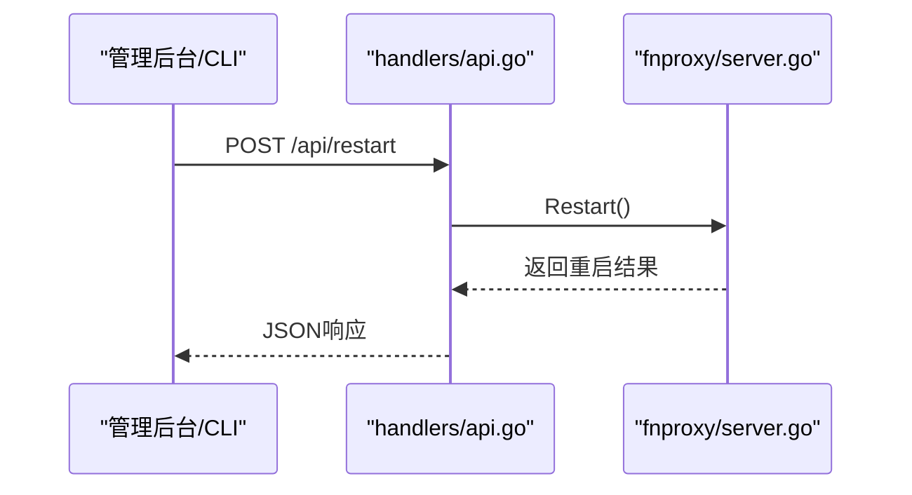

图表来源
- [api.go:777-785](file://src/handlers/api.go#L777-L785)
- [server.go:220-226](file://src/fnproxy/server.go#L220-L226)

章节来源
- [api.go:777-785](file://src/handlers/api.go#L777-L785)
- [server.go:220-226](file://src/fnproxy/server.go#L220-L226)

## 依赖关系分析
- main.go 依赖 fnproxy/server.go 提供代理服务器实例，依赖 handlers/api.go 提供 API 路由，依赖 config/manager.go 提供配置管理。
- Server 依赖 config/manager.go 获取监听器与服务配置，依赖 utils/certificate_manager 获取 TLS 证书。
- API 层通过 fnproxy.GetServer() 调用生命周期方法，实现远程控制。

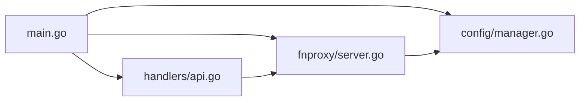

图表来源
- [main.go:105-110](file://src/main.go#L105-L110)
- [api.go:777-785](file://src/handlers/api.go#L777-L785)
- [server.go:183-199](file://src/fnproxy/server.go#L183-L199)

章节来源
- [main.go:105-110](file://src/main.go#L105-L110)
- [api.go:777-785](file://src/handlers/api.go#L777-L785)
- [server.go:183-199](file://src/fnproxy/server.go#L183-L199)

## 性能考虑
- 连接复用：全局共享 http.Transport，启用 KeepAlive、限制每主机连接数与空闲连接数，降低连接开销。
- 热更新：监听器已运行时仅更新路由与代理，避免重启带来的连接中断。
- 优雅关闭：Stop() 调用 http.Server.Shutdown()，配合 context 控制关闭时限，减少资源泄漏。
- 日志与审计：代理错误通过安全日志记录，便于定位性能瓶颈与异常。

章节来源
- [server.go:142-161](file://src/fnproxy/server.go#L142-L161)
- [server.go:201-218](file://src/fnproxy/server.go#L201-L218)
- [server.go:557-572](file://src/fnproxy/server.go#L557-L572)

## 故障排查指南
- 启动失败：Start() 会聚合多个监听器的启动错误，检查具体端口占用与权限，确认配置正确。
- 热加载失败：applyListenerConfig 在监听器创建失败时尝试回滚到上次成功快照，若回滚也失败，需检查配置合法性。
- 重启失败：/api/restart 返回错误时，检查 Server.Restart() 的 Stop()/Start() 流程，确认配置文件与证书状态。
- 单实例冲突：ensureSingleInstance 报告已有进程运行，检查 PID 文件与进程状态，必要时手动清理。
- 优雅关闭：若关闭超时，检查是否有长时间阻塞的请求或未正确释放的资源。

章节来源
- [server.go:183-199](file://src/fnproxy/server.go#L183-L199)
- [server.go:370-425](file://src/fnproxy/server.go#L370-L425)
- [process_control.go:129-139](file://src/process_control.go#L129-L139)
- [api.go:777-785](file://src/handlers/api.go#L777-L785)

## 结论
本项目通过单例模式统一管理代理服务器生命周期，结合热加载与回滚机制实现高可用的动态配置更新；配合进程级的单实例保护与优雅关闭，确保服务稳定运行。API 层提供远程重启能力，便于运维自动化。

## 附录

### 常用代码示例路径
- 获取服务器单例：[server.go:163-181](file://src/fnproxy/server.go#L163-L181)
- 启动所有监听器：[server.go:183-199](file://src/fnproxy/server.go#L183-L199)
- 停止所有监听器：[server.go:201-218](file://src/fnproxy/server.go#L201-L218)
- 重启服务器：[server.go:220-226](file://src/fnproxy/server.go#L220-L226)
- 启动指定监听器：[server.go:228-233](file://src/fnproxy/server.go#L228-L233)
- 停止指定监听器：[server.go:235-253](file://src/fnproxy/server.go#L235-L253)
- 热加载监听器：[server.go:427-433](file://src/fnproxy/server.go#L427-L433)
- 监听器状态检查：[server.go:435-440](file://src/fnproxy/server.go#L435-L440)
- API 触发重启：[api.go:777-785](file://src/handlers/api.go#L777-L785)
- 进程控制与单实例保护：[process_control.go:129-139](file://src/process_control.go#L129-L139)