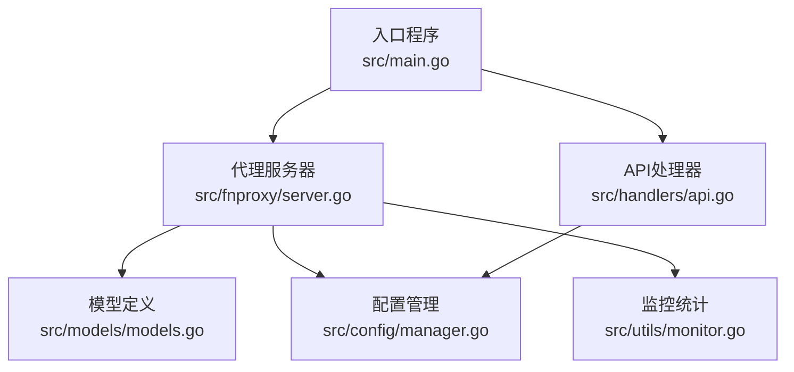
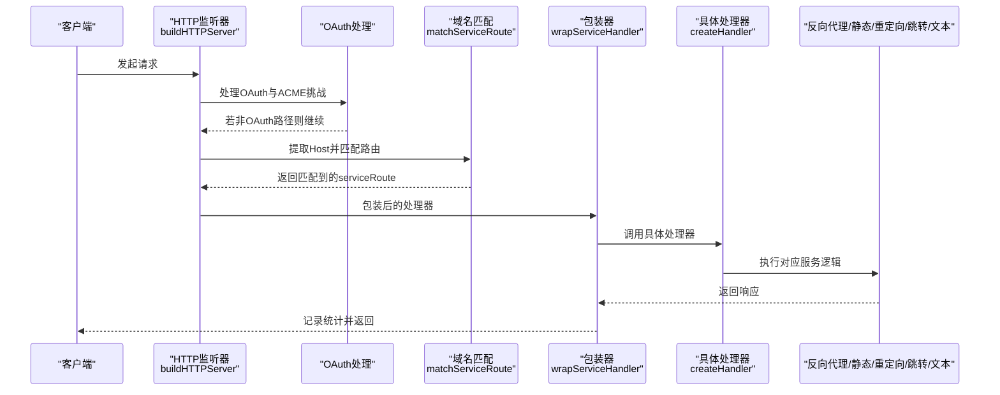
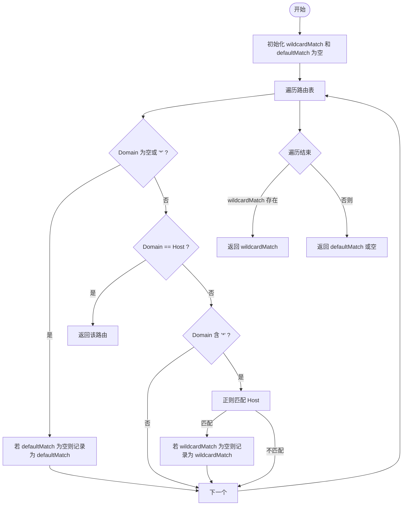
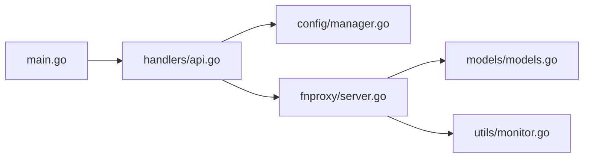

# 服务路由配置

<cite>
**本文引用的文件**
- [src/main.go](file://src/main.go)
- [src/fnproxy/server.go](file://src/fnproxy/server.go)
- [src/models/models.go](file://src/models/models.go)
- [src/handlers/api.go](file://src/handlers/api.go)
- [src/config/manager.go](file://src/config/manager.go)
- [src/utils/monitor.go](file://src/utils/monitor.go)
</cite>

## 目录
1. [简介](#简介)
2. [项目结构](#项目结构)
3. [核心组件](#核心组件)
4. [架构总览](#架构总览)
5. [详细组件分析](#详细组件分析)
6. [依赖关系分析](#依赖关系分析)
7. [性能考量](#性能考量)
8. [故障排查指南](#故障排查指南)
9. [结论](#结论)
10. [附录](#附录)

## 简介
本技术文档聚焦于服务路由配置系统，围绕动态路由表的构建与管理、服务类型的工厂模式实现、路由匹配算法、路由包装器的作用与实现、以及最佳实践与性能优化建议展开。文档旨在帮助开发者与运维人员快速理解并高效维护该系统。

## 项目结构
该项目采用模块化组织，核心路由与服务类型处理集中在 fnproxy 包，配置与模型定义在 models 与 config 包，管理接口在 handlers 包，运行时监控在 utils 包，入口程序在 main.go 中完成 HTTP 服务挂载与代理服务器启动。

图表来源
- [src/main.go:112-430](file://src/main.go#L112-L430)
- [src/fnproxy/server.go:37-49](file://src/fnproxy/server.go#L37-L49)
- [src/models/models.go:82-107](file://src/models/models.go#L82-L107)
- [src/config/manager.go:18-21](file://src/config/manager.go#L18-L21)
- [src/handlers/api.go:377-414](file://src/handlers/api.go#L377-L414)
- [src/utils/monitor.go:39-46](file://src/utils/monitor.go#L39-L46)

章节来源
- [src/main.go:112-430](file://src/main.go#L112-L430)
- [src/fnproxy/server.go:37-49](file://src/fnproxy/server.go#L37-L49)
- [src/models/models.go:82-107](file://src/models/models.go#L82-L107)
- [src/config/manager.go:18-21](file://src/config/manager.go#L18-L21)
- [src/handlers/api.go:377-414](file://src/handlers/api.go#L377-L414)
- [src/utils/monitor.go:39-46](file://src/utils/monitor.go#L39-L46)

## 核心组件
- 服务路由结构 serviceRoute：封装单条服务规则与其对应的处理器，用于动态路由表。
- 代理服务器 Server：负责监听器生命周期、动态路由表构建与热更新、服务处理器工厂、OAuth 登录流程与请求包装。
- 配置管理 Manager：提供监听器、服务、用户、证书等配置的增删改查与持久化。
- API 处理器：对外暴露服务配置的 CRUD 与重载能力，并触发代理服务器的热更新。
- 监控统计 Monitor：记录请求计数、活跃连接、字节流入流出、速率与访问日志。

章节来源
- [src/fnproxy/server.go:51-54](file://src/fnproxy/server.go#L51-L54)
- [src/fnproxy/server.go:37-49](file://src/fnproxy/server.go#L37-L49)
- [src/config/manager.go:18-21](file://src/config/manager.go#L18-L21)
- [src/handlers/api.go:377-414](file://src/handlers/api.go#L377-L414)
- [src/utils/monitor.go:39-46](file://src/utils/monitor.go#L39-L46)

## 架构总览
代理服务器在每个监听器上维护一份动态路由表，路由表由服务配置构建而来。HTTP 请求进入监听器后，先进行 OAuth 处理与 ACME 挑战处理，随后根据 Host 进行域名匹配，命中后交由包装后的具体服务处理器执行。

图表来源
- [src/fnproxy/server.go:293-324](file://src/fnproxy/server.go#L293-L324)
- [src/fnproxy/server.go:1119-1140](file://src/fnproxy/server.go#L1119-L1140)
- [src/fnproxy/server.go:442-458](file://src/fnproxy/server.go#L442-L458)

章节来源
- [src/fnproxy/server.go:293-324](file://src/fnproxy/server.go#L293-L324)
- [src/fnproxy/server.go:1119-1140](file://src/fnproxy/server.go#L1119-L1140)
- [src/fnproxy/server.go:442-458](file://src/fnproxy/server.go#L442-L458)

## 详细组件分析

### 动态路由表与服务路由结构
- serviceRoute：包含服务配置与对应处理器，作为路由表的基本单元。
- 路由表 routes：按监听器 ID 分组存储，监听器启动或热更新时重建。
- 路由构建流程：
  - 读取监听器对应的所有服务配置（按 SortOrder 排序，通配默认规则排在最后）。
  - 对每个服务调用 createHandler 创建处理器。
  - 使用 wrapServiceHandler 包装处理器，注入认证与统计逻辑。
  - 将 serviceRoute 存入路由表。

章节来源
- [src/fnproxy/server.go:51-54](file://src/fnproxy/server.go#L51-L54)
- [src/fnproxy/server.go:270-291](file://src/fnproxy/server.go#L270-L291)
- [src/config/manager.go:314-341](file://src/config/manager.go#L314-L341)

### 服务类型工厂模式实现
- createHandler：根据服务类型分发到具体处理器创建函数。
  - 反向代理：createReverseProxyHandler
  - 静态文件：createStaticHandler
  - 重定向：createRedirectHandler
  - URL跳转：createURLJumpHandler
  - 文本输出：createTextOutputHandler
- 反向代理处理器特点：
  - 支持上游地址规范化、路径前缀处理、Host 头策略、隐藏/修改请求/响应头、信任上游代理头策略。
  - 使用共享 Transport 实现连接复用与超时控制。
  - WebSocket 升级特殊处理，独立的 gorilla/websocket 实现双向转发。
- 静态文件处理器特点：
  - 支持目录浏览、默认索引、文件存在性与类型判断。
- 重定向与 URL 跳转处理器：
  - 重定向：固定目标地址，缺省 302。
  - URL 跳转：可选保留路径。
- 文本输出处理器：
  - 自定义 Content-Type、状态码与响应体。

章节来源
- [src/fnproxy/server.go:442-458](file://src/fnproxy/server.go#L442-L458)
- [src/fnproxy/server.go:460-584](file://src/fnproxy/server.go#L460-L584)
- [src/fnproxy/server.go:804-852](file://src/fnproxy/server.go#L804-L852)
- [src/fnproxy/server.go:1043-1063](file://src/fnproxy/server.go#L1043-L1063)
- [src/fnproxy/server.go:1065-1089](file://src/fnproxy/server.go#L1065-L1089)
- [src/fnproxy/server.go:1091-1117](file://src/fnproxy/server.go#L1091-L1117)

### 路由匹配算法（matchServiceRoute）
- 输入：监听器的动态路由表与请求 Host。
- 匹配策略：
  - 忽略空域或通配符“*”规则，优先级低于精确匹配。
  - 精确匹配优先：当 Domain 与 Host 完全一致时立即返回。
  - 通配符匹配：使用正则将“*”转换为“.*”，匹配成功后记录第一个匹配结果。
  - 默认规则：若无精确或通配符匹配，返回最先遇到的默认规则。
- 主机名标准化：去除端口并统一为小写，确保匹配一致性。

图表来源
- [src/fnproxy/server.go:1277-1303](file://src/fnproxy/server.go#L1277-L1303)
- [src/fnproxy/server.go:1305-1321](file://src/fnproxy/server.go#L1305-L1321)

章节来源
- [src/fnproxy/server.go:1277-1303](file://src/fnproxy/server.go#L1277-L1303)
- [src/fnproxy/server.go:1305-1321](file://src/fnproxy/server.go#L1305-L1321)

### 路由包装器（wrapServiceHandler）
- 作用：在具体服务处理器执行前后注入统一逻辑。
- 认证拦截：若服务要求认证且未登录，重定向至 OAuth 登录页。
- 统计记录：开始请求时增加活跃连接，结束后计算耗时、字节数并写入访问日志与监控存储。
- 影响范围：对所有服务类型生效，保证统一的审计与可观测性。

章节来源
- [src/fnproxy/server.go:1119-1140](file://src/fnproxy/server.go#L1119-L1140)
- [src/utils/monitor.go:131-189](file://src/utils/monitor.go#L131-L189)

### 监听器与热更新
- 启动监听器：构建路由表与处理器，创建 HTTP/TLS 监听器并启动服务。
- 热更新：若监听器已运行，仅更新路由表与代理实例，避免重启。
- 回滚：应用新配置失败时，恢复到上次成功的快照。
- 重载接口：API 层提供重载端口的能力，触发代理服务器热更新。

章节来源
- [src/fnproxy/server.go:370-425](file://src/fnproxy/server.go#L370-L425)
- [src/fnproxy/server.go:427-433](file://src/fnproxy/server.go#L427-L433)
- [src/handlers/api.go:396-414](file://src/handlers/api.go#L396-L414)

### OAuth 登录流程
- OAuth 登录页渲染与提交处理。
- 登录成功后生成令牌并写入 Cookie，随后重定向到目标地址。
- 登录失败记录审计日志并返回错误信息。

章节来源
- [src/fnproxy/server.go:1142-1251](file://src/fnproxy/server.go#L1142-L1251)

## 依赖关系分析
- 代理服务器依赖配置管理器获取监听器与服务配置，依赖监控器记录统计数据，依赖安全模块进行 OAuth 与证书管理。
- API 处理器依赖配置管理器进行持久化，依赖代理服务器进行热更新。
- 入口程序负责注册静态资源与 API 路由，挂载中间件，启动代理服务器。

图表来源
- [src/main.go:112-430](file://src/main.go#L112-L430)
- [src/handlers/api.go:377-414](file://src/handlers/api.go#L377-L414)
- [src/config/manager.go:18-21](file://src/config/manager.go#L18-L21)
- [src/fnproxy/server.go:37-49](file://src/fnproxy/server.go#L37-L49)
- [src/models/models.go:82-107](file://src/models/models.go#L82-L107)
- [src/utils/monitor.go:39-46](file://src/utils/monitor.go#L39-L46)

章节来源
- [src/main.go:112-430](file://src/main.go#L112-L430)
- [src/handlers/api.go:377-414](file://src/handlers/api.go#L377-L414)
- [src/config/manager.go:18-21](file://src/config/manager.go#L18-L21)
- [src/fnproxy/server.go:37-49](file://src/fnproxy/server.go#L37-L49)
- [src/models/models.go:82-107](file://src/models/models.go#L82-L107)
- [src/utils/monitor.go:39-46](file://src/utils/monitor.go#L39-L46)

## 性能考量
- 连接复用：反向代理使用共享 Transport，设置合理的空闲连接上限与超时，减少连接建立开销。
- 路由匹配：域名匹配为线性扫描，建议在单监听器内控制服务数量，避免过多规则导致匹配延迟。
- 统计与日志：访问日志与监控统计写入磁盘，注意日志轮转与容量限制，避免 IO 抖动。
- TLS 与证书：HTTPS 监听器通过证书管理器动态获取证书，避免频繁重启。
- WebSocket：独立的升级与转发通道，减少对通用反向代理栈的影响。

章节来源
- [src/fnproxy/server.go:142-161](file://src/fnproxy/server.go#L142-L161)
- [src/fnproxy/server.go:1277-1303](file://src/fnproxy/server.go#L1277-L1303)
- [src/utils/monitor.go:16-21](file://src/utils/monitor.go#L16-L21)

## 故障排查指南
- 路由不生效或 404：
  - 检查服务 Domain 是否与请求 Host 匹配（含通配符与默认规则）。
  - 确认服务 Enabled 且监听器已启用。
- 认证问题：
  - 若服务要求认证而未登录，会被重定向至 OAuth 登录页。
  - 检查 Cookie 是否正确设置与有效期。
- 反向代理异常：
  - 查看代理错误回调记录的审计日志。
  - 检查上游地址、路径前缀、Host 头策略与隐藏头配置。
- 热更新失败：
  - 查看回滚日志，确认上次成功配置是否恢复。
  - 检查服务配置合法性与上游可达性。
- 性能问题：
  - 监控活跃连接与吞吐量，检查连接池配置与上游健康状况。
  - 关注访问日志与网络采样，定位瓶颈。

章节来源
- [src/fnproxy/server.go:557-572](file://src/fnproxy/server.go#L557-L572)
- [src/fnproxy/server.go:396-425](file://src/fnproxy/server.go#L396-L425)
- [src/utils/monitor.go:131-189](file://src/utils/monitor.go#L131-L189)

## 结论
该服务路由配置系统以动态路由表为核心，结合工厂模式与包装器实现了灵活、可观测、可热更新的服务编排。通过清晰的匹配策略与统一的认证/统计拦截，系统在易用性与可维护性方面表现良好。建议在生产环境中合理规划服务数量与排序，完善日志与监控策略，并定期验证配置变更的回滚路径。

## 附录
- 最佳实践
  - 为不同域名配置明确的 Domain，避免过多通配符导致匹配复杂度上升。
  - 使用 SortOrder 控制同端口下服务优先级，将默认规则置于末尾。
  - 对反向代理配置路径前缀与 Host 头策略，确保上游接收正确的请求信息。
  - 开启必要的访问日志与审计日志，便于问题定位与合规审计。
  - 在高并发场景下，合理设置连接池与超时参数，避免资源耗尽。
- 路由冲突处理
  - 精确匹配优先于通配符匹配，通配符匹配优先于默认规则。
  - 当多个通配符同时匹配时，以首次匹配为准；建议避免重叠的通配符规则。
- 调试技巧
  - 利用 API 的重载接口快速验证配置变更。
  - 通过监控接口查看实时统计与历史趋势，辅助定位问题。
  - 在 OAuth 登录失败时，检查审计日志中的错误原因与远程地址。