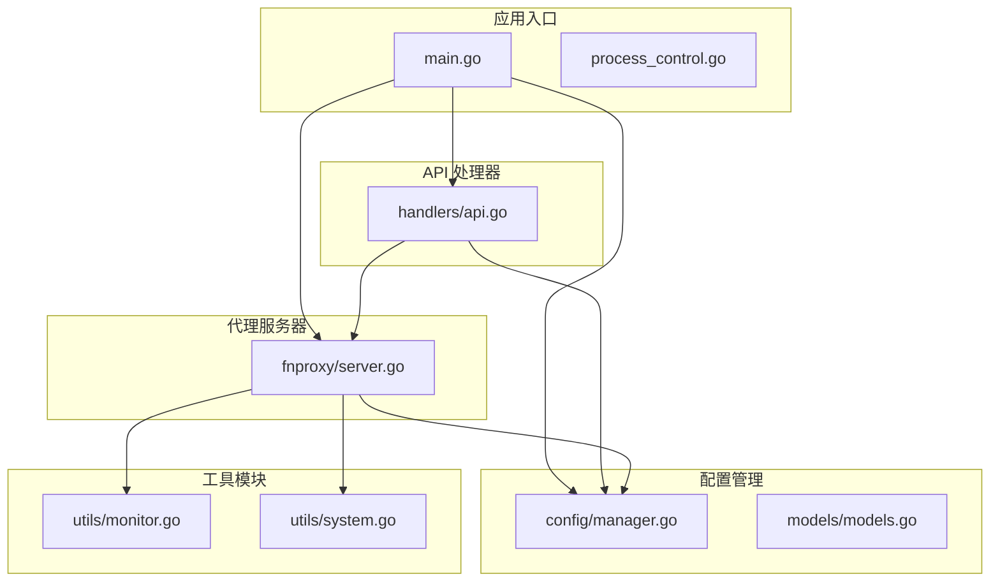
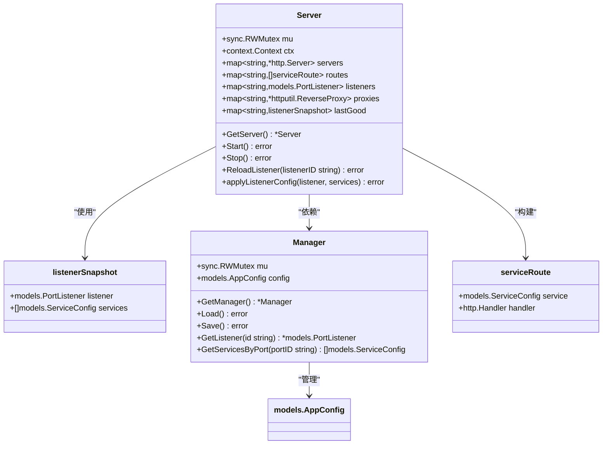
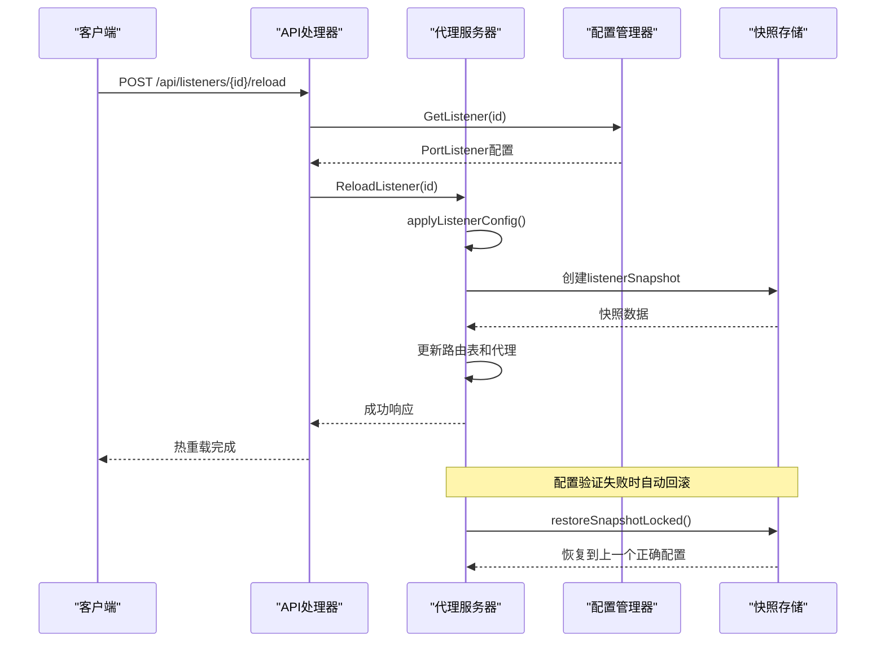
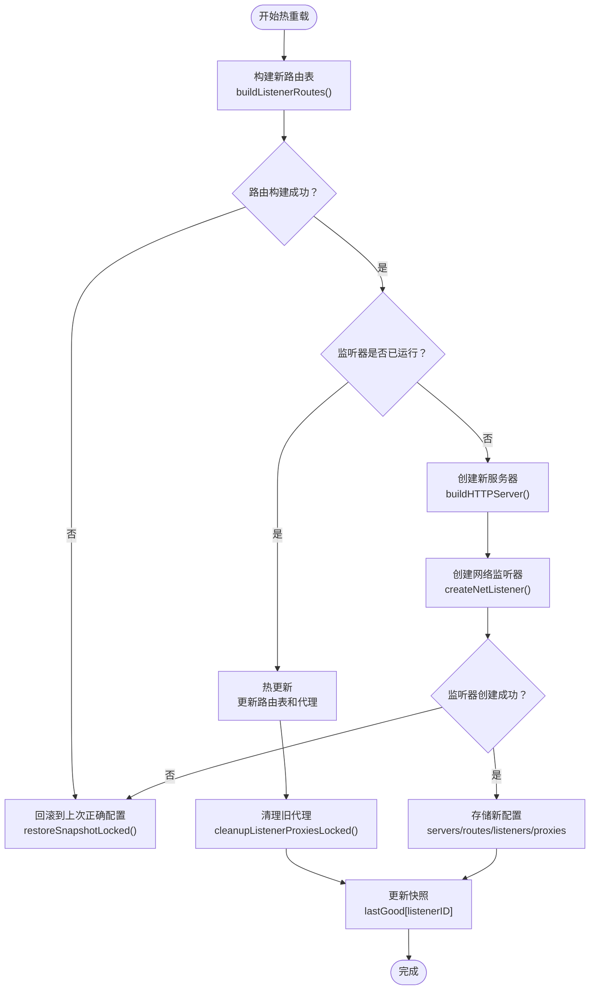
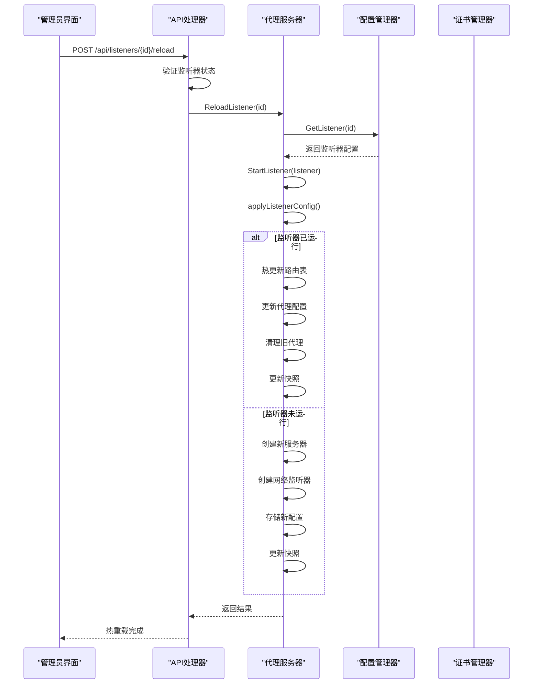
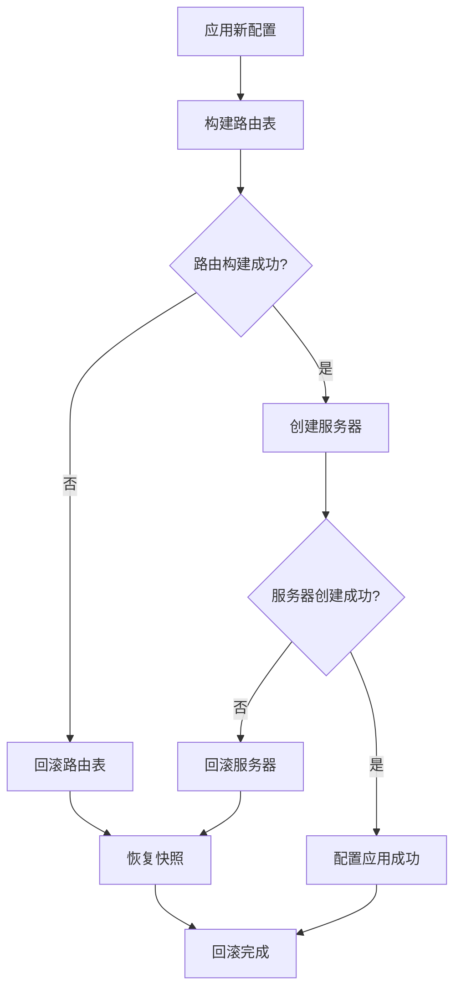
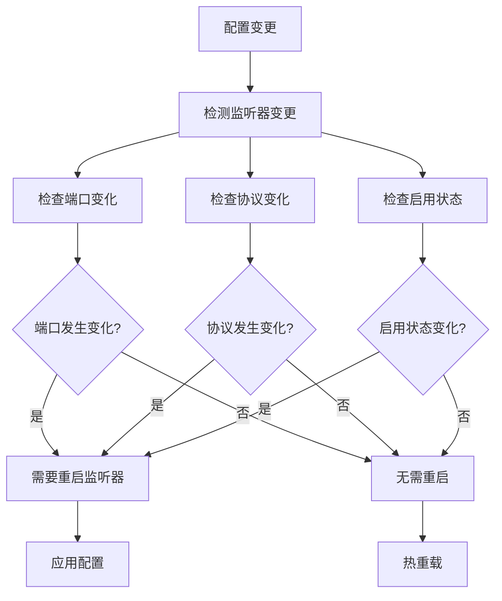
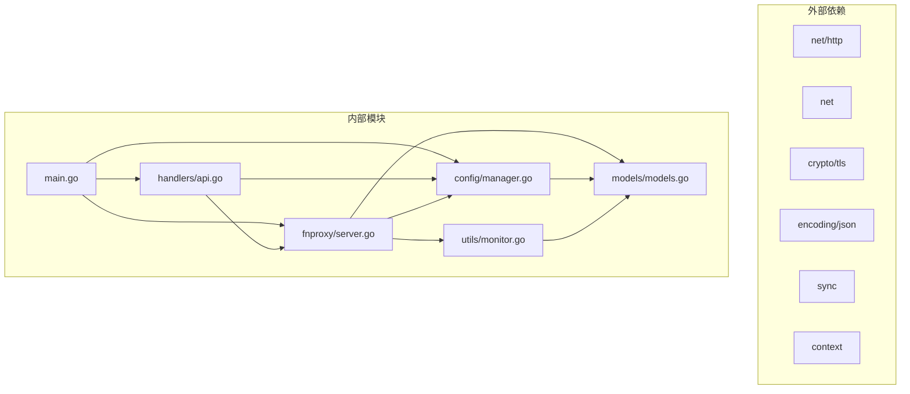
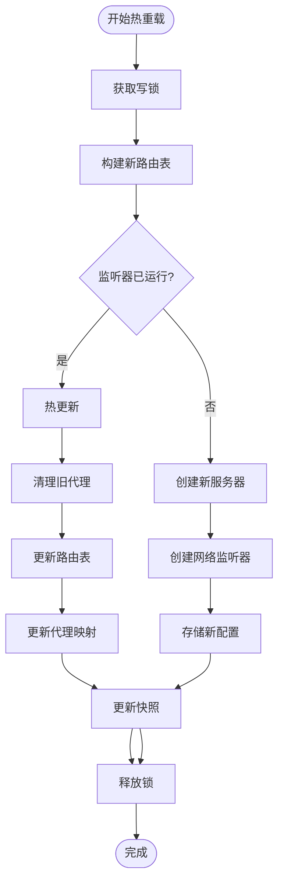
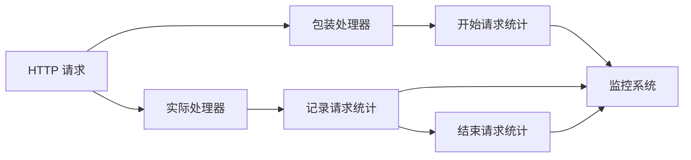

# 热重载机制

<cite>
**本文档引用的文件**
- [main.go](file://src/main.go)
- [process_control.go](file://src/process_control.go)
- [config/manager.go](file://src/config/manager.go)
- [fnproxy/server.go](file://src/fnproxy/server.go)
- [handlers/api.go](file://src/handlers/api.go)
- [models/models.go](file://src/models/models.go)
- [utils/monitor.go](file://src/utils/monitor.go)
- [utils/system.go](file://src/utils/system.go)
</cite>

## 目录
1. [简介](#简介)
2. [项目结构](#项目结构)
3. [核心组件](#核心组件)
4. [架构概览](#架构概览)
5. [详细组件分析](#详细组件分析)
6. [依赖关系分析](#依赖关系分析)
7. [性能考虑](#性能考虑)
8. [故障排除指南](#故障排除指南)
9. [结论](#结论)

## 简介

本文档深入分析了 Caddy Panel 项目中的热重载机制实现。热重载是现代 Web 代理服务器的核心功能之一，它允许在不中断服务的情况下动态更新配置。本文将详细解释热重载的实现原理，包括配置变更检测、无缝切换机制、快照机制（listenerSnapshot）的设计与实现、执行流程以及错误回滚策略。

## 项目结构

该项目采用模块化的 Go 语言架构，主要包含以下核心模块：

**图表来源**
- [main.go:24-516](file://src/main.go#L24-L516)
- [config/manager.go:1-791](file://src/config/manager.go#L1-L791)
- [fnproxy/server.go:1-1477](file://src/fnproxy/server.go#L1-L1477)

**章节来源**
- [main.go:1-516](file://src/main.go#L1-L516)
- [config/manager.go:1-791](file://src/config/manager.go#L1-L791)

## 核心组件

### 热重载核心组件

系统中的热重载机制主要由以下几个核心组件构成：

1. **Server 结构体** - 代理服务器的主控制器
2. **listenerSnapshot 结构体** - 配置快照机制
3. **Manager 结构体** - 配置管理器
4. **API 处理器** - 提供热重载接口

### 数据结构设计

**图表来源**
- [fnproxy/server.go:37-59](file://src/fnproxy/server.go#L37-L59)
- [config/manager.go:18-21](file://src/config/manager.go#L18-L21)
- [models/models.go:72-107](file://src/models/models.go#L72-L107)

**章节来源**
- [fnproxy/server.go:37-59](file://src/fnproxy/server.go#L37-L59)
- [config/manager.go:18-21](file://src/config/manager.go#L18-L21)
- [models/models.go:72-107](file://src/models/models.go#L72-L107)

## 架构概览

热重载机制的整体架构采用"配置驱动 + 快照备份 + 无缝切换"的设计模式：

**图表来源**
- [handlers/api.go:359-375](file://src/handlers/api.go#L359-L375)
- [fnproxy/server.go:427-433](file://src/fnproxy/server.go#L427-L433)
- [fnproxy/server.go:349-368](file://src/fnproxy/server.go#L349-L368)

## 详细组件分析

### 快照机制（listenerSnapshot）

listenerSnapshot 是热重载机制的核心组件，负责配置备份和恢复：

#### 设计原理

**图表来源**
- [fnproxy/server.go:370-425](file://src/fnproxy/server.go#L370-L425)
- [fnproxy/server.go:349-368](file://src/fnproxy/server.go#L349-L368)

#### 快照数据结构

listenerSnapshot 结构体包含两个关键字段：
- `listener`: 当前监听器的完整配置
- `services`: 与监听器关联的所有服务配置

这种设计确保了在配置更新失败时能够完整恢复到之前的正确状态。

**章节来源**
- [fnproxy/server.go:56-59](file://src/fnproxy/server.go#L56-L59)
- [fnproxy/server.go:349-368](file://src/fnproxy/server.go#L349-L368)

### 热重载执行流程

#### 热重载触发流程

热重载功能通过 API 接口触发，完整的执行流程如下：

**图表来源**
- [handlers/api.go:359-375](file://src/handlers/api.go#L359-L375)
- [fnproxy/server.go:427-433](file://src/fnproxy/server.go#L427-L433)
- [fnproxy/server.go:228-233](file://src/fnproxy/server.go#L228-L233)

#### 配置验证机制

在应用新配置之前，系统会进行完整的配置验证：

1. **路由构建验证**: 尝试构建新的路由表，任何服务配置错误都会导致验证失败
2. **监听器创建验证**: 尝试创建网络监听器，端口占用等系统级错误会被捕获
3. **证书验证**: 对于 HTTPS 监听器，验证 TLS 证书配置的有效性

**章节来源**
- [fnproxy/server.go:270-291](file://src/fnproxy/server.go#L270-L291)
- [fnproxy/server.go:400-411](file://src/fnproxy/server.go#L400-L411)

### 错误回滚机制

系统实现了完善的错误回滚机制，确保在配置更新失败时能够自动恢复到正确的状态：

#### 回滚策略

**图表来源**
- [fnproxy/server.go:404-410](file://src/fnproxy/server.go#L404-L410)
- [fnproxy/server.go:349-368](file://src/fnproxy/server.go#L349-L368)

#### 回滚实现细节

回滚过程包括以下步骤：
1. **恢复服务器**: 重新启动之前正常运行的服务器实例
2. **重建路由表**: 使用快照中的配置重新构建路由表
3. **清理代理**: 清理可能存在的错误代理实例
4. **更新状态**: 将服务器状态恢复到回滚前的正确状态

**章节来源**
- [fnproxy/server.go:349-368](file://src/fnproxy/server.go#L349-L368)

### 配置变更检测

系统通过多种机制检测配置变更：

#### 监听器变更检测

**图表来源**
- [handlers/api.go:220-276](file://src/handlers/api.go#L220-L276)
- [handlers/api.go:304-357](file://src/handlers/api.go#L304-L357)

**章节来源**
- [handlers/api.go:220-276](file://src/handlers/api.go#L220-L276)
- [handlers/api.go:304-357](file://src/handlers/api.go#L304-L357)

## 依赖关系分析

### 组件间依赖关系

**图表来源**
- [main.go:3-22](file://src/main.go#L3-L22)
- [fnproxy/server.go:3-35](file://src/fnproxy/server.go#L3-L35)
- [config/manager.go:3-14](file://src/config/manager.go#L3-L14)

### 关键依赖关系

1. **Server 依赖 Config**: 服务器需要访问配置管理器来获取最新的配置信息
2. **Handlers 依赖 Server**: API 处理器通过调用服务器方法实现热重载
3. **Monitor 依赖 Models**: 监控系统使用模型定义来存储统计数据

**章节来源**
- [main.go:16-21](file://src/main.go#L16-L21)
- [fnproxy/server.go:28-32](file://src/fnproxy/server.go#L28-L32)

## 性能考虑

### 内存使用优化

系统采用了多项内存优化策略：

1. **代理缓存**: 通过 `proxies` 映射缓存反向代理实例，避免重复创建
2. **快照优化**: 只存储必要的配置信息，避免复制整个配置对象
3. **连接复用**: 使用共享的 HTTP Transport 实现连接复用

### 切换时间优化

**图表来源**
- [fnproxy/server.go:376-397](file://src/fnproxy/server.go#L376-L397)
- [fnproxy/server.go:400-424](file://src/fnproxy/server.go#L400-L424)

### 性能优化建议

基于代码分析，以下是针对热重载机制的性能优化建议：

1. **批量配置更新**: 对于大量配置变更，建议使用批量操作减少锁竞争
2. **异步回滚**: 在回滚过程中可以考虑异步执行，避免阻塞主线程
3. **预分配内存**: 对于频繁使用的数据结构，可以考虑预分配内存池
4. **连接池优化**: 调整 HTTP Transport 的连接池参数以适应不同的负载场景

**章节来源**
- [fnproxy/server.go:142-161](file://src/fnproxy/server.go#L142-L161)
- [fnproxy/server.go:376-397](file://src/fnproxy/server.go#L376-L397)

## 故障排除指南

### 常见问题及解决方案

#### 热重载失败

**问题症状**: 热重载请求返回错误，但服务仍然可用

**可能原因**:
1. 新配置中的服务规则无效
2. 端口被其他进程占用
3. 证书配置错误

**解决步骤**:
1. 检查服务器日志获取详细错误信息
2. 验证新配置的语法和有效性
3. 确认端口和证书配置的正确性

#### 配置验证失败

**问题症状**: 配置更新被拒绝，系统保持在之前的配置状态

**诊断方法**:
1. 查看 API 响应中的错误消息
2. 检查配置文件的 JSON 格式
3. 验证服务配置的完整性

**章节来源**
- [handlers/api.go:64-93](file://src/handlers/api.go#L64-L93)
- [fnproxy/server.go:370-411](file://src/fnproxy/server.go#L370-L411)

### 监控建议

系统提供了丰富的监控指标来帮助诊断热重载相关的问题：

#### 关键监控指标

1. **请求统计**: 通过 `utils/monitor.go` 提供的统计接口
2. **网络流量**: 实时监控网络输入输出速率
3. **内存使用**: 监控进程内存使用情况
4. **CPU 使用率**: 监控系统资源占用

#### 监控实现

**图表来源**
- [fnproxy/server.go:1119-1140](file://src/fnproxy/server.go#L1119-L1140)
- [utils/monitor.go:131-189](file://src/utils/monitor.go#L131-L189)

**章节来源**
- [utils/monitor.go:131-189](file://src/utils/monitor.go#L131-L189)
- [fnproxy/server.go:1119-1140](file://src/fnproxy/server.go#L1119-L1140)

## 结论

Caddy Panel 项目的热重载机制展现了现代 Web 代理服务器的优秀设计。通过精心设计的快照机制、完善的错误回滚策略和高效的执行流程，系统实现了真正的零停机配置更新。

### 主要优势

1. **零停机更新**: 通过热更新机制实现配置变更的无缝切换
2. **完整回滚**: 快照机制确保配置更新失败时能够完全恢复
3. **细粒度控制**: 支持监听器级别的热重载，提高灵活性
4. **性能优化**: 通过代理缓存和连接复用提升性能

### 技术亮点

1. **listenerSnapshot 设计**: 精确的配置备份和恢复机制
2. **双层验证**: 配置构建和系统级验证双重保障
3. **智能回滚**: 自动化的错误恢复策略
4. **监控集成**: 完善的性能监控和诊断能力

该实现为类似系统的热重载功能提供了优秀的参考模板，展示了如何在保证可靠性的同时实现高性能的配置更新。