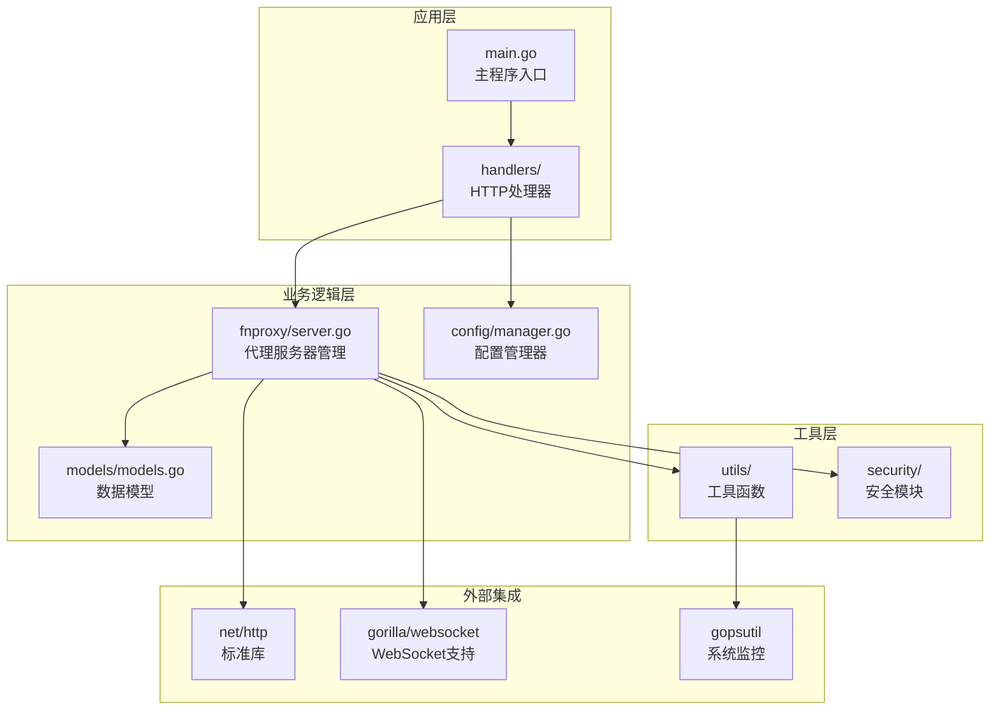
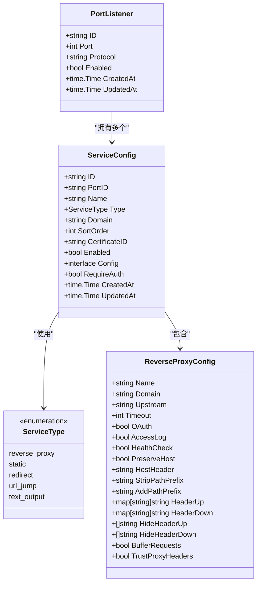
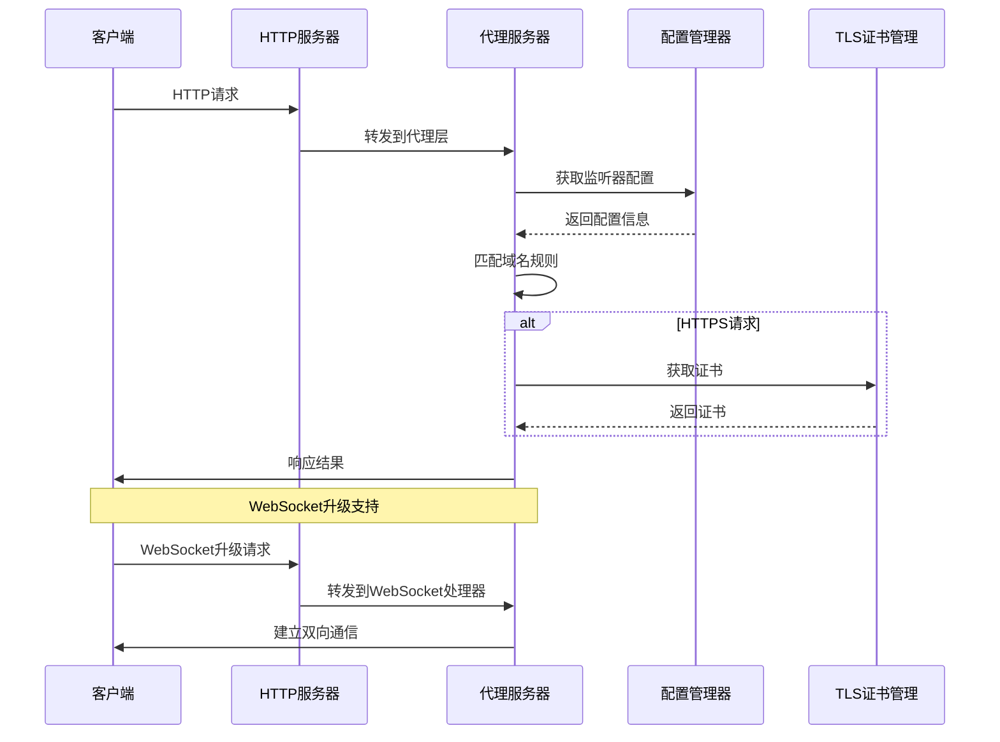
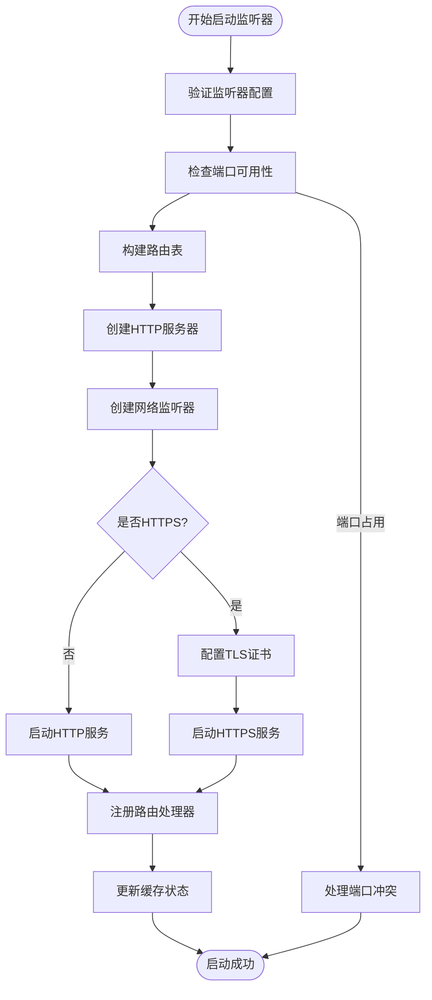
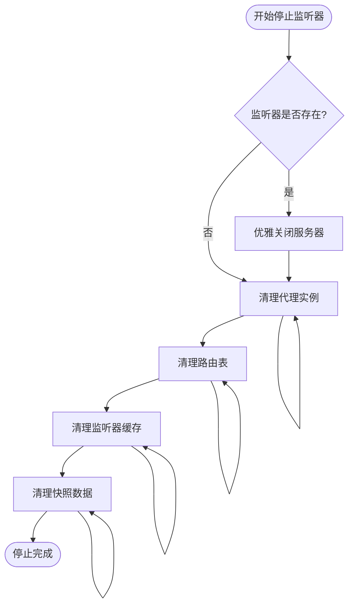
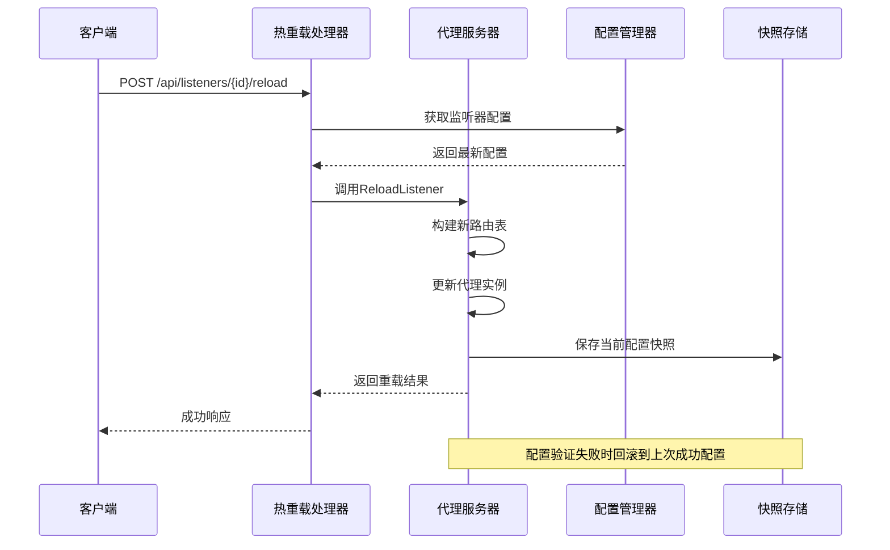
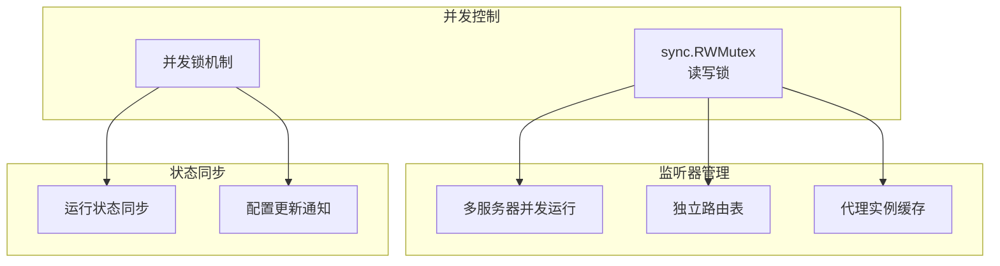
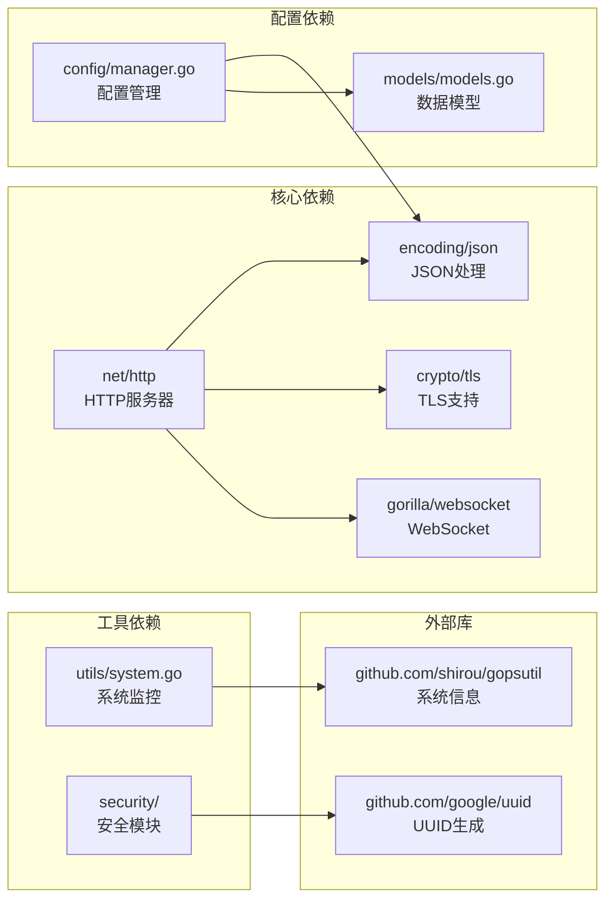

# 监听器管理系统

<cite>
**本文档引用的文件**
- [main.go](file://src/main.go)
- [server.go](file://src/fnproxy/server.go)
- [models.go](file://src/models/models.go)
- [manager.go](file://src/config/manager.go)
- [api.go](file://src/handlers/api.go)
- [process_control.go](file://src/process_control.go)
- [system.go](file://src/utils/system.go)
- [ui-listener-fixes-20260311.md](file://documents/ui-listener-fixes-20260311.md)
</cite>

## 目录
1. [简介](#简介)
2. [项目结构](#项目结构)
3. [核心组件](#核心组件)
4. [架构概览](#架构概览)
5. [详细组件分析](#详细组件分析)
6. [依赖关系分析](#依赖关系分析)
7. [性能考虑](#性能考虑)
8. [故障排除指南](#故障排除指南)
9. [结论](#结论)

## 简介

监听器管理系统是一个基于 Go 语言开发的高性能 HTTP/HTTPS 代理服务器管理系统。该系统提供了完整的监听器生命周期管理，包括监听器配置、启动、停止、热重载等功能。系统采用模块化设计，支持多监听器并发管理，具备完善的错误处理和资源清理机制。

## 项目结构

项目采用清晰的分层架构设计，主要包含以下核心模块：



**图表来源**
- [main.go:1-516](file://src/main.go#L1-L516)
- [server.go:1-800](file://src/fnproxy/server.go#L1-L800)
- [manager.go:1-791](file://src/config/manager.go#L1-L791)

**章节来源**
- [main.go:24-516](file://src/main.go#L24-L516)
- [server.go:37-181](file://src/fnproxy/server.go#L37-L181)

## 核心组件

### PortListener 配置模型

PortListener 是监听器的核心配置模型，定义了监听器的基本属性和行为：



**图表来源**
- [models.go:72-163](file://src/models/models.go#L72-L163)

### 监听器缓存系统

系统实现了高效的监听器缓存机制，通过内存映射实现快速查找和更新：

```mermaid
graph LR
subgraph "内存缓存"
Servers[servers: map[string]*http.Server<br/>运行中的服务器]
Routes[routes: map[string][]serviceRoute<br/>动态路由表]
Listeners[listeners: map[string]PortListener<br/>监听器配置缓存]
Proxies[proxies: map[string]*httputil.ReverseProxy<br/>代理实例缓存]
LastGood[lastGood: map[string]listenerSnapshot<br/>上次成功配置快照]
end
subgraph "持久化存储"
ConfigManager[ConfigManager<br/>配置文件存储]
end
Servers --> ConfigManager
Routes --> ConfigManager
Listeners --> ConfigManager
Proxies --> ConfigManager
LastGood --> ConfigManager
```

**图表来源**
- [server.go:38-49](file://src/fnproxy/server.go#L38-L49)

**章节来源**
- [models.go:72-163](file://src/models/models.go#L72-L163)
- [server.go:38-49](file://src/fnproxy/server.go#L38-L49)

## 架构概览

监听器管理系统采用事件驱动的架构模式，通过 HTTP 服务器和 WebSocket 服务器协同工作：



**图表来源**
- [server.go:293-347](file://src/fnproxy/server.go#L293-L347)
- [server.go:639-781](file://src/fnproxy/server.go#L639-L781)

**章节来源**
- [server.go:293-347](file://src/fnproxy/server.go#L293-L347)
- [server.go:639-781](file://src/fnproxy/server.go#L639-L781)

## 详细组件分析

### 监听器启动流程 (StartListener)

监听器启动流程是整个系统的核心，涉及配置验证、路由构建和服务器创建等多个步骤：



**图表来源**
- [server.go:370-425](file://src/fnproxy/server.go#L370-L425)
- [server.go:270-291](file://src/fnproxy/server.go#L270-L291)

#### 配置验证机制

系统实现了多层次的配置验证机制：

1. **端口验证**：检查端口号范围 (1-65535)
2. **协议验证**：仅支持 http 和 https
3. **冲突检测**：检测端口是否被其他程序占用
4. **管理端口保护**：防止管理后台端口被占用

**章节来源**
- [api.go:64-93](file://src/handlers/api.go#L64-L93)
- [server.go:370-425](file://src/fnproxy/server.go#L370-L425)

### 监听器停止机制 (StopListener)

停止机制确保资源的正确释放和状态的恢复：



**图表来源**
- [server.go:235-253](file://src/fnproxy/server.go#L235-L253)
- [server.go:264-268](file://src/fnproxy/server.go#L264-L268)

#### 资源清理策略

系统采用渐进式资源清理策略：

1. **服务器优雅关闭**：使用 context.Background() 进行优雅关闭
2. **代理实例清理**：删除对应的反向代理实例
3. **路由表清理**：移除监听器相关的路由配置
4. **缓存状态清理**：清除内存中的监听器状态

**章节来源**
- [server.go:235-253](file://src/fnproxy/server.go#L235-L253)

### 监听器热重载功能 (ReloadListener)

热重载功能实现了配置变更的无缝切换：



**图表来源**
- [server.go:427-433](file://src/fnproxy/server.go#L427-L433)
- [api.go:359-375](file://src/handlers/api.go#L359-L375)

#### 热重载实现细节

热重载功能的关键特性：

1. **配置验证**：在重载前验证配置的有效性
2. **无缝切换**：通过内存中的快照实现零停机切换
3. **错误回滚**：配置错误时自动回滚到上次成功状态
4. **代理实例复用**：复用现有的反向代理实例以提高性能

**章节来源**
- [server.go:427-433](file://src/fnproxy/server.go#L427-L433)
- [server.go:349-368](file://src/fnproxy/server.go#L349-L368)

### 多监听器并发管理

系统支持多监听器的并发管理，通过互斥锁确保线程安全：



**图表来源**
- [server.go:38-49](file://src/fnproxy/server.go#L38-L49)
- [server.go:183-199](file://src/fnproxy/server.go#L183-L199)

**章节来源**
- [server.go:38-49](file://src/fnproxy/server.go#L38-L49)
- [server.go:183-199](file://src/fnproxy/server.go#L183-L199)

## 依赖关系分析

系统采用松耦合的设计，各组件之间的依赖关系清晰：



**图表来源**
- [server.go:3-35](file://src/fnproxy/server.go#L3-L35)
- [manager.go:3-14](file://src/config/manager.go#L3-L14)

**章节来源**
- [server.go:3-35](file://src/fnproxy/server.go#L3-L35)
- [manager.go:3-14](file://src/config/manager.go#L3-L14)

## 性能考虑

### 连接池优化

系统实现了高效的连接池管理：

- **共享传输层**：使用全局共享的 http.Transport 实现连接复用
- **连接限制**：最大空闲连接数 200，每个主机 50 个
- **超时配置**：合理的超时设置避免资源泄露
- **TLS优化**：跳过后端证书验证减少握手开销

### 内存管理

系统采用多种内存优化策略：

- **对象池**：复用反向代理实例减少 GC 压力
- **快照机制**：使用 listenerSnapshot 存储上次成功配置
- **路由缓存**：缓存路由表避免重复构建
- **延迟初始化**：按需创建代理实例

### 并发优化

- **读写分离**：使用 RWMutex 实现读多写少场景的优化
- **无锁设计**：在可能的情况下避免锁竞争
- **批量操作**：支持批量配置更新减少锁持有时间

## 故障排除指南

### 常见启动问题

1. **端口占用错误**
   - 检查是否有其他进程占用了目标端口
   - 使用系统命令查看端口占用情况
   - 修改监听器端口号

2. **TLS证书问题**
   - 确保证书文件路径正确
   - 检查证书权限设置
   - 验证证书格式有效性

3. **配置文件损坏**
   - 备份现有配置文件
   - 重新生成配置文件
   - 检查 JSON 格式正确性

### 运行时问题

1. **监听器无法停止**
   - 检查是否有活跃连接
   - 使用优雅关闭方法
   - 强制终止进程（最后手段）

2. **热重载失败**
   - 检查配置语法
   - 验证上游服务可达性
   - 查看错误日志获取详细信息

3. **内存泄漏**
   - 监控内存使用情况
   - 检查代理实例清理
   - 分析 GC 行为

### 性能问题诊断

1. **高CPU使用率**
   - 检查连接数是否异常
   - 分析请求处理时间
   - 优化路由匹配算法

2. **内存占用过高**
   - 监控对象数量
   - 检查缓存策略
   - 分析内存分配模式

3. **连接超时**
   - 检查上游服务响应
   - 调整超时参数
   - 分析网络延迟

**章节来源**
- [process_control.go:84-109](file://src/process_control.go#L84-L109)
- [server.go:235-253](file://src/fnproxy/server.go#L235-L253)

## 结论

监听器管理系统是一个设计精良的高性能代理服务器管理平台。系统通过模块化的架构设计、完善的错误处理机制和高效的性能优化策略，为用户提供了一个稳定可靠的监听器管理解决方案。

### 主要优势

1. **架构清晰**：采用分层设计，职责分离明确
2. **性能优异**：通过连接复用、缓存优化等策略提升性能
3. **可靠性强**：完善的错误处理和回滚机制
4. **扩展性强**：支持多监听器并发管理和热重载功能
5. **易用性好**：提供完整的 API 接口和管理界面

### 技术特色

- **零停机热重载**：通过快照机制实现无缝配置切换
- **多协议支持**：同时支持 HTTP/HTTPS 和 WebSocket
- **智能路由**：基于域名的智能路由匹配
- **安全防护**：内置防火墙和安全审计功能
- **监控集成**：完整的运行时监控和日志记录

该系统适合在生产环境中部署，能够满足高并发、低延迟的代理服务器需求，为各种应用场景提供可靠的技术支撑。