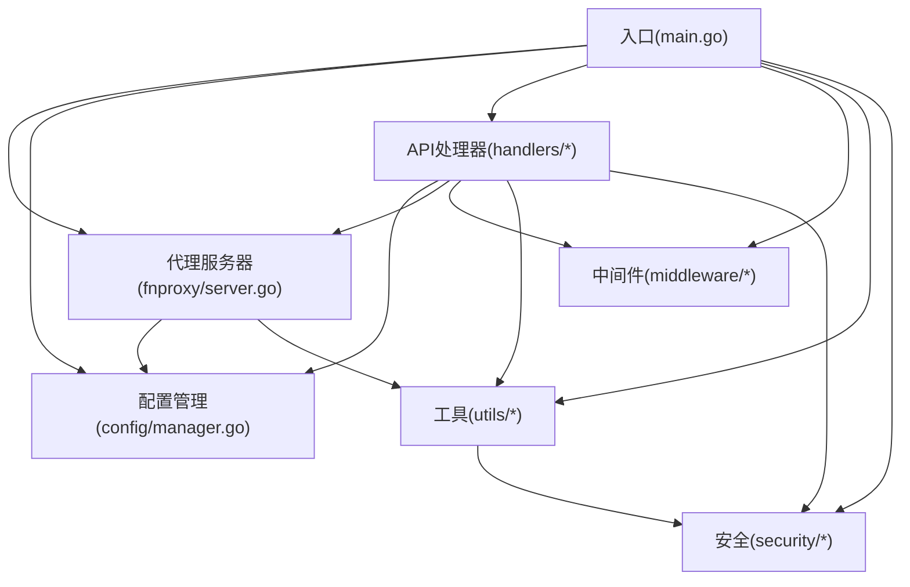
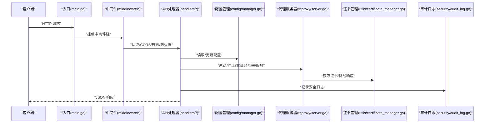
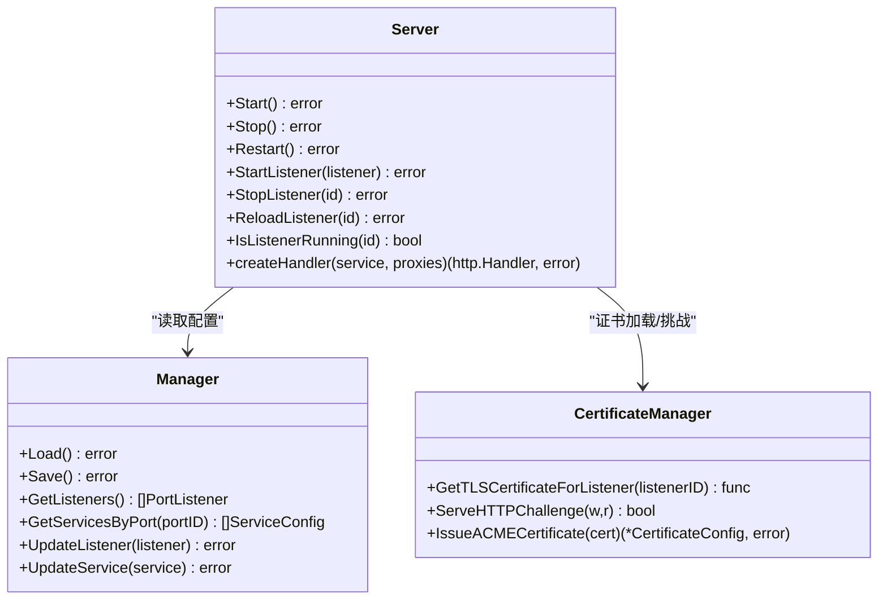
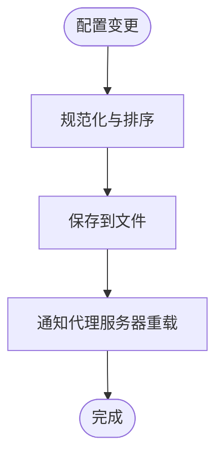
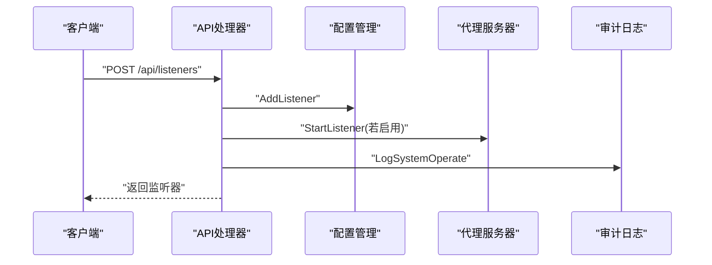
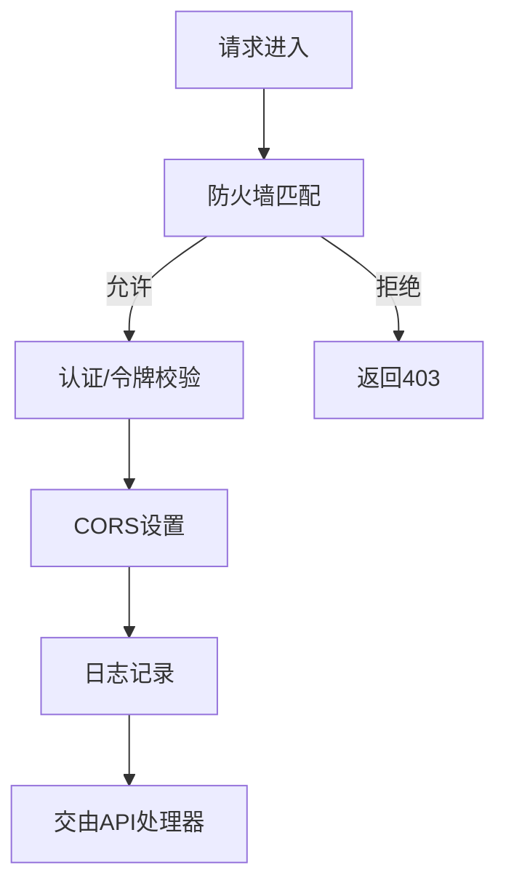
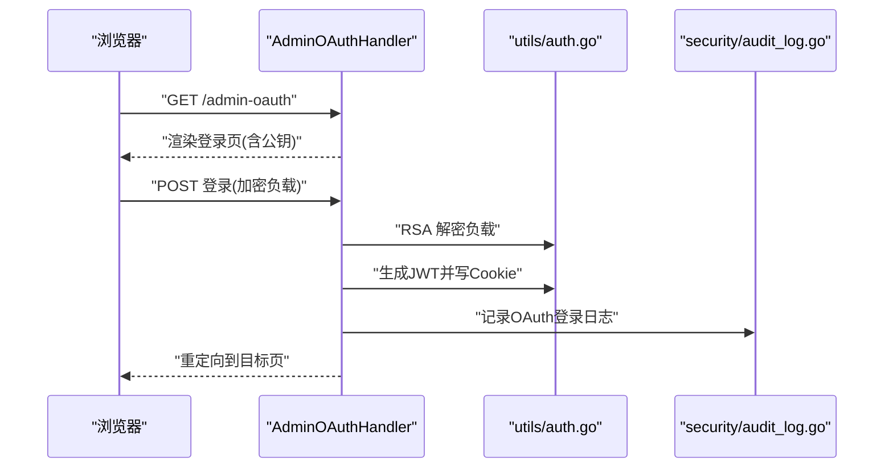
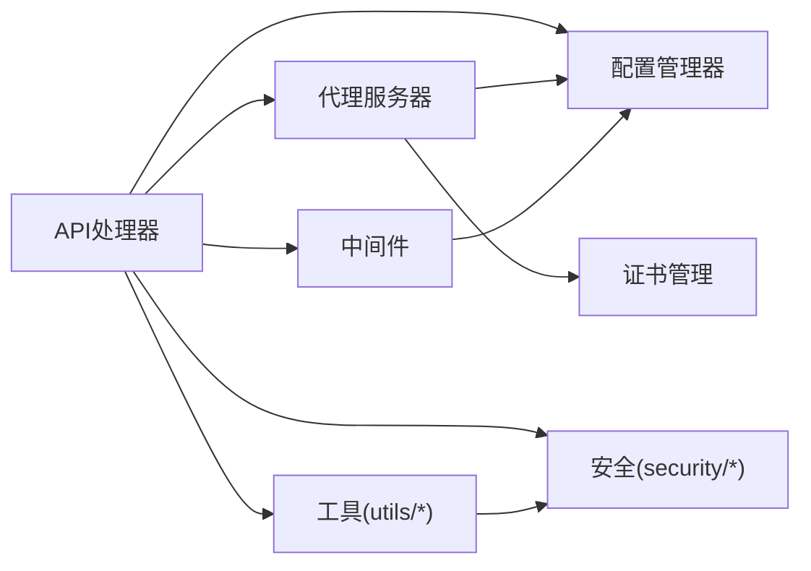

# 核心模块

<cite>
**本文引用的文件**
- [src/main.go](file://src/main.go)
- [src/fnproxy/server.go](file://src/fnproxy/server.go)
- [src/config/manager.go](file://src/config/manager.go)
- [src/handlers/api.go](file://src/handlers/api.go)
- [src/middleware/auth.go](file://src/middleware/auth.go)
- [src/middleware/firewall.go](file://src/middleware/firewall.go)
- [src/models/models.go](file://src/models/models.go)
- [src/handlers/auth.go](file://src/handlers/auth.go)
- [src/utils/certificate_manager.go](file://src/utils/certificate_manager.go)
- [src/process_control.go](file://src/process_control.go)
- [src/utils/system.go](file://src/utils/system.go)
- [src/utils/auth.go](file://src/utils/auth.go)
- [src/security/audit_log.go](file://src/security/audit_log.go)
- [src/handlers/firewall.go](file://src/handlers/firewall.go)
</cite>

## 目录
1. [简介](#简介)
2. [项目结构](#项目结构)
3. [核心组件](#核心组件)
4. [架构总览](#架构总览)
5. [详细组件分析](#详细组件分析)
6. [依赖关系分析](#依赖关系分析)
7. [性能考量](#性能考量)
8. [故障排查指南](#故障排查指南)
9. [结论](#结论)
10. [附录](#附录)

## 简介
本文件面向 Caddy Panel 的核心模块，系统性梳理代理服务器、配置管理、API 处理器与中间件体系，重点覆盖：
- 代理服务器模块：监听器管理、服务路由配置与热重载机制
- 配置管理器：配置文件结构、持久化存储与运行时配置更新
- API 处理器：RESTful 接口设计与业务逻辑处理
- 中间件系统：认证、防火墙、CORS、日志等中间件
- 模块间依赖关系与交互流程
- 代码示例与使用模式，便于开发者理解与扩展

## 项目结构
项目采用分层与职责分离的组织方式：
- 入口与进程控制：main.go、process_control.go
- 代理服务器：fnproxy/server.go
- 配置管理：config/manager.go
- 数据模型：models/models.go
- API 处理器：handlers/*（含认证、防火墙、证书、终端等）
- 中间件：middleware/*
- 工具与安全：utils/*、security/*

图表来源
- [src/main.go:1-516](file://src/main.go#L1-L516)
- [src/fnproxy/server.go:1-800](file://src/fnproxy/server.go#L1-L800)
- [src/config/manager.go:1-791](file://src/config/manager.go#L1-L791)

章节来源
- [src/main.go:1-516](file://src/main.go#L1-L516)

## 核心组件
- 代理服务器 Server：负责监听器生命周期、动态路由构建与热重载、反向代理与 WebSocket 代理、TLS 证书加载与挑战响应
- 配置管理器 Manager：负责应用配置的加载/保存、监听器与服务的增删改查、防火墙配置的运行时持久化
- API 处理器：提供 RESTful 接口，覆盖监听器、服务、用户、配置、证书、防火墙、终端、状态等管理能力
- 中间件：认证、管理员权限、CORS、日志、防火墙
- 工具与安全：JWT 令牌、Cookie 管理、系统状态采集、审计日志、证书管理（ACME/导入/同步）

章节来源
- [src/fnproxy/server.go:37-181](file://src/fnproxy/server.go#L37-L181)
- [src/config/manager.go:18-72](file://src/config/manager.go#L18-L72)
- [src/handlers/api.go:20-115](file://src/handlers/api.go#L20-L115)
- [src/middleware/auth.go:14-119](file://src/middleware/auth.go#L14-L119)
- [src/middleware/firewall.go:13-226](file://src/middleware/firewall.go#L13-L226)
- [src/utils/auth.go:13-139](file://src/utils/auth.go#L13-L139)
- [src/utils/system.go:19-82](file://src/utils/system.go#L19-L82)
- [src/security/audit_log.go:15-80](file://src/security/audit_log.go#L15-L80)
- [src/utils/certificate_manager.go:126-151](file://src/utils/certificate_manager.go#L126-L151)

## 架构总览
下图展示从 HTTP 请求进入，经由中间件、API 处理器，到配置管理与代理服务器的调用链路，以及与证书管理、审计日志、系统状态工具的协作关系。

图表来源
- [src/main.go:421-431](file://src/main.go#L421-L431)
- [src/middleware/auth.go:14-55](file://src/middleware/auth.go#L14-L55)
- [src/middleware/firewall.go:13-50](file://src/middleware/firewall.go#L13-L50)
- [src/handlers/api.go:732-785](file://src/handlers/api.go#L732-L785)
- [src/config/manager.go:74-107](file://src/config/manager.go#L74-L107)
- [src/fnproxy/server.go:183-226](file://src/fnproxy/server.go#L183-L226)
- [src/utils/certificate_manager.go:253-269](file://src/utils/certificate_manager.go#L253-L269)
- [src/security/audit_log.go:62-80](file://src/security/audit_log.go#L62-L80)

## 详细组件分析

### 代理服务器模块
- 监听器管理
  - 启动/停止/重启监听器，支持 HTTP/HTTPS，HTTPS 自动注入 TLS 证书加载器
  - 热重载：监听器已运行时仅更新路由表与代理实例，避免重启
  - 监听器快照：记录上次成功配置，失败时回滚
- 服务路由配置
  - 支持多种服务类型：反向代理、静态文件、重定向、URL 跳转、文本输出
  - 路由匹配：基于监听器 ID 分组的动态路由表
  - WebSocket 代理：独立 Upgrader 与双向消息转发
- 热重载机制
  - 监听器重载：ApplyListenerConfig 在存在旧监听器时仅更新路由与代理
  - 服务重载：通过 ReloadService 触发对应监听器的路由重建
- TLS 与挑战
  - 证书加载：按 SNI 匹配服务显式绑定或域名匹配
  - ACME HTTP-01 挑战：内存 Provider 注册 token，供挑战响应

图表来源
- [src/fnproxy/server.go:37-181](file://src/fnproxy/server.go#L37-L181)
- [src/config/manager.go:74-107](file://src/config/manager.go#L74-L107)
- [src/utils/certificate_manager.go:271-306](file://src/utils/certificate_manager.go#L271-L306)

章节来源
- [src/fnproxy/server.go:183-425](file://src/fnproxy/server.go#L183-L425)
- [src/fnproxy/server.go:442-781](file://src/fnproxy/server.go#L442-L781)
- [src/utils/certificate_manager.go:253-269](file://src/utils/certificate_manager.go#L253-L269)

### 配置管理器
- 配置文件结构
  - AppConfig：包含全局、监听器、服务、证书、用户、SSH、防火墙等字段
  - 全局配置：管理端口、日志级别、日志保留、证书同步周期等
  - 监听器：端口、协议、启用状态
  - 服务：类型、域名、排序、证书绑定、启用状态、具体配置
  - 证书：来源（ACME/导入/同步）、挑战类型、DNS 提供商、自动续签、到期时间等
  - 防火墙：开关、默认动作、规则列表（IP/国家、优先级、允许/拒绝）
- 持久化存储
  - Load/Save：JSON 文件读写，确保目录存在
  - 运行时持久化：防火墙配置独立文件，支持即时写入
- 运行时配置更新
  - 监听器/服务增删改查：带时间戳与排序规范化
  - 服务排序：同端口下稳定排序，支持重排
  - 全局配置更新：立即落盘并触发证书维护

图表来源
- [src/config/manager.go:74-107](file://src/config/manager.go#L74-L107)
- [src/config/manager.go:158-210](file://src/config/manager.go#L158-L210)
- [src/config/manager.go:409-451](file://src/config/manager.go#L409-L451)

章节来源
- [src/config/manager.go:18-72](file://src/config/manager.go#L18-L72)
- [src/config/manager.go:227-341](file://src/config/manager.go#L227-L341)
- [src/config/manager.go:639-791](file://src/config/manager.go#L639-L791)

### API 处理器
- RESTful 设计
  - 监听器：GET/POST/PUT/DELETE，支持 toggle/reload
  - 服务：GET/POST/PUT/DELETE，支持 toggle/reorder
  - 用户：GET/POST/PUT/DELETE，支持 toggle
  - 配置：GET/PUT
  - 证书：GET/POST/PUT/DELETE，支持 renew
  - 防火墙：GET/POST（规则增删改）
  - 终端：会话管理与心跳
  - 状态：服务器状态、网络历史、监听器/服务统计、日志
- 业务逻辑
  - 监听器/服务的启用/禁用、重载与回滚
  - 用户密码解密（前端加密传输）、令牌唯一性校验
  - 安全日志记录：系统操作、OAuth 登录、代理错误、SSH 连接
  - 重启代理服务器：调用 Server.Restart

图表来源
- [src/handlers/api.go:156-218](file://src/handlers/api.go#L156-L218)
- [src/handlers/api.go:304-375](file://src/handlers/api.go#L304-L375)
- [src/handlers/api.go:777-785](file://src/handlers/api.go#L777-L785)
- [src/security/audit_log.go:149-166](file://src/security/audit_log.go#L149-L166)

章节来源
- [src/handlers/api.go:139-785](file://src/handlers/api.go#L139-L785)

### 中间件系统
- 认证中间件
  - 支持 Authorization: Bearer 与 Auth 头令牌，以及 Cookie
  - 公开路径：登录、登出、公钥接口
  - 管理员中间件：角色校验
- 防火墙中间件
  - 读取运行时防火墙配置，按优先级匹配 IP/国家规则
  - 默认动作：允许或拒绝
- CORS 中间件
  - 设置允许的来源、方法与头部
- 日志中间件
  - 记录请求方法、路径与耗时

图表来源
- [src/middleware/firewall.go:13-50](file://src/middleware/firewall.go#L13-L50)
- [src/middleware/auth.go:14-119](file://src/middleware/auth.go#L14-L119)

章节来源
- [src/middleware/firewall.go:13-226](file://src/middleware/firewall.go#L13-L226)
- [src/middleware/auth.go:14-119](file://src/middleware/auth.go#L14-L119)

### 认证与 OAuth 登录
- 传统登录：用户名/密码，生成 JWT 并写入 Cookie
- OAuth 登录：管理后台页面，支持前端加密负载，服务端 RSA 解密
- 公钥接口：暴露 OAuth 公钥供前端加密
- 页面认证中间件：未登录重定向至登录页

图表来源
- [src/handlers/auth.go:124-198](file://src/handlers/auth.go#L124-L198)
- [src/handlers/auth.go:253-266](file://src/handlers/auth.go#L253-L266)
- [src/utils/auth.go:24-53](file://src/utils/auth.go#L24-L53)
- [src/security/audit_log.go:82-99](file://src/security/audit_log.go#L82-L99)

章节来源
- [src/handlers/auth.go:124-266](file://src/handlers/auth.go#L124-L266)
- [src/utils/auth.go:13-139](file://src/utils/auth.go#L13-L139)

### 证书管理
- 证书来源
  - ACME：自动申请/续签，支持 HTTP-01/DNS-01
  - 导入：PEM 文件导入，手动维护
  - 同步：外部配置文件同步，定期扫描与更新
- 运行时加载
  - 按 SNI 匹配证书，支持监听器维度绑定
  - HTTP-01 挑战响应
- 维护任务
  - 定时任务：同步外部配置、自动续签
  - 立即执行：API 触发

章节来源
- [src/utils/certificate_manager.go:126-151](file://src/utils/certificate_manager.go#L126-L151)
- [src/utils/certificate_manager.go:192-216](file://src/utils/certificate_manager.go#L192-L216)
- [src/utils/certificate_manager.go:253-306](file://src/utils/certificate_manager.go#L253-L306)

### 进程控制与启动
- 命令行参数：action/status/stop/restart、secure、config_path、port
- 单实例保证：PID 文件检查与清理
- 管理端口：TCP 或 Unix Socket
- 优雅关闭：信号处理、代理服务器停止、HTTP 服务器关闭、清理资源

章节来源
- [src/process_control.go:17-139](file://src/process_control.go#L17-L139)
- [src/main.go:24-516](file://src/main.go#L24-L516)

## 依赖关系分析
- 模块耦合
  - API 处理器强依赖配置管理器与代理服务器，弱依赖中间件与工具
  - 代理服务器依赖配置管理器与证书管理器
  - 中间件依赖配置管理器（防火墙）与工具（JWT/Cookie）
  - 审计日志与安全模块被多处调用，形成横切关注点
- 外部依赖
  - HTTP 服务器、WebSocket、ACME lego、gopsutil、JWT 等

图表来源
- [src/main.go:421-431](file://src/main.go#L421-L431)
- [src/handlers/api.go:732-785](file://src/handlers/api.go#L732-L785)
- [src/fnproxy/server.go:183-226](file://src/fnproxy/server.go#L183-L226)

章节来源
- [src/main.go:421-431](file://src/main.go#L421-L431)
- [src/handlers/api.go:732-785](file://src/handlers/api.go#L732-L785)

## 性能考量
- 连接复用与传输优化
  - 全局共享 HTTP Transport，启用 KeepAlive、限制空闲连接数与超时
- 代理性能
  - 反向代理使用单主机代理，支持请求/响应头隐藏与修改
  - WebSocket 代理直连上游，避免不必要的缓冲
- 证书与挑战
  - 内存 HTTP-01 Provider，减少磁盘 IO
  - 定时任务批量处理续签与同步，降低频繁 IO
- 日志与监控
  - 审计日志异步追加，限制最大条数
  - 系统状态采集使用轻量库，避免阻塞

章节来源
- [src/fnproxy/server.go:142-161](file://src/fnproxy/server.go#L142-L161)
- [src/utils/certificate_manager.go:94-124](file://src/utils/certificate_manager.go#L94-L124)
- [src/security/audit_log.go:33-80](file://src/security/audit_log.go#L33-L80)
- [src/utils/system.go:19-82](file://src/utils/system.go#L19-L82)

## 故障排查指南
- 监听器启动失败
  - 检查端口占用与管理端口冲突
  - 查看代理错误日志与审计日志
- 热重载失败
  - 代理服务器会尝试回滚到上次成功快照
  - 检查服务配置合法性与上游地址
- 证书问题
  - ACME 申请失败：检查 DNS/HTTP-01 配置与 80 端口监听
  - 同步证书：确认外部配置文件路径与权限
- 认证问题
  - JWT 令牌无效：确认密钥一致与签名算法
  - Cookie 安全：HTTPS 下 Secure Cookie
- 防火墙拦截
  - 检查规则优先级与默认动作
  - 临时关闭防火墙定位问题

章节来源
- [src/fnproxy/server.go:349-425](file://src/fnproxy/server.go#L349-L425)
- [src/utils/certificate_manager.go:440-533](file://src/utils/certificate_manager.go#L440-L533)
- [src/security/audit_log.go:101-113](file://src/security/audit_log.go#L101-L113)
- [src/middleware/firewall.go:13-50](file://src/middleware/firewall.go#L13-L50)

## 结论
Caddy Panel 的核心模块以“配置驱动 + 热重载 + 中间件”为核心设计思想，实现了高可用的代理与管理能力：
- 代理服务器具备完善的监听器与服务路由管理，支持热重载与 WebSocket
- 配置管理器提供结构化配置与持久化，支持运行时更新
- API 处理器覆盖全面的管理接口，并与中间件、安全模块协同
- 中间件体系提供认证、防火墙、CORS、日志等横切能力
- 证书管理器支持 ACME、导入与同步，保障 HTTPS 体验
- 进程控制与优雅关闭确保运维稳定性

## 附录
- 使用模式与示例（以路径代替代码片段）
  - 启动/停止/重启：参考命令行参数与进程控制逻辑
    - [src/process_control.go:17-139](file://src/process_control.go#L17-L139)
  - 监听器增删改与启用/禁用/重载：参考 API 处理器
    - [src/handlers/api.go:156-375](file://src/handlers/api.go#L156-L375)
  - 服务路由与反向代理：参考代理服务器实现
    - [src/fnproxy/server.go:442-584](file://src/fnproxy/server.go#L442-L584)
  - 认证与登录：参考认证处理器与工具
    - [src/handlers/auth.go:37-110](file://src/handlers/auth.go#L37-L110)
    - [src/utils/auth.go:24-53](file://src/utils/auth.go#L24-L53)
  - 防火墙规则：参考中间件与处理器
    - [src/middleware/firewall.go:13-226](file://src/middleware/firewall.go#L13-L226)
    - [src/handlers/firewall.go:13-156](file://src/handlers/firewall.go#L13-L156)
  - 证书申请/续签/同步：参考证书管理器
    - [src/utils/certificate_manager.go:440-593](file://src/utils/certificate_manager.go#L440-L593)
  - 审计日志：参考安全模块
    - [src/security/audit_log.go:62-166](file://src/security/audit_log.go#L62-L166)
  - 系统状态：参考系统工具
    - [src/utils/system.go:19-82](file://src/utils/system.go#L19-L82)