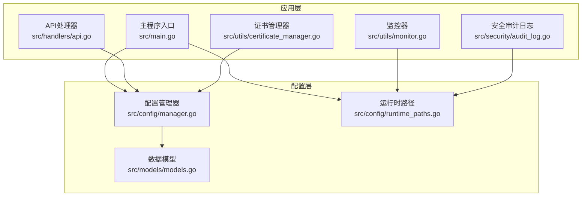
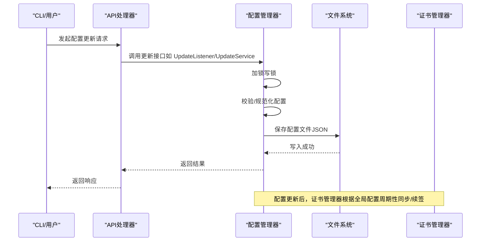
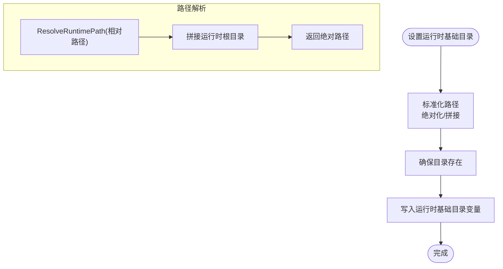
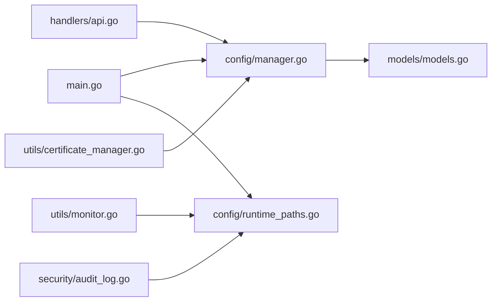

# 配置管理器

<cite>
**本文引用的文件**
- [src/config/manager.go](file://src/config/manager.go)
- [src/config/runtime_paths.go](file://src/config/runtime_paths.go)
- [src/models/models.go](file://src/models/models.go)
- [src/main.go](file://src/main.go)
- [src/handlers/api.go](file://src/handlers/api.go)
- [src/utils/certificate_manager.go](file://src/utils/certificate_manager.go)
- [src/utils/monitor.go](file://src/utils/monitor.go)
- [src/security/audit_log.go](file://src/security/audit_log.go)
- [README.md](file://README.md)
</cite>

## 目录
1. [简介](#简介)
2. [项目结构](#项目结构)
3. [核心组件](#核心组件)
4. [架构总览](#架构总览)
5. [详细组件分析](#详细组件分析)
6. [依赖关系分析](#依赖关系分析)
7. [性能考虑](#性能考虑)
8. [故障排查指南](#故障排查指南)
9. [结论](#结论)
10. [附录](#附录)

## 简介
本文件面向“配置管理器”的综合技术文档，围绕以下目标展开：
- 配置文件的数据结构设计：应用配置、监听器配置、服务配置、证书配置、用户配置、SSH 连接配置、防火墙配置等完整模型。
- 配置管理器的单例实现与线程安全机制。
- 配置的持久化存储方案：JSON 文件存储与运行时路径解析。
- 运行时配置的动态更新机制：热重载触发条件与回滚策略。
- 配置验证、错误处理与性能优化的技术细节。
- 提供配置文件示例与最佳实践指南。

## 项目结构
配置管理器位于 src/config 目录，核心文件包括：
- manager.go：配置管理器主体，负责加载、保存、更新与查询各类配置。
- runtime_paths.go：运行时路径解析与管理，统一管理配置文件、缓存、证书、PID、Unix Socket 等路径。

同时，模型定义集中在 models.go，API 层通过 handlers 调用配置管理器，主程序 main.go 在启动阶段初始化配置管理器与运行时路径。



图表来源
- [src/config/manager.go:1-791](file://src/config/manager.go#L1-L791)
- [src/config/runtime_paths.go:1-160](file://src/config/runtime_paths.go#L1-L160)
- [src/models/models.go:1-394](file://src/models/models.go#L1-L394)
- [src/main.go:1-516](file://src/main.go#L1-L516)
- [src/handlers/api.go:1-200](file://src/handlers/api.go#L1-L200)
- [src/utils/certificate_manager.go:1-200](file://src/utils/certificate_manager.go#L1-L200)
- [src/utils/monitor.go:1-200](file://src/utils/monitor.go#L1-L200)
- [src/security/audit_log.go:1-200](file://src/security/audit_log.go#L1-L200)

章节来源
- [src/config/manager.go:1-791](file://src/config/manager.go#L1-L791)
- [src/config/runtime_paths.go:1-160](file://src/config/runtime_paths.go#L1-L160)
- [src/models/models.go:1-394](file://src/models/models.go#L1-L394)
- [src/main.go:1-516](file://src/main.go#L1-L516)

## 核心组件
- 配置管理器（Manager）：提供单例访问、配置加载/保存、全局配置更新、监听器增删改查、服务增删改查、证书增删改查、用户增删改查、SSH 连接增删改查、防火墙配置增删改查等能力。
- 运行时路径（runtime_paths）：集中管理运行时目录、配置文件、缓存、证书、PID、Unix Socket 等路径解析与设置。
- 数据模型（models）：定义 AppConfig、PortListener、ServiceConfig、CertificateConfig、User、SSHConnection、FirewallConfig 等完整配置模型。
- API 层：通过 handlers 对外暴露 REST 接口，调用配置管理器完成配置的增删改查与热重载。
- 主程序（main）：初始化运行时路径、单实例保护、安全参数、审计日志、代理服务器与证书管理器，挂载 API 路由并启动管理后台。

章节来源
- [src/config/manager.go:18-72](file://src/config/manager.go#L18-L72)
- [src/config/runtime_paths.go:12-160](file://src/config/runtime_paths.go#L12-L160)
- [src/models/models.go:384-394](file://src/models/models.go#L384-L394)
- [src/main.go:24-516](file://src/main.go#L24-L516)

## 架构总览
配置管理器采用“单例 + 读写锁”的线程安全设计，结合 JSON 文件持久化，提供完整的配置生命周期管理。运行时路径模块统一解析相对路径到绝对路径，确保配置文件、缓存、证书等落盘位置可控。



图表来源
- [src/config/manager.go:234-241](file://src/config/manager.go#L234-L241)
- [src/config/manager.go:75-107](file://src/config/manager.go#L75-L107)
- [src/utils/certificate_manager.go:153-190](file://src/utils/certificate_manager.go#L153-L190)

## 详细组件分析

### 配置管理器（Manager）分析
- 单例实现与初始化
  - 使用 once.Do 确保只初始化一次，内部构造默认 AppConfig 并加载配置文件。
  - 默认配置包含全局参数、监听器、服务、证书、SSH、用户等字段。
- 线程安全机制
  - 读写锁（sync.RWMutex）保护配置结构，读多写少场景下提升并发性能。
  - 所有读取操作使用 RLock，写入/更新/保存操作使用 Lock。
- 配置加载与保存
  - Load：读取配置文件并反序列化，失败时尝试保存默认配置。
  - Save：序列化配置并写入文件，确保目录存在。
- 配置规范化
  - normalizeGlobalLocked：对全局配置进行默认值填充与边界校验。
  - normalizeServiceOrderLocked：同端口服务排序，保证默认规则优先级与顺序一致性。
  - normalizeCertificateLocked：证书字段默认值与自动续签参数规范化。
- 配置查询与更新
  - GetConfig：深拷贝返回，避免外部修改影响内部状态。
  - GetListeners/GetServices/GetCertificates/GetUsers/GetSSHConnections：返回副本，防止并发修改。
  - Add/Update/Delete：均在写锁下执行，更新后保存到磁盘。
- 防火墙配置
  - LoadFirewallConfig/SaveFirewallConfig：独立的防火墙配置文件，便于运行时热更新。
  - Add/Update/Delete FirewallRule：逐条规则更新并即时落盘。

```mermaid
classDiagram
class Manager {
-mu : RWMutex
-config : AppConfig
+Load() error
+Save() error
+GetConfig() AppConfig
+UpdateGlobal(GlobalConfig) error
+GetListeners() []PortListener
+GetListener(id) PortListener*
+AddListener(PortListener) error
+UpdateListener(PortListener) error
+DeleteListener(id) error
+GetServices() []ServiceConfig
+GetServicesByPort(portID) []ServiceConfig
+GetService(id) ServiceConfig*
+AddService(ServiceConfig) error
+UpdateService(ServiceConfig) error
+DeleteService(id) error
+ReorderServices(portID, orderedIDs) error
+GetCertificates() []CertificateConfig
+GetCertificate(id) CertificateConfig*
+AddCertificate(CertificateConfig) error
+UpdateCertificate(CertificateConfig) error
+DeleteCertificate(id) error
+GetUsers() []User
+GetUserByUsername(username) User*
+GetUserByToken(token) User*
+AddUser(User) error
+UpdateUser(User) error
+DeleteUser(id) error
+GetSSHConnections() []SSHConnection
+GetSSHConnection(id) SSHConnection*
+AddSSHConnection(SSHConnection) error
+UpdateSSHConnection(SSHConnection) error
+DeleteSSHConnection(id) error
+GetFirewallConfig() FirewallConfig*
+LoadFirewallConfig() FirewallConfig*, error
+SaveFirewallConfig(FirewallConfig*) error
+UpdateFirewallConfig(FirewallConfig) error
+AddFirewallRule(FirewallRule) error
+UpdateFirewallRule(FirewallRule) error
+DeleteFirewallRule(id) error
}
class AppConfig {
+Global : GlobalConfig
+Listeners : []PortListener
+Services : []ServiceConfig
+Certs : []CertificateConfig
+Users : []User
+SSH : []SSHConnection
+Firewall : *FirewallConfig
}
class PortListener {
+ID : string
+Port : int
+Protocol : string
+Enabled : bool
+CreatedAt : time
+UpdatedAt : time
}
class ServiceConfig {
+ID : string
+PortID : string
+Name : string
+Type : ServiceType
+Domain : string
+SortOrder : int
+CertificateID : string
+Enabled : bool
+Config : interface{}
+RequireAuth : bool
+CreatedAt : time
+UpdatedAt : time
}
class CertificateConfig {
+ID : string
+Name : string
+Domains : []string
+Source : CertificateSource
+ChallengeType : CertificateChallengeType
+DNSProvider : CertificateDNSProvider
+DNSConfig : CertificateDNSConfig
+AccountEmail : string
+AutoRenew : bool
+RenewBeforeDays : int
+CertPath : string
+KeyPath : string
+SourceConfigPath : string
+AccountKeyPath : string
+RegistrationURI : string
+CertURL : string
+CertStableURL : string
+Issuer : string
+Status : CertificateStatus
+LastError : string
+LastIssuedAt : *time
+LastRenewedAt : *time
+LastSyncedAt : *time
+CertFileUpdatedAt : *time
+KeyFileUpdatedAt : *time
+ExpiresAt : *time
+NextRenewAt : *time
+CreatedAt : time
+UpdatedAt : time
}
class User {
+ID : string
+Username : string
+Password : string
+Token : string
+Email : string
+Enabled : bool
+Role : string
+CreatedAt : time
+UpdatedAt : time
}
class SSHConnection {
+ID : string
+Name : string
+Host : string
+Port : int
+Username : string
+Password : string
+WorkDir : string
+IsLocal : bool
+CreatedAt : time
+UpdatedAt : time
}
class FirewallConfig {
+Enabled : bool
+DefaultDeny : bool
+Rules : []FirewallRule
}
Manager --> AppConfig : "持有"
AppConfig --> PortListener : "包含"
AppConfig --> ServiceConfig : "包含"
AppConfig --> CertificateConfig : "包含"
AppConfig --> User : "包含"
AppConfig --> SSHConnection : "包含"
AppConfig --> FirewallConfig : "可选"
```

图表来源
- [src/config/manager.go:18-791](file://src/config/manager.go#L18-L791)
- [src/models/models.go:72-394](file://src/models/models.go#L72-L394)

章节来源
- [src/config/manager.go:18-791](file://src/config/manager.go#L18-L791)
- [src/models/models.go:72-394](file://src/models/models.go#L72-L394)

### 运行时路径（runtime_paths）分析
- 运行时基础目录
  - SetRuntimeBaseDir：设置运行时根目录，支持相对路径解析为绝对路径并确保目录存在。
  - GetRuntimeBaseDir：获取运行时根目录，若未设置则回退到当前工作目录。
  - ResolveRuntimePath：将相对路径解析为绝对路径。
- 配置与文件路径
  - ConfigFilePath、RuntimePIDFilePath、RuntimeSocketFilePath、RuntimeMonitorCachePath、RuntimeSecurityLogCachePath、RuntimeManagedCertDir、RuntimeAccountCertDir、RuntimeFirewallConfigPath：统一管理各运行时文件路径。
- 管理后台监听方式
  - SetRuntimeAdminTarget：支持端口或 Unix Socket（sock），并提供读取接口。
  - IsRuntimeAdminSocket、GetRuntimeAdminPort：读取当前监听方式与端口。



图表来源
- [src/config/runtime_paths.go:31-83](file://src/config/runtime_paths.go#L31-L83)
- [src/config/runtime_paths.go:85-160](file://src/config/runtime_paths.go#L85-L160)

章节来源
- [src/config/runtime_paths.go:12-160](file://src/config/runtime_paths.go#L12-L160)

### 数据模型（models）分析
- 应用配置（AppConfig）
  - 包含全局配置、监听器、服务、证书、用户、SSH、防火墙等字段。
- 监听器配置（PortListener）
  - 端口、协议（http/https）、启用状态、创建/更新时间。
- 服务配置（ServiceConfig）
  - 服务类型（反向代理、静态、重定向、URL跳转、文本输出）、域名匹配、排序、证书绑定、认证需求、配置对象、创建/更新时间。
- 证书配置（CertificateConfig）
  - 证书来源（ACME/导入/文件同步）、挑战类型（HTTP-01/DNS-01）、DNS提供商及凭据、账户邮箱、自动续签与提前续签天数、证书/密钥路径、注册/证书URL、颁发/续签/同步时间、到期时间、状态与错误信息、创建/更新时间。
- 用户（User）
  - 用户名、密码（加密存储）、Token、邮箱、角色、启用状态、创建/更新时间。
- SSH 连接（SSHConnection）
  - 主机、端口、用户名、密码（加密存储）、工作目录、是否本地、创建/更新时间。
- 防火墙配置（FirewallConfig）
  - 总开关、默认拒绝策略、规则列表。
- 全局配置（GlobalConfig）
  - 管理端口、默认认证、日志级别、日志文件、日志保留天数、最大访问/安全日志条数、外部证书配置路径、证书同步周期。

章节来源
- [src/models/models.go:72-394](file://src/models/models.go#L72-L394)

### API 层与配置管理器交互
- API 路由
  - 监听器：/api/listeners、/api/listeners/{id}、/api/listeners/{id}/toggle、/api/listeners/{id}/reload
  - 服务：/api/services、/api/services/reorder、/api/services/{id}、/api/services/{id}/toggle
  - 用户：/api/users、/api/users/{id}、/api/users/{id}/toggle
  - 配置：/api/config
  - 证书：/api/certificates、/api/certificates/{id}、/api/certificates/{id}/renew
  - SSH：/api/ssh-connections、/api/ssh-connections/{id}、/api/ssh-connections/{id}/test
  - 防火墙：/api/firewall、/api/firewall/rules、/api/firewall/rules/{id}
  - 重启：/api/restart
- 处理流程
  - API 处理器接收请求，调用配置管理器执行相应操作（增删改查、热重载），并将结果封装为统一响应结构返回。

章节来源
- [src/main.go:140-430](file://src/main.go#L140-L430)
- [src/handlers/api.go:139-200](file://src/handlers/api.go#L139-L200)

### 证书管理与配置联动
- 证书管理器
  - 单例模式，启动后定期执行证书同步与自动续签。
  - 维护内存中的已加载证书映射，支持回退证书。
- 与配置联动
  - 维护间隔来自全局配置的证书同步周期。
  - 证书状态变化与续签事件由配置驱动。

章节来源
- [src/utils/certificate_manager.go:126-190](file://src/utils/certificate_manager.go#L126-L190)
- [src/config/manager.go:109-137](file://src/config/manager.go#L109-L137)

## 依赖关系分析
- 配置管理器依赖数据模型（models）定义的结构。
- 主程序依赖配置管理器与运行时路径模块，初始化审计日志、监控器与证书管理器。
- API 层依赖配置管理器完成配置的增删改查与热重载。
- 证书管理器依赖配置管理器提供的全局配置与证书列表。



图表来源
- [src/main.go:1-516](file://src/main.go#L1-L516)
- [src/config/manager.go:1-791](file://src/config/manager.go#L1-L791)
- [src/config/runtime_paths.go:1-160](file://src/config/runtime_paths.go#L1-L160)
- [src/models/models.go:1-394](file://src/models/models.go#L1-L394)
- [src/handlers/api.go:1-200](file://src/handlers/api.go#L1-L200)
- [src/utils/certificate_manager.go:1-200](file://src/utils/certificate_manager.go#L1-L200)
- [src/utils/monitor.go:1-200](file://src/utils/monitor.go#L1-L200)
- [src/security/audit_log.go:1-200](file://src/security/audit_log.go#L1-L200)

章节来源
- [src/main.go:1-516](file://src/main.go#L1-L516)
- [src/config/manager.go:1-791](file://src/config/manager.go#L1-L791)

## 性能考虑
- 线程安全与并发
  - 读多写少场景下，使用 RWMutex 将读锁与写锁分离，减少写锁竞争。
  - GetConfig 返回深拷贝，避免外部持有内部可变状态。
- I/O 优化
  - Save 与 SaveFirewallConfig 均在写锁下执行，确保原子性写入。
  - 仅在必要时创建目录，减少系统调用。
- 排序与规范化
  - normalizeServiceOrderLocked 对同端口服务进行稳定排序，避免每次读取时重复计算。
- 运行时存储
  - 监控与安全日志分别使用独立缓存文件，降低单文件压力。
- 证书同步
  - 证书管理器按全局配置周期定时执行，避免频繁 I/O。

章节来源
- [src/config/manager.go:18-791](file://src/config/manager.go#L18-L791)
- [src/utils/monitor.go:1-200](file://src/utils/monitor.go#L1-L200)
- [src/utils/certificate_manager.go:153-190](file://src/utils/certificate_manager.go#L153-L190)

## 故障排查指南
- 配置文件不存在
  - Load 时若配置文件不存在，会尝试保存默认配置并继续运行。
- 配置文件损坏
  - Load 反序列化失败时返回错误，需检查 JSON 格式与字段类型。
- 端口冲突
  - 新增/更新监听器时会校验端口占用与管理端口冲突，必要时自动禁用启用状态。
- 热重载失败
  - 证书管理器按全局配置周期执行同步与续签，若外部证书文件变更，等待下次周期生效。
- 防火墙规则更新
  - 防火墙配置独立文件，更新后立即落盘，重启或服务端重启后生效。

章节来源
- [src/config/manager.go:75-107](file://src/config/manager.go#L75-L107)
- [src/handlers/api.go:64-93](file://src/handlers/api.go#L64-L93)
- [src/utils/certificate_manager.go:162-190](file://src/utils/certificate_manager.go#L162-L190)

## 结论
配置管理器通过单例与读写锁实现了线程安全的配置生命周期管理，结合 JSON 文件持久化与运行时路径解析，提供了灵活且可靠的配置管理能力。配合 API 层与证书管理器，实现了配置的动态更新与证书的自动同步/续签。整体设计兼顾了易用性、可维护性与性能。

## 附录

### 配置文件示例与最佳实践
- 配置文件位置
  - 默认位于运行时根目录下的 fnproxy.json，可通过 -config_path 指定。
- 示例结构要点
  - 全局配置：管理端口、日志级别、日志文件、日志保留天数、最大日志条数、证书配置路径、证书同步周期。
  - 监听器：端口、协议（http/https）、启用状态。
  - 服务：服务类型、域名匹配、排序、证书绑定、认证需求、具体配置对象。
  - 证书：来源、挑战类型、DNS提供商与凭据、自动续签与提前续签天数、证书/密钥路径。
  - 用户：用户名、密码（加密存储）、Token、邮箱、角色、启用状态。
  - SSH：主机、端口、用户名、密码（加密存储）、工作目录、是否本地。
  - 防火墙：总开关、默认拒绝策略、规则列表。
- 最佳实践
  - 使用 -config_path 统一管理运行时文件，便于备份与迁移。
  - 生产环境显式指定 -secure 参数，避免使用默认密钥。
  - 监听器与服务配置遵循最小权限原则，启用必要的认证与日志记录。
  - 证书配置使用 ACME 自动续签，并合理设置续签周期。
  - 定期清理日志与缓存，避免磁盘空间不足。

章节来源
- [README.md:105-166](file://README.md#L105-L166)
- [src/config/manager.go:35-72](file://src/config/manager.go#L35-L72)
- [src/models/models.go:384-394](file://src/models/models.go#L384-L394)