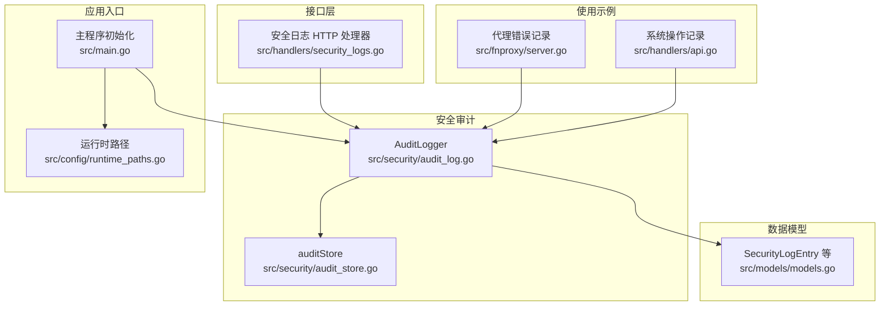
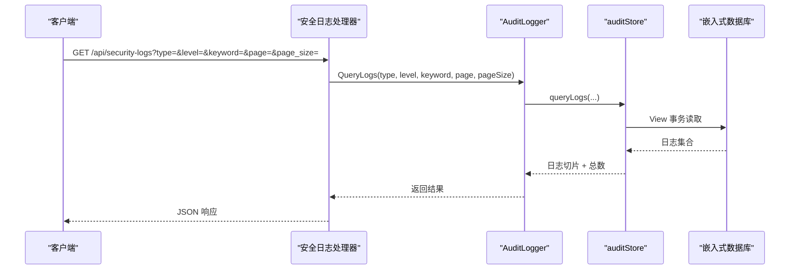
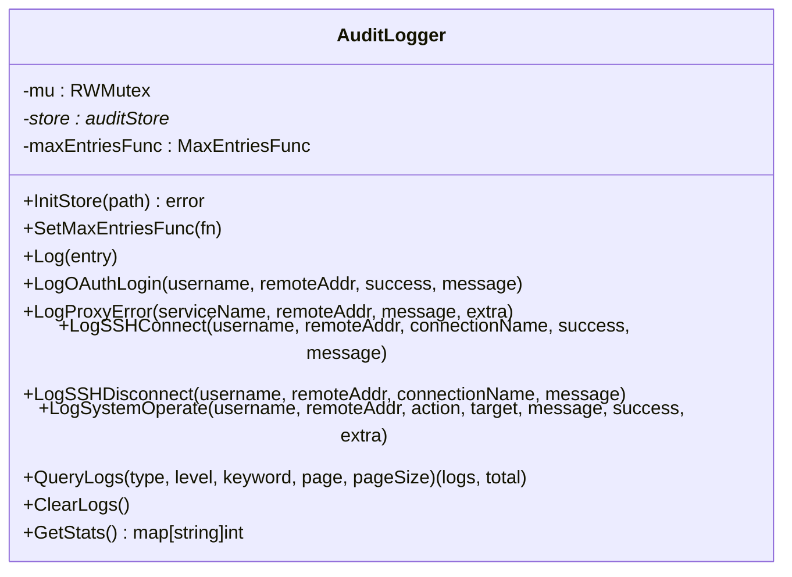
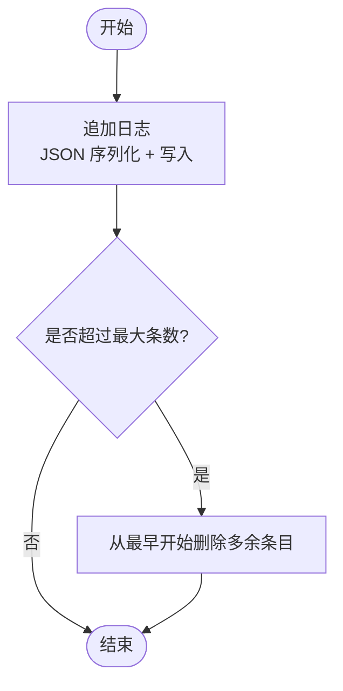
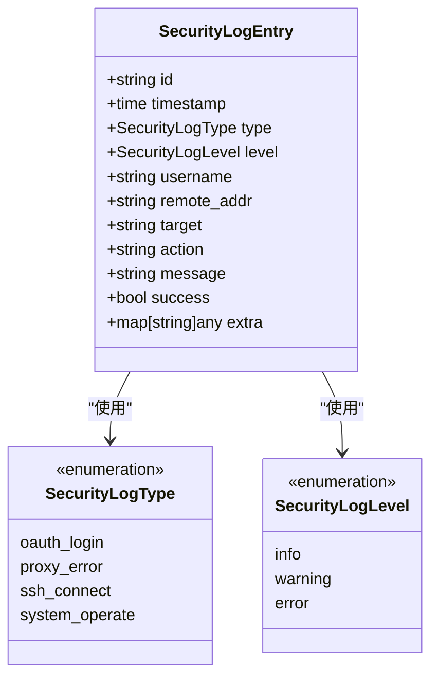
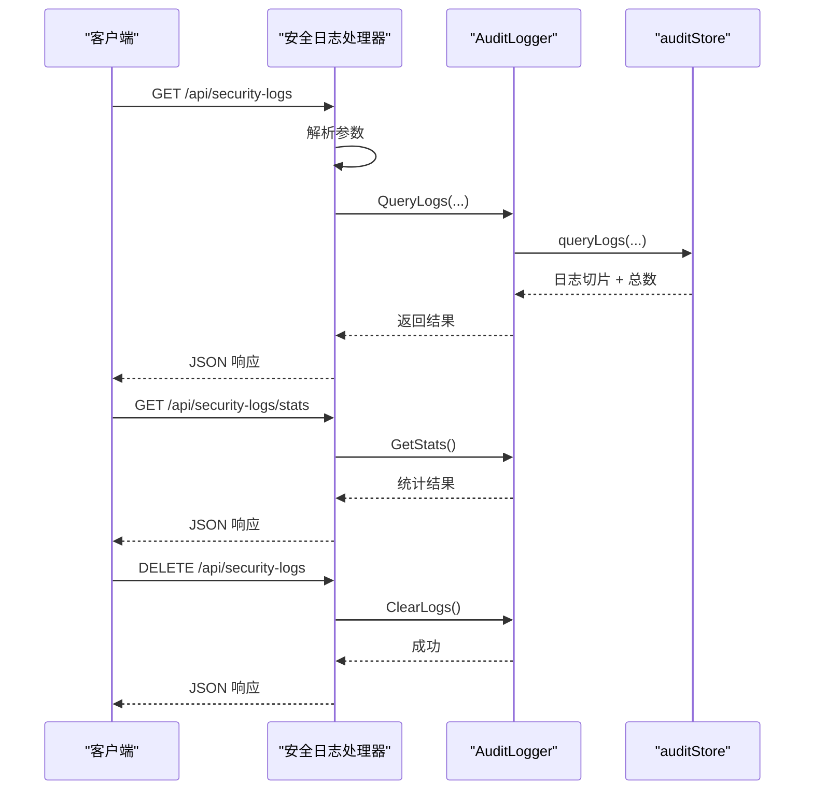
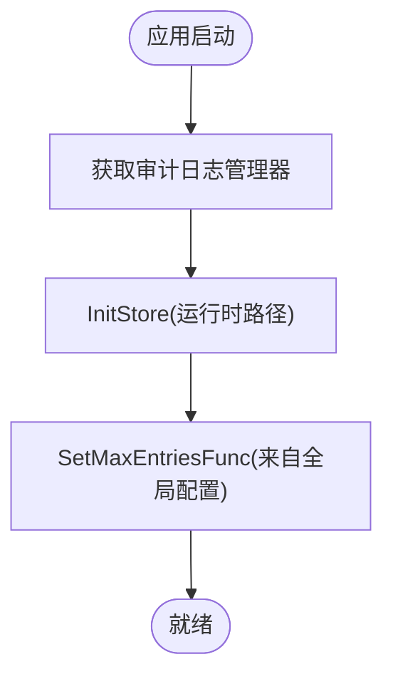
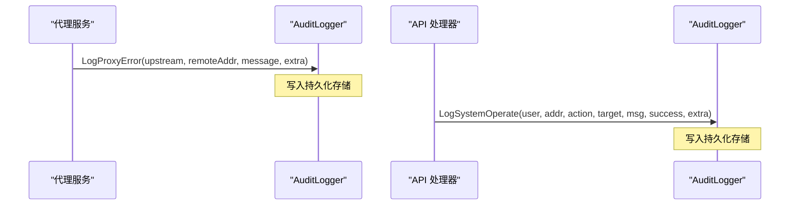
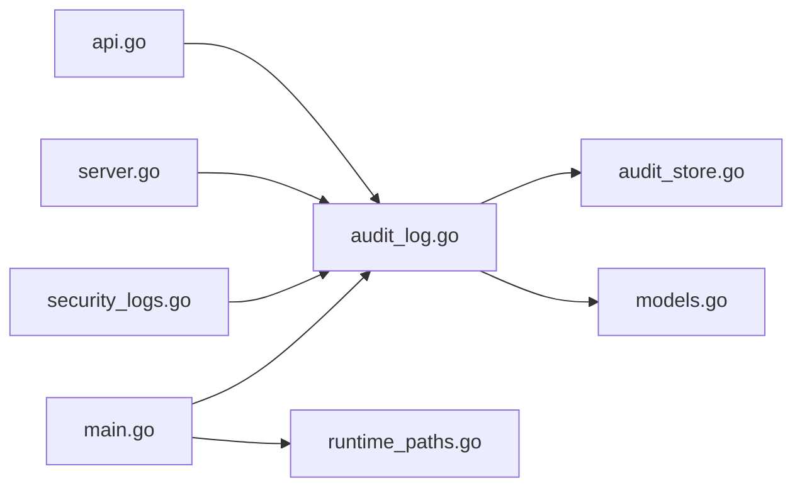

# 审计日志

<cite>
**本文引用的文件**
- [audit_log.go](file://src/security/audit_log.go)
- [audit_store.go](file://src/security/audit_store.go)
- [models.go](file://src/models/models.go)
- [security_logs.go](file://src/handlers/security_logs.go)
- [main.go](file://src/main.go)
- [runtime_paths.go](file://src/config/runtime_paths.go)
- [server.go](file://src/fnproxy/server.go)
- [api.go](file://src/handlers/api.go)
</cite>

## 目录
1. [简介](#简介)
2. [项目结构](#项目结构)
3. [核心组件](#核心组件)
4. [架构总览](#架构总览)
5. [详细组件分析](#详细组件分析)
6. [依赖分析](#依赖分析)
7. [性能考量](#性能考量)
8. [故障排查指南](#故障排查指南)
9. [结论](#结论)
10. [附录](#附录)

## 简介
本文件面向 Caddy Panel 的审计日志系统，系统性阐述其设计理念、实现机制与使用方法。审计日志覆盖登录审计、配置变更审计、系统操作审计与安全事件审计等场景，采用轻量级嵌入式数据库进行持久化存储，并提供查询、统计与清空能力。本文同时给出数据模型、存储策略、查询过滤、配置项、合规性与最佳实践建议，帮助读者快速理解并正确使用该系统。

## 项目结构
审计日志相关代码主要分布在以下模块：
- 安全日志核心与存储：src/security/audit_log.go、src/security/audit_store.go
- 数据模型：src/models/models.go
- HTTP 接口：src/handlers/security_logs.go
- 程序入口与初始化：src/main.go
- 运行时路径与持久化位置：src/config/runtime_paths.go
- 使用示例（调用点）：src/fnproxy/server.go、src/handlers/api.go

图表来源
- [audit_log.go:1-224](file://src/security/audit_log.go#L1-L224)
- [audit_store.go:1-222](file://src/security/audit_store.go#L1-L222)
- [models.go:312-344](file://src/models/models.go#L312-L344)
- [security_logs.go:1-65](file://src/handlers/security_logs.go#L1-L65)
- [main.go:96-103](file://src/main.go#L96-L103)
- [runtime_paths.go:101-103](file://src/config/runtime_paths.go#L101-L103)
- [server.go:564-570](file://src/fnproxy/server.go#L564-L570)
- [api.go:210-211](file://src/handlers/api.go#L210-L211)

章节来源
- [audit_log.go:1-224](file://src/security/audit_log.go#L1-L224)
- [audit_store.go:1-222](file://src/security/audit_store.go#L1-L222)
- [models.go:312-344](file://src/models/models.go#L312-L344)
- [security_logs.go:1-65](file://src/handlers/security_logs.go#L1-L65)
- [main.go:96-103](file://src/main.go#L96-L103)
- [runtime_paths.go:101-103](file://src/config/runtime_paths.go#L101-L103)
- [server.go:564-570](file://src/fnproxy/server.go#L564-L570)
- [api.go:210-211](file://src/handlers/api.go#L210-L211)

## 核心组件
- 审计日志管理器（AuditLogger）
  - 单例模式，负责日志记录、查询、统计与清空
  - 支持动态设置最大日志条数回调
  - 内部持有持久化存储实例
- 审计存储（auditStore）
  - 基于嵌入式数据库的持久化实现
  - 提供追加、查询、统计、清空与裁剪能力
- 数据模型（SecurityLogEntry 等）
  - 定义日志类型、级别、字段与序列化结构
- HTTP 接口（安全日志处理器）
  - 提供分页查询、统计与清空接口
- 初始化与路径
  - 主程序在启动时初始化审计日志存储与最大条数限制
  - 运行时路径决定持久化文件位置

章节来源
- [audit_log.go:15-31](file://src/security/audit_log.go#L15-L31)
- [audit_store.go:22-45](file://src/security/audit_store.go#L22-L45)
- [models.go:312-344](file://src/models/models.go#L312-L344)
- [security_logs.go:10-64](file://src/handlers/security_logs.go#L10-L64)
- [main.go:96-103](file://src/main.go#L96-L103)
- [runtime_paths.go:101-103](file://src/config/runtime_paths.go#L101-L103)

## 架构总览
审计日志系统采用“管理器 + 存储”的分层设计：
- 管理器负责并发控制、日志规范化（ID、时间戳）、调用存储与统计
- 存储负责持久化、索引与查询
- 接口层提供 HTTP API
- 初始化阶段完成存储路径与容量限制的设定

图表来源
- [security_logs.go:10-40](file://src/handlers/security_logs.go#L10-L40)
- [audit_log.go:168-183](file://src/security/audit_log.go#L168-L183)
- [audit_store.go:69-129](file://src/security/audit_store.go#L69-L129)

## 详细组件分析

### 审计日志管理器（AuditLogger）
- 单例与并发
  - 通过互斥锁保护内部状态与存储指针
  - 提供初始化存储、设置最大条数回调、记录日志、查询、统计与清空
- 日志记录
  - 自动补全 ID 与时间戳
  - 将日志写入存储并按最大条数进行裁剪
- 便捷记录方法
  - OAuth 登录、代理错误、SSH 连接/断开、系统操作等专用方法
- 查询与统计
  - 支持按类型、级别、关键词过滤
  - 支持分页（默认每页 50，上限 200）
  - 统计各类型日志数量

图表来源
- [audit_log.go:15-224](file://src/security/audit_log.go#L15-L224)

章节来源
- [audit_log.go:25-31](file://src/security/audit_log.go#L25-L31)
- [audit_log.go:33-51](file://src/security/audit_log.go#L33-L51)
- [audit_log.go:62-80](file://src/security/audit_log.go#L62-L80)
- [audit_log.go:82-166](file://src/security/audit_log.go#L82-L166)
- [audit_log.go:168-194](file://src/security/audit_log.go#L168-L194)
- [audit_log.go:196-223](file://src/security/audit_log.go#L196-L223)

### 审计存储（auditStore）
- 存储引擎与桶
  - 使用嵌入式数据库作为存储后端
  - 使用固定桶名存放安全日志
- 追加与裁剪
  - 追加时序列化为 JSON 并写入
  - 使用复合键（纳秒时间戳 + ID）保证有序与唯一
  - 当超过最大条数时，从最早开始删除多余条目
- 查询与过滤
  - 从最新到最旧遍历，支持类型、级别、关键词过滤
  - 分页返回子集
- 统计与清空
  - 统计总数与各类型数量
  - 清空时重建桶

图表来源
- [audit_store.go:47-67](file://src/security/audit_store.go#L47-L67)
- [audit_store.go:202-221](file://src/security/audit_store.go#L202-L221)

章节来源
- [audit_store.go:26-45](file://src/security/audit_store.go#L26-L45)
- [audit_store.go:47-67](file://src/security/audit_store.go#L47-L67)
- [audit_store.go:69-129](file://src/security/audit_store.go#L69-L129)
- [audit_store.go:131-162](file://src/security/audit_store.go#L131-L162)
- [audit_store.go:164-176](file://src/security/audit_store.go#L164-L176)
- [audit_store.go:198-200](file://src/security/audit_store.go#L198-L200)
- [audit_store.go:202-221](file://src/security/audit_store.go#L202-L221)

### 数据模型（SecurityLogEntry）
- 字段定义
  - 唯一标识、时间戳、类型、级别、用户名、来源 IP、目标、动作、消息、成功标志、额外信息
- 类型与级别
  - 类型：OAuth 登录、代理错误、SSH 连接、系统操作
  - 级别：信息、警告、错误
- 结构用于序列化与反序列化，确保跨模块一致

图表来源
- [models.go:312-344](file://src/models/models.go#L312-L344)

章节来源
- [models.go:312-344](file://src/models/models.go#L312-L344)

### HTTP 接口（安全日志）
- 查询接口
  - 支持 type、level、keyword、page、page_size 参数
  - 返回日志列表、总数、当前页与页大小
- 统计接口
  - 返回总数量与按类型细分的数量
- 清空接口
  - DELETE 方法清空所有日志

图表来源
- [security_logs.go:10-40](file://src/handlers/security_logs.go#L10-L40)
- [security_logs.go:42-54](file://src/handlers/security_logs.go#L42-L54)
- [security_logs.go:56-64](file://src/handlers/security_logs.go#L56-L64)

章节来源
- [security_logs.go:10-40](file://src/handlers/security_logs.go#L10-L40)
- [security_logs.go:42-54](file://src/handlers/security_logs.go#L42-L54)
- [security_logs.go:56-64](file://src/handlers/security_logs.go#L56-L64)

### 初始化与运行时路径
- 初始化流程
  - 主程序启动时获取审计日志管理器实例
  - 使用运行时路径初始化存储
  - 设置最大日志条数回调，来源于全局配置
- 运行时路径
  - 安全日志缓存文件位于运行时目录下的 cache/security-logs.db

图表来源
- [main.go:96-103](file://src/main.go#L96-L103)
- [runtime_paths.go:101-103](file://src/config/runtime_paths.go#L101-L103)

章节来源
- [main.go:96-103](file://src/main.go#L96-L103)
- [runtime_paths.go:101-103](file://src/config/runtime_paths.go#L101-L103)

### 使用示例（调用点）
- 代理错误记录
  - 在代理失败时记录错误日志，包含上游服务名、来源 IP 与错误信息
- 系统操作记录
  - 在增删改启停等关键操作后记录系统操作日志，包含操作人、目标与结果

图表来源
- [server.go:564-570](file://src/fnproxy/server.go#L564-L570)
- [api.go:210-211](file://src/handlers/api.go#L210-L211)

章节来源
- [server.go:564-570](file://src/fnproxy/server.go#L564-L570)
- [api.go:210-211](file://src/handlers/api.go#L210-L211)

## 依赖分析
- 组件耦合
  - AuditLogger 依赖 models 的日志模型与运行时路径
  - auditStore 依赖嵌入式数据库与 models
  - HTTP 处理器依赖 AuditLogger
  - 主程序依赖配置管理器与运行时路径
- 外部依赖
  - 嵌入式数据库驱动
  - UUID 生成库
- 循环依赖
  - 未发现循环依赖

图表来源
- [main.go:96-103](file://src/main.go#L96-L103)
- [audit_log.go:15-224](file://src/security/audit_log.go#L15-L224)
- [audit_store.go:1-222](file://src/security/audit_store.go#L1-L222)
- [models.go:312-344](file://src/models/models.go#L312-L344)
- [security_logs.go:1-65](file://src/handlers/security_logs.go#L1-L65)
- [server.go:564-570](file://src/fnproxy/server.go#L564-L570)
- [api.go:210-211](file://src/handlers/api.go#L210-L211)

章节来源
- [main.go:96-103](file://src/main.go#L96-L103)
- [audit_log.go:15-224](file://src/security/audit_log.go#L15-L224)
- [audit_store.go:1-222](file://src/security/audit_store.go#L1-L222)
- [models.go:312-344](file://src/models/models.go#L312-L344)
- [security_logs.go:1-65](file://src/handlers/security_logs.go#L1-L65)
- [server.go:564-570](file://src/fnproxy/server.go#L564-L570)
- [api.go:210-211](file://src/handlers/api.go#L210-L211)

## 性能考量
- 存储与索引
  - 使用复合键（时间戳+ID）保证插入有序，便于裁剪与遍历
  - 查询采用从最新到最旧的游标遍历，避免全表扫描
- 分页与过滤
  - 分页参数默认每页 50，最大 200，降低一次性传输压力
  - 关键词过滤在内存中进行，建议配合类型/级别的精确过滤
- 裁剪策略
  - 当超过最大条数时，从最早开始删除，保持存储规模可控
- 并发与锁
  - 读多写少场景下，读写锁提升并发性能
- I/O 优化
  - 批量写入与事务提交减少磁盘 I/O 次数

[本节为通用性能讨论，不直接分析具体文件]

## 故障排查指南
- 初始化失败
  - 检查运行时目录权限与路径是否存在
  - 确认嵌入式数据库可正常打开
- 查询无结果
  - 确认查询参数（类型、级别、关键词）是否正确
  - 检查日志是否被裁剪或清空
- 清空无效
  - 确认使用 DELETE 方法调用清空接口
  - 检查存储桶是否被重建
- 性能问题
  - 调整最大日志条数与分页大小
  - 优化关键词过滤范围

章节来源
- [audit_store.go:26-45](file://src/security/audit_store.go#L26-L45)
- [audit_store.go:69-129](file://src/security/audit_store.go#L69-L129)
- [audit_store.go:164-176](file://src/security/audit_store.go#L164-L176)
- [security_logs.go:56-64](file://src/handlers/security_logs.go#L56-L64)

## 结论
Caddy Panel 的审计日志系统以简洁高效为目标，采用嵌入式数据库与统一的数据模型，实现了对登录、代理错误、SSH 连接与系统操作等关键行为的完整记录。通过分页查询、关键词过滤与统计接口，满足日常运维与合规审计需求。建议在生产环境中合理设置最大日志条数与访问频率，结合外部备份策略保障长期留存与检索效率。

[本节为总结性内容，不直接分析具体文件]

## 附录

### 审计日志类型与含义
- OAuth 登录：记录 OAuth 登录成功/失败与相关信息
- 代理错误：记录代理服务不可用或上游错误
- SSH 连接：记录 SSH 连接/断开成功/失败
- 系统操作：记录管理员对系统配置与资源的关键操作

章节来源
- [models.go:315-320](file://src/models/models.go#L315-L320)
- [audit_log.go:82-166](file://src/security/audit_log.go#L82-L166)

### 数据模型字段说明
- id：日志唯一标识
- timestamp：日志时间戳
- type：日志类型
- level：日志级别
- username：操作用户（可选）
- remote_addr：来源 IP
- target：目标对象（如服务名、SSH 连接名）
- action：动作描述
- message：详细信息
- success：是否成功
- extra：额外信息（可选）

章节来源
- [models.go:332-344](file://src/models/models.go#L332-L344)

### 存储机制与数据清理策略
- 存储介质：嵌入式数据库
- 存储位置：运行时目录 cache/security-logs.db
- 清理策略：当超过最大条数时，从最早开始删除多余条目
- 查询策略：从最新到最旧遍历，支持类型、级别、关键词过滤与分页

章节来源
- [runtime_paths.go:101-103](file://src/config/runtime_paths.go#L101-L103)
- [audit_store.go:15-18](file://src/security/audit_store.go#L15-L18)
- [audit_store.go:47-67](file://src/security/audit_store.go#L47-L67)
- [audit_store.go:202-221](file://src/security/audit_store.go#L202-L221)
- [audit_store.go:69-129](file://src/security/audit_store.go#L69-L129)

### 审计日志查询与过滤使用方法
- 查询接口
  - GET /api/security-logs
  - 参数：type、level、keyword、page、page_size
  - 返回：logs、total、page、page_size
- 统计接口
  - GET /api/security-logs/stats
  - 返回：total、按类型细分的数量
- 清空接口
  - DELETE /api/security-logs

章节来源
- [security_logs.go:10-40](file://src/handlers/security_logs.go#L10-L40)
- [security_logs.go:42-54](file://src/handlers/security_logs.go#L42-L54)
- [security_logs.go:56-64](file://src/handlers/security_logs.go#L56-L64)

### 配置选项与合规性考虑
- 配置项
  - 最大安全日志条数：来源于全局配置，影响裁剪阈值
  - 运行时路径：决定持久化文件位置
- 合规性建议
  - 保留期限：根据法规要求设置合理的日志保留期
  - 访问控制：仅授权人员可访问审计日志接口
  - 备份策略：定期导出与归档重要审计数据
  - 隐私保护：避免记录敏感信息（如明文密码），必要时脱敏

章节来源
- [main.go:96-103](file://src/main.go#L96-L103)
- [models.go:300-310](file://src/models/models.go#L300-L310)

### 最佳实践
- 合理设置最大条数：平衡存储空间与查询效率
- 使用精确过滤：优先使用 type 与 level，再使用关键词
- 控制查询频率：避免高频全量扫描
- 定期维护：清理过期日志，监控存储使用情况
- 安全加固：限制接口访问权限，启用鉴权与审计

[本节为通用最佳实践建议，不直接分析具体文件]