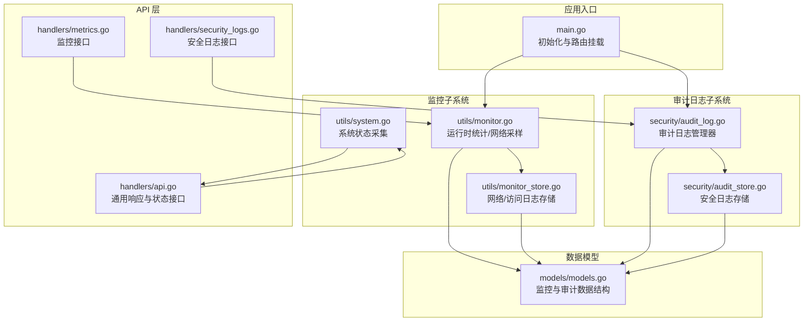
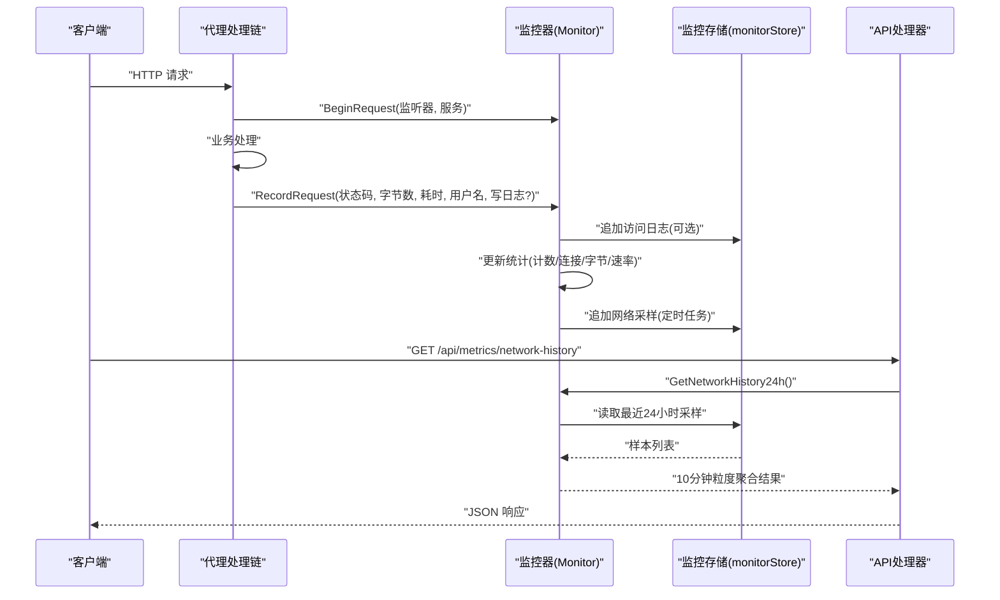
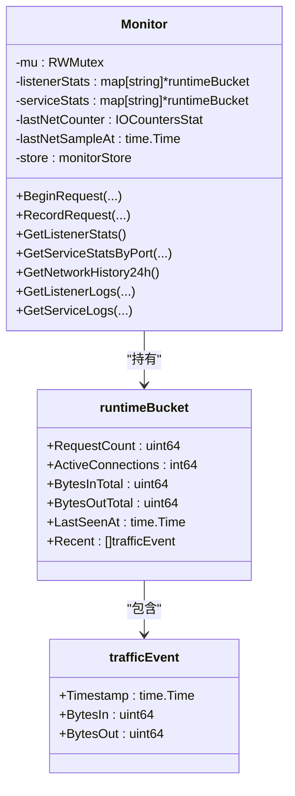
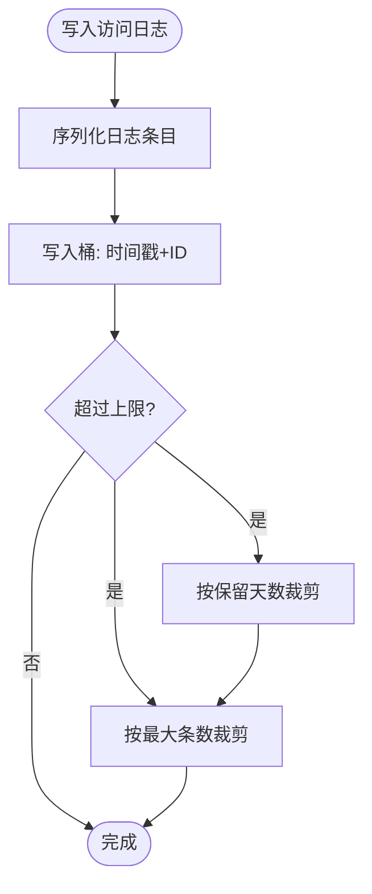
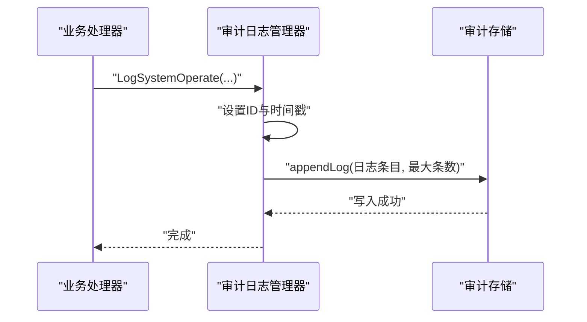
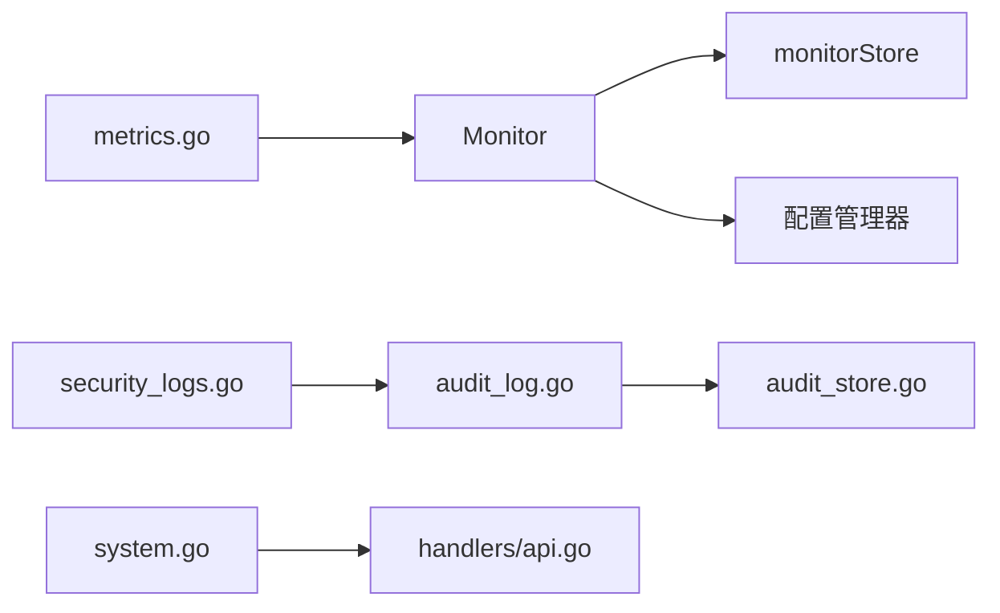

# 监控系统

<cite>
**本文引用的文件**
- [src/main.go](file://src/main.go)
- [src/utils/monitor.go](file://src/utils/monitor.go)
- [src/utils/monitor_store.go](file://src/utils/monitor_store.go)
- [src/utils/system.go](file://src/utils/system.go)
- [src/handlers/metrics.go](file://src/handlers/metrics.go)
- [src/handlers/security_logs.go](file://src/handlers/security_logs.go)
- [src/handlers/api.go](file://src/handlers/api.go)
- [src/models/models.go](file://src/models/models.go)
- [src/security/audit_log.go](file://src/security/audit_log.go)
- [src/security/audit_store.go](file://src/security/audit_store.go)
</cite>

## 目录
1. [简介](#简介)
2. [项目结构](#项目结构)
3. [核心组件](#核心组件)
4. [架构总览](#架构总览)
5. [详细组件分析](#详细组件分析)
6. [依赖分析](#依赖分析)
7. [性能考量](#性能考量)
8. [故障排除指南](#故障排除指南)
9. [结论](#结论)
10. [附录](#附录)

## 简介
本文件面向 Caddy Panel 的监控系统，系统性阐述其状态监控、网络流量统计、性能指标采集与存储、审计日志设计与查询、以及监控数据的可视化与导出思路。文档同时提供指标含义解释、阈值建议、配置项说明、性能优化与故障排除指引，并给出使用示例与最佳实践。

## 项目结构
监控系统由以下模块协同构成：
- 运行时监控与网络采样：负责实时统计连接数、请求量、进出字节与速率，并周期性采样网卡 IO 构建网络历史。
- 存储层：基于嵌入式数据库持久化网络采样与访问日志，支持按时间窗口聚合与清理。
- API 层：提供网络历史、监听/服务统计、访问日志查询等接口。
- 审计日志：独立的安全审计日志系统，支持类型/级别/关键词过滤、分页与统计。
- 系统状态：提供 CPU、内存、网络总量与速率等基础系统指标。

图表来源
- [src/main.go:112-429](file://src/main.go#L112-L429)
- [src/utils/monitor.go:38-117](file://src/utils/monitor.go#L38-L117)
- [src/utils/monitor_store.go:30-125](file://src/utils/monitor_store.go#L30-L125)
- [src/utils/system.go:19-82](file://src/utils/system.go#L19-L82)
- [src/handlers/metrics.go:11-52](file://src/handlers/metrics.go#L11-L52)
- [src/handlers/security_logs.go:10-64](file://src/handlers/security_logs.go#L10-L64)
- [src/models/models.go:18-70](file://src/models/models.go#L18-L70)
- [src/security/audit_log.go:15-80](file://src/security/audit_log.go#L15-L80)
- [src/security/audit_store.go:26-67](file://src/security/audit_store.go#L26-L67)

章节来源
- [src/main.go:112-429](file://src/main.go#L112-L429)

## 核心组件
- 运行时监控器（Monitor）
  - 负责监听器与服务维度的实时统计：请求数、活动连接数、累计/瞬时字节数与速率。
  - 周期性采样网卡 IO，计算每秒流入/流出速率并持久化。
  - 提供按监听器、按服务、按端口的统计查询，以及 24 小时网络历史聚合。
- 监控存储（monitorStore）
  - 使用嵌入式数据库存储网络采样与访问日志，键采用时间戳或时间+ID，支持按时间范围检索与按上限裁剪。
- 系统状态采集（system.go）
  - 提供运行时 CPU、内存、网络总量与速率、主机信息等基础指标。
- 审计日志（audit_log.go + audit_store.go）
  - 提供统一的日志管理器，支持多种类型与级别的安全事件记录、查询、统计与清理。
- API 接口（handlers）
  - 提供网络历史、监听/服务统计、访问日志查询、安全日志查询与统计、清空等接口。
- 数据模型（models）
  - 定义网络采样、运行时统计、访问日志、安全日志等结构体。

章节来源
- [src/utils/monitor.go:38-386](file://src/utils/monitor.go#L38-L386)
- [src/utils/monitor_store.go:26-208](file://src/utils/monitor_store.go#L26-L208)
- [src/utils/system.go:19-124](file://src/utils/system.go#L19-L124)
- [src/security/audit_log.go:15-224](file://src/security/audit_log.go#L15-L224)
- [src/security/audit_store.go:22-222](file://src/security/audit_store.go#L22-L222)
- [src/handlers/metrics.go:11-52](file://src/handlers/metrics.go#L11-L52)
- [src/handlers/security_logs.go:10-64](file://src/handlers/security_logs.go#L10-L64)
- [src/models/models.go:18-70](file://src/models/models.go#L18-L70)

## 架构总览
监控系统围绕“实时采集—短期存储—聚合查询—对外暴露”的闭环展开。运行时监控器在业务处理路径中埋点，记录请求生命周期内的关键指标；网络采样通过定时任务从系统层面采集；访问日志与安全日志分别写入各自桶，支持按需查询与统计。

图表来源
- [src/utils/monitor.go:119-189](file://src/utils/monitor.go#L119-L189)
- [src/utils/monitor_store.go:56-100](file://src/utils/monitor_store.go#L56-L100)
- [src/handlers/metrics.go:11-14](file://src/handlers/metrics.go#L11-L14)

## 详细组件分析

### 运行时监控器（Monitor）
- 实时统计
  - 监听器与服务维度维护活动连接数、累计字节、最近时间戳与近期事件队列。
  - 在请求开始时增加活动连接，在结束时减少并累加计数与字节，同时维护最近窗口内的事件以计算瞬时速率。
- 网络采样
  - 启动后每分钟采样一次网卡 IO，计算与上次采样的差值并除以时间间隔得到每秒速率，持久化到监控存储。
  - 仅保留最近 24 小时的网络采样，避免无限增长。
- 统计查询
  - 支持按监听器 ID、服务 ID、端口 ID 查询统计。
  - 支持 24 小时内每 10 分钟的平均速率聚合，便于前端折线图展示。
- 访问日志
  - 可选择是否写入访问日志，包含监听器/服务标识、请求方法/路径/状态码、耗时、字节数、远端地址、用户名等。
  - 支持按监听器或服务过滤，限制返回条数。

图表来源
- [src/utils/monitor.go:38-386](file://src/utils/monitor.go#L38-L386)

章节来源
- [src/utils/monitor.go:38-386](file://src/utils/monitor.go#L38-L386)

### 监控存储（monitorStore）
- 网络采样存储
  - 键：仅时间戳（纳秒），保证单调递增且可范围扫描。
  - 写入时自动清理早于保留期的数据。
- 访问日志存储
  - 键：时间戳+日志ID，确保唯一性与稳定排序。
  - 写入时根据全局配置裁剪：按保留天数与最大条数上限进行清理。
- 查询能力
  - 网络历史：按起始时间范围读取并聚合。
  - 访问日志：支持限制数量与自定义过滤函数。

图表来源
- [src/utils/monitor_store.go:102-125](file://src/utils/monitor_store.go#L102-L125)
- [src/utils/monitor_store.go:188-199](file://src/utils/monitor_store.go#L188-L199)

章节来源
- [src/utils/monitor_store.go:26-208](file://src/utils/monitor_store.go#L26-L208)

### 系统状态采集（system.go）
- 提供运行时 CPU 使用率、内存占用与百分比、网络收发总量与速率、主机名、OS、平台等信息。
- 速率计算基于两次采样之间的差值与时间间隔。

章节来源
- [src/utils/system.go:19-82](file://src/utils/system.go#L19-L82)

### 审计日志系统（audit_log.go + audit_store.go）
- 管理器职责
  - 单例初始化与存储绑定，支持设置最大日志条数回调。
  - 提供多种事件记录方法：OAuth 登录、代理错误、SSH 连接/断开、系统操作等。
- 存储职责
  - 键：时间戳+ID，支持按类型/级别/关键词过滤与分页查询。
  - 统计：按类型汇总总数。
  - 清理：支持清空桶并重建。

图表来源
- [src/security/audit_log.go:62-80](file://src/security/audit_log.go#L62-L80)
- [src/security/audit_store.go:47-67](file://src/security/audit_store.go#L47-L67)

章节来源
- [src/security/audit_log.go:15-224](file://src/security/audit_log.go#L15-L224)
- [src/security/audit_store.go:22-222](file://src/security/audit_store.go#L22-L222)

### API 接口与数据模型
- 监控接口
  - 网络历史：/api/metrics/network-history
  - 监听统计：/api/metrics/listeners
  - 服务统计：/api/metrics/services?port_id=...
  - 访问日志：/api/logs/listeners/{id}?limit=... 与 /api/logs/services/{id}?limit=...
- 审计日志接口
  - 列表与统计：/api/security-logs 与 /api/security-logs/stats
  - 清空：DELETE /api/security-logs
- 数据模型
  - 网络采样、运行时统计、访问日志、安全日志等结构体定义。

章节来源
- [src/handlers/metrics.go:11-52](file://src/handlers/metrics.go#L11-L52)
- [src/handlers/security_logs.go:10-64](file://src/handlers/security_logs.go#L10-L64)
- [src/models/models.go:18-70](file://src/models/models.go#L18-L70)

## 依赖分析
- 组件耦合
  - Monitor 依赖 monitorStore 与配置管理器（用于监听器/服务枚举）。
  - API 层仅依赖 Monitor 与审计日志管理器，保持清晰的边界。
  - 审计日志管理器与存储解耦，支持通过回调动态调整上限。
- 外部依赖
  - 网络采样使用第三方库读取系统 IO。
  - 存储使用嵌入式数据库，键设计保证高效范围扫描与裁剪。

图表来源
- [src/utils/monitor.go:54-64](file://src/utils/monitor.go#L54-L64)
- [src/handlers/metrics.go:11-14](file://src/handlers/metrics.go#L11-L14)
- [src/handlers/security_logs.go:10-31](file://src/handlers/security_logs.go#L10-L31)
- [src/utils/system.go:19-82](file://src/utils/system.go#L19-L82)

章节来源
- [src/utils/monitor.go:54-64](file://src/utils/monitor.go#L54-L64)
- [src/handlers/metrics.go:11-52](file://src/handlers/metrics.go#L11-L52)
- [src/handlers/security_logs.go:10-64](file://src/handlers/security_logs.go#L10-L64)
- [src/utils/system.go:19-82](file://src/utils/system.go#L19-L82)

## 性能考量
- 采样频率与窗口
  - 网络采样默认每分钟一次，24 小时保留期；10 分钟粒度聚合适合折线图展示，兼顾精度与性能。
- 存储策略
  - 采用时间戳键，范围扫描高效；写入时即时裁剪，避免无限增长。
  - 访问日志与安全日志均支持按天数与条数上限裁剪，防止磁盘膨胀。
- 并发与锁
  - 统计更新使用读写锁保护，避免热点竞争；网络采样与日志写入在独立 goroutine 中定时执行。
- 前端展示
  - 24 小时聚合结果按固定步长生成，减少前端计算压力；日志查询支持分页与限制数量。

[本节为通用性能讨论，不直接分析具体文件]

## 故障排除指南
- 网络历史为空
  - 检查监控器是否正常初始化与定时采样；确认存储路径可写且未被外部进程锁定。
  - 确认时间窗口内存在样本（首次运行可能需要至少一个完整周期）。
- 访问日志缺失
  - 确认服务配置中启用了访问日志记录；检查写日志标志位。
  - 检查日志上限与保留天数配置，确认未被裁剪。
- 审计日志查询异常
  - 确认审计存储已初始化；检查类型/级别/关键词过滤条件。
  - 若日志过多导致查询缓慢，适当提高分页大小或缩小查询范围。
- 系统状态接口报错
  - 检查系统指标读取权限与第三方库可用性；确认网络 IO 采样返回有效数据。

章节来源
- [src/utils/monitor.go:67-76](file://src/utils/monitor.go#L67-L76)
- [src/utils/monitor_store.go:56-75](file://src/utils/monitor_store.go#L56-L75)
- [src/utils/monitor_store.go:102-125](file://src/utils/monitor_store.go#L102-L125)
- [src/security/audit_log.go:34-44](file://src/security/audit_log.go#L34-L44)
- [src/security/audit_store.go:47-67](file://src/security/audit_store.go#L47-L67)

## 结论
Caddy Panel 的监控系统以轻量、低侵入的方式实现了运行时统计、网络采样与访问日志持久化，并通过统一的 API 对外提供查询能力。审计日志系统独立于业务逻辑，具备完善的过滤、统计与清理机制。整体设计兼顾实时性与可维护性，适合中小规模到中等规模的运维场景。

[本节为总结性内容，不直接分析具体文件]

## 附录

### 监控指标含义与阈值建议
- 运行时统计
  - 请求计数：单位时间内请求数，可用于评估负载变化。
  - 活动连接数：当前活跃连接，峰值过高可能指示连接泄漏或突发流量。
  - 累计/瞬时字节：累计字节反映总体流量，瞬时速率用于带宽预警。
- 网络采样
  - 入/出速率：用于带宽使用分析与告警阈值设定。
- 系统状态
  - CPU 使用率：持续高于阈值可能需要扩容或优化。
  - 内存使用：结合总内存与使用率判断是否存在内存泄漏。
  - 网络总量与速率：与瞬时速率配合，识别异常波动。

阈值建议（示例）
- CPU 使用率：短期峰值超过 80%，持续 5 分钟以上触发告警。
- 内存使用率：超过 85% 且持续 10 分钟以上触发告警。
- 网络速率：单接口瞬时速率超过带宽上限的 70% 触发预警。
- 活动连接数：超过服务承载能力的 80% 触发预警。

[本节为通用指导，不直接分析具体文件]

### 配置选项与最佳实践
- 全局配置（影响监控与审计）
  - 日志保留天数：决定访问日志与安全日志的保留周期。
  - 最大访问日志条数：限制内存与磁盘占用。
  - 最大安全日志条数：限制审计日志规模。
- 监控最佳实践
  - 为高流量服务开启访问日志，但注意日志量与存储成本。
  - 合理设置日志上限与保留天数，避免磁盘占满。
  - 使用 10 分钟粒度聚合展示网络历史，兼顾细节与性能。
  - 对关键服务设置阈值告警，结合活动连接数与速率进行综合判断。

章节来源
- [src/models/models.go:299-310](file://src/models/models.go#L299-L310)
- [src/utils/monitor_store.go:188-199](file://src/utils/monitor_store.go#L188-L199)
- [src/security/audit_store.go:15-18](file://src/security/audit_store.go#L15-L18)

### 使用示例与导出思路
- 获取网络历史（折线图数据）
  - 请求：GET /api/metrics/network-history
  - 响应：24 小时内每 10 分钟的平均入/出速率点集合。
- 获取监听统计
  - 请求：GET /api/metrics/listeners
  - 响应：各监听器的请求计数、活动连接、累计/瞬时字节与速率。
- 获取服务统计
  - 请求：GET /api/metrics/services?port_id=...
  - 响应：端口下各服务的统计信息。
- 获取访问日志
  - 请求：GET /api/logs/listeners/{id}?limit=100 或 /api/logs/services/{id}?limit=100
  - 响应：按时间倒序的日志列表。
- 安全日志查询与统计
  - 请求：GET /api/security-logs?type=&level=&keyword=&page=&page_size=
  - 请求：GET /api/security-logs/stats
  - 请求：DELETE /api/security-logs
- 导出思路
  - 前端轮询接口获取 JSON 数据，按需转换为 CSV/Excel。
  - 后端可扩展导出接口，支持指定时间范围与字段过滤。

章节来源
- [src/handlers/metrics.go:11-52](file://src/handlers/metrics.go#L11-L52)
- [src/handlers/security_logs.go:10-64](file://src/handlers/security_logs.go#L10-L64)
- [src/handlers/api.go:129-137](file://src/handlers/api.go#L129-L137)