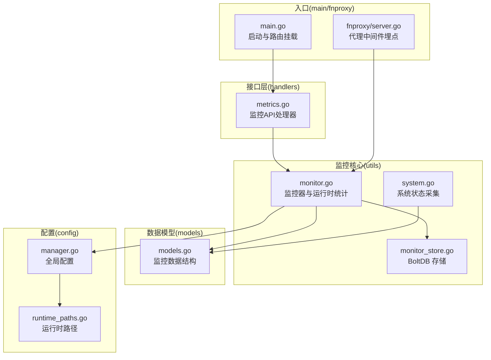
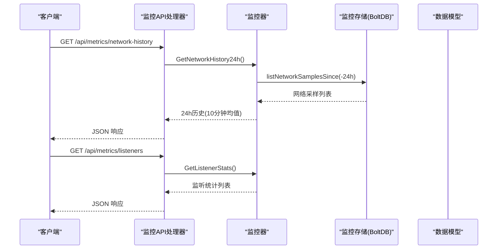
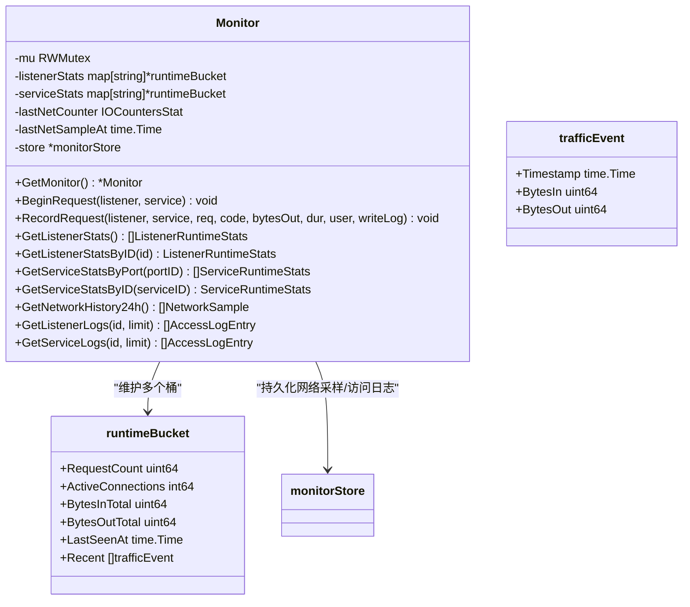
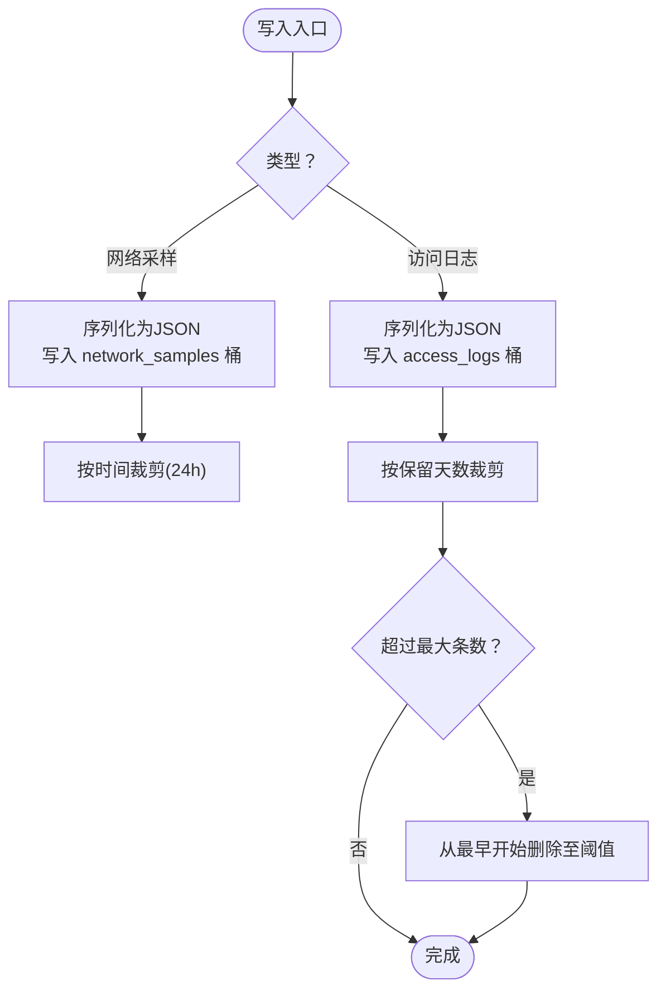
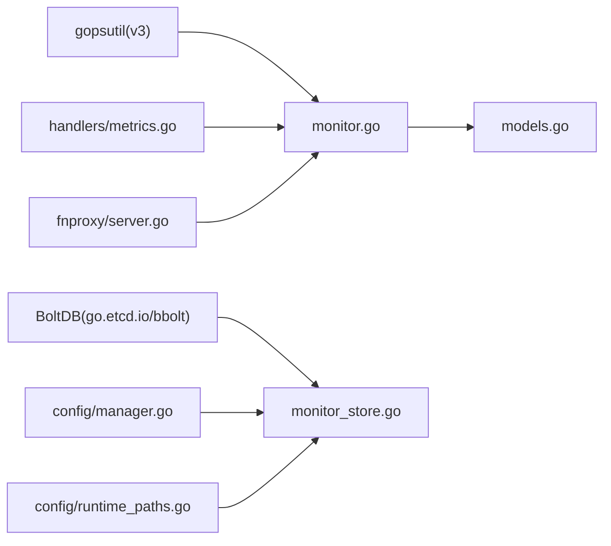

# 系统监控

<cite>
**本文引用的文件**
- [src/utils/monitor.go](file://src/utils/monitor.go)
- [src/utils/monitor_store.go](file://src/utils/monitor_store.go)
- [src/utils/system.go](file://src/utils/system.go)
- [src/handlers/metrics.go](file://src/handlers/metrics.go)
- [src/models/models.go](file://src/models/models.go)
- [src/config/manager.go](file://src/config/manager.go)
- [src/config/runtime_paths.go](file://src/config/runtime_paths.go)
- [src/main.go](file://src/main.go)
- [src/fnproxy/server.go](file://src/fnproxy/server.go)
</cite>

## 目录
1. [简介](#简介)
2. [项目结构](#项目结构)
3. [核心组件](#核心组件)
4. [架构总览](#架构总览)
5. [详细组件分析](#详细组件分析)
6. [依赖关系分析](#依赖关系分析)
7. [性能考量](#性能考量)
8. [故障排除指南](#故障排除指南)
9. [结论](#结论)
10. [附录](#附录)

## 简介
本文件面向 Caddy Panel 的系统监控能力，系统性阐述其资源监控与运行时统计的实现机制，包括：
- 系统资源监控：CPU 使用率、内存占用、网络流量（含瞬时速率与历史趋势）
- 运行时统计：请求计数、活跃连接数、字节流入/流出总量与速率
- 实时采集流程：gopsutil 库使用、采样间隔与存储策略
- 数据持久化：基于 BoltDB 的监控缓存与访问日志存储
- 配置项与限制：日志保留、最大条数、网络采样窗口
- 性能优化与故障排除建议

## 项目结构
围绕监控功能的关键模块如下：
- utils：监控核心（内存统计、网络采样、运行时统计）、系统状态采集、监控存储
- handlers：监控相关 API（网络历史、监听/服务统计、访问日志）
- models：监控数据结构（运行时统计、网络采样、访问日志、全局配置）
- config：运行时路径与全局配置（含日志保留与条数限制）
- main/fnproxy：监控初始化与在代理链路中的埋点

图表来源
- [src/utils/monitor.go:1-386](file://src/utils/monitor.go#L1-L386)
- [src/utils/monitor_store.go:1-208](file://src/utils/monitor_store.go#L1-L208)
- [src/utils/system.go:1-124](file://src/utils/system.go#L1-L124)
- [src/handlers/metrics.go:1-53](file://src/handlers/metrics.go#L1-L53)
- [src/models/models.go:1-394](file://src/models/models.go#L1-L394)
- [src/config/manager.go:1-791](file://src/config/manager.go#L1-L791)
- [src/config/runtime_paths.go:1-160](file://src/config/runtime_paths.go#L1-L160)
- [src/main.go:1-516](file://src/main.go#L1-L516)
- [src/fnproxy/server.go:1120-1140](file://src/fnproxy/server.go#L1120-L1140)

章节来源
- [src/main.go:108-139](file://src/main.go#L108-L139)
- [src/fnproxy/server.go:1120-1140](file://src/fnproxy/server.go#L1120-L1140)

## 核心组件
- 监控器（Monitor）：负责运行时统计、网络采样、访问日志记录与查询
- 监控存储（monitorStore/BoltDB）：持久化网络采样与访问日志，支持按时间裁剪与最大条数限制
- 系统状态采集（system.go）：CPU、内存、网络 IO、主机信息等基础系统状态
- 监控 API（handlers/metrics.go）：对外暴露网络历史、监听/服务统计、访问日志接口
- 数据模型（models.go）：监控数据结构定义
- 配置与路径（config/manager.go、runtime_paths.go）：运行时路径、日志保留与条数限制

章节来源
- [src/utils/monitor.go:38-65](file://src/utils/monitor.go#L38-L65)
- [src/utils/monitor_store.go:26-54](file://src/utils/monitor_store.go#L26-L54)
- [src/utils/system.go:19-82](file://src/utils/system.go#L19-L82)
- [src/handlers/metrics.go:11-53](file://src/handlers/metrics.go#L11-L53)
- [src/models/models.go:7-70](file://src/models/models.go#L7-L70)
- [src/config/manager.go:35-72](file://src/config/manager.go#L35-L72)
- [src/config/runtime_paths.go:97-99](file://src/config/runtime_paths.go#L97-L99)

## 架构总览
监控子系统由“采集—计算—存储—查询—展示”构成闭环：
- 采集：gopsutil 采集 CPU/内存/网络 IO；定时器周期性采样网络速率
- 计算：在内存中维护监听器与服务维度的运行时统计（请求计数、活跃连接、字节总量、最近事件窗口速率）
- 存储：网络采样与访问日志写入 BoltDB；按时间窗口裁剪与最大条数限制
- 查询：API 提供网络历史、监听/服务统计、访问日志查询
- 展示：前端通过 API 获取数据进行可视化

图表来源
- [src/handlers/metrics.go:11-29](file://src/handlers/metrics.go#L11-L29)
- [src/utils/monitor.go:323-355](file://src/utils/monitor.go#L323-L355)
- [src/utils/monitor_store.go:77-100](file://src/utils/monitor_store.go#L77-L100)

## 详细组件分析

### 监控器（Monitor）与运行时统计
- 单例模式：通过 GetMonitor() 初始化，内部创建监听器与服务维度的运行时桶，启动网络采样定时器
- 网络采样：每分钟采样一次网卡 IO，计算瞬时速率并持久化
- 请求生命周期埋点：BeginRequest/RecordRequest 在代理中间件中调用，更新活跃连接、请求计数、字节总量与最近事件窗口
- 速率计算：基于最近 1 分钟窗口内的事件累加字节数，除以窗口时长得到速率
- 查询接口：按监听器 ID、服务 ID、端口聚合查询统计

图表来源
- [src/utils/monitor.go:38-65](file://src/utils/monitor.go#L38-L65)
- [src/utils/monitor.go:29-36](file://src/utils/monitor.go#L29-L36)
- [src/utils/monitor.go:23-27](file://src/utils/monitor.go#L23-L27)

章节来源
- [src/utils/monitor.go:53-117](file://src/utils/monitor.go#L53-L117)
- [src/utils/monitor.go:119-189](file://src/utils/monitor.go#L119-L189)
- [src/utils/monitor.go:220-251](file://src/utils/monitor.go#L220-L251)
- [src/utils/monitor.go:253-321](file://src/utils/monitor.go#L253-L321)
- [src/utils/monitor.go:323-355](file://src/utils/monitor.go#L323-L355)
- [src/utils/monitor.go:357-380](file://src/utils/monitor.go#L357-L380)

### 监控存储（BoltDB）与持久化策略
- 网络采样：按时间戳键写入 JSON，保留 24 小时，定时清理过期数据
- 访问日志：按时间+ID 复合键写入 JSON，支持按日志保留天数与最大条数裁剪
- 键设计：时间戳仅键（timeOnlyKey）与时间+ID复合键（timeCompositeKey），保证有序遍历与去重
- 限制来源：来自全局配置 Global 的 LogRetentionDays 与 MaxAccessLogEntries

图表来源
- [src/utils/monitor_store.go:56-75](file://src/utils/monitor_store.go#L56-L75)
- [src/utils/monitor_store.go:102-125](file://src/utils/monitor_store.go#L102-L125)
- [src/utils/monitor_store.go:157-186](file://src/utils/monitor_store.go#L157-L186)
- [src/utils/monitor_store.go:188-199](file://src/utils/monitor_store.go#L188-L199)
- [src/utils/monitor_store.go:201-208](file://src/utils/monitor_store.go#L201-L208)

章节来源
- [src/utils/monitor_store.go:16-24](file://src/utils/monitor_store.go#L16-L24)
- [src/utils/monitor_store.go:30-54](file://src/utils/monitor_store.go#L30-L54)
- [src/utils/monitor_store.go:77-100](file://src/utils/monitor_store.go#L77-L100)
- [src/utils/monitor_store.go:102-125](file://src/utils/monitor_store.go#L102-L125)
- [src/utils/monitor_store.go:188-199](file://src/utils/monitor_store.go#L188-L199)

### 系统状态采集（CPU/内存/网络/主机）
- CPU 使用率：使用 gopsutil 的 CPU 百分比采样
- 内存：读取运行时内存统计，包含已用与总内存
- 网络 IO：累计字节接收/发送，结合上次采样计算瞬时速率
- 主机信息：主机名、OS、平台等

章节来源
- [src/utils/system.go:19-82](file://src/utils/system.go#L19-L82)

### 监控 API 与路由
- 网络历史：GET /api/metrics/network-history
- 监听统计：GET /api/metrics/listeners
- 服务统计：GET /api/metrics/services?port_id=...
- 访问日志：GET /api/logs/listeners/{id}?limit=N、GET /api/logs/services/{id}?limit=N

章节来源
- [src/handlers/metrics.go:11-53](file://src/handlers/metrics.go#L11-L53)
- [src/main.go:134-138](file://src/main.go#L134-L138)

### 代理中间件中的监控埋点
- 在代理处理链中，进入请求时调用 BeginRequest 增加活跃连接
- 响应完成后调用 RecordRequest 减少活跃连接、更新请求计数与字节统计，并根据服务配置决定是否写入访问日志

章节来源
- [src/fnproxy/server.go:1120-1140](file://src/fnproxy/server.go#L1120-L1140)

## 依赖关系分析
- 监控器依赖 gopsutil 用于 CPU/内存/网络 IO 采集
- 监控存储依赖 BoltDB（go.etcd.io/bbolt）进行持久化
- 监控 API 依赖监控器提供的查询方法
- 配置管理器提供日志保留与条数限制，影响存储裁剪策略
- 运行时路径提供监控缓存数据库文件位置

图表来源
- [src/utils/monitor.go:9-13](file://src/utils/monitor.go#L9-L13)
- [src/utils/monitor_store.go:13](file://src/utils/monitor_store.go#L13)
- [src/config/manager.go:35-72](file://src/config/manager.go#L35-L72)
- [src/config/runtime_paths.go:97-99](file://src/config/runtime_paths.go#L97-L99)
- [src/handlers/metrics.go:8](file://src/handlers/metrics.go#L8)
- [src/fnproxy/server.go:1120-1140](file://src/fnproxy/server.go#L1120-L1140)

## 性能考量
- 采样频率与内存占用
  - 网络采样：每分钟一次，内存中维护 Recent 窗口（默认 1 分钟），窗口修剪成本低
  - 访问日志：按需写入，受日志保留与最大条数限制，避免无限增长
- I/O 与锁竞争
  - 监控器使用读写锁保护统计桶，读多写少场景下并发友好
  - BoltDB 写入采用事务，批量裁剪与键排序在小规模数据上开销可控
- 速率计算
  - 瞬时速率基于两次采样差值/时间间隔，平滑度取决于采样间隔
  - 运行时速率基于最近 1 分钟事件窗口累加，更贴近短期趋势
- 建议
  - 如需更高分辨率网络速率，可缩短采样间隔，但需评估 CPU 与存储压力
  - 对高 QPS 场景，建议合理设置日志保留与最大条数，避免 BoltDB 膨胀

[本节为通用性能讨论，不直接分析具体文件]

## 故障排除指南
- 网络采样为空
  - 检查 gopsutil 是否可用，确认系统权限与平台支持
  - 查看监控器初始化是否成功（单例初始化与定时器启动）
- BoltDB 写入失败
  - 检查运行时路径是否存在且有写权限（monitor-cache.db 所在目录）
  - 确认 BoltDB 选项与超时设置是否合理
- 访问日志缺失
  - 确认服务配置中是否启用访问日志
  - 检查日志保留天数与最大条数是否过小导致被裁剪
- API 查询异常
  - 确认路由挂载与鉴权中间件是否正确
  - 检查查询参数（如 port_id、limit）是否符合预期

章节来源
- [src/utils/monitor.go:53-65](file://src/utils/monitor.go#L53-L65)
- [src/utils/monitor_store.go:30-54](file://src/utils/monitor_store.go#L30-L54)
- [src/config/runtime_paths.go:97-99](file://src/config/runtime_paths.go#L97-L99)
- [src/main.go:134-138](file://src/main.go#L134-L138)

## 结论
Caddy Panel 的系统监控以“内存统计 + BoltDB 持久化”的方式实现了对 CPU、内存、网络与运行时指标的可观测性。通过在代理中间件中埋点，系统能够准确统计请求、连接与流量，并提供简洁的 API 接口供前端可视化。合理的采样间隔与存储策略在保证实时性的同时兼顾了性能与资源占用。

[本节为总结性内容，不直接分析具体文件]

## 附录

### 监控指标与含义
- 监听统计（ListenerRuntimeStats）
  - request_count：监听器累计请求数
  - active_connections：当前活跃连接数
  - bytes_in_total/bytes_out_total：累计流入/流出字节数
  - bytes_in_rate/bytes_out_rate：最近 1 分钟平均速率
  - last_seen_at：最后观测时间
- 服务统计（ServiceRuntimeStats）
  - 包含监听器统计字段，并附加服务标识（名称、域名、类型）
- 网络采样（NetworkSample）
  - timestamp：采样时间
  - in_rate/out_rate：瞬时流入/流出速率（基于两次采样差值/时间间隔）
- 访问日志（AccessLogEntry）
  - 包含请求时间、监听器/服务信息、主机、方法、路径、状态码、耗时、字节流入/流出、远端地址、用户名等

章节来源
- [src/models/models.go:25-70](file://src/models/models.go#L25-L70)

### 配置选项与默认值
- 全局配置（GlobalConfig）
  - log_retention_days：日志保留天数，默认 7
  - max_access_log_entries：最大访问日志条数，默认 10000
  - 其他与监控相关的字段详见模型定义
- 运行时路径
  - monitor-cache.db：监控缓存数据库文件路径（相对运行时根目录）

章节来源
- [src/models/models.go:299-310](file://src/models/models.go#L299-L310)
- [src/config/runtime_paths.go:97-99](file://src/config/runtime_paths.go#L97-L99)
- [src/utils/monitor_store.go:188-199](file://src/utils/monitor_store.go#L188-L199)

### 使用示例（API）
- 获取 24 小时网络历史（每 10 分钟均值）
  - GET /api/metrics/network-history
- 获取监听统计
  - GET /api/metrics/listeners
- 获取端口下服务统计
  - GET /api/metrics/services?port_id={portID}
- 获取监听访问日志（限制条数）
  - GET /api/logs/listeners/{listenerID}?limit=100
- 获取服务访问日志（限制条数）
  - GET /api/logs/services/{serviceID}?limit=100

章节来源
- [src/handlers/metrics.go:11-53](file://src/handlers/metrics.go#L11-L53)