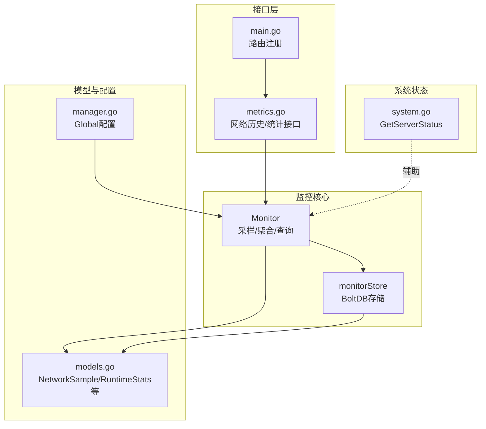
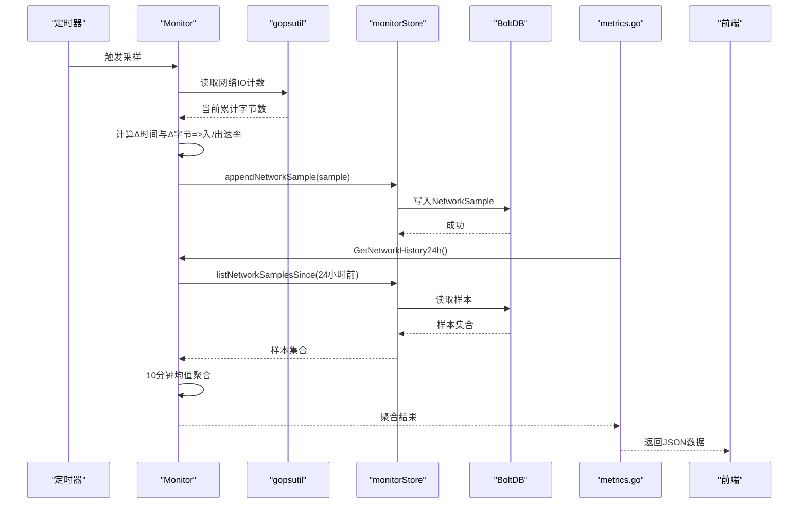
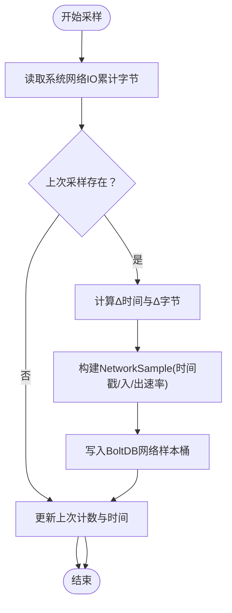
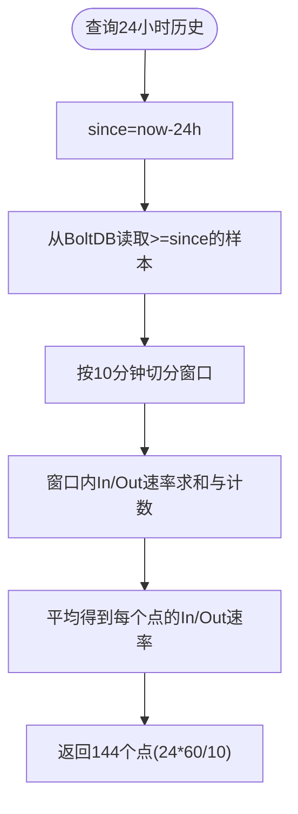
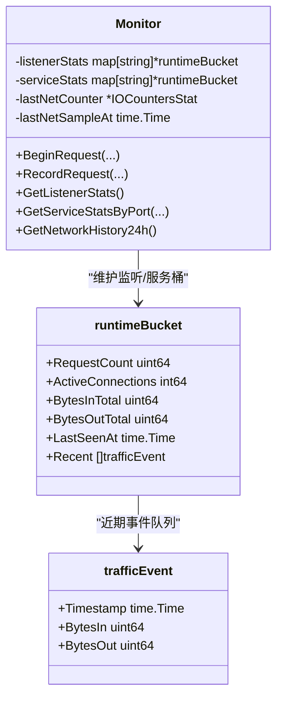
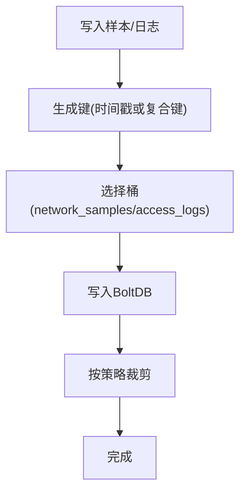
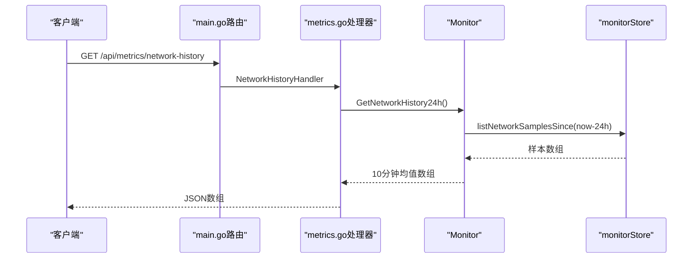
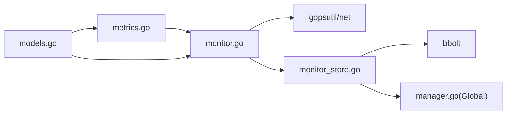

# 网络监控

<cite>
**本文引用的文件**
- [monitor.go](file://src/utils/monitor.go)
- [monitor_store.go](file://src/utils/monitor_store.go)
- [metrics.go](file://src/handlers/metrics.go)
- [models.go](file://src/models/models.go)
- [manager.go](file://src/config/manager.go)
- [system.go](file://src/utils/system.go)
- [main.go](file://src/main.go)
</cite>

## 目录
1. [简介](#简介)
2. [项目结构](#项目结构)
3. [核心组件](#核心组件)
4. [架构总览](#架构总览)
5. [详细组件分析](#详细组件分析)
6. [依赖分析](#依赖分析)
7. [性能考量](#性能考量)
8. [故障排查指南](#故障排查指南)
9. [结论](#结论)
10. [附录](#附录)

## 简介
本文件系统性阐述 Caddy Panel 的网络监控能力，重点覆盖：
- 网络 IO 统计与带宽使用率计算
- 流量趋势分析与 24 小时历史数据聚合
- 采样机制、采样间隔、数据聚合与历史数据存储
- 监控数据格式与结构（入站/出站、时间戳、聚合粒度）
- 配置参数、数据保留策略与性能优化
- 网络监控 API 使用示例与数据分析最佳实践

## 项目结构
网络监控相关代码主要分布在以下模块：
- 数据采集与聚合：utils/monitor.go
- 存储与清理：utils/monitor_store.go
- API 接口：handlers/metrics.go
- 数据模型：models/models.go
- 全局配置：config/manager.go
- 服务器状态辅助：utils/system.go
- 路由注册：main.go

图表来源
- [monitor.go:1-386](file://src/utils/monitor.go#L1-L386)
- [monitor_store.go:1-208](file://src/utils/monitor_store.go#L1-L208)
- [metrics.go:1-53](file://src/handlers/metrics.go#L1-L53)
- [models.go:18-70](file://src/models/models.go#L18-L70)
- [manager.go:300-310](file://src/config/manager.go#L300-L310)
- [system.go:19-82](file://src/utils/system.go#L19-L82)
- [main.go:134-138](file://src/main.go#L134-L138)

章节来源
- [monitor.go:1-386](file://src/utils/monitor.go#L1-L386)
- [monitor_store.go:1-208](file://src/utils/monitor_store.go#L1-L208)
- [metrics.go:1-53](file://src/handlers/metrics.go#L1-L53)
- [models.go:18-70](file://src/models/models.go#L18-L70)
- [manager.go:300-310](file://src/config/manager.go#L300-L310)
- [system.go:19-82](file://src/utils/system.go#L19-L82)
- [main.go:134-138](file://src/main.go#L134-L138)

## 核心组件
- Monitor：负责网络采样、运行时统计、24 小时历史聚合与日志过滤。
- monitorStore：基于 BoltDB 的持久化存储，维护网络样本与访问日志。
- handlers/metrics：提供网络历史、监听器/服务统计、访问日志接口。
- models：定义 NetworkSample、RuntimeStats、AccessLogEntry 等数据结构。
- config/manager：提供全局配置（含日志保留策略）。
- utils/system：提供服务器状态（包含累计网络字节与速率），辅助理解监控口径。

章节来源
- [monitor.go:38-65](file://src/utils/monitor.go#L38-L65)
- [monitor_store.go:26-54](file://src/utils/monitor_store.go#L26-L54)
- [metrics.go:11-52](file://src/handlers/metrics.go#L11-L52)
- [models.go:18-70](file://src/models/models.go#L18-L70)
- [manager.go:300-310](file://src/config/manager.go#L300-L310)
- [system.go:19-82](file://src/utils/system.go#L19-L82)

## 架构总览
网络监控采用“采样-存储-查询-展示”的分层设计：
- 采样层：定时读取系统网络 IO，计算每采样周期的入/出速率，生成 NetworkSample 并落库。
- 存储层：BoltDB 分桶存储网络样本与访问日志，自动按时间裁剪过期数据。
- 查询层：提供 API 获取 24 小时历史（10 分钟均值）、监听/服务实时统计、访问日志。
- 展示层：前端通过 API 获取数据进行可视化（例如首页的 24 小时网络流量趋势图）。

图表来源
- [monitor.go:67-117](file://src/utils/monitor.go#L67-L117)
- [monitor_store.go:56-100](file://src/utils/monitor_store.go#L56-L100)
- [metrics.go:11-14](file://src/handlers/metrics.go#L11-L14)

## 详细组件分析

### 采样与带宽计算
- 采样频率：每分钟一次（常量定义在 Monitor 中）。
- 速率计算：基于两次采样的时间差与累计字节差，计算每秒入/出速率。
- 数据结构：NetworkSample 包含时间戳、入速率、出速率。

图表来源
- [monitor.go:78-117](file://src/utils/monitor.go#L78-L117)
- [monitor_store.go:56-75](file://src/utils/monitor_store.go#L56-L75)

章节来源
- [monitor.go:16-21](file://src/utils/monitor.go#L16-L21)
- [monitor.go:78-117](file://src/utils/monitor.go#L78-L117)
- [models.go:18-23](file://src/models/models.go#L18-L23)

### 24 小时历史数据聚合
- 时间窗口：最近 24 小时。
- 聚合粒度：每 10 分钟一个点。
- 聚合算法：对每个 10 分钟窗口内的样本速率求平均。
- 数据来源：从 BoltDB 读取 24 小时内的样本，按时间窗口聚合。

图表来源
- [monitor.go:323-355](file://src/utils/monitor.go#L323-L355)
- [monitor_store.go:77-100](file://src/utils/monitor_store.go#L77-L100)

章节来源
- [monitor.go:323-355](file://src/utils/monitor.go#L323-L355)
- [monitor_store.go:77-100](file://src/utils/monitor_store.go#L77-L100)

### 运行时统计与请求事件
- 请求生命周期：BeginRequest 记录连接变化，RecordRequest 记录请求的入/出字节、状态码、耗时等。
- 近期速率窗口：固定 60 秒，用于计算每秒入/出速率。
- 近期事件修剪：超过 60 秒的事件被移除，避免内存膨胀。

图表来源
- [monitor.go:29-46](file://src/utils/monitor.go#L29-L46)
- [monitor.go:119-189](file://src/utils/monitor.go#L119-L189)
- [monitor.go:220-251](file://src/utils/monitor.go#L220-L251)

章节来源
- [monitor.go:29-46](file://src/utils/monitor.go#L29-L46)
- [monitor.go:119-189](file://src/utils/monitor.go#L119-L189)
- [monitor.go:220-251](file://src/utils/monitor.go#L220-L251)

### 存储与数据保留
- 存储引擎：BoltDB，网络样本与访问日志分别存放在独立桶中。
- 键设计：网络样本仅以时间戳作为键；访问日志以“时间戳:ID”复合键保证唯一性。
- 保留策略：
  - 网络样本：按时间裁剪，保留最近 24 小时。
  - 访问日志：按“保留天数”和“最大条数”双维度裁剪，保留天数与最大条数来自全局配置，有默认值。

图表来源
- [monitor_store.go:56-75](file://src/utils/monitor_store.go#L56-L75)
- [monitor_store.go:102-125](file://src/utils/monitor_store.go#L102-L125)
- [monitor_store.go:157-186](file://src/utils/monitor_store.go#L157-L186)
- [monitor_store.go:201-207](file://src/utils/monitor_store.go#L201-L207)

章节来源
- [monitor_store.go:16-24](file://src/utils/monitor_store.go#L16-L24)
- [monitor_store.go:56-75](file://src/utils/monitor_store.go#L56-L75)
- [monitor_store.go:102-125](file://src/utils/monitor_store.go#L102-L125)
- [monitor_store.go:188-199](file://src/utils/monitor_store.go#L188-L199)

### API 与使用示例
- 网络历史（24 小时，10 分钟均值）：GET /api/metrics/network-history
- 监听统计：GET /api/metrics/listeners
- 服务统计（按端口）：GET /api/metrics/services?port_id=...
- 监听访问日志：GET /api/logs/listeners/{listener_id}?limit=N
- 服务访问日志：GET /api/logs/services/{service_id}?limit=N

图表来源
- [main.go:134-138](file://src/main.go#L134-L138)
- [metrics.go:11-14](file://src/handlers/metrics.go#L11-L14)
- [monitor.go:323-355](file://src/utils/monitor.go#L323-L355)
- [monitor_store.go:77-100](file://src/utils/monitor_store.go#L77-L100)

章节来源
- [main.go:134-138](file://src/main.go#L134-L138)
- [metrics.go:11-52](file://src/handlers/metrics.go#L11-L52)
- [monitor.go:323-355](file://src/utils/monitor.go#L323-L355)

## 依赖分析
- Monitor 依赖 gopsutil 获取系统网络 IO，依赖 monitorStore 写入/读取 BoltDB。
- monitorStore 依赖 BoltDB（bbolt）与配置管理器提供的日志保留策略。
- handlers/metrics 依赖 Monitor 提供的统计数据。
- models 定义了跨模块共享的数据结构。

图表来源
- [monitor.go:3-14](file://src/utils/monitor.go#L3-L14)
- [monitor_store.go:3-14](file://src/utils/monitor_store.go#L3-L14)
- [metrics.go:3-9](file://src/handlers/metrics.go#L3-L9)
- [models.go:18-70](file://src/models/models.go#L18-L70)
- [manager.go:300-310](file://src/config/manager.go#L300-L310)

章节来源
- [monitor.go:3-14](file://src/utils/monitor.go#L3-L14)
- [monitor_store.go:3-14](file://src/utils/monitor_store.go#L3-L14)
- [metrics.go:3-9](file://src/handlers/metrics.go#L3-L9)
- [models.go:18-70](file://src/models/models.go#L18-L70)
- [manager.go:300-310](file://src/config/manager.go#L300-L310)

## 性能考量
- 采样频率与内存：每分钟采样一次，内存中仅维护最近 60 秒的近期事件，避免长期累积。
- 存储开销：BoltDB 顺序写入，键为时间戳字符串，查询按时间范围扫描，适合高频写入场景。
- 聚合复杂度：24 小时 10 分钟均值聚合为 O(N) 遍历，N 为 24×6=144 个点，实际样本数通常远大于 144，但每次聚合仅遍历该窗口内的样本。
- I/O 限制：BoltDB 读写受磁盘性能影响，建议使用 SSD 或高性能存储。
- 并发安全：Monitor 使用读写锁保护内部状态，避免并发写冲突。

[本节为通用性能讨论，不直接分析具体文件，故无章节来源]

## 故障排查指南
- 无法获取网络历史：确认采样线程是否正常运行、BoltDB 是否可写、网络样本桶是否存在。
- 历史数据缺失：检查网络样本保留策略（默认 24 小时）与 BoltDB 裁剪逻辑。
- 访问日志异常：检查日志保留天数与最大条数配置，确认裁剪函数是否生效。
- 速率异常为 0：确认系统网络 IO 读取成功且两次采样之间时间差大于 0。
- API 返回空数组：确认查询时间范围与键排序是否正确（时间戳升序）。

章节来源
- [monitor.go:67-76](file://src/utils/monitor.go#L67-L76)
- [monitor_store.go:56-75](file://src/utils/monitor_store.go#L56-L75)
- [monitor_store.go:157-186](file://src/utils/monitor_store.go#L157-L186)

## 结论
Caddy Panel 的网络监控以“高频率采样 + 低开销存储 + 窗口聚合”的方式实现了对系统网络 IO 的可观测性。其设计兼顾了实时性与可维护性，适合中小规模部署的日常运维与容量规划。对于更高吞吐量场景，可考虑调整采样间隔、优化存储介质或引入外部时序数据库。

[本节为总结性内容，不直接分析具体文件，故无章节来源]

## 附录

### 数据格式与结构
- NetworkSample：包含时间戳、入速率、出速率。
- RuntimeStats：包含请求数、活跃连接数、入/出总字节、入/出速率、最后活跃时间。
- AccessLogEntry：包含访问日志关键字段（时间戳、监听器/服务标识、主机、方法、路径、状态码、耗时、入/出字节、远端地址、用户名等）。

章节来源
- [models.go:18-23](file://src/models/models.go#L18-L23)
- [models.go:25-34](file://src/models/models.go#L25-L34)
- [models.go:53-70](file://src/models/models.go#L53-L70)

### 配置参数与数据保留策略
- 全局配置项（Global）：
  - LogRetentionDays：访问日志保留天数，默认 7 天。
  - MaxAccessLogEntries：访问日志最大条数，默认 10000。
  - MaxSecurityLogEntries：安全日志最大条数，默认 5000。
- 网络样本保留：默认 24 小时。
- 访问日志保留：按“保留天数”和“最大条数”裁剪。

章节来源
- [manager.go:300-310](file://src/config/manager.go#L300-L310)
- [monitor_store.go:16-19](file://src/utils/monitor_store.go#L16-L19)
- [monitor_store.go:188-199](file://src/utils/monitor_store.go#L188-L199)

### 采样间隔与聚合算法
- 采样间隔：1 分钟。
- 聚合窗口：10 分钟。
- 聚合算法：窗口内速率求平均。

章节来源
- [monitor.go:16-21](file://src/utils/monitor.go#L16-L21)
- [monitor.go:323-355](file://src/utils/monitor.go#L323-L355)

### API 使用示例
- 获取 24 小时网络历史：GET /api/metrics/network-history
- 获取监听统计：GET /api/metrics/listeners
- 获取服务统计（按端口）：GET /api/metrics/services?port_id=...
- 获取监听访问日志：GET /api/logs/listeners/{listener_id}?limit=N
- 获取服务访问日志：GET /api/logs/services/{service_id}?limit=N

章节来源
- [main.go:134-138](file://src/main.go#L134-L138)
- [metrics.go:11-52](file://src/handlers/metrics.go#L11-L52)

### 数据分析最佳实践
- 采样粒度选择：根据业务峰值与展示需求权衡采样间隔与聚合窗口。
- 异常检测：关注入/出速率突增或长时间为 0 的异常点，结合访问日志定位问题。
- 历史对比：对比同时间段的历史数据，识别周期性波动与异常趋势。
- 存储容量：定期评估 BoltDB 文件大小，必要时迁移至外部时序数据库或调整保留策略。

[本节为通用实践建议，不直接分析具体文件，故无章节来源]