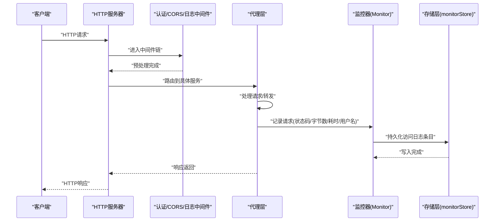
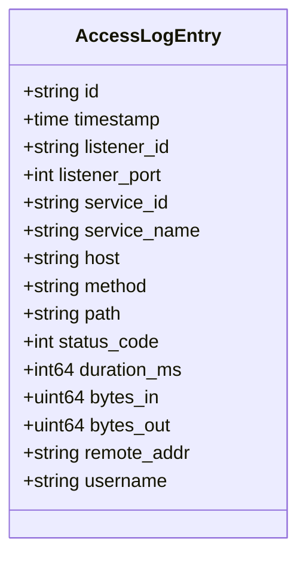
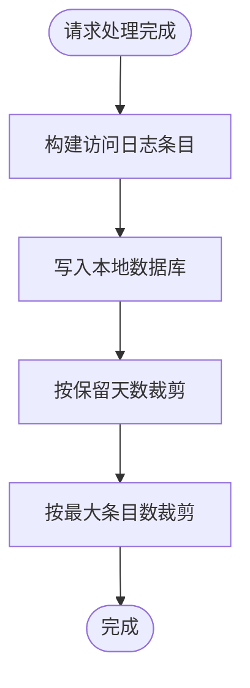
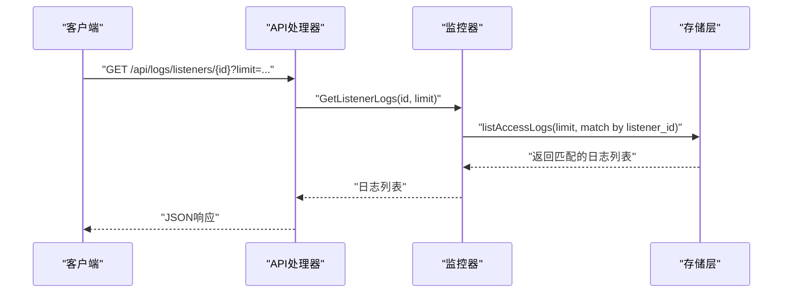
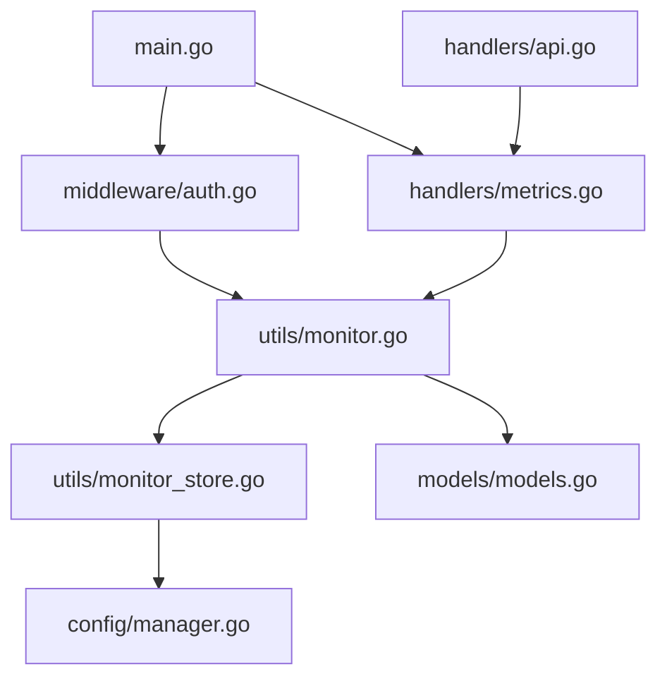

# 访问日志

<cite>
**本文档引用的文件**
- [src/main.go](file://src/main.go)
- [src/handlers/metrics.go](file://src/handlers/metrics.go)
- [src/handlers/api.go](file://src/handlers/api.go)
- [src/utils/monitor.go](file://src/utils/monitor.go)
- [src/utils/monitor_store.go](file://src/utils/monitor_store.go)
- [src/models/models.go](file://src/models/models.go)
- [src/config/manager.go](file://src/config/manager.go)
- [src/middleware/auth.go](file://src/middleware/auth.go)
</cite>

## 目录
1. [简介](#简介)
2. [项目结构](#项目结构)
3. [核心组件](#核心组件)
4. [架构总览](#架构总览)
5. [详细组件分析](#详细组件分析)
6. [依赖关系分析](#依赖关系分析)
7. [性能考量](#性能考量)
8. [故障排查指南](#故障排查指南)
9. [结论](#结论)
10. [附录](#附录)

## 简介
本文件系统性阐述 Caddy Panel 的访问日志功能，覆盖日志记录机制、字段采集与存储策略、过滤与查询能力、内存缓存与持久化机制、配置项与查询限制，以及 API 使用示例与分析方法。访问日志由代理层在请求处理完成后生成，记录监听器、服务、客户端、响应状态与性能指标，并持久化至本地数据库，支持按监听器或服务维度进行检索。

## 项目结构
访问日志相关代码主要分布在以下模块：
- 代理与入口：HTTP 服务器、路由注册、中间件链
- 监控与日志：运行时统计、访问日志生成与存储
- 数据模型：访问日志条目结构与全局配置
- 配置管理：日志保留与容量限制等全局参数
- API 层：对外暴露的访问日志查询接口

```mermaid
graph TB
subgraph "入口与中间件"
MAIN["main.go<br/>HTTP服务器与路由注册"]
AUTH["middleware/auth.go<br/>认证/CORS/日志中间件"]
end
subgraph "监控与日志"
MONITOR["utils/monitor.go<br/>运行时统计与日志生成"]
STORE["utils/monitor_store.go<br/>访问日志持久化"]
end
subgraph "模型与配置"
MODELS["models/models.go<br/>访问日志结构与全局配置"]
CFG["config/manager.go<br/>全局配置与默认值"]
end
subgraph "API"
METRICS["handlers/metrics.go<br/>访问日志查询API"]
API["handlers/api.go<br/>通用响应与上下文"]
end
MAIN --> AUTH
AUTH --> MONITOR
MONITOR --> STORE
MODELS --> MONITOR
CFG --> MONITOR
METRICS --> MONITOR
API --> METRICS
```

图表来源
- [src/main.go:112-429](file://src/main.go#L112-L429)
- [src/middleware/auth.go:109-118](file://src/middleware/auth.go#L109-L118)
- [src/utils/monitor.go:39-65](file://src/utils/monitor.go#L39-L65)
- [src/utils/monitor_store.go:26-54](file://src/utils/monitor_store.go#L26-L54)
- [src/models/models.go:53-70](file://src/models/models.go#L53-L70)
- [src/config/manager.go:300-310](file://src/config/manager.go#L300-L310)
- [src/handlers/metrics.go:31-41](file://src/handlers/metrics.go#L31-L41)
- [src/handlers/api.go:20-127](file://src/handlers/api.go#L20-L127)

章节来源
- [src/main.go:112-429](file://src/main.go#L112-L429)
- [src/utils/monitor.go:39-65](file://src/utils/monitor.go#L39-L65)
- [src/utils/monitor_store.go:26-54](file://src/utils/monitor_store.go#L26-L54)
- [src/models/models.go:53-70](file://src/models/models.go#L53-L70)
- [src/config/manager.go:300-310](file://src/config/manager.go#L300-L310)
- [src/handlers/metrics.go:31-41](file://src/handlers/metrics.go#L31-L41)
- [src/handlers/api.go:20-127](file://src/handlers/api.go#L20-L127)

## 核心组件
- 访问日志模型：包含时间戳、监听器与服务标识、客户端信息、请求方法与路径、状态码、耗时、字节数、用户名等字段。
- 监控器（Monitor）：负责统计运行时指标、在请求结束时生成访问日志条目，并调用存储层持久化。
- 存储层（monitorStore）：基于嵌入式数据库对访问日志进行持久化，支持按时间与ID复合键存储、按时间裁剪与按最大条目数裁剪。
- API 层：提供按监听器与服务维度的访问日志查询接口，支持 limit 参数限制返回数量。
- 中间件链：认证、CORS、日志中间件在请求处理前后参与流程，确保日志生成与安全控制。

章节来源
- [src/models/models.go:53-70](file://src/models/models.go#L53-L70)
- [src/utils/monitor.go:131-189](file://src/utils/monitor.go#L131-L189)
- [src/utils/monitor_store.go:102-125](file://src/utils/monitor_store.go#L102-L125)
- [src/handlers/metrics.go:31-41](file://src/handlers/metrics.go#L31-L41)
- [src/middleware/auth.go:109-118](file://src/middleware/auth.go#L109-L118)

## 架构总览
访问日志的产生与查询遵循如下流程：
- 请求进入 HTTP 服务器，经过认证、CORS、日志中间件处理。
- 代理层在请求处理完成后，构造响应记录器以捕获状态码与输出字节。
- 监控器统计请求计数、连接数、字节总量与速率，并在需要时生成访问日志条目。
- 访问日志条目写入本地数据库，同时按配置进行裁剪（按保留天数与最大条目数）。
- API 层提供查询接口，按监听器或服务ID过滤，并限制返回条目数量。



图表来源
- [src/main.go:422-429](file://src/main.go#L422-L429)
- [src/middleware/auth.go:109-118](file://src/middleware/auth.go#L109-L118)
- [src/utils/monitor.go:131-189](file://src/utils/monitor.go#L131-L189)
- [src/utils/monitor_store.go:102-125](file://src/utils/monitor_store.go#L102-L125)

## 详细组件分析

### 访问日志模型与字段
访问日志条目包含以下关键字段：
- 时间戳：记录日志生成时刻
- 监听器标识：监听器ID与端口
- 服务标识：服务ID、服务名称
- 客户端信息：Host、Method、Path、RemoteAddr
- 响应状态：状态码
- 性能指标：耗时（毫秒）、输入/输出字节数
- 用户信息：用户名（来自认证上下文）



图表来源
- [src/models/models.go:53-70](file://src/models/models.go#L53-L70)

章节来源
- [src/models/models.go:53-70](file://src/models/models.go#L53-L70)

### 日志生成与写入流程
- 在代理层处理请求后，构造响应记录器以捕获状态码与输出字节数。
- 监控器统计请求计数、活跃连接、字节总量与速率，并在需要时生成访问日志条目。
- 日志条目写入本地数据库，采用“时间+ID”的复合键，便于按时间倒序读取。
- 写入后按配置进行裁剪：按保留天数删除过期条目，按最大条目数删除最旧条目。



图表来源
- [src/utils/monitor.go:131-189](file://src/utils/monitor.go#L131-L189)
- [src/utils/monitor_store.go:102-125](file://src/utils/monitor_store.go#L102-L125)
- [src/utils/monitor_store.go:157-186](file://src/utils/monitor_store.go#L157-L186)

章节来源
- [src/utils/monitor.go:131-189](file://src/utils/monitor.go#L131-L189)
- [src/utils/monitor_store.go:102-125](file://src/utils/monitor_store.go#L102-L125)
- [src/utils/monitor_store.go:157-186](file://src/utils/monitor_store.go#L157-L186)

### 查询接口与过滤逻辑
- 监听器访问日志：通过监听器ID过滤，支持 limit 参数限制返回数量（默认100，上限500）。
- 服务访问日志：通过服务ID过滤，支持 limit 参数限制返回数量（默认100，上限500）。
- 查询实现：从数据库末尾向前遍历，按匹配条件筛选，直到达到限制数量。



图表来源
- [src/handlers/metrics.go:31-41](file://src/handlers/metrics.go#L31-L41)
- [src/utils/monitor.go:357-380](file://src/utils/monitor.go#L357-L380)
- [src/utils/monitor_store.go:127-155](file://src/utils/monitor_store.go#L127-L155)

章节来源
- [src/handlers/metrics.go:31-41](file://src/handlers/metrics.go#L31-L41)
- [src/utils/monitor.go:357-380](file://src/utils/monitor.go#L357-L380)
- [src/utils/monitor_store.go:127-155](file://src/utils/monitor_store.go#L127-L155)

### 配置与限制
- 全局配置项：
  - 日志保留天数：影响按时间裁剪的截止时间
  - 最大访问日志条目数：影响按条目数裁剪的上限
- 查询限制：
  - limit 参数默认100，最大500
- 存储限制：
  - 写入时先按保留天数裁剪，再按最大条目数裁剪

章节来源
- [src/config/manager.go:300-310](file://src/config/manager.go#L300-L310)
- [src/utils/monitor_store.go:188-199](file://src/utils/monitor_store.go#L188-L199)
- [src/handlers/metrics.go:43-52](file://src/handlers/metrics.go#L43-L52)

## 依赖关系分析
- 入口与中间件：HTTP 服务器挂载路由与中间件，认证与日志中间件贯穿请求生命周期。
- 代理与监控：代理层在请求处理完成后调用监控器记录日志。
- 存储与配置：监控器通过配置管理器读取全局日志限制，存储层负责持久化与裁剪。
- API 与模型：API 层提供查询接口，模型定义访问日志结构。



图表来源
- [src/main.go:112-429](file://src/main.go#L112-L429)
- [src/middleware/auth.go:109-118](file://src/middleware/auth.go#L109-L118)
- [src/utils/monitor.go:39-65](file://src/utils/monitor.go#L39-L65)
- [src/utils/monitor_store.go:26-54](file://src/utils/monitor_store.go#L26-L54)
- [src/models/models.go:53-70](file://src/models/models.go#L53-L70)
- [src/config/manager.go:300-310](file://src/config/manager.go#L300-L310)
- [src/handlers/metrics.go:31-41](file://src/handlers/metrics.go#L31-L41)
- [src/handlers/api.go:20-127](file://src/handlers/api.go#L20-L127)

章节来源
- [src/main.go:112-429](file://src/main.go#L112-L429)
- [src/middleware/auth.go:109-118](file://src/middleware/auth.go#L109-L118)
- [src/utils/monitor.go:39-65](file://src/utils/monitor.go#L39-L65)
- [src/utils/monitor_store.go:26-54](file://src/utils/monitor_store.go#L26-L54)
- [src/models/models.go:53-70](file://src/models/models.go#L53-L70)
- [src/config/manager.go:300-310](file://src/config/manager.go#L300-L310)
- [src/handlers/metrics.go:31-41](file://src/handlers/metrics.go#L31-L41)
- [src/handlers/api.go:20-127](file://src/handlers/api.go#L20-L127)

## 性能考量
- 写入性能：采用嵌入式数据库，写入时使用时间+ID复合键，避免重复键冲突；写入后立即进行裁剪，控制存储规模。
- 读取性能：查询从数据库末尾向前遍历，按匹配条件筛选，限制返回数量，避免全表扫描。
- 并发安全：监控器内部使用互斥锁保护统计数据与日志写入，保证多请求并发场景下的数据一致性。
- 速率统计：监控器维护最近窗口内的事件，计算速率，避免长时间累积导致的内存膨胀。
- 传输与代理：共享的 HTTP 传输启用连接复用，减少连接建立开销，间接提升整体吞吐。

章节来源
- [src/utils/monitor_store.go:102-125](file://src/utils/monitor_store.go#L102-L125)
- [src/utils/monitor_store.go:127-155](file://src/utils/monitor_store.go#L127-L155)
- [src/utils/monitor.go:39-65](file://src/utils/monitor.go#L39-L65)
- [src/utils/monitor.go:220-229](file://src/utils/monitor.go#L220-L229)
- [src/fnproxy/server.go:142-161](file://src/fnproxy/server.go#L142-L161)

## 故障排查指南
- 日志为空或数量异常
  - 检查服务配置中是否启用访问日志记录（不同服务类型配置项不同）。
  - 确认全局配置中的日志保留天数与最大条目数是否合理。
  - 查看查询 limit 参数是否过小。
- 查询结果不完整
  - 确认 limit 参数是否达到上限（默认100，最大500）。
  - 检查是否存在按监听器或服务ID的过滤条件导致结果较少。
- 存储空间问题
  - 调整全局配置中的日志保留天数与最大条目数，平衡存储与查询需求。
- 访问日志字段缺失
  - 确认请求是否经过认证中间件，用户名字段来自认证上下文。
  - 检查客户端IP是否被代理隐藏，必要时检查代理头设置。

章节来源
- [src/models/models.go:109-130](file://src/models/models.go#L109-L130)
- [src/models/models.go:132-146](file://src/models/models.go#L132-L146)
- [src/models/models.go:148-163](file://src/models/models.go#L148-L163)
- [src/config/manager.go:300-310](file://src/config/manager.go#L300-L310)
- [src/handlers/metrics.go:43-52](file://src/handlers/metrics.go#L43-L52)

## 结论
Caddy Panel 的访问日志功能通过代理层与监控器协作，在请求处理完成后生成并持久化访问日志，支持按监听器与服务维度的高效查询。其设计兼顾实时性与性能，通过合理的裁剪策略与查询限制，确保在高并发场景下仍能稳定提供日志服务。建议结合业务需求调整全局配置与查询参数，以获得最佳的可观测性体验。

## 附录

### 访问日志 API 使用示例
- 查询监听器访问日志
  - 方法：GET
  - 路径：/api/logs/listeners/{listener_id}?limit={n}
  - 示例：GET /api/logs/listeners/l-abc123?limit=200
- 查询服务访问日志
  - 方法：GET
  - 路径：/api/logs/services/{service_id}?limit={n}
  - 示例：GET /api/logs/services/s-def456?limit=100

章节来源
- [src/handlers/metrics.go:31-41](file://src/handlers/metrics.go#L31-L41)

### 日志字段说明
- 时间戳：日志生成时间
- 监听器ID/端口：请求所经由的监听器标识
- 服务ID/名称：匹配到的具体服务标识
- Host/Method/Path：客户端请求的关键元信息
- 状态码：最终响应的状态码
- 耗时（毫秒）：请求处理耗时
- 输入/输出字节数：请求体与响应体的字节数
- 客户端地址：客户端IP（考虑代理头）
- 用户名：来自认证上下文

章节来源
- [src/models/models.go:53-70](file://src/models/models.go#L53-L70)