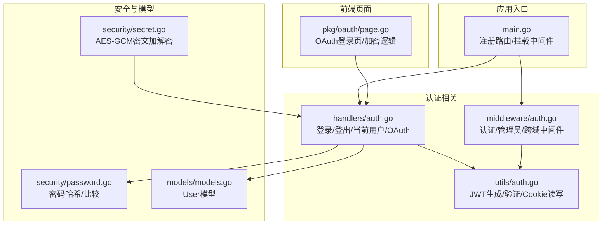
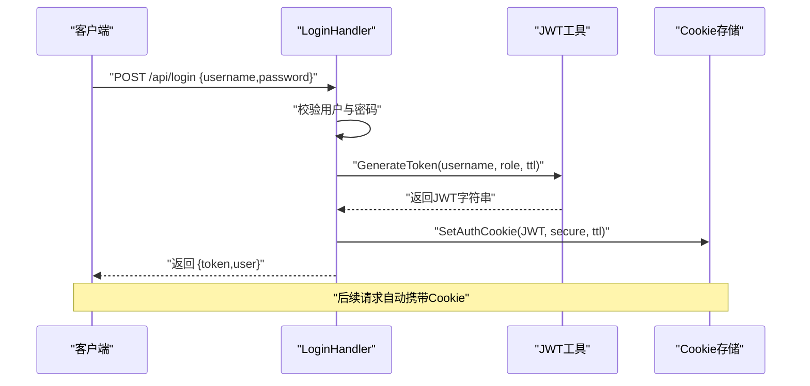
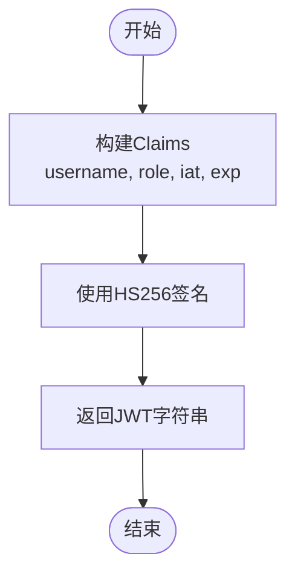
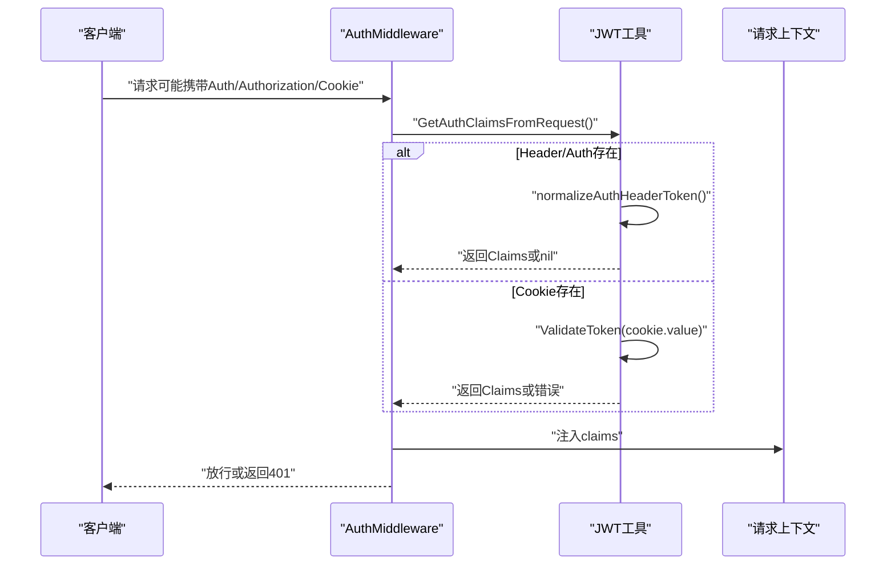
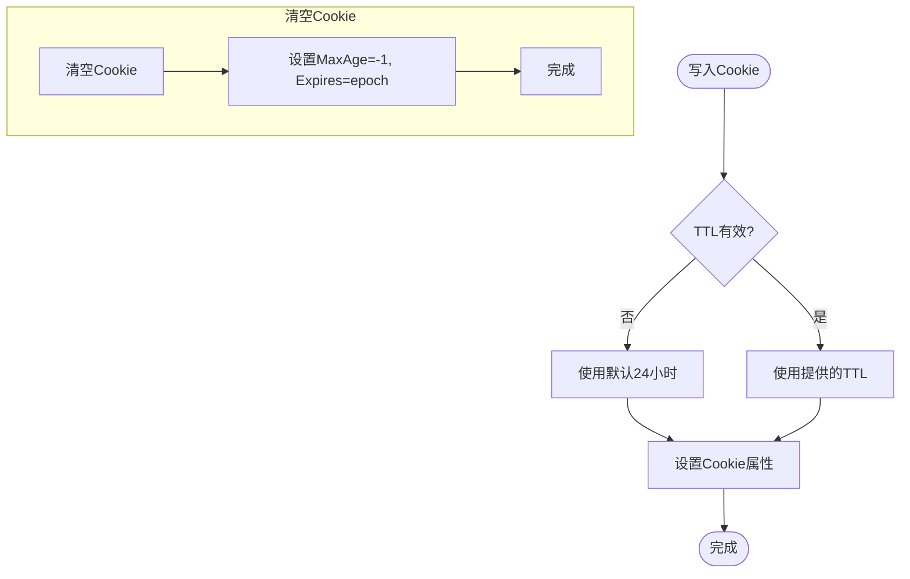
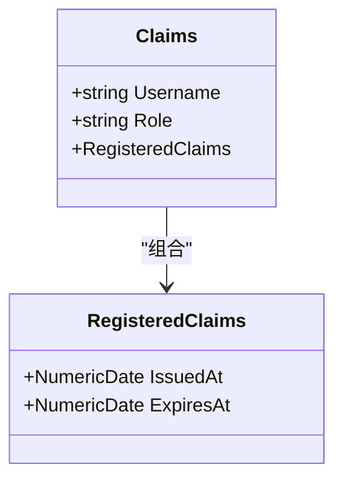
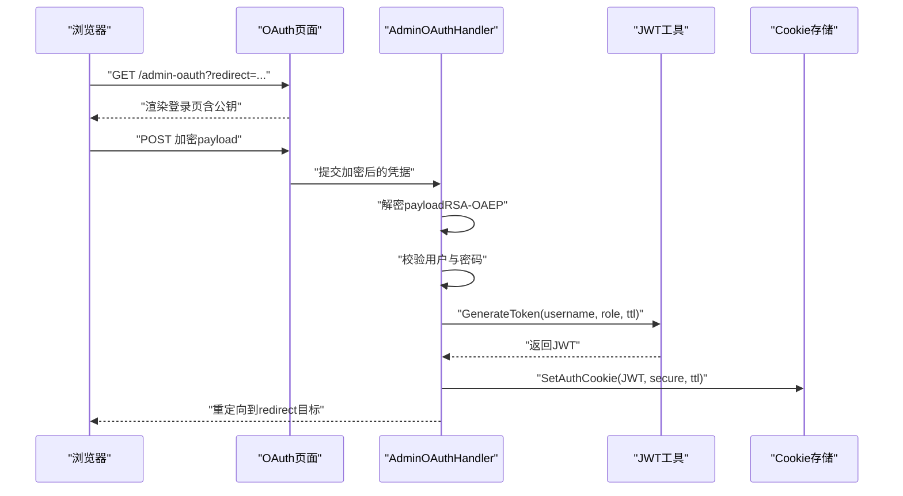
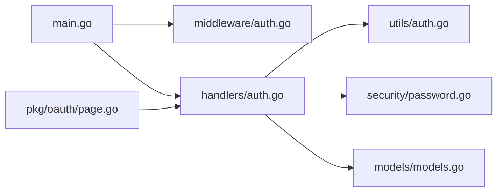

# JWT 认证机制

<cite>
**本文档引用的文件**
- [src/utils/auth.go](file://src/utils/auth.go)
- [src/handlers/auth.go](file://src/handlers/auth.go)
- [src/middleware/auth.go](file://src/middleware/auth.go)
- [src/main.go](file://src/main.go)
- [src/pkg/oauth/page.go](file://src/pkg/oauth/page.go)
- [src/security/password.go](file://src/security/password.go)
- [src/security/secret.go](file://src/security/secret.go)
- [src/models/models.go](file://src/models/models.go)
</cite>

## 目录
1. [简介](#简介)
2. [项目结构](#项目结构)
3. [核心组件](#核心组件)
4. [架构总览](#架构总览)
5. [详细组件分析](#详细组件分析)
6. [依赖关系分析](#依赖关系分析)
7. [性能考虑](#性能考虑)
8. [故障排除指南](#故障排除指南)
9. [结论](#结论)

## 简介
本文件系统性阐述 Caddy Panel 中的 JWT 认证机制，覆盖密钥管理、签名算法、有效期设置、令牌验证流程、存储机制（Cookie）、Claims 结构设计、令牌刷新策略与安全最佳实践，并提供客户端处理示例的代码路径指引，帮助开发者与运维人员正确实现与维护该认证体系。

## 项目结构
围绕 JWT 认证的关键模块分布如下：
- 工具层：负责 JWT 生成、验证、Cookie 设置与读取
- 处理器层：登录、登出、获取当前用户、OAuth 登录等 API
- 中间件层：全局认证中间件、管理员权限中间件、CORS 中间件
- 主入口：注册路由、挂载中间件、启动服务
- 安全工具：密码哈希、安全密钥管理、敏感数据加解密
- OAuth 页面：浏览器端加密提交凭据的前端页面模板

图表来源
- [src/main.go:111-429](file://src/main.go#L111-L429)
- [src/handlers/auth.go:37-198](file://src/handlers/auth.go#L37-L198)
- [src/middleware/auth.go:14-91](file://src/middleware/auth.go#L14-L91)
- [src/utils/auth.go:24-138](file://src/utils/auth.go#L24-L138)
- [src/pkg/oauth/page.go:15-196](file://src/pkg/oauth/page.go#L15-L196)
- [src/security/password.go:44-70](file://src/security/password.go#L44-L70)
- [src/security/secret.go:16-81](file://src/security/secret.go#L16-L81)
- [src/models/models.go:256-267](file://src/models/models.go#L256-L267)

章节来源
- [src/main.go:111-429](file://src/main.go#L111-L429)
- [src/handlers/auth.go:37-198](file://src/handlers/auth.go#L37-L198)
- [src/middleware/auth.go:14-91](file://src/middleware/auth.go#L14-L91)
- [src/utils/auth.go:24-138](file://src/utils/auth.go#L24-L138)
- [src/pkg/oauth/page.go:15-196](file://src/pkg/oauth/page.go#L15-L196)
- [src/security/password.go:44-70](file://src/security/password.go#L44-L70)
- [src/security/secret.go:16-81](file://src/security/secret.go#L16-L81)
- [src/models/models.go:256-267](file://src/models/models.go#L256-L267)

## 核心组件
- JWT 工具（utils/auth.go）
  - Claims 结构：包含用户名、角色以及标准注册声明（签发时间、过期时间）
  - 生成令牌：使用 HS256 签名，基于固定密钥
  - 验证令牌：解析并校验签名与有效性
  - Cookie 存储：设置 HttpOnly、SameSite、Secure 等属性
  - 从请求读取：支持 Header（Auth/Bearer/Token）与 Cookie 两种来源
- 认证处理器（handlers/auth.go）
  - 登录：校验用户、生成 JWT 并写入 Cookie
  - OAuth 登录：浏览器端 RSA-OAEP 加密凭据，服务端解密后校验并发放 JWT
  - 当前用户：从上下文提取 Claims 返回用户信息
  - 公钥：对外暴露 OAuth 公钥供前端加密
- 认证中间件（middleware/auth.go）
  - 全局认证：拦截非公开路径，优先从 Authorization 或 Header Auth 读取 JWT
  - 管理员权限：校验角色为 admin
  - 公开路径：登录、公钥、登出等接口无需认证
- 主入口（main.go）
  - 注册 API 路由并挂载中间件（防火墙、认证、CORS、日志）
  - 管理后台静态资源通过页面认证中间件保护
- 安全与模型（security/* 与 models/models.go）
  - 密码哈希与比较：HMAC-SHA256，常量时间比较
  - 敏感数据加解密：AES-GCM，带前缀标识兼容明文
  - User 模型：包含用户名、角色、启用状态等

章节来源
- [src/utils/auth.go:17-138](file://src/utils/auth.go#L17-L138)
- [src/handlers/auth.go:37-198](file://src/handlers/auth.go#L37-L198)
- [src/middleware/auth.go:14-91](file://src/middleware/auth.go#L14-L91)
- [src/main.go:111-429](file://src/main.go#L111-L429)
- [src/security/password.go:44-70](file://src/security/password.go#L44-L70)
- [src/security/secret.go:16-81](file://src/security/secret.go#L16-L81)
- [src/models/models.go:256-267](file://src/models/models.go#L256-L267)

## 架构总览
下图展示了从客户端发起登录请求到服务端颁发 JWT 并写入 Cookie 的完整流程，以及后续请求携带令牌进行认证的过程。

图表来源
- [src/handlers/auth.go:37-76](file://src/handlers/auth.go#L37-L76)
- [src/utils/auth.go:24-70](file://src/utils/auth.go#L24-L70)

章节来源
- [src/handlers/auth.go:37-76](file://src/handlers/auth.go#L37-L76)
- [src/utils/auth.go:24-70](file://src/utils/auth.go#L24-L70)

## 详细组件分析

### JWT 生成与密钥管理
- 签名算法：HS256（HMAC-SHA256）
- 密钥来源：固定字节数组变量（开发默认值，需在生产环境替换）
- 有效期：通过 TTL 控制（登录默认 24 小时；OAuth“记住我”为 30 天）

图表来源
- [src/utils/auth.go:24-37](file://src/utils/auth.go#L24-L37)

章节来源
- [src/utils/auth.go:15-37](file://src/utils/auth.go#L15-L37)

### JWT 验证流程
- 支持三种来源：Header Auth、Authorization Bearer、Cookie
- 解析与校验：使用相同密钥进行 HS256 校验，确保签名有效且未过期
- 上下文注入：将 Claims 注入请求上下文供后续处理器使用

图表来源
- [src/middleware/auth.go:14-54](file://src/middleware/auth.go#L14-L54)
- [src/utils/auth.go:86-138](file://src/utils/auth.go#L86-L138)

章节来源
- [src/middleware/auth.go:14-54](file://src/middleware/auth.go#L14-L54)
- [src/utils/auth.go:86-138](file://src/utils/auth.go#L86-L138)

### 令牌存储机制（Cookie）
- 名称：固定 Cookie 名称
- 属性：HttpOnly、SameSite=Lax、Secure（仅 HTTPS 时生效）、Path=/、过期时间由 TTL 决定
- 登出：清空 Cookie（MaxAge=-1，Expires=epoch）

图表来源
- [src/utils/auth.go:55-84](file://src/utils/auth.go#L55-L84)

章节来源
- [src/utils/auth.go:55-84](file://src/utils/auth.go#L55-L84)

### Claims 结构设计
- 字段：username、role、RegisteredClaims（iat、exp 等）
- 使用场景：登录响应、当前用户查询、中间件鉴权

图表来源
- [src/utils/auth.go:17-22](file://src/utils/auth.go#L17-L22)

章节来源
- [src/utils/auth.go:17-22](file://src/utils/auth.go#L17-L22)

### 登录与 OAuth 流程
- 标准登录：用户名/密码校验通过后生成 JWT 并写入 Cookie
- OAuth 登录：前端使用服务端公钥进行 RSA-OAEP 加密，服务端解密后校验并发放 JWT
- “记住我”：OAuth 登录时可选择 30 天有效期

图表来源
- [src/handlers/auth.go:124-198](file://src/handlers/auth.go#L124-L198)
- [src/pkg/oauth/page.go:15-196](file://src/pkg/oauth/page.go#L15-L196)

章节来源
- [src/handlers/auth.go:124-198](file://src/handlers/auth.go#L124-L198)
- [src/pkg/oauth/page.go:15-196](file://src/pkg/oauth/page.go#L15-L196)

### 管理员权限与公开路径
- 公开路径：/api/login、/api/auth/public-key、/api/logout
- 管理员中间件：校验角色为 admin
- 其余路径：默认需要认证

章节来源
- [src/middleware/auth.go:57-91](file://src/middleware/auth.go#L57-L91)

### 客户端处理 JWT 的推荐方式
- 推荐使用 Cookie（HttpOnly）存储，避免 XSS 泄露风险
- 若使用 Header（Authorization: Bearer ...），确保 SameSite 和 Secure 配置正确
- 登出时清除 Cookie 或调用登出接口
- “记住我”选项仅在 OAuth 登录中生效，对应较长的令牌有效期

章节来源
- [src/utils/auth.go:55-84](file://src/utils/auth.go#L55-L84)
- [src/handlers/auth.go:184-197](file://src/handlers/auth.go#L184-L197)

## 依赖关系分析
- 认证处理器依赖 JWT 工具与安全模块
- 中间件依赖 JWT 工具读取与验证令牌
- 主入口负责挂载中间件并注册路由
- OAuth 页面依赖服务端公钥进行前端加密

图表来源
- [src/main.go:111-429](file://src/main.go#L111-L429)
- [src/middleware/auth.go:14-91](file://src/middleware/auth.go#L14-L91)
- [src/handlers/auth.go:37-198](file://src/handlers/auth.go#L37-L198)
- [src/utils/auth.go:24-138](file://src/utils/auth.go#L24-L138)
- [src/security/password.go:44-70](file://src/security/password.go#L44-L70)
- [src/models/models.go:256-267](file://src/models/models.go#L256-L267)
- [src/pkg/oauth/page.go:15-196](file://src/pkg/oauth/page.go#L15-L196)

章节来源
- [src/main.go:111-429](file://src/main.go#L111-L429)
- [src/middleware/auth.go:14-91](file://src/middleware/auth.go#L14-L91)
- [src/handlers/auth.go:37-198](file://src/handlers/auth.go#L37-L198)
- [src/utils/auth.go:24-138](file://src/utils/auth.go#L24-L138)
- [src/security/password.go:44-70](file://src/security/password.go#L44-L70)
- [src/models/models.go:256-267](file://src/models/models.go#L256-L267)
- [src/pkg/oauth/page.go:15-196](file://src/pkg/oauth/page.go#L15-L196)

## 性能考虑
- JWT 验证为内存计算，开销极低
- Cookie 读取与解析在每次请求都会发生，建议合理设置 TTL 以平衡用户体验与安全性
- 对于高并发场景，建议将 Cookie 设置为 HttpOnly，减少前端脚本对令牌的直接访问带来的潜在风险

## 故障排除指南
- 401 未授权
  - 检查 Authorization 头格式是否为 Bearer
  - 确认 Cookie 是否正确写入且未被浏览器阻止
  - 核对密钥是否一致（生产环境需替换默认密钥）
- 令牌过期
  - 检查 iat/exp 时间戳是否正确
  - OAuth“记住我”选项可延长有效期
- 登录失败
  - 核对用户名与密码是否正确
  - OAuth 登录需确认前端公钥与服务端公钥匹配

章节来源
- [src/middleware/auth.go:30-54](file://src/middleware/auth.go#L30-L54)
- [src/utils/auth.go:39-53](file://src/utils/auth.go#L39-L53)
- [src/handlers/auth.go:167-182](file://src/handlers/auth.go#L167-L182)

## 结论
Caddy Panel 的 JWT 认证机制采用 HS256 签名与固定密钥，结合 Cookie 存储（HttpOnly、SameSite、Secure）实现基础的安全保障。登录与 OAuth 登录流程清晰，支持“记住我”延长有效期。建议在生产环境中：
- 替换默认密钥并妥善保管
- 使用 HTTPS 以启用 Secure Cookie
- 严格限制 Cookie 的作用域与 SameSite 策略
- 定期轮换密钥并监控异常登录行为