# OAuth 第三方认证

<cite>
**本文档引用的文件**
- [src/pkg/oauth/page.go](file://src/pkg/oauth/page.go)
- [src/handlers/auth.go](file://src/handlers/auth.go)
- [src/middleware/auth.go](file://src/middleware/auth.go)
- [src/utils/auth.go](file://src/utils/auth.go)
- [src/security/audit_log.go](file://src/security/audit_log.go)
- [src/security/secret.go](file://src/security/secret.go)
- [src/main.go](file://src/main.go)
- [src/static/app.js](file://src/static/app.js)
- [src/fnproxy/server.go](file://src/fnproxy/server.go)
</cite>

## 目录
1. [简介](#简介)
2. [项目结构](#项目结构)
3. [核心组件](#核心组件)
4. [架构概览](#架构概览)
5. [详细组件分析](#详细组件分析)
6. [依赖关系分析](#依赖关系分析)
7. [性能考虑](#性能考虑)
8. [故障排除指南](#故障排除指南)
9. [结论](#结论)

## 简介

Caddy Panel 的 OAuth 第三方认证系统是一个基于 RSA 加密的安全认证框架，专为管理后台设计。该系统采用浏览器端加密、服务器端解密的双重保护机制，确保用户凭据在传输过程中的安全性。

系统的核心特性包括：
- **RSA-OAEP 加密**：使用公私钥对进行数据加密，防止敏感信息在传输过程中被截获
- **双层加密回退**：支持 Web Crypto API 和 Forge 库两种加密方式
- **会话管理**：基于 JWT 的无状态认证机制
- **审计日志**：完整的登录行为记录和监控
- **安全传输**：HTTPS 强制要求和 Cookie 安全属性

## 项目结构

Caddy Panel 的 OAuth 认证系统分布在多个模块中，形成了清晰的分层架构：

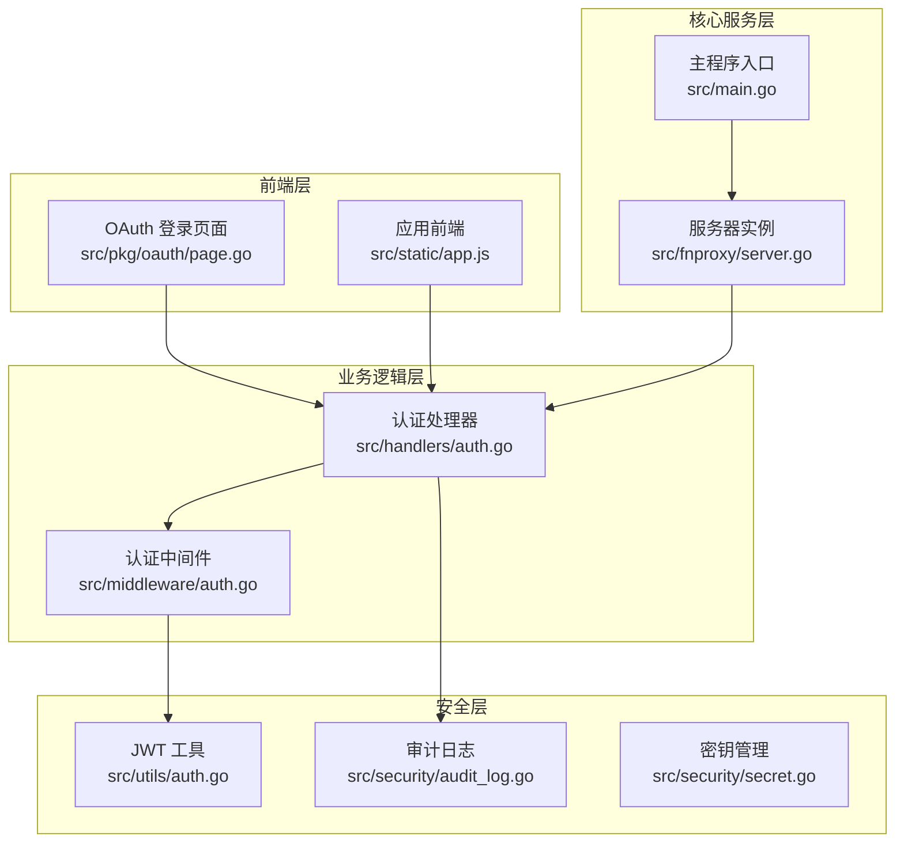

**图表来源**
- [src/pkg/oauth/page.go:1-197](file://src/pkg/oauth/page.go#L1-L197)
- [src/handlers/auth.go:1-266](file://src/handlers/auth.go#L1-L266)
- [src/middleware/auth.go:1-119](file://src/middleware/auth.go#L1-L119)

**章节来源**
- [src/main.go:114-130](file://src/main.go#L114-L130)
- [src/pkg/oauth/page.go:15-27](file://src/pkg/oauth/page.go#L15-L27)

## 核心组件

### OAuth 登录页面渲染器

OAuth 登录页面渲染器负责生成用户友好的登录界面，并集成前端加密功能：

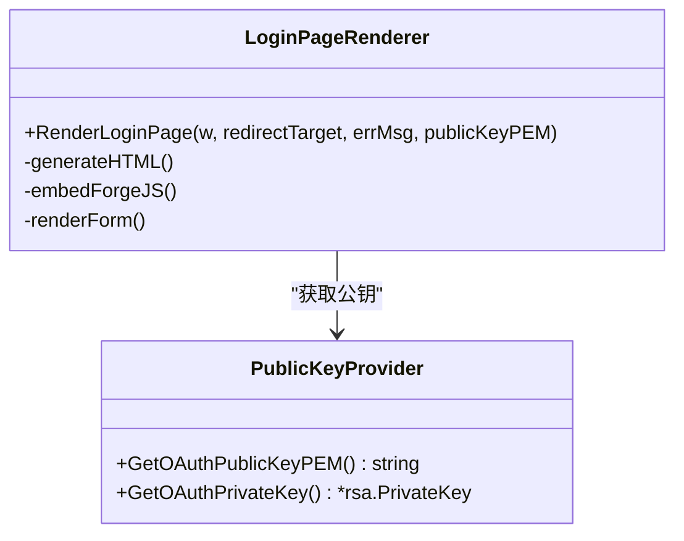

**图表来源**
- [src/pkg/oauth/page.go:16-197](file://src/pkg/oauth/page.go#L16-L197)

### 认证处理器

认证处理器是系统的核心业务逻辑组件，负责处理用户认证请求：

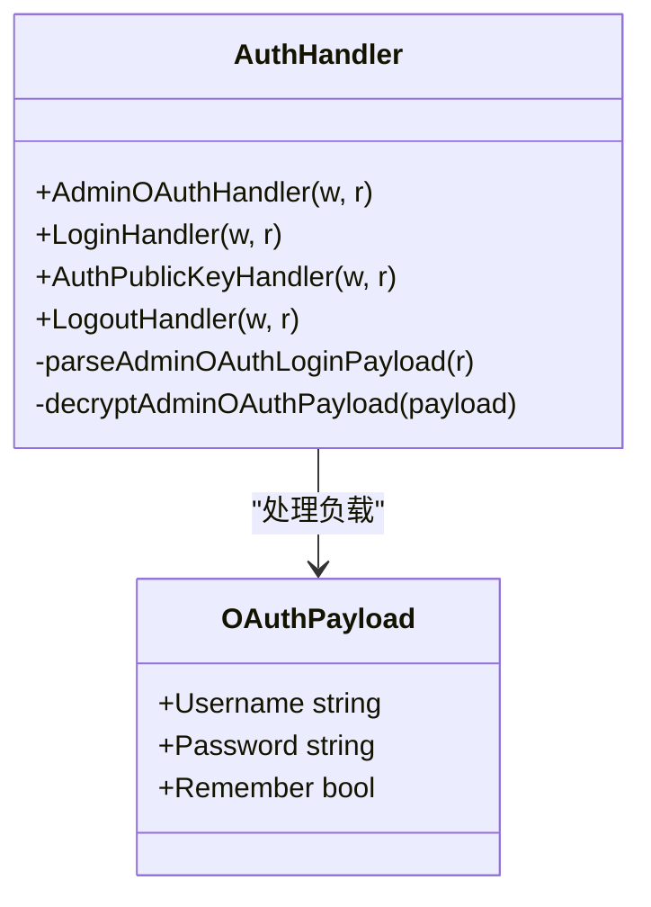

**图表来源**
- [src/handlers/auth.go:124-242](file://src/handlers/auth.go#L124-L242)

### 认证中间件

认证中间件提供统一的访问控制机制：

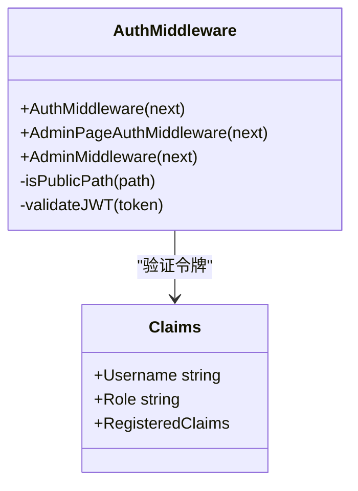

**图表来源**
- [src/middleware/auth.go:14-91](file://src/middleware/auth.go#L14-L91)

**章节来源**
- [src/handlers/auth.go:22-35](file://src/handlers/auth.go#L22-L35)
- [src/middleware/auth.go:14-55](file://src/middleware/auth.go#L14-L55)

## 架构概览

Caddy Panel 的 OAuth 认证系统采用分层架构设计，确保了安全性、可维护性和扩展性：

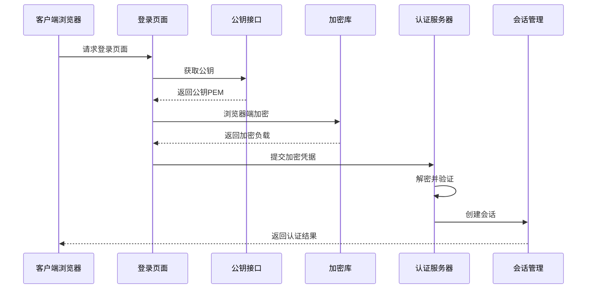

**图表来源**
- [src/pkg/oauth/page.go:133-193](file://src/pkg/oauth/page.go#L133-L193)
- [src/handlers/auth.go:212-242](file://src/handlers/auth.go#L212-L242)

### 数据流分析

系统的数据流遵循严格的加密和验证流程：

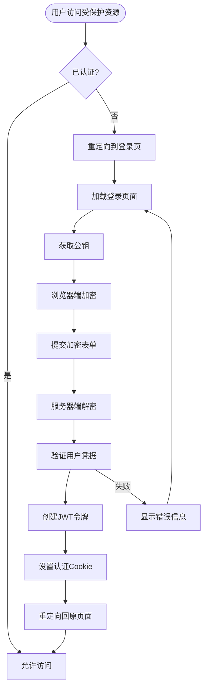

**图表来源**
- [src/middleware/auth.go:244-265](file://src/middleware/auth.go#L244-L265)
- [src/handlers/auth.go:125-198](file://src/handlers/auth.go#L125-L198)

## 详细组件分析

### RSA 加密机制

系统采用 RSA-OAEP 填充方案进行数据加密，确保传输过程中的安全性：

#### 加密流程

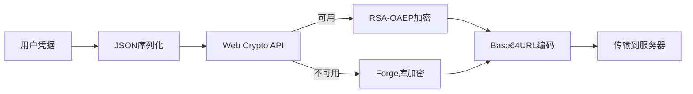

**图表来源**
- [src/pkg/oauth/page.go:153-169](file://src/pkg/oauth/page.go#L153-L169)

#### 解密流程

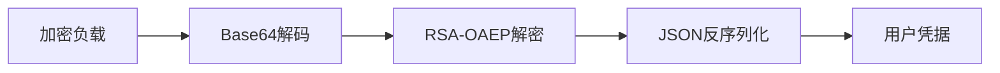

**图表来源**
- [src/handlers/auth.go:212-242](file://src/handlers/auth.go#L212-L242)

#### 双层加密回退机制

系统实现了两层加密回退机制，确保在不同环境下都能正常工作：

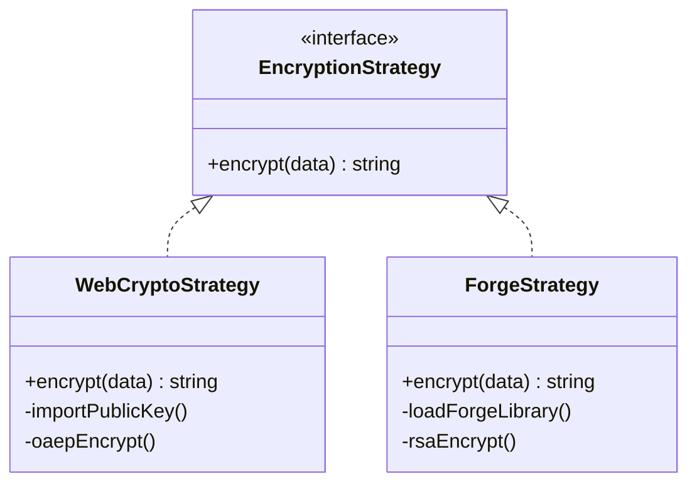

**图表来源**
- [src/pkg/oauth/page.go:153-169](file://src/pkg/oauth/page.go#L153-L169)
- [src/static/app.js:254-284](file://src/static/app.js#L254-L284)

**章节来源**
- [src/pkg/oauth/page.go:133-193](file://src/pkg/oauth/page.go#L133-L193)
- [src/static/app.js:236-284](file://src/static/app.js#L236-L284)

### 管理后台 OAuth 登录处理

管理后台的 OAuth 登录处理包含了完整的表单验证、重定向机制和会话管理：

#### 登录处理流程

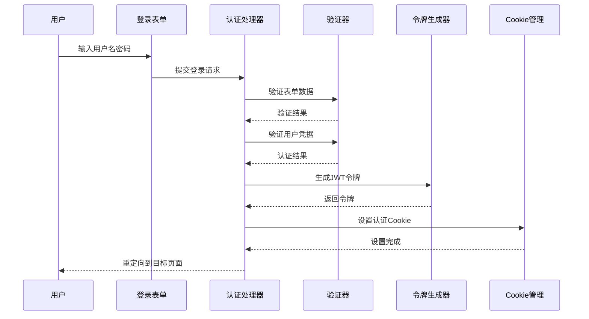

**图表来源**
- [src/handlers/auth.go:125-198](file://src/handlers/auth.go#L125-L198)

#### 表单验证机制

系统实现了多层次的表单验证机制：

| 验证阶段 | 验证内容 | 错误处理 |
|---------|---------|----------|
| 基础格式验证 | 必填字段检查 | 显示错误信息 |
| 用户存在性验证 | 用户名查找 | 提示用户不存在 |
| 凭据验证 | 密码哈希比较 | 提示密码错误 |
| 账户状态验证 | 账户启用状态 | 提示账户被禁用 |

**章节来源**
- [src/handlers/auth.go:167-182](file://src/handlers/auth.go#L167-L182)

### JWT 令牌管理

系统使用 JWT（JSON Web Token）作为认证令牌，实现了无状态的认证机制：

#### 令牌结构

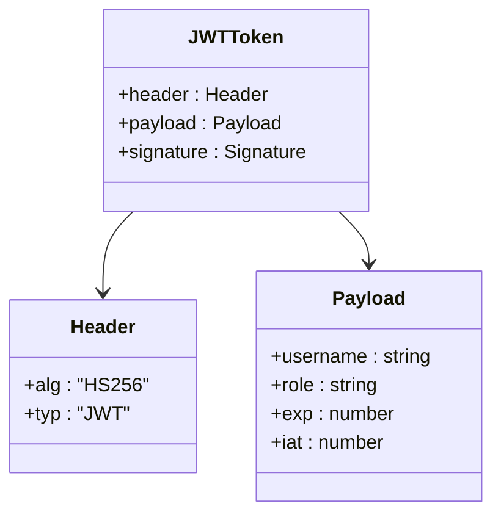

**图表来源**
- [src/utils/auth.go:17-37](file://src/utils/auth.go#L17-L37)

#### 令牌生命周期

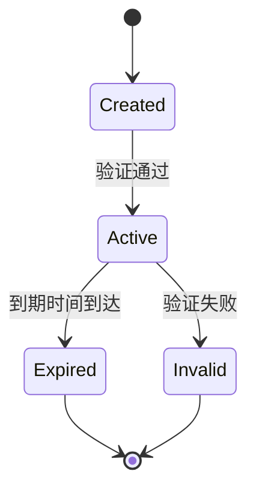

**图表来源**
- [src/utils/auth.go:25-53](file://src/utils/auth.go#L25-L53)

**章节来源**
- [src/utils/auth.go:17-53](file://src/utils/auth.go#L17-L53)

### 审计日志系统

系统实现了完整的安全审计日志功能，记录所有认证相关的活动：

#### 日志记录流程

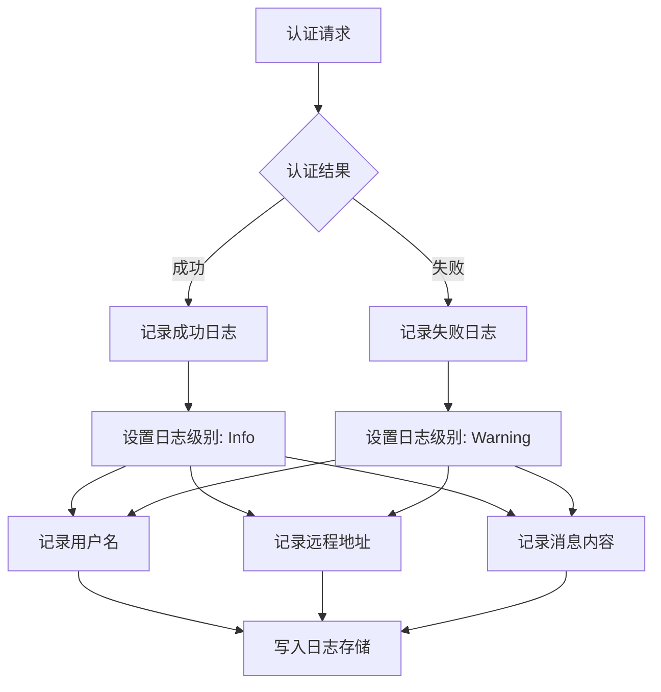

**图表来源**
- [src/security/audit_log.go:82-99](file://src/security/audit_log.go#L82-L99)

#### 日志类型定义

| 日志类型 | 描述 | 使用场景 |
|---------|------|----------|
| OAuthLogin | OAuth 登录认证 | 所有登录尝试记录 |
| ProxyError | 代理错误 | 代理服务异常记录 |
| SSHConnect | SSH 连接 | SSH 连接建立和断开 |
| SystemOperate | 系统操作 | 管理员操作记录 |

**章节来源**
- [src/security/audit_log.go:82-166](file://src/security/audit_log.go#L82-L166)

## 依赖关系分析

系统采用了模块化的依赖关系设计，确保了各组件之间的松耦合：

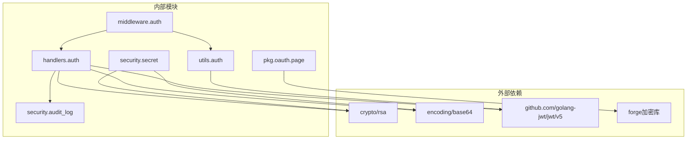

**图表来源**
- [src/handlers/auth.go:3-20](file://src/handlers/auth.go#L3-L20)
- [src/utils/auth.go:3-11](file://src/utils/auth.go#L3-L11)

### 关键依赖关系

| 组件 | 主要依赖 | 用途 |
|------|----------|------|
| handlers.auth | crypto/rsa, encoding/base64 | RSA 加密解密 |
| utils.auth | github.com/golang-jwt/jwt/v5 | JWT 令牌处理 |
| middleware.auth | utils.auth | 认证中间件 |
| security.audit_log | models.security | 审计日志记录 |
| pkg.oauth.page | forge | 前端加密库 |

**章节来源**
- [src/handlers/auth.go:3-20](file://src/handlers/auth.go#L3-L20)
- [src/utils/auth.go:3-11](file://src/utils/auth.go#L3-L11)

## 性能考虑

### 加密性能优化

系统在加密性能方面采用了多项优化措施：

1. **公钥缓存**：前端和后端都实现了公钥缓存机制，减少重复的公钥获取开销
2. **异步加密**：使用异步加密操作，避免阻塞主线程
3. **回退机制**：当 Web Crypto API 不可用时自动回退到 Forge 库

### 内存管理

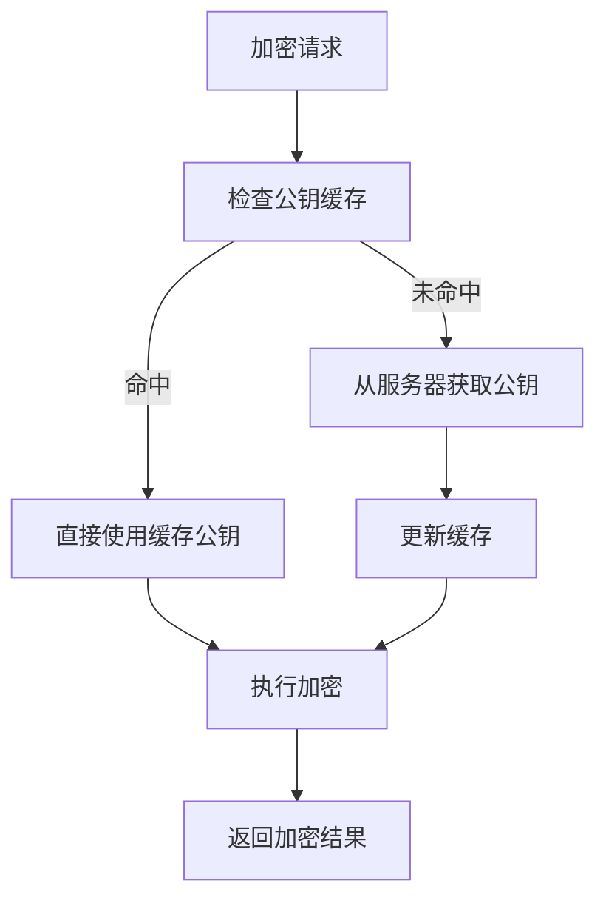

**图表来源**
- [src/static/app.js:148-158](file://src/static/app.js#L148-L158)

### 并发处理

系统支持高并发的认证请求处理：

- **无状态设计**：JWT 令牌的无状态特性减少了服务器端的状态维护开销
- **连接池**：数据库连接和外部服务连接使用连接池管理
- **超时控制**：所有外部调用都有合理的超时设置

## 故障排除指南

### 常见问题及解决方案

#### 1. 公钥获取失败

**症状**：登录页面无法加载或显示加密错误

**可能原因**：
- 服务器未正确配置安全密钥
- 网络连接问题
- CORS 配置错误

**解决步骤**：
1. 检查服务器启动参数中的 `-secure` 参数
2. 验证 `/api/auth/public-key` 接口的响应
3. 检查浏览器开发者工具中的网络请求

#### 2. 加密失败

**症状**：浏览器控制台出现加密错误

**可能原因**：
- Web Crypto API 不可用
- 公钥格式不正确
- 浏览器兼容性问题

**解决步骤**：
1. 检查浏览器对 Web Crypto API 的支持
2. 验证公钥 PEM 格式的正确性
3. 确认使用了正确的加密算法

#### 3. 登录验证失败

**症状**：用户凭据正确但无法登录

**可能原因**：
- 用户账户被禁用
- 密码哈希不匹配
- 服务器时间不同步

**解决步骤**：
1. 检查用户账户状态
2. 验证密码哈希算法
3. 同步服务器时间

#### 4. 会话过期

**症状**：登录后一段时间自动退出

**可能原因**：
- JWT 令牌过期
- 服务器重启导致内存中的令牌丢失
- 客户端 Cookie 被清除

**解决步骤**：
1. 检查 JWT 令牌的有效期设置
2. 验证服务器的重启策略
3. 检查浏览器的 Cookie 设置

### 调试工具和方法

#### 1. 前端调试

使用浏览器开发者工具检查：
- 网络请求中的加密负载
- 控制台中的错误信息
- 存储中的 Cookie 和本地存储

#### 2. 后端调试

使用日志系统跟踪：
- 认证请求的完整流程
- 加密和解密操作的详细信息
- 审计日志的记录情况

#### 3. 性能监控

监控关键指标：
- 加密操作的响应时间
- 认证请求的吞吐量
- 内存和 CPU 使用率

**章节来源**
- [src/security/audit_log.go:62-80](file://src/security/audit_log.go#L62-L80)
- [src/handlers/auth.go:147-158](file://src/handlers/auth.go#L147-L158)

## 结论

Caddy Panel 的 OAuth 第三方认证系统是一个设计精良的安全认证框架，具有以下特点：

### 安全性优势
- **端到端加密**：用户凭据在传输过程中始终处于加密状态
- **多层防护**：结合了多种安全机制，包括 HTTPS、JWT、审计日志等
- **零信任原则**：每次请求都需要重新验证身份

### 技术创新
- **双层加密回退**：确保在各种环境下都能正常工作
- **无状态设计**：简化了部署和扩展
- **模块化架构**：便于维护和升级

### 实用价值
- **易于集成**：提供了清晰的 API 接口和文档
- **性能优化**：采用了多种性能优化技术
- **全面监控**：完整的审计日志和监控功能

该系统为 Caddy Panel 提供了强大而安全的认证能力，是现代 Web 应用安全架构的优秀实践案例。