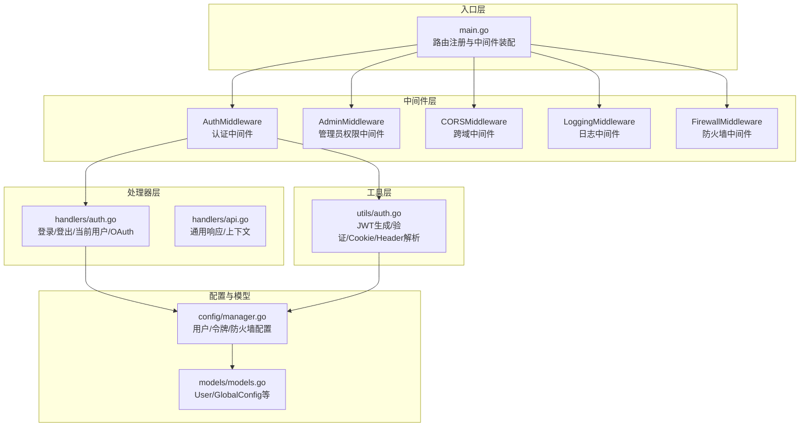
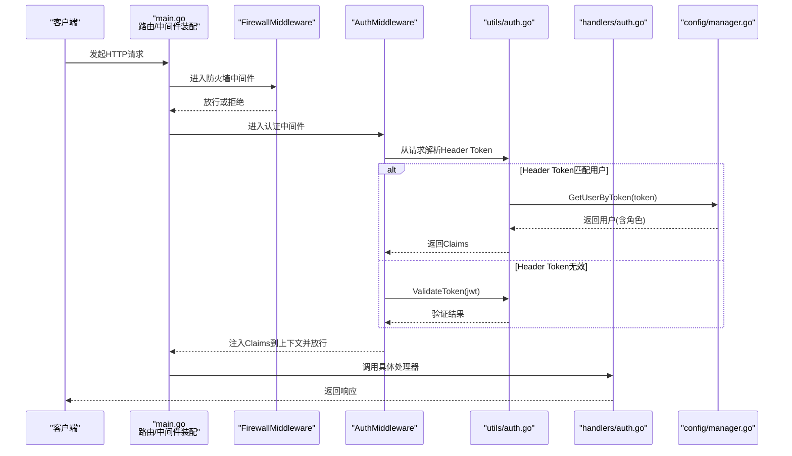
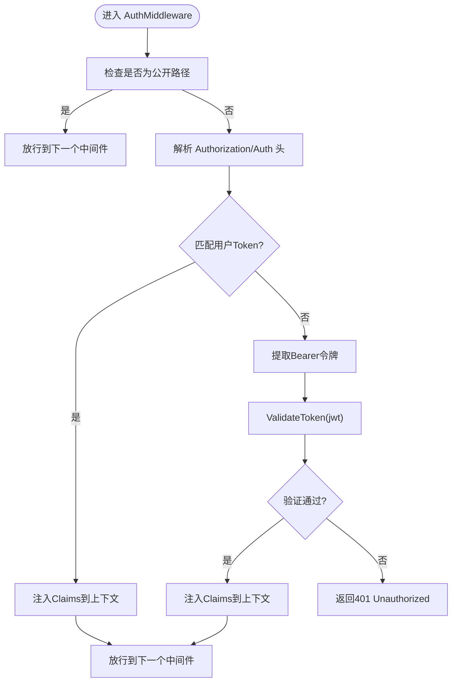
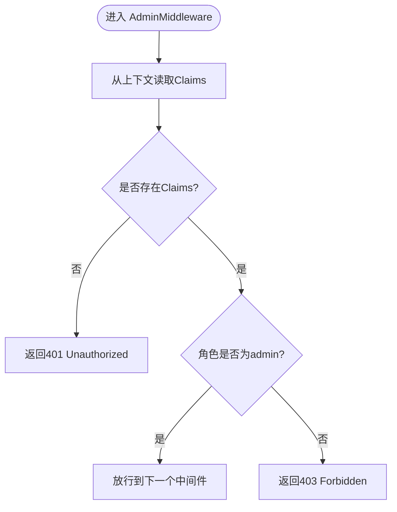
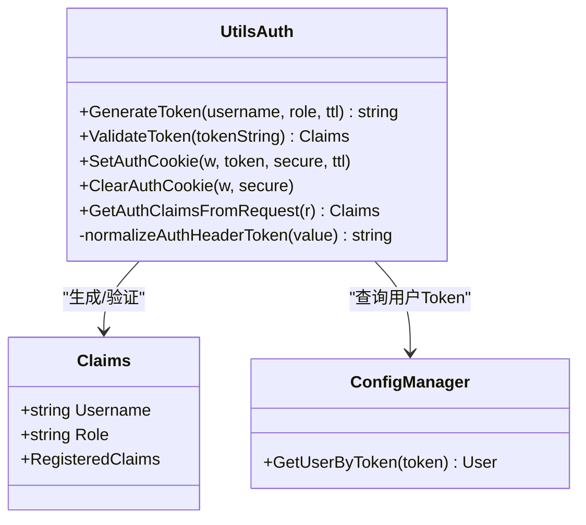
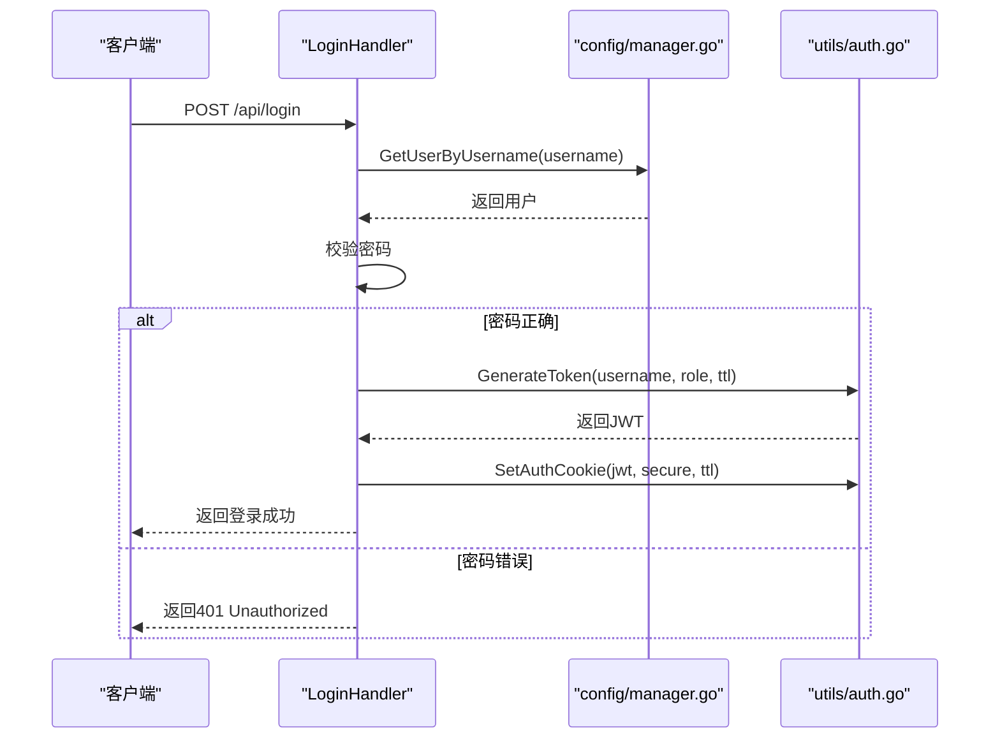
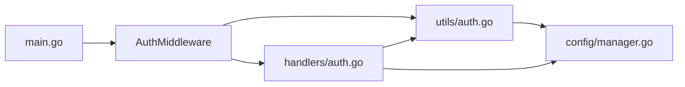

# Token 鉴权机制

<cite>
**本文引用的文件**
- [src/middleware/auth.go](file://src/middleware/auth.go)
- [src/utils/auth.go](file://src/utils/auth.go)
- [src/handlers/auth.go](file://src/handlers/auth.go)
- [src/models/models.go](file://src/models/models.go)
- [src/main.go](file://src/main.go)
- [src/config/manager.go](file://src/config/manager.go)
- [src/security/password.go](file://src/security/password.go)
- [README.md](file://README.md)
</cite>

## 目录
1. [简介](#简介)
2. [项目结构](#项目结构)
3. [核心组件](#核心组件)
4. [架构总览](#架构总览)
5. [详细组件分析](#详细组件分析)
6. [依赖分析](#依赖分析)
7. [性能考虑](#性能考虑)
8. [故障排除指南](#故障排除指南)
9. [结论](#结论)
10. [附录](#附录)

## 简介
本文件针对 Caddy Panel 的 Token 鉴权机制进行全面技术文档化，重点覆盖：
- Bearer Token 认证流程：Authorization 头解析、令牌提取与验证
- 中间件实现：请求拦截、令牌验证、上下文注入
- 鉴权策略：签名验证、过期检查、权限验证
- 中间件配置与使用：路由保护与权限控制
- Token 管理最佳实践：轮换、撤销、安全传输
- 完整中间件集成示例与调试指南

## 项目结构
Caddy Panel 采用分层架构，Token 鉴权涉及以下关键模块：
- 中间件层：认证与权限控制（AuthMiddleware、AdminMiddleware、CORSMiddleware、LoggingMiddleware）
- 工具层：JWT 生成与验证、Cookie 管理、Header Token 解析
- 处理器层：登录、登出、当前用户信息、OAuth 登录
- 配置与模型：用户模型、全局配置、防火墙配置
- 入口层：路由注册与中间件链装配

图表来源
- [src/main.go:111-431](file://src/main.go#L111-L431)
- [src/middleware/auth.go:14-119](file://src/middleware/auth.go#L14-L119)
- [src/utils/auth.go:17-139](file://src/utils/auth.go#L17-L139)
- [src/handlers/auth.go:37-266](file://src/handlers/auth.go#L37-L266)
- [src/config/manager.go:530-544](file://src/config/manager.go#L530-L544)
- [src/models/models.go:256-267](file://src/models/models.go#L256-L267)

章节来源
- [src/main.go:111-431](file://src/main.go#L111-L431)
- [src/middleware/auth.go:14-119](file://src/middleware/auth.go#L14-L119)
- [src/utils/auth.go:17-139](file://src/utils/auth.go#L17-L139)
- [src/handlers/auth.go:37-266](file://src/handlers/auth.go#L37-L266)
- [src/config/manager.go:530-544](file://src/config/manager.go#L530-L544)
- [src/models/models.go:256-267](file://src/models/models.go#L256-L267)

## 核心组件
- 认证中间件 AuthMiddleware：拦截请求，优先从 Auth/Authorization 头部解析用户令牌，若无效则按 JWT 校验；通过后将 Claims 注入请求上下文
- 管理员中间件 AdminMiddleware：从上下文中读取 Claims，校验角色为 admin
- 工具层 utils/auth.go：提供 JWT 生成/验证、Cookie 设置/清理、Header Token 规范化与解析
- 处理器 handlers/auth.go：登录生成 JWT 并写入 Cookie；登出清理 Cookie；当前用户信息读取；OAuth 登录页面与处理
- 配置与模型：用户模型包含 Token 字段；配置管理器提供 GetUserByToken 查询

章节来源
- [src/middleware/auth.go:14-119](file://src/middleware/auth.go#L14-L119)
- [src/utils/auth.go:17-139](file://src/utils/auth.go#L17-L139)
- [src/handlers/auth.go:37-266](file://src/handlers/auth.go#L37-L266)
- [src/config/manager.go:530-544](file://src/config/manager.go#L530-L544)
- [src/models/models.go:256-267](file://src/models/models.go#L256-L267)

## 架构总览
Token 鉴权在中间件链中的位置如下：
- 请求进入后依次经过：防火墙 -> 认证 -> CORS -> 日志
- 认证中间件优先尝试 Header Token（Auth/Authorization），否则走 JWT 验证
- 验证通过后将 Claims 写入上下文，后续处理器可读取

图表来源
- [src/main.go:421-429](file://src/main.go#L421-L429)
- [src/middleware/auth.go:15-55](file://src/middleware/auth.go#L15-L55)
- [src/utils/auth.go:86-139](file://src/utils/auth.go#L86-L139)
- [src/config/manager.go:530-544](file://src/config/manager.go#L530-L544)
- [src/handlers/auth.go:37-76](file://src/handlers/auth.go#L37-L76)

## 详细组件分析

### 认证中间件 AuthMiddleware
- 公开路径豁免：登录、公钥、登出等接口无需认证
- Header 优先策略：优先从 Auth/Authorization 头解析用户令牌；若匹配用户 Token 则直接注入 Claims
- JWT 回退策略：若 Header 非用户 Token，则按 Bearer JWT 校验
- 上下文注入：将 Claims 写入 r.Context，供后续处理器使用

图表来源
- [src/middleware/auth.go:15-55](file://src/middleware/auth.go#L15-L55)
- [src/utils/auth.go:86-139](file://src/utils/auth.go#L86-L139)
- [src/config/manager.go:530-544](file://src/config/manager.go#L530-L544)

章节来源
- [src/middleware/auth.go:15-73](file://src/middleware/auth.go#L15-L73)
- [src/utils/auth.go:86-139](file://src/utils/auth.go#L86-L139)
- [src/config/manager.go:530-544](file://src/config/manager.go#L530-L544)

### 管理员中间件 AdminMiddleware
- 从请求上下文读取 Claims
- 校验角色是否为 admin
- 非管理员返回 403 Forbidden

图表来源
- [src/middleware/auth.go:76-91](file://src/middleware/auth.go#L76-L91)

章节来源
- [src/middleware/auth.go:76-91](file://src/middleware/auth.go#L76-L91)

### 工具层：JWT 生成与验证、Cookie 管理、Header Token 解析
- JWT Claims 结构：包含用户名、角色及标准声明
- GenerateToken：基于 HS256 生成 JWT，设置过期时间
- ValidateToken：使用共享密钥验证 JWT，返回 Claims
- SetAuthCookie/ClearAuthCookie：写入/清理认证 Cookie
- GetAuthClaimsFromRequest：优先从 Auth/Authorization 头解析，其次从 Cookie 解析 JWT
- normalizeAuthHeaderToken：规范化头部令牌格式（支持 Bearer/Token/Auth）

图表来源
- [src/utils/auth.go:17-139](file://src/utils/auth.go#L17-L139)
- [src/config/manager.go:530-544](file://src/config/manager.go#L530-L544)

章节来源
- [src/utils/auth.go:17-139](file://src/utils/auth.go#L17-L139)
- [src/config/manager.go:530-544](file://src/config/manager.go#L530-L544)

### 处理器层：登录、登出、当前用户信息、OAuth
- LoginHandler：校验用户凭据，生成 JWT 并写入 Cookie
- LogoutHandler：返回登出成功消息（JWT 无状态，客户端删除 Cookie 即可）
- GetCurrentUserHandler：从上下文读取 Claims，查询用户信息
- AdminOAuthHandler：管理后台 OAuth 登录页面与处理，支持记住登录状态

图表来源
- [src/handlers/auth.go:37-76](file://src/handlers/auth.go#L37-L76)
- [src/utils/auth.go:24-37](file://src/utils/auth.go#L24-L37)
- [src/config/manager.go:518-528](file://src/config/manager.go#L518-L528)

章节来源
- [src/handlers/auth.go:37-110](file://src/handlers/auth.go#L37-L110)
- [src/utils/auth.go:24-37](file://src/utils/auth.go#L24-L37)
- [src/config/manager.go:518-528](file://src/config/manager.go#L518-L528)

### 配置与模型：用户与全局配置
- User 模型：包含 Token 字段，用于 Header Token 鉴权
- GlobalConfig：包含 DefaultAuth 等全局配置项
- 配置管理器提供 GetUserByToken 查询，支持快速匹配用户 Token

章节来源
- [src/models/models.go:256-267](file://src/models/models.go#L256-L267)
- [src/config/manager.go:530-544](file://src/config/manager.go#L530-L544)

## 依赖分析
- 中间件依赖工具层：AuthMiddleware 依赖 utils/auth.go 的解析与验证能力
- 工具层依赖配置层：GetAuthClaimsFromRequest 依赖 GetUserByToken 查询用户
- 处理器依赖工具层与配置层：登录/登出依赖 JWT 与 Cookie 管理，当前用户依赖上下文与配置查询
- 入口层负责装配中间件链，确保认证与权限控制在路由处理前生效

图表来源
- [src/main.go:421-429](file://src/main.go#L421-L429)
- [src/middleware/auth.go:15-55](file://src/middleware/auth.go#L15-L55)
- [src/utils/auth.go:86-139](file://src/utils/auth.go#L86-L139)
- [src/config/manager.go:530-544](file://src/config/manager.go#L530-L544)
- [src/handlers/auth.go:37-76](file://src/handlers/auth.go#L37-L76)

章节来源
- [src/main.go:421-429](file://src/main.go#L421-L429)
- [src/middleware/auth.go:15-55](file://src/middleware/auth.go#L15-L55)
- [src/utils/auth.go:86-139](file://src/utils/auth.go#L86-L139)
- [src/config/manager.go:530-544](file://src/config/manager.go#L530-L544)
- [src/handlers/auth.go:37-76](file://src/handlers/auth.go#L37-L76)

## 性能考虑
- JWT 验证为内存计算，开销极低；建议合理设置 TTL，避免频繁刷新
- Header Token 查询 GetUserByToken 为内存查找，复杂度 O(n)，建议控制用户数量规模
- 中间件链顺序：防火墙 -> 认证 -> CORS -> 日志，避免不必要的处理
- Cookie 传输：生产环境务必启用 HTTPS，防止明文泄露

## 故障排除指南
- 401 Unauthorized
  - 检查 Authorization/Auth 头格式是否为 Bearer 或 Token
  - 确认 JWT 密钥一致且未被篡改
  - 确认用户 Token 与用户状态有效
- 403 Forbidden
  - 管理员中间件校验失败，确认角色为 admin
- 登录成功但接口仍返回 401
  - 确认 Cookie 已正确写入且未被浏览器阻止
  - 确认 Cookie Secure 属性与 TLS 状态匹配
- 调试建议
  - 启用 LoggingMiddleware 输出请求耗时与路径
  - 在 AuthMiddleware/GetAuthClaimsFromRequest 处增加日志
  - 使用 curl 指定 Authorization 头进行最小化复现

章节来源
- [src/middleware/auth.go:15-55](file://src/middleware/auth.go#L15-L55)
- [src/utils/auth.go:86-139](file://src/utils/auth.go#L86-L139)
- [src/handlers/auth.go:37-76](file://src/handlers/auth.go#L37-L76)

## 结论
Caddy Panel 的 Token 鉴权机制通过“Header Token + JWT”的双通道设计，既满足了用户独立 Token 的便捷访问，又保留了 JWT 的无状态特性。中间件链将认证与权限控制前置，配合 Cookie 管理与上下文注入，形成清晰、可扩展的鉴权体系。建议在生产环境中强化密钥管理、TLS 传输与日志审计，确保安全与可观测性。

## 附录

### Bearer Token 认证流程详解
- Authorization 头解析
  - 支持 "Bearer ..."、"Token ..."、"Auth ..." 三种格式
  - 自动去除前后空白与 Scheme 前缀
- 令牌提取与验证
  - Header Token：优先匹配用户 Token，匹配成功直接注入 Claims
  - JWT：若 Header 非用户 Token，则按 Bearer JWT 校验
- 上下文注入
  - 验证通过后将 Claims 写入 r.Context，后续处理器可直接读取

章节来源
- [src/middleware/auth.go:15-55](file://src/middleware/auth.go#L15-L55)
- [src/utils/auth.go:86-139](file://src/utils/auth.go#L86-L139)

### 中间件配置与使用
- 路由保护
  - 对 /api/* 路由应用中间件链：防火墙 -> 认证 -> CORS -> 日志
  - 管理员接口可叠加 AdminMiddleware
- 权限控制
  - 通过 AdminMiddleware 限制 admin 角色访问
  - 通过上下文中的 Claims 实现细粒度权限控制

章节来源
- [src/main.go:421-429](file://src/main.go#L421-L429)
- [src/middleware/auth.go:76-91](file://src/middleware/auth.go#L76-L91)

### Token 管理最佳实践
- 令牌轮换
  - 合理设置 TTL，定期刷新 JWT
  - 用户 Token 变更后及时通知客户端更新
- 撤销机制
  - JWT 无内置撤销，建议引入黑名单或缩短 TTL
  - 用户 Token 可通过禁用用户或变更 Token 实现撤销
- 安全传输
  - 生产环境强制 HTTPS，启用 HttpOnly/Secure/SameSite Cookie
  - 使用强密钥并定期轮换

章节来源
- [src/utils/auth.go:55-84](file://src/utils/auth.go#L55-L84)
- [README.md:180-196](file://README.md#L180-L196)

### 完整中间件集成示例
- 在 main.go 中装配中间件链
  - FirewallMiddleware -> AuthMiddleware -> CORSMiddleware -> LoggingMiddleware
  - 对 /api/* 路由应用链式中间件
- 在处理器中读取上下文
  - 从 r.Context 获取 Claims，实现权限控制与用户信息查询

章节来源
- [src/main.go:421-429](file://src/main.go#L421-L429)
- [src/handlers/auth.go:90-110](file://src/handlers/auth.go#L90-L110)