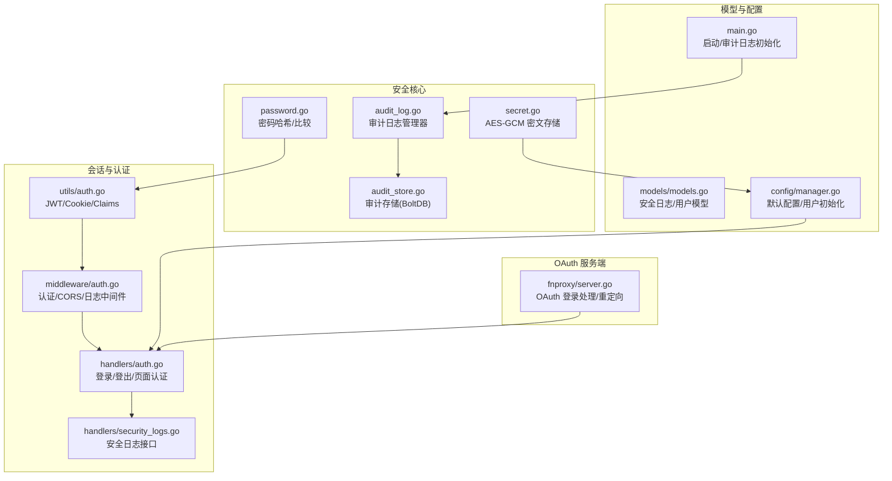
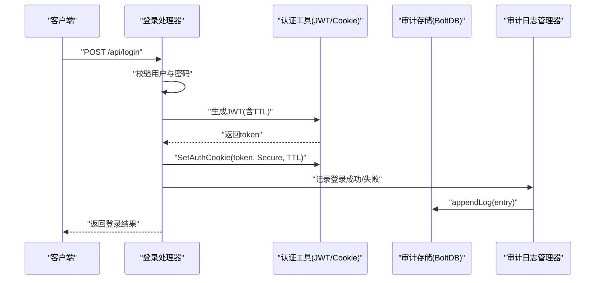
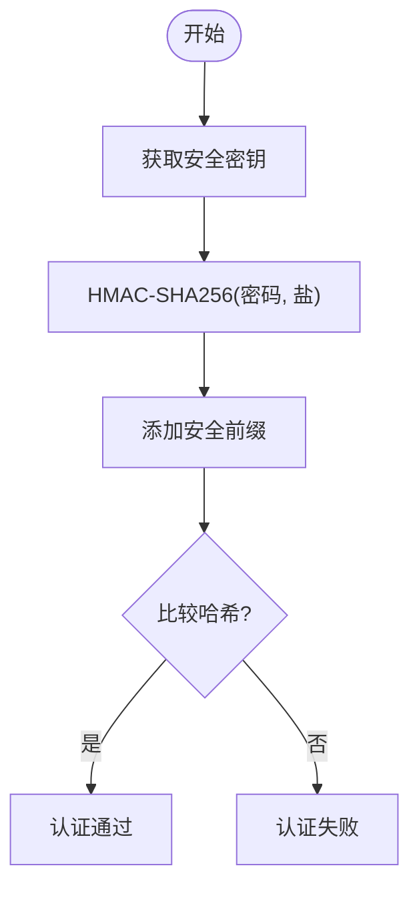
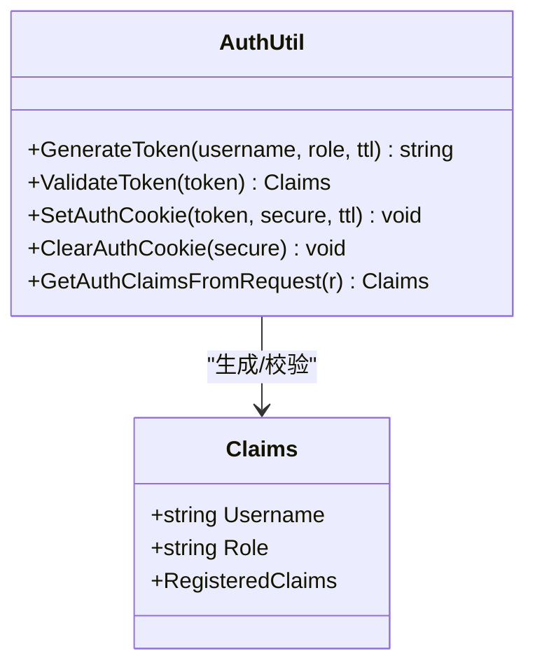
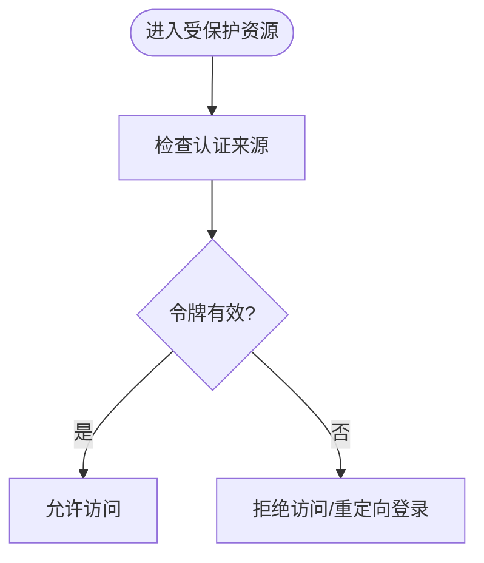
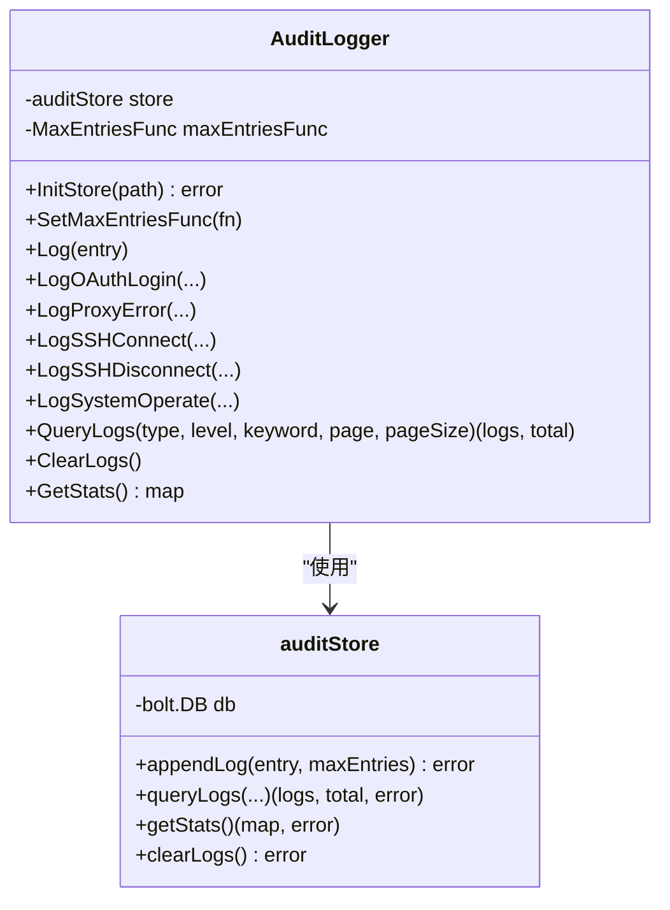
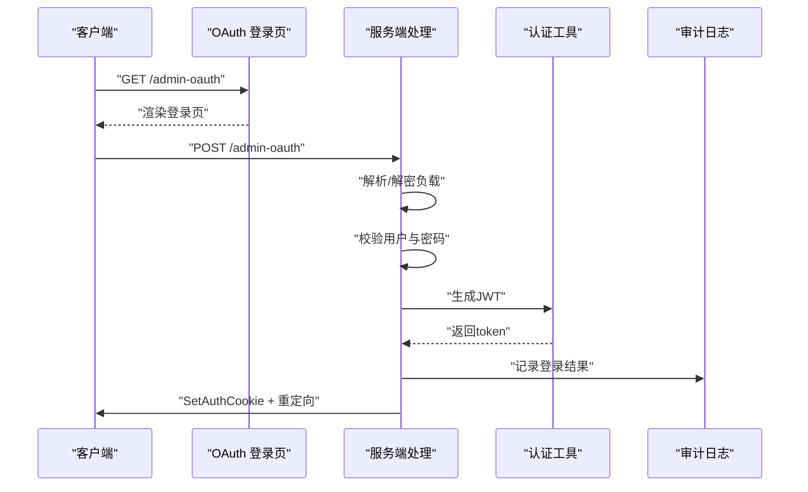
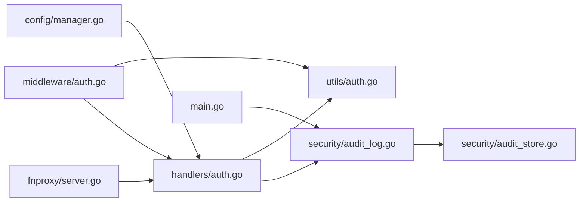

# 会话与安全

<cite>
**本文引用的文件**
- [src/security/password.go](file://src/security/password.go)
- [src/security/audit_log.go](file://src/security/audit_log.go)
- [src/security/audit_store.go](file://src/security/audit_store.go)
- [src/security/secret.go](file://src/security/secret.go)
- [src/utils/auth.go](file://src/utils/auth.go)
- [src/handlers/auth.go](file://src/handlers/auth.go)
- [src/middleware/auth.go](file://src/middleware/auth.go)
- [src/handlers/security_logs.go](file://src/handlers/security_logs.go)
- [src/models/models.go](file://src/models/models.go)
- [src/main.go](file://src/main.go)
- [src/config/manager.go](file://src/config/manager.go)
- [src/fnproxy/server.go](file://src/fnproxy/server.go)
- [documents/ui-listener-fixes-20260311.md](file://documents/ui-listener-fixes-20260311.md)
</cite>

## 目录
1. [简介](#简介)
2. [项目结构](#项目结构)
3. [核心组件](#核心组件)
4. [架构总览](#架构总览)
5. [详细组件分析](#详细组件分析)
6. [依赖关系分析](#依赖关系分析)
7. [性能考量](#性能考量)
8. [故障排查指南](#故障排查指南)
9. [结论](#结论)
10. [附录](#附录)

## 简介
本文件聚焦 Caddy Panel 的会话与安全机制，涵盖以下主题：
- 会话管理策略：Cookie 设置、HttpOnly 属性、安全传输与 SameSite 策略
- 密码安全机制：哈希算法、盐值管理与安全存储
- 会话超时与自动登出：TTL 设置与清理策略
- 安全审计功能：登录尝试记录、失败原因分析与异常检测
- 安全配置最佳实践：HTTPS 强制、CSRF 防护与会话固定攻击防护
- 安全漏洞修复指南与渗透测试建议

## 项目结构
围绕会话与安全的关键模块分布如下：
- 安全核心：密码哈希、审计日志、密文存储
- 会话与认证：JWT 生成/校验、Cookie 设置、中间件与处理器
- 数据模型：安全日志结构、用户模型
- 启动与集成：主程序初始化、审计日志存储、OAuth 登录链路

**图示来源**
- [src/security/password.go:1-71](file://src/security/password.go#L1-L71)
- [src/security/secret.go:1-82](file://src/security/secret.go#L1-L82)
- [src/security/audit_log.go:1-224](file://src/security/audit_log.go#L1-L224)
- [src/security/audit_store.go:1-222](file://src/security/audit_store.go#L1-L222)
- [src/utils/auth.go:1-139](file://src/utils/auth.go#L1-L139)
- [src/middleware/auth.go:1-119](file://src/middleware/auth.go#L1-L119)
- [src/handlers/auth.go:1-266](file://src/handlers/auth.go#L1-L266)
- [src/handlers/security_logs.go:1-65](file://src/handlers/security_logs.go#L1-L65)
- [src/models/models.go:312-344](file://src/models/models.go#L312-L344)
- [src/config/manager.go:55-66](file://src/config/manager.go#L55-L66)
- [src/main.go:96-103](file://src/main.go#L96-L103)
- [src/fnproxy/server.go:1148-1454](file://src/fnproxy/server.go#L1148-L1454)

**章节来源**
- [src/main.go:96-103](file://src/main.go#L96-L103)
- [src/security/audit_log.go:25-31](file://src/security/audit_log.go#L25-L31)
- [src/security/audit_store.go:26-44](file://src/security/audit_store.go#L26-L44)
- [src/utils/auth.go:55-84](file://src/utils/auth.go#L55-L84)
- [src/handlers/auth.go:37-76](file://src/handlers/auth.go#L37-L76)
- [src/middleware/auth.go:14-55](file://src/middleware/auth.go#L14-L55)
- [src/models/models.go:312-344](file://src/models/models.go#L312-L344)
- [src/config/manager.go:55-66](file://src/config/manager.go#L55-L66)
- [src/fnproxy/server.go:1148-1454](file://src/fnproxy/server.go#L1148-L1454)

## 核心组件
- 密码安全与盐值管理
  - 使用 HMAC-SHA256 对密码进行摘要，前缀标识安全哈希
  - 安全密钥通过命令行参数注入，运行时可更新
  - 支持与 OAuth 登录流程结合，确保前后端一致的盐值派生
- 会话与 Cookie 策略
  - JWT 令牌生成与校验，支持自定义 TTL
  - Cookie 写入包含 HttpOnly、SameSite、Secure 等关键属性
  - 支持 Auth Header 与 Cookie 双通道认证
- 安全审计
  - 审计日志管理器单例，支持初始化存储、查询、统计与清空
  - 存储层基于 BoltDB，带最大条目裁剪与时间复合键
  - 记录 OAuth 登录、代理错误、SSH 连接等事件
- OAuth 登录与页面认证
  - 管理后台 OAuth 登录页面，支持“记住我”延长令牌 TTL
  - 服务端 OAuth 登录处理，支持前端公钥加密凭据
  - 页面中间件实现未登录重定向至 OAuth 登录页

**章节来源**
- [src/security/password.go:44-70](file://src/security/password.go#L44-L70)
- [src/security/secret.go:16-81](file://src/security/secret.go#L16-L81)
- [src/utils/auth.go:24-53](file://src/utils/auth.go#L24-L53)
- [src/utils/auth.go:55-84](file://src/utils/auth.go#L55-L84)
- [src/handlers/auth.go:37-76](file://src/handlers/auth.go#L37-L76)
- [src/handlers/auth.go:124-198](file://src/handlers/auth.go#L124-L198)
- [src/security/audit_log.go:62-80](file://src/security/audit_log.go#L62-L80)
- [src/security/audit_store.go:47-67](file://src/security/audit_store.go#L47-L67)
- [src/fnproxy/server.go:1148-1454](file://src/fnproxy/server.go#L1148-L1454)

## 架构总览
会话与安全的整体交互流程如下：

**图示来源**
- [src/handlers/auth.go:37-76](file://src/handlers/auth.go#L37-L76)
- [src/utils/auth.go:24-53](file://src/utils/auth.go#L24-L53)
- [src/utils/auth.go:55-84](file://src/utils/auth.go#L55-L84)
- [src/security/audit_log.go:62-80](file://src/security/audit_log.go#L62-L80)
- [src/security/audit_store.go:47-67](file://src/security/audit_store.go#L47-L67)

## 详细组件分析

### 密码安全机制
- 哈希算法与盐值
  - 使用 HMAC-SHA256 对密码进行摘要，前缀标识安全哈希
  - 盐值来自安全密钥，可通过命令行参数注入并运行时更新
  - 比较采用常量时间比较，防止时序攻击
- 安全存储
  - SSH 密码等敏感值采用 AES-GCM 加密，使用安全密钥派生密钥
  - 兼容历史明文存储，避免迁移中断
- 用户初始化
  - 默认管理员账户使用安全密钥派生的哈希作为初始密码

**图示来源**
- [src/security/password.go:44-70](file://src/security/password.go#L44-L70)
- [src/security/secret.go:16-81](file://src/security/secret.go#L16-L81)
- [src/config/manager.go:55-66](file://src/config/manager.go#L55-L66)

**章节来源**
- [src/security/password.go:44-70](file://src/security/password.go#L44-L70)
- [src/security/secret.go:16-81](file://src/security/secret.go#L16-L81)
- [src/config/manager.go:55-66](file://src/config/manager.go#L55-L66)

### 会话与 Cookie 策略
- JWT 令牌
  - 生成时包含过期时间与签发时间，支持自定义 TTL
  - 校验时验证签名与有效期
- Cookie 设置
  - 名称固定，路径为根路径
  - HttpOnly 防止 XSS 读取
  - SameSite 为 Lax，平衡 CSRF 与跨站场景
  - Secure 根据是否 HTTPS 决定是否启用
  - MaxAge 与 Expires 与 TTL 保持一致
- 认证来源
  - 支持 Authorization: Bearer 与 Auth Header
  - 优先从 Header 提取令牌，其次从 Cookie 读取
- 登出
  - JWT 无状态，登出由客户端清除令牌
  - 也可通过清理 Cookie 实现

**图示来源**
- [src/utils/auth.go:17-53](file://src/utils/auth.go#L17-L53)
- [src/utils/auth.go:55-99](file://src/utils/auth.go#L55-L99)

**章节来源**
- [src/utils/auth.go:24-53](file://src/utils/auth.go#L24-L53)
- [src/utils/auth.go:55-99](file://src/utils/auth.go#L55-L99)

### 会话超时与自动登出机制
- TTL 设置
  - 登录与 OAuth 登录支持 1 天或 30 天两种 TTL
  - Cookie 的 MaxAge 与 Expires 与 TTL 同步
- 自动登出
  - JWT 过期后服务端校验失败，需重新认证
  - Cookie 清理可实现即时登出
- 会话固定攻击防护
  - 登录成功后生成新的令牌并写入 Cookie
  - 不复用旧会话上下文

**图示来源**
- [src/utils/auth.go:86-99](file://src/utils/auth.go#L86-L99)
- [src/middleware/auth.go:14-55](file://src/middleware/auth.go#L14-L55)

**章节来源**
- [src/handlers/auth.go:61](file://src/handlers/auth.go#L61)
- [src/handlers/auth.go:184-187](file://src/handlers/auth.go#L184-L187)
- [src/utils/auth.go:55-84](file://src/utils/auth.go#L55-L84)
- [src/middleware/auth.go:14-55](file://src/middleware/auth.go#L14-L55)

### 安全审计功能
- 审计日志管理器
  - 单例初始化，支持设置最大日志条目回调
  - 提供日志记录、查询、统计与清空
- 存储层
  - 使用 BoltDB，桶名为 security_logs
  - 时间+ID 复合键保证有序与唯一
  - 超限自动裁剪至最大条目
- 记录类型
  - OAuth 登录（成功/失败）、代理错误、SSH 连接/断开、系统操作
- 接口
  - 提供分页查询、关键词过滤、按类型/级别筛选
  - 提供统计接口与清空接口

**图示来源**
- [src/security/audit_log.go:15-80](file://src/security/audit_log.go#L15-L80)
- [src/security/audit_store.go:22-67](file://src/security/audit_store.go#L22-L67)

**章节来源**
- [src/security/audit_log.go:62-80](file://src/security/audit_log.go#L62-L80)
- [src/security/audit_store.go:47-67](file://src/security/audit_store.go#L47-L67)
- [src/handlers/security_logs.go:10-64](file://src/handlers/security_logs.go#L10-L64)

### OAuth 登录与页面认证
- 管理后台 OAuth 登录
  - 支持表单提交与前端公钥加密提交
  - “记住我”选项延长令牌 TTL 至 30 天
  - 登录成功写入 Cookie 并重定向回原地址
- 服务端 OAuth 登录
  - 解析表单，必要时解密前端加密负载
  - 校验用户、启用状态与密码
  - 记录审计日志并生成令牌
- 页面认证中间件
  - 未登录时重定向至 OAuth 登录页
  - 已登录则放行

**图示来源**
- [src/handlers/auth.go:124-198](file://src/handlers/auth.go#L124-L198)
- [src/fnproxy/server.go:1148-1454](file://src/fnproxy/server.go#L1148-L1454)
- [src/utils/auth.go:55-84](file://src/utils/auth.go#L55-L84)
- [src/security/audit_log.go:82-99](file://src/security/audit_log.go#L82-L99)

**章节来源**
- [src/handlers/auth.go:124-198](file://src/handlers/auth.go#L124-L198)
- [src/fnproxy/server.go:1148-1454](file://src/fnproxy/server.go#L1148-L1454)

## 依赖关系分析
- 组件耦合
  - 认证工具与处理器紧密耦合，共同完成登录与校验
  - 审计日志管理器与存储层松耦合，通过接口抽象
  - 中间件负责横切关注点（认证、CORS、日志）
- 外部依赖
  - JWT 库用于令牌生成与校验
  - BoltDB 用于审计日志持久化
  - RSA/OAEP 用于前端加密负载解密

**图示来源**
- [src/handlers/auth.go:1-266](file://src/handlers/auth.go#L1-L266)
- [src/utils/auth.go:1-139](file://src/utils/auth.go#L1-L139)
- [src/middleware/auth.go:1-119](file://src/middleware/auth.go#L1-L119)
- [src/security/audit_log.go:1-224](file://src/security/audit_log.go#L1-L224)
- [src/security/audit_store.go:1-222](file://src/security/audit_store.go#L1-L222)
- [src/main.go:96-103](file://src/main.go#L96-L103)
- [src/config/manager.go:1-791](file://src/config/manager.go#L1-L791)
- [src/fnproxy/server.go:1148-1454](file://src/fnproxy/server.go#L1148-L1454)

**章节来源**
- [src/handlers/auth.go:1-266](file://src/handlers/auth.go#L1-L266)
- [src/utils/auth.go:1-139](file://src/utils/auth.go#L1-L139)
- [src/middleware/auth.go:1-119](file://src/middleware/auth.go#L1-L119)
- [src/security/audit_log.go:1-224](file://src/security/audit_log.go#L1-L224)
- [src/security/audit_store.go:1-222](file://src/security/audit_store.go#L1-L222)
- [src/main.go:96-103](file://src/main.go#L96-L103)
- [src/config/manager.go:1-791](file://src/config/manager.go#L1-L791)
- [src/fnproxy/server.go:1148-1454](file://src/fnproxy/server.go#L1148-L1454)

## 性能考量
- 审计日志裁剪
  - 存储层在写入时裁剪至最大条目，避免无限增长
  - 查询采用游标反向遍历，支持关键词与类型/级别过滤
- JWT 无状态
  - 服务端无需维护会话状态，降低内存压力
- Cookie TTL 与 MaxAge
  - 与令牌 TTL 同步，减少无效请求

[本节为通用性能讨论，不直接分析具体文件]

## 故障排查指南
- 登录失败
  - 检查用户是否存在、是否启用、密码是否正确
  - 查看审计日志记录的失败原因（用户不存在、被禁用、密码错误、令牌生成失败）
- 令牌无效
  - 确认是否使用正确的 Authorization: Bearer 或 Auth Header
  - 检查 JWT 是否过期
- Cookie 未生效
  - 确认是否为 HTTPS 环境（Secure Cookie）
  - 检查 SameSite 与跨站访问策略
- 审计日志缺失
  - 确认审计存储初始化成功
  - 检查最大条目限制与裁剪策略

**章节来源**
- [src/handlers/auth.go:45-59](file://src/handlers/auth.go#L45-L59)
- [src/security/audit_log.go:82-99](file://src/security/audit_log.go#L82-L99)
- [src/utils/auth.go:86-99](file://src/utils/auth.go#L86-L99)
- [src/security/audit_store.go:202-221](file://src/security/audit_store.go#L202-L221)

## 结论
Caddy Panel 的会话与安全机制以 JWT 为核心，配合严格的 Cookie 属性与多通道认证，实现了基础而有效的会话管理。密码安全通过 HMAC-SHA256 与可配置盐值保障，审计日志提供了完整的失败原因追踪与统计能力。建议在生产环境中强制 HTTPS、完善 CSRF 防护与会话固定防护，并定期轮换安全密钥与审计日志策略。

[本节为总结性内容，不直接分析具体文件]

## 附录

### 安全配置最佳实践
- HTTPS 强制
  - 确保管理后台与 OAuth 登录页面仅在 HTTPS 下运行
  - Cookie 的 Secure 属性依赖于 TLS 终止位置
- CSRF 防护
  - 使用 SameSite=Lax 并结合 Token 校验
  - 对关键操作要求二次确认或验证码
- 会话固定攻击防护
  - 登录成功后生成新令牌并写入 Cookie
  - 避免复用旧会话上下文
- 密钥与盐值
  - 生产环境必须显式设置 -secure 参数
  - 定期轮换安全密钥，确保新旧密钥过渡期间的兼容性

**章节来源**
- [src/utils/auth.go:55-84](file://src/utils/auth.go#L55-L84)
- [src/handlers/auth.go:61](file://src/handlers/auth.go#L61)
- [src/main.go:79-94](file://src/main.go#L79-L94)

### 安全漏洞修复指南
- 密码哈希
  - 确保使用安全密钥派生的盐值，避免弱默认值
  - 对历史明文密码进行迁移至安全哈希
- 审计日志
  - 限制最大日志条目，定期清理过期日志
  - 对异常登录尝试进行告警与封禁策略
- OAuth 登录
  - 严格校验前端加密负载的解密过程
  - 对失败原因进行细粒度记录与可视化

**章节来源**
- [src/security/password.go:44-70](file://src/security/password.go#L44-L70)
- [src/security/audit_store.go:202-221](file://src/security/audit_store.go#L202-L221)
- [src/fnproxy/server.go:1178-1454](file://src/fnproxy/server.go#L1178-L1454)

### 渗透测试建议
- 会话劫持
  - 测试 HttpOnly Cookie 是否被 JavaScript 读取
  - 验证 SameSite 策略在跨站场景下的有效性
- 认证绕过
  - 尝试绕过 Authorization 头与 Cookie 的认证路径
  - 检查默认公开路径与中间件配置
- 审计盲点
  - 检查审计日志是否覆盖所有关键操作
  - 验证日志查询接口的权限控制

**章节来源**
- [src/middleware/auth.go:14-55](file://src/middleware/auth.go#L14-L55)
- [src/handlers/security_logs.go:10-64](file://src/handlers/security_logs.go#L10-L64)