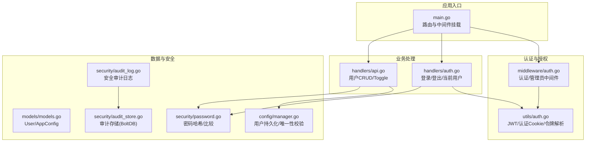
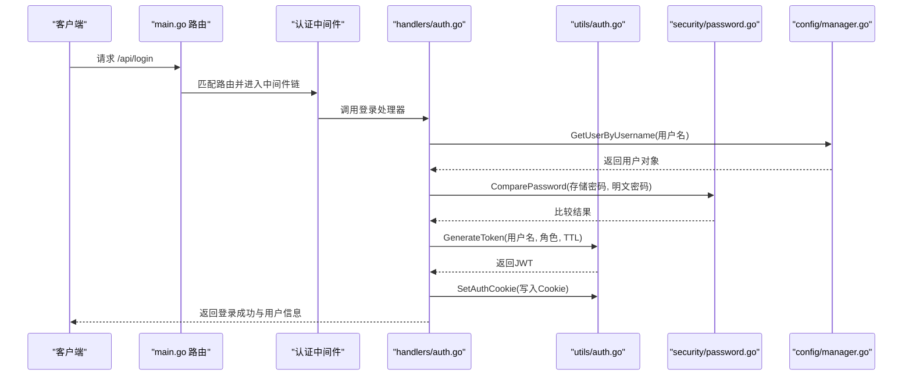
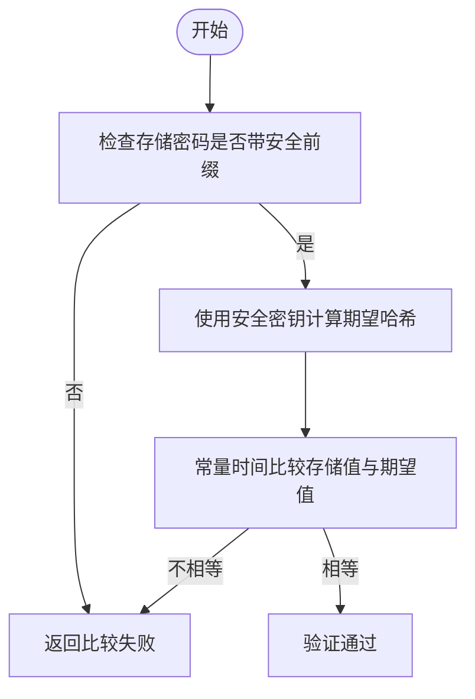
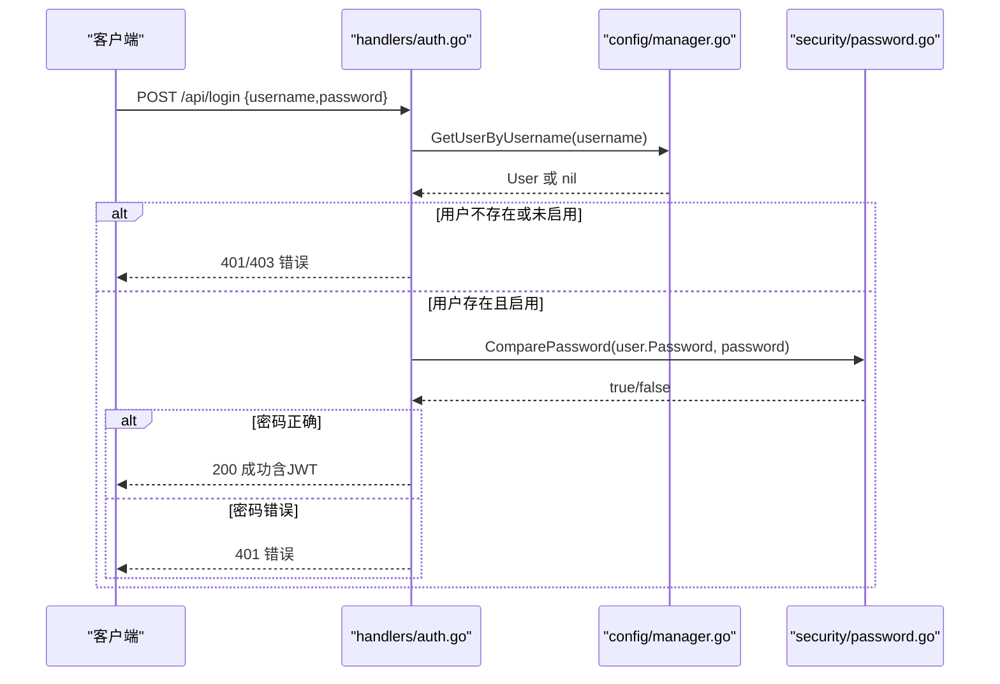
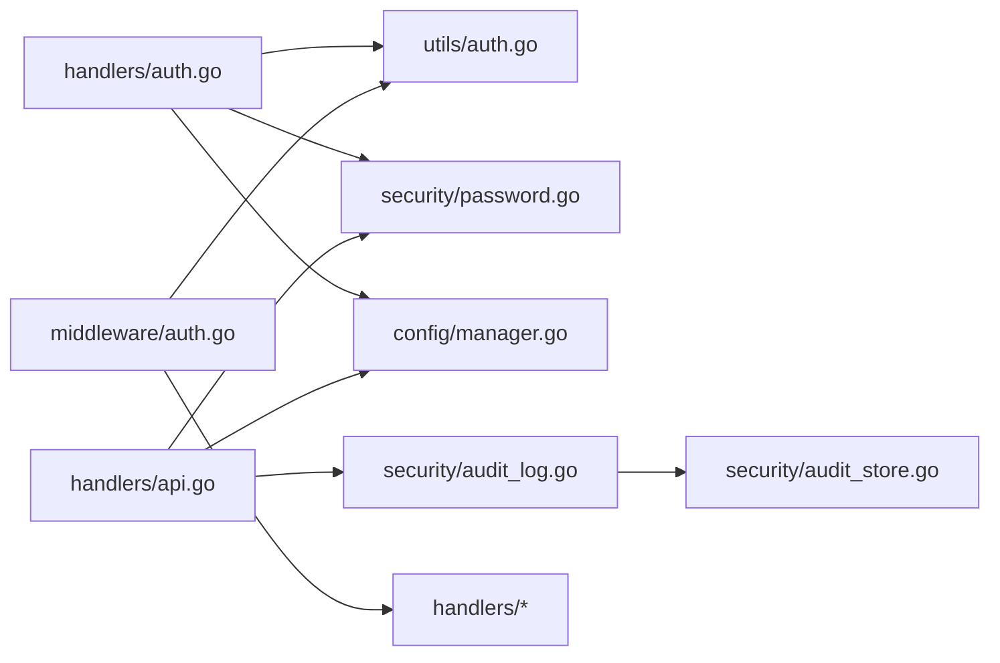

# 用户管理功能

<cite>
**本文档引用的文件**
- [models.go](file://src/models/models.go)
- [password.go](file://src/security/password.go)
- [auth.go](file://src/utils/auth.go)
- [auth.go](file://src/middleware/auth.go)
- [auth.go](file://src/handlers/auth.go)
- [manager.go](file://src/config/manager.go)
- [audit_log.go](file://src/security/audit_log.go)
- [audit_store.go](file://src/security/audit_store.go)
- [api.go](file://src/handlers/api.go)
- [main.go](file://src/main.go)
- [secret.go](file://src/security/secret.go)
</cite>

## 目录
1. [简介](#简介)
2. [项目结构](#项目结构)
3. [核心组件](#核心组件)
4. [架构总览](#架构总览)
5. [详细组件分析](#详细组件分析)
6. [依赖关系分析](#依赖关系分析)
7. [性能考量](#性能考量)
8. [故障排查指南](#故障排查指南)
9. [结论](#结论)
10. [附录](#附录)

## 简介
本文件面向 Caddy Panel 的用户管理功能，系统性阐述用户数据模型、密码加密存储机制、用户查询与验证流程、用户信息获取接口以及最佳实践与安全配置。文档同时提供 API 使用示例与安全审计能力说明，帮助开发者与运维人员正确实现与维护用户体系。

## 项目结构
用户管理相关代码主要分布在以下模块：
- 数据模型层：用户实体与全局配置等
- 安全与工具层：密码哈希、JWT 工具、安全审计
- 配置管理层：用户持久化、唯一性约束、令牌校验
- 中间件与处理器层：认证中间件、登录/登出、当前用户查询
- API 层：用户增删改查、启用/禁用、OAuth 登录页面
- 主程序层：路由注册、中间件挂载、安全参数初始化

图表来源
- [main.go:112-272](file://src/main.go#L112-L272)
- [middleware/auth.go:14-119](file://src/middleware/auth.go#L14-L119)
- [utils/auth.go:17-139](file://src/utils/auth.go#L17-L139)
- [handlers/auth.go:37-115](file://src/handlers/auth.go#L37-L115)
- [handlers/api.go:531-712](file://src/handlers/api.go#L531-L712)
- [models.go:256-267](file://src/models/models.go#L256-L267)
- [manager.go:511-581](file://src/config/manager.go#L511-L581)
- [password.go:44-70](file://src/security/password.go#L44-L70)
- [audit_log.go:15-224](file://src/security/audit_log.go#L15-L224)
- [audit_store.go:22-222](file://src/security/audit_store.go#L22-L222)

章节来源
- [main.go:112-272](file://src/main.go#L112-L272)

## 核心组件
- 用户数据模型：包含 ID、用户名、密码（加密存储）、令牌、邮箱、启用状态、角色、创建/更新时间等字段
- 密码加密：基于 HMAC-SHA256 的安全哈希，带固定前缀标识，支持常量时间比较
- 认证与授权：JWT 令牌签发与校验、Cookie 设置、中间件拦截与权限检查
- 配置与持久化：内存配置管理器，用户列表持久化到本地文件，令牌唯一性校验
- 安全审计：OAuth 登录、代理错误、SSH 连接、系统操作等日志记录与查询

章节来源
- [models.go:256-267](file://src/models/models.go#L256-L267)
- [password.go:44-70](file://src/security/password.go#L44-L70)
- [utils/auth.go:24-53](file://src/utils/auth.go#L24-L53)
- [middleware/auth.go:14-91](file://src/middleware/auth.go#L14-L91)
- [manager.go:511-581](file://src/config/manager.go#L511-L581)
- [audit_log.go:82-166](file://src/security/audit_log.go#L82-L166)

## 架构总览
用户管理在系统中的交互流程如下：

图表来源
- [main.go:127-129](file://src/main.go#L127-L129)
- [middleware/auth.go:14-55](file://src/middleware/auth.go#L14-L55)
- [handlers/auth.go:37-76](file://src/handlers/auth.go#L37-L76)
- [utils/auth.go:24-53](file://src/utils/auth.go#L24-L53)
- [security/password.go:54-70](file://src/security/password.go#L54-L70)
- [config/manager.go:518-528](file://src/config/manager.go#L518-L528)

## 详细组件分析

### 用户数据模型
- 字段说明
  - ID：用户唯一标识
  - Username：用户名（登录凭据之一）
  - Password：密码字段，实际存储为安全哈希字符串
  - Token：可选访问令牌，支持通过令牌快速获取用户身份
  - Email：邮箱
  - Enabled：启用状态
  - Role：角色（admin/user）
  - CreatedAt/UpdatedAt：创建与更新时间
- 设计要点
  - 密码不以明文形式返回给前端
  - 用户列表在查询时会隐藏密码字段
  - 支持通过令牌进行无 Cookie 的认证（Header 或 Authorization）

章节来源
- [models.go:256-267](file://src/models/models.go#L256-L267)
- [handlers/api.go:531-539](file://src/handlers/api.go#L531-L539)

### 密码加密存储机制
- 哈希算法与前缀
  - 使用 HMAC-SHA256 对密码进行哈希，并在结果前添加固定前缀
  - 存储格式：前缀 + 十六进制编码的哈希值
- 安全参数
  - 通过命令行参数设置安全密钥，用于派生 HMAC 密钥
  - 若未设置，默认使用内置默认密钥（生产环境强烈建议显式设置）
- 比较策略
  - 使用常量时间比较，避免时序攻击
  - 仅当存储值具有安全前缀时才进行比较
- 令牌解析与解密
  - 用户密码在创建/更新时可能经过前端加密传输，后端会先解密再哈希
  - SSH 密码采用 AES-GCM 加密存储，兼容历史明文

图表来源
- [password.go:54-70](file://src/security/password.go#L54-L70)

章节来源
- [password.go:44-70](file://src/security/password.go#L44-L70)
- [secret.go:16-81](file://src/security/secret.go#L16-L81)

### 用户查询与验证流程
- 用户名查找
  - 通过配置管理器按用户名精确匹配返回用户对象
- 账户状态检查
  - 登录时检查用户是否启用；禁用用户无法登录
- 凭据验证
  - 使用安全哈希比较函数验证密码
  - 支持通过令牌快速获取用户身份（Header/Auth 或 Cookie）
- 令牌唯一性
  - 在创建/更新用户时对 Token 进行唯一性校验，避免冲突

图表来源
- [handlers/auth.go:37-76](file://src/handlers/auth.go#L37-L76)
- [config/manager.go:518-528](file://src/config/manager.go#L518-L528)
- [security/password.go:54-70](file://src/security/password.go#L54-L70)

章节来源
- [handlers/auth.go:37-76](file://src/handlers/auth.go#L37-L76)
- [config/manager.go:518-544](file://src/config/manager.go#L518-L544)
- [utils/auth.go:86-123](file://src/utils/auth.go#L86-L123)

### 用户信息获取接口
- 当前用户信息查询
  - 路径：/api/me
  - 通过中间件注入的 Claims 获取当前用户身份
  - 返回用户名、邮箱、启用状态、角色
- 权限检查
  - 该接口受认证中间件保护，未认证访问返回 401
  - 管理员专用接口需配合管理员中间件

章节来源
- [main.go:129](file://src/main.go#L129)
- [handlers/auth.go:90-110](file://src/handlers/auth.go#L90-L110)
- [middleware/auth.go:75-91](file://src/middleware/auth.go#L75-L91)

### 用户管理 API
- 列表查询：GET /api/users
  - 返回用户列表，密码字段被隐藏
- 新增用户：POST /api/users
  - 支持提供密码（可能经前端加密），系统自动解密并哈希
  - Token 唯一性校验
  - 记录系统操作审计日志
- 更新用户：PUT /api/users/{id}
  - 可选更新密码（同样进行解密与哈希）
  - Token 唯一性校验
  - 记录系统操作审计日志
- 启用/禁用：POST /api/users/{id}/toggle
  - 禁用时确保至少保留一个启用用户
  - 记录系统操作审计日志
- 删除用户：DELETE /api/users/{id}
  - 删除后确保至少保留一个启用用户

章节来源
- [main.go:229-260](file://src/main.go#L229-L260)
- [handlers/api.go:531-712](file://src/handlers/api.go#L531-L712)
- [config/manager.go:546-581](file://src/config/manager.go#L546-L581)

### OAuth 登录与安全审计
- OAuth 登录页面
  - 提供公开的登录页面，支持记住我选项（影响令牌有效期）
  - 登录成功后写入认证 Cookie 并重定向
- 安全审计
  - 记录 OAuth 登录成功/失败、代理错误、SSH 连接、系统操作等
  - 使用 BoltDB 作为审计存储，支持分页查询与统计

章节来源
- [handlers/auth.go:124-198](file://src/handlers/auth.go#L124-L198)
- [audit_log.go:82-166](file://src/security/audit_log.go#L82-L166)
- [audit_store.go:22-222](file://src/security/audit_store.go#L22-L222)

## 依赖关系分析
- 组件耦合
  - handlers/auth.go 依赖 utils/auth.go（JWT/认证）、security/password.go（密码比较）、config/manager.go（用户查询）
  - middleware/auth.go 依赖 utils/auth.go（Claims解析）、handlers（错误响应）
  - handlers/api.go 依赖 config/manager.go（用户持久化）、security/password.go（密码哈希）、security/audit_log.go（审计）
- 外部依赖
  - JWT 库用于令牌签发与校验
  - BoltDB 用于审计日志持久化
  - 标准库 crypto/* 用于 HMAC、AES-GCM 等

图表来源
- [handlers/auth.go:15-20](file://src/handlers/auth.go#L15-L20)
- [handlers/api.go:15-20](file://src/handlers/api.go#L15-L20)
- [middleware/auth.go:3-12](file://src/middleware/auth.go#L3-L12)
- [audit_log.go:15-21](file://src/security/audit_log.go#L15-L21)

章节来源
- [handlers/auth.go:15-20](file://src/handlers/auth.go#L15-L20)
- [handlers/api.go:15-20](file://src/handlers/api.go#L15-L20)
- [middleware/auth.go:3-12](file://src/middleware/auth.go#L3-L12)
- [audit_log.go:15-21](file://src/security/audit_log.go#L15-L21)

## 性能考量
- 密码比较为常量时间操作，避免时序侧信道，性能开销极低
- 用户查询为内存数组扫描，用户规模较小时延迟可忽略
- 审计日志采用 BoltDB，写入时进行上限裁剪，避免无限增长
- JWT 无状态设计，无需数据库查询，适合高并发场景

## 故障排查指南
- 登录失败
  - 检查用户名是否存在且启用
  - 确认密码哈希格式与安全密钥一致
  - 查看安全审计日志中的 OAuth 登录失败记录
- 令牌无效
  - 确认 JWT 密钥未被更改
  - 检查 Cookie 是否正确设置（HttpOnly、SameSite、Secure）
- 用户无法禁用/删除
  - 确保至少保留一个启用用户
- 审计日志为空
  - 检查审计存储初始化与最大条目限制
  - 确认日志查询参数与分页

章节来源
- [handlers/auth.go:46-59](file://src/handlers/auth.go#L46-L59)
- [handlers/api.go:660-672](file://src/handlers/api.go#L660-L672)
- [audit_log.go:62-80](file://src/security/audit_log.go#L62-L80)

## 结论
Caddy Panel 的用户管理功能以简洁的数据模型与安全的密码存储为核心，结合 JWT 认证、中间件拦截与审计日志，构建了可扩展且易维护的用户体系。通过合理的 API 设计与安全配置，可在保证安全性的同时满足日常运维需求。

## 附录

### API 使用示例
- 登录
  - 方法：POST /api/login
  - 请求体：{ "username": "...", "password": "..." }
  - 成功响应：包含 token 与用户基本信息
- 获取当前用户
  - 方法：GET /api/me
  - 需携带有效 JWT（Cookie 或 Authorization: Bearer ...）
- 用户管理
  - 列表：GET /api/users
  - 新增：POST /api/users
  - 更新：PUT /api/users/{id}
  - 启用/禁用：POST /api/users/{id}/toggle
  - 删除：DELETE /api/users/{id}

章节来源
- [main.go:127-129](file://src/main.go#L127-L129)
- [main.go:229-260](file://src/main.go#L229-L260)
- [handlers/auth.go:90-110](file://src/handlers/auth.go#L90-L110)

### 安全配置指南
- 设置安全密钥
  - 启动时通过 -secure 指定密钥，避免使用默认值
  - 生产环境建议使用强随机密钥并妥善保管
- 令牌有效期
  - 登录时默认 1 天；勾选“记住我”可延长至 30 天
- 审计日志
  - 启动后自动初始化审计存储
  - 通过 /api/security-logs 与 /api/security-logs/stats 查询与清理

章节来源
- [main.go:79-94](file://src/main.go#L79-L94)
- [handlers/auth.go:184-197](file://src/handlers/auth.go#L184-L197)
- [audit_log.go:33-51](file://src/security/audit_log.go#L33-L51)