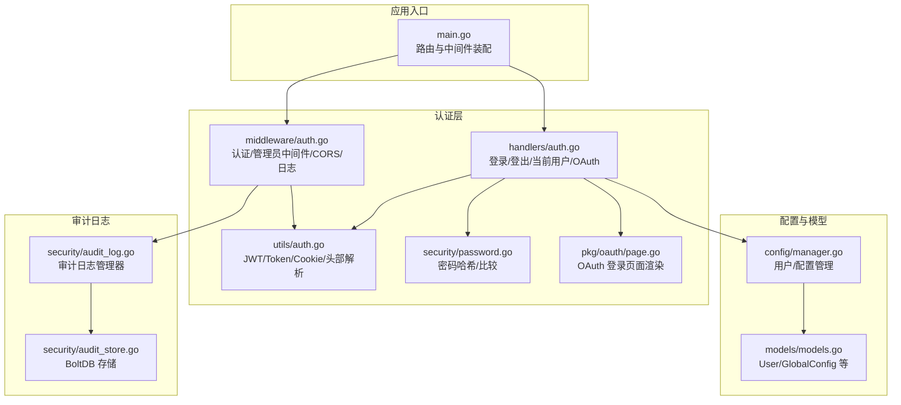
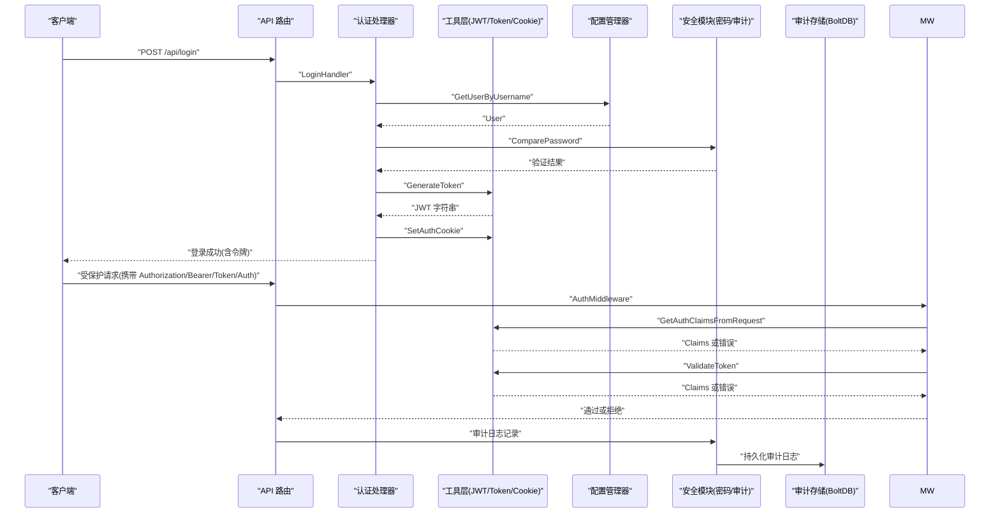
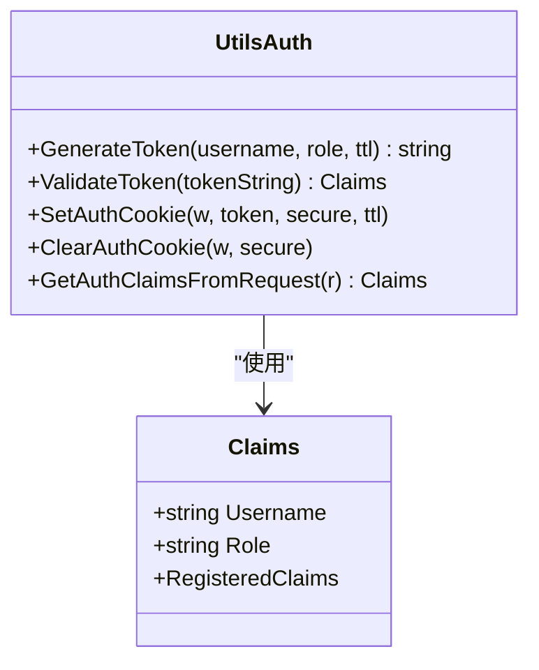
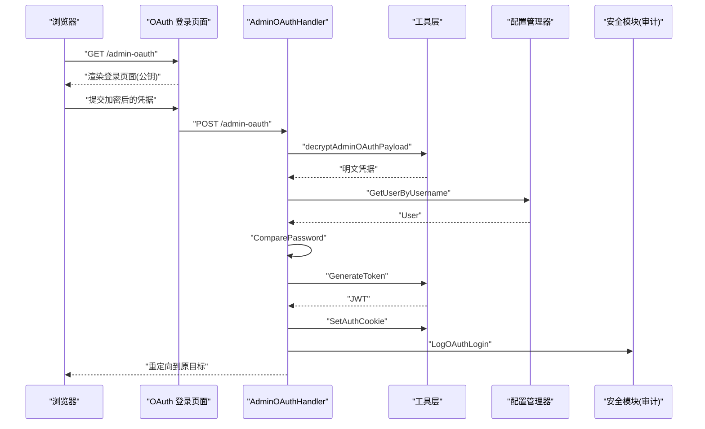
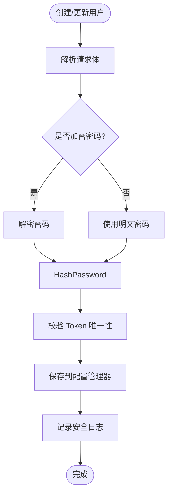
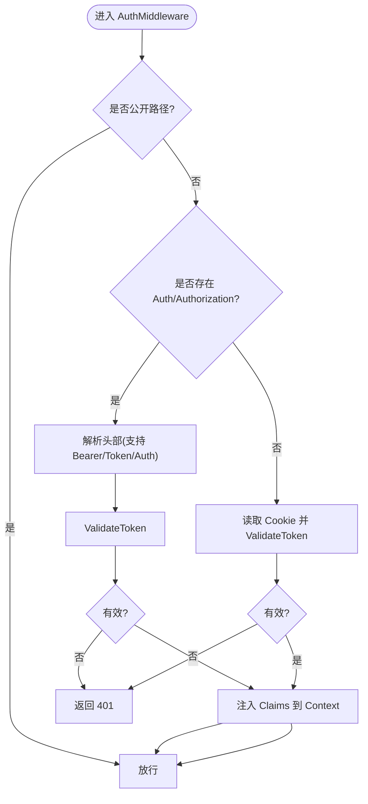
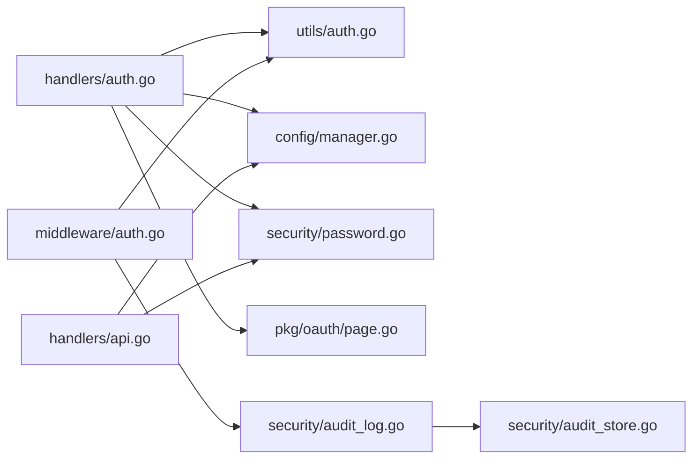

# 认证与授权系统

<cite>
**本文档引用的文件**
- [src/main.go](file://src/main.go)
- [src/handlers/auth.go](file://src/handlers/auth.go)
- [src/middleware/auth.go](file://src/middleware/auth.go)
- [src/utils/auth.go](file://src/utils/auth.go)
- [src/security/password.go](file://src/security/password.go)
- [src/pkg/oauth/page.go](file://src/pkg/oauth/page.go)
- [src/config/manager.go](file://src/config/manager.go)
- [src/models/models.go](file://src/models/models.go)
- [src/handlers/api.go](file://src/handlers/api.go)
- [src/security/audit_log.go](file://src/security/audit_log.go)
- [src/security/audit_store.go](file://src/security/audit_store.go)
</cite>

## 目录
1. [简介](#简介)
2. [项目结构](#项目结构)
3. [核心组件](#核心组件)
4. [架构总览](#架构总览)
5. [详细组件分析](#详细组件分析)
6. [依赖关系分析](#依赖关系分析)
7. [性能考量](#性能考量)
8. [故障排查指南](#故障排查指南)
9. [结论](#结论)
10. [附录](#附录)

## 简介
本文件面向 Caddy Panel 的认证与授权系统，系统采用基于 Cookie 的 JWT 令牌机制与 OAuth 登录页面相结合的方式，提供统一的身份认证与权限控制能力。本文档将深入解释：
- JWT 认证机制的实现（令牌生成、验证、Cookie 存储与清理）
- OAuth 登录流程（浏览器端公钥加密、服务端私钥解密、重定向与审计日志）
- 用户管理功能（用户创建、权限分配、密码加密存储）
- Token 鉴权机制（Bearer Token 与 Authorization 头部支持）
- 认证中间件的工作原理与配置选项
- 安全最佳实践、常见攻击防护与漏洞修复建议
- 具体的代码示例与集成指南

## 项目结构
Caddy Panel 的认证与授权相关代码主要分布在以下模块：
- 主入口与路由注册：负责挂载认证相关 API 与静态资源保护
- 认证处理器：处理登录、登出、获取当前用户、OAuth 登录页面渲染与处理
- 中间件：统一的认证与管理员权限中间件
- 工具与安全：JWT 令牌生成与验证、密码哈希与比较、OAuth 公钥/私钥、Cookie 管理
- 配置与模型：用户模型、全局配置、用户管理接口
- 审计日志：OAuth 登录审计、代理错误、SSH 连接、系统操作日志

图表来源
- [src/main.go:112-429](file://src/main.go#L112-L429)
- [src/handlers/auth.go:38-265](file://src/handlers/auth.go#L38-L265)
- [src/middleware/auth.go:14-119](file://src/middleware/auth.go#L14-L119)
- [src/utils/auth.go:24-139](file://src/utils/auth.go#L24-L139)
- [src/security/password.go:44-71](file://src/security/password.go#L44-L71)
- [src/pkg/oauth/page.go:15-197](file://src/pkg/oauth/page.go#L15-L197)
- [src/config/manager.go:511-581](file://src/config/manager.go#L511-L581)
- [src/models/models.go:256-267](file://src/models/models.go#L256-L267)
- [src/security/audit_log.go:82-99](file://src/security/audit_log.go#L82-L99)
- [src/security/audit_store.go:26-45](file://src/security/audit_store.go#L26-L45)

章节来源
- [src/main.go:112-429](file://src/main.go#L112-L429)

## 核心组件
- JWT 令牌生成与验证：基于 HS256 签名，Claims 包含用户名、角色与标准声明
- Cookie 认证：使用 HttpOnly、SameSite、Secure Cookie 存储令牌
- OAuth 登录页面：前端使用公钥加密凭据，服务端使用私钥解密
- 用户管理：用户创建、更新、禁用、权限分配（admin/user）
- 审计日志：OAuth 登录、代理错误、SSH 连接、系统操作记录

章节来源
- [src/utils/auth.go:24-53](file://src/utils/auth.go#L24-L53)
- [src/utils/auth.go:55-84](file://src/utils/auth.go#L55-L84)
- [src/handlers/auth.go:38-76](file://src/handlers/auth.go#L38-L76)
- [src/handlers/auth.go:124-198](file://src/handlers/auth.go#L124-L198)
- [src/config/manager.go:511-581](file://src/config/manager.go#L511-L581)
- [src/security/audit_log.go:82-99](file://src/security/audit_log.go#L82-L99)

## 架构总览
下图展示了认证与授权的整体交互流程，包括登录、令牌发放、中间件拦截、权限校验以及审计日志记录。

图表来源
- [src/main.go:421-429](file://src/main.go#L421-L429)
- [src/handlers/auth.go:38-76](file://src/handlers/auth.go#L38-L76)
- [src/middleware/auth.go:14-55](file://src/middleware/auth.go#L14-L55)
- [src/utils/auth.go:86-139](file://src/utils/auth.go#L86-L139)
- [src/security/audit_log.go:82-99](file://src/security/audit_log.go#L82-L99)
- [src/security/audit_store.go:47-67](file://src/security/audit_store.go#L47-L67)

## 详细组件分析

### JWT 认证机制
- 令牌生成：使用 HS256 签名，Claims 包含用户名、角色与过期/签发时间
- 令牌验证：解析并验证签名，返回 Claims
- Cookie 管理：设置 HttpOnly、SameSite、Secure Cookie，支持清理
- 头部支持：支持 Authorization: Bearer、Token、Auth 三种头部方案

图表来源
- [src/utils/auth.go:17-53](file://src/utils/auth.go#L17-L53)
- [src/utils/auth.go:55-99](file://src/utils/auth.go#L55-L99)

章节来源
- [src/utils/auth.go:24-53](file://src/utils/auth.go#L24-L53)
- [src/utils/auth.go:55-84](file://src/utils/auth.go#L55-L84)
- [src/utils/auth.go:86-139](file://src/utils/auth.go#L86-L139)

### OAuth 登录流程
- 浏览器端：使用公钥对用户名、密码、记住我标志进行 RSA-OAEP 加密，提交到服务端
- 服务端：使用私钥解密，验证用户并生成 JWT，设置 Cookie 并重定向
- 审计日志：记录登录成功/失败、来源 IP、消息详情

图表来源
- [src/pkg/oauth/page.go:15-197](file://src/pkg/oauth/page.go#L15-L197)
- [src/handlers/auth.go:124-198](file://src/handlers/auth.go#L124-L198)
- [src/utils/auth.go:200-242](file://src/utils/auth.go#L200-L242)
- [src/security/audit_log.go:82-99](file://src/security/audit_log.go#L82-L99)

章节来源
- [src/pkg/oauth/page.go:15-197](file://src/pkg/oauth/page.go#L15-L197)
- [src/handlers/auth.go:124-198](file://src/handlers/auth.go#L124-L198)
- [src/utils/auth.go:200-242](file://src/utils/auth.go#L200-L242)

### 用户管理功能
- 用户创建：支持明文密码解密（来自前端加密或直接传入）、唯一性校验、角色分配
- 用户更新：支持密码更新（自动加密）、Token 唯一性校验、角色与邮箱更新
- 用户禁用：确保至少保留一个启用用户
- 密码加密：使用 HMAC-SHA256 前缀存储，常量时间比较防止时序攻击

图表来源
- [src/handlers/api.go:541-579](file://src/handlers/api.go#L541-L579)
- [src/handlers/api.go:581-642](file://src/handlers/api.go#L581-L642)
- [src/security/password.go:44-71](file://src/security/password.go#L44-L71)
- [src/config/manager.go:511-581](file://src/config/manager.go#L511-L581)

章节来源
- [src/handlers/api.go:541-579](file://src/handlers/api.go#L541-L579)
- [src/handlers/api.go:581-642](file://src/handlers/api.go#L581-L642)
- [src/security/password.go:44-71](file://src/security/password.go#L44-L71)
- [src/config/manager.go:511-581](file://src/config/manager.go#L511-L581)

### Token 鉴权机制
- 支持多种头部方案：Authorization: Bearer ...、Token ...、Auth ...
- 优先从 Auth 头部读取，其次 Authorization: Bearer
- 若无头部，尝试从 Cookie 中读取并验证
- 将 Claims 注入请求上下文供后续处理器使用

图表来源
- [src/middleware/auth.go:14-55](file://src/middleware/auth.go#L14-L55)
- [src/utils/auth.go:86-139](file://src/utils/auth.go#L86-L139)

章节来源
- [src/middleware/auth.go:14-55](file://src/middleware/auth.go#L14-L55)
- [src/utils/auth.go:86-139](file://src/utils/auth.go#L86-L139)

### 认证中间件与权限控制
- AuthMiddleware：统一认证拦截，区分公开路径与受保护路径
- AdminMiddleware：管理员权限校验，要求角色为 admin
- CORSMiddleware：设置跨域头，允许 Authorization/Auth 头
- LoggingMiddleware：简单日志输出

章节来源
- [src/middleware/auth.go:75-91](file://src/middleware/auth.go#L75-L91)
- [src/middleware/auth.go:93-119](file://src/middleware/auth.go#L93-L119)

### 审计日志与安全存储
- 审计日志管理器：支持初始化存储、设置最大条数、查询、清空、统计
- OAuth 登录审计：记录用户名、来源 IP、成功/失败、消息
- BoltDB 存储：按时间复合键存储，自动裁剪至最大条数

章节来源
- [src/security/audit_log.go:25-99](file://src/security/audit_log.go#L25-L99)
- [src/security/audit_store.go:26-67](file://src/security/audit_store.go#L26-L67)

## 依赖关系分析
- 认证处理器依赖工具层进行 JWT 生成与验证、Cookie 管理
- 认证处理器依赖配置管理器获取用户信息
- 中间件依赖工具层进行头部与 Cookie 解析
- 审计日志依赖 BoltDB 存储实现持久化
- 用户管理接口依赖安全模块进行密码加密与比较

图表来源
- [src/handlers/auth.go:38-265](file://src/handlers/auth.go#L38-L265)
- [src/middleware/auth.go:14-119](file://src/middleware/auth.go#L14-L119)
- [src/utils/auth.go:24-139](file://src/utils/auth.go#L24-L139)
- [src/security/password.go:44-71](file://src/security/password.go#L44-L71)
- [src/pkg/oauth/page.go:15-197](file://src/pkg/oauth/page.go#L15-L197)
- [src/config/manager.go:511-581](file://src/config/manager.go#L511-L581)
- [src/handlers/api.go:541-642](file://src/handlers/api.go#L541-L642)
- [src/security/audit_log.go:25-99](file://src/security/audit_log.go#L25-L99)
- [src/security/audit_store.go:26-67](file://src/security/audit_store.go#L26-L67)

## 性能考量
- JWT 无状态验证避免了数据库查询，适合高并发场景
- Cookie 存储令牌减少每次请求的头部体积
- 审计日志采用 BoltDB，具备较好的写入性能与自动裁剪策略
- 建议：合理设置审计日志最大条数与保留天数，避免磁盘膨胀

[本节为一般性指导，无需特定文件来源]

## 故障排查指南
- 登录失败
  - 检查用户名是否存在、账户是否启用
  - 确认密码哈希算法与比较逻辑
  - 查看审计日志中的 OAuth 登录记录
- 令牌无效
  - 确认 Authorization 头部格式是否为 Bearer
  - 检查 JWT 秘钥一致性与签名算法
  - 验证 Cookie 是否正确设置（HttpOnly、Secure、SameSite）
- 用户管理异常
  - 确保 Token 唯一性
  - 检查最小启用用户数量限制
- 审计日志缺失
  - 确认审计存储初始化与最大条数设置
  - 检查 BoltDB 文件权限与路径

章节来源
- [src/handlers/auth.go:45-59](file://src/handlers/auth.go#L45-L59)
- [src/middleware/auth.go:30-49](file://src/middleware/auth.go#L30-L49)
- [src/utils/auth.go:55-84](file://src/utils/auth.go#L55-L84)
- [src/handlers/api.go:660-672](file://src/handlers/api.go#L660-L672)
- [src/security/audit_log.go:33-51](file://src/security/audit_log.go#L33-L51)
- [src/security/audit_store.go:26-45](file://src/security/audit_store.go#L26-L45)

## 结论
Caddy Panel 的认证与授权系统以 JWT 为核心，结合 Cookie 与多头部支持，实现了灵活且安全的认证机制。OAuth 登录页面通过浏览器端公钥加密，进一步提升了传输安全性。配合完善的用户管理与审计日志，系统在易用性与安全性之间取得了良好平衡。建议在生产环境中：
- 更换默认 JWT 秘钥与安全参数
- 强制 HTTPS 与 Secure Cookie
- 启用管理员权限中间件保护敏感接口
- 定期审查审计日志与用户权限

[本节为总结性内容，无需特定文件来源]

## 附录

### API 定义与使用示例
- 登录
  - 方法：POST /api/login
  - 请求体：包含用户名与密码
  - 成功响应：返回 token 与用户信息
  - 失败响应：401/403
- 获取当前用户
  - 方法：GET /api/me
  - 需要认证
  - 成功响应：返回当前用户信息
- OAuth 登录页面
  - 方法：GET /admin-oauth
  - 返回登录页面，前端使用公钥加密提交
- 获取公钥
  - 方法：GET /api/auth/public-key
  - 返回服务端公钥 PEM，用于前端加密

章节来源
- [src/main.go:127-130](file://src/main.go#L127-L130)
- [src/handlers/auth.go:38-76](file://src/handlers/auth.go#L38-L76)
- [src/handlers/auth.go:90-110](file://src/handlers/auth.go#L90-L110)
- [src/handlers/auth.go:78-82](file://src/handlers/auth.go#L78-L82)

### 集成指南
- 在客户端发起登录请求时，先调用 GET /api/auth/public-key 获取公钥
- 使用公钥对用户名、密码、记住我标志进行 RSA-OAEP 加密
- 将加密后的 payload 作为表单字段提交到 /admin-oauth
- 登录成功后，服务端设置 HttpOnly Cookie，后续请求可携带 Authorization: Bearer 或 Auth 头部

章节来源
- [src/pkg/oauth/page.go:15-197](file://src/pkg/oauth/page.go#L15-L197)
- [src/handlers/auth.go:124-198](file://src/handlers/auth.go#L124-L198)
- [src/utils/auth.go:86-139](file://src/utils/auth.go#L86-L139)

### 安全最佳实践
- 使用 HTTPS 与 Secure Cookie，避免明文传输
- 定期轮换 JWT 秘钥与安全参数
- 启用管理员权限中间件保护敏感接口
- 对密码进行常量时间比较，防止时序攻击
- 启用审计日志并定期审查
- 限制最小启用用户数量，防止锁定自身

章节来源
- [src/utils/auth.go:55-84](file://src/utils/auth.go#L55-L84)
- [src/security/password.go:62-71](file://src/security/password.go#L62-L71)
- [src/handlers/api.go:660-672](file://src/handlers/api.go#L660-L672)
- [src/middleware/auth.go:75-91](file://src/middleware/auth.go#L75-L91)