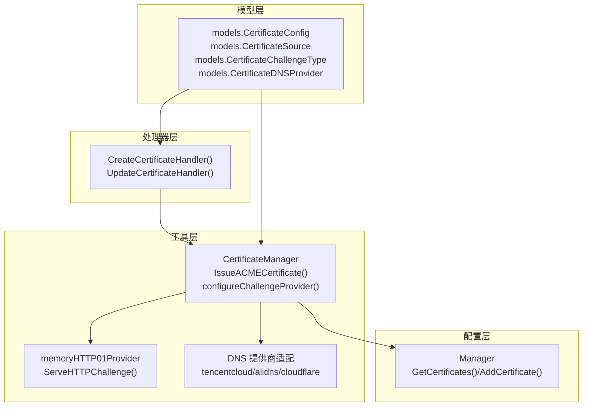
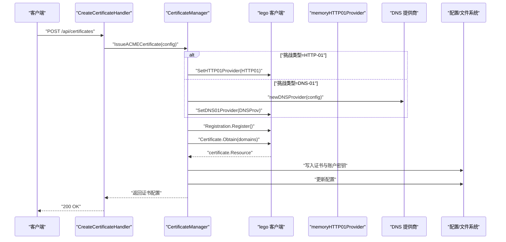
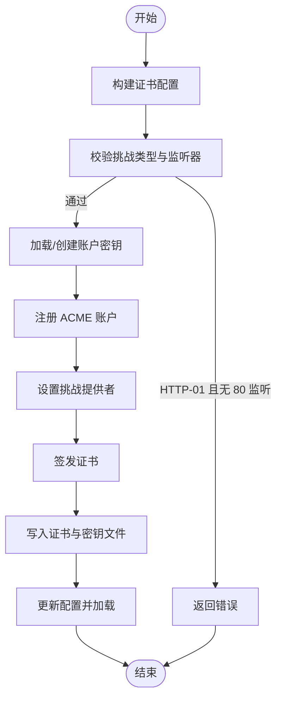
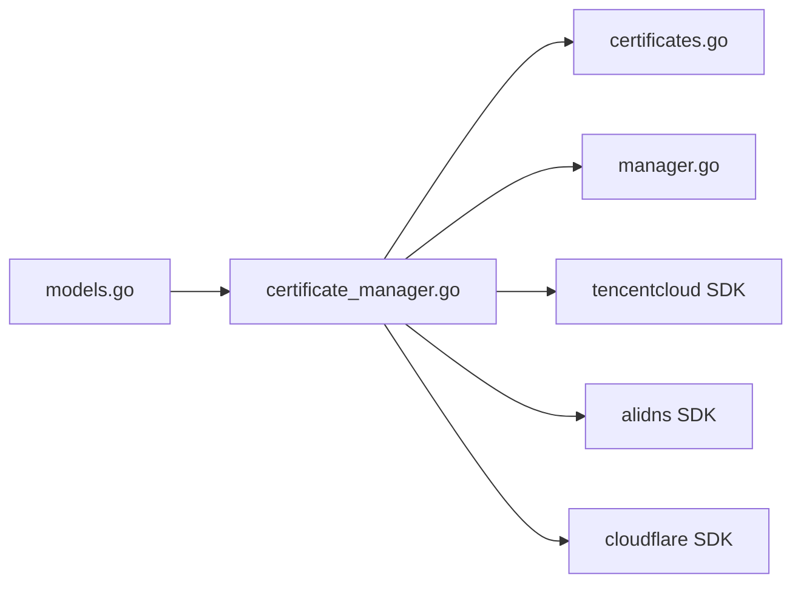

# ACME 证书申请

<cite>
**本文引用的文件**
- [README.md](file://README.md)
- [models.go](file://src/models/models.go)
- [certificate_manager.go](file://src/utils/certificate_manager.go)
- [certificates.go](file://src/handlers/certificates.go)
- [manager.go](file://src/config/manager.go)
- [default_fallback_certificate.go](file://src/utils/default_fallback_certificate.go)
</cite>

## 目录
1. [简介](#简介)
2. [项目结构](#项目结构)
3. [核心组件](#核心组件)
4. [架构总览](#架构总览)
5. [详细组件分析](#详细组件分析)
6. [依赖关系分析](#依赖关系分析)
7. [性能考量](#性能考量)
8. [故障排查指南](#故障排查指南)
9. [结论](#结论)
10. [附录](#附录)

## 简介
本文件面向 ACME 证书申请功能，系统性阐述协议工作原理与实现细节，覆盖 HTTP-01 与 DNS-01 两种验证方式的技术差异与适用场景；详解证书申请流程的每个步骤：账户注册、域名验证、证书签发与存储；分析不同挑战类型的配置方法，包括 HTTP-01 对 HTTP 80 监听器的要求与 DNS-01 的 DNS 提供商集成；解释账户密钥管理与注册资源的存储机制；提供完整配置示例（腾讯云、阿里云、Cloudflare）；并给出错误处理机制与常见问题的解决方案。

## 项目结构
该项目采用分层架构，围绕“模型-工具-处理器-配置”的组织方式展开。与 ACME 证书申请密切相关的模块包括：
- 模型层：定义证书来源、挑战类型、DNS 提供商、证书配置等数据结构
- 工具层：封装 ACME 客户端、挑战提供者、证书存储与加载、自动续签等核心逻辑
- 处理器层：对外暴露 REST 接口，接收证书申请请求并调用工具层
- 配置层：持久化应用配置、证书配置与运行时路径解析

图表来源
- [models.go:165-254](file://src/models/models.go#L165-L254)
- [certificate_manager.go:126-151](file://src/utils/certificate_manager.go#L126-L151)
- [certificate_manager.go:253-269](file://src/utils/certificate_manager.go#L253-L269)
- [certificate_manager.go:840-882](file://src/utils/certificate_manager.go#L840-L882)
- [certificates.go:55-94](file://src/handlers/certificates.go#L55-L94)
- [manager.go:453-509](file://src/config/manager.go#L453-L509)

章节来源
- [README.md:198-207](file://README.md#L198-L207)
- [models.go:165-254](file://src/models/models.go#L165-L254)
- [certificate_manager.go:126-151](file://src/utils/certificate_manager.go#L126-L151)
- [certificates.go:55-94](file://src/handlers/certificates.go#L55-L94)
- [manager.go:453-509](file://src/config/manager.go#L453-L509)

## 核心组件
- 证书管理器（CertificateManager）：负责 ACME 证书申请、导入、续签、运行时加载与动态匹配；内置内存 HTTP-01 挑战提供者；支持自动续签与外部配置文件同步。
- ACME 用户与账户密钥：封装 ACME 注册与私钥管理，支持账户密钥的加载与创建。
- DNS 提供商适配：针对腾讯云、阿里云、Cloudflare 的 DNS API 进行封装，用于 DNS-01 挑战。
- HTTP-01 挑战提供者：内存记录 token 到 keyAuth 的映射，拦截 /.well-known/acme-challenge/ 请求并返回 keyAuth。
- REST 处理器：接收证书申请请求，构建配置并调用证书管理器执行 ACME 申请或导入。
- 配置管理器：提供证书配置的增删改查与持久化。

章节来源
- [certificate_manager.go:126-151](file://src/utils/certificate_manager.go#L126-L151)
- [certificate_manager.go:44-48](file://src/utils/certificate_manager.go#L44-L48)
- [certificate_manager.go:884-907](file://src/utils/certificate_manager.go#L884-L907)
- [certificate_manager.go:94-124](file://src/utils/certificate_manager.go#L94-L124)
- [certificates.go:55-94](file://src/handlers/certificates.go#L55-L94)
- [manager.go:453-509](file://src/config/manager.go#L453-L509)

## 架构总览
下图展示了 ACME 证书申请的关键交互：REST 处理器接收请求，构建证书配置，调用证书管理器；证书管理器根据挑战类型选择 HTTP-01 或 DNS-01 提供者；通过 lego 客户端完成注册与证书签发；最终将证书与账户密钥落盘并更新配置。

图表来源
- [certificates.go:55-94](file://src/handlers/certificates.go#L55-L94)
- [certificate_manager.go:440-533](file://src/utils/certificate_manager.go#L440-L533)
- [certificate_manager.go:840-882](file://src/utils/certificate_manager.go#L840-L882)
- [certificate_manager.go:94-124](file://src/utils/certificate_manager.go#L94-L124)

## 详细组件分析

### ACME 协议与挑战类型
- HTTP-01：ACME 服务器通过 HTTP GET 访问域名/.well-known/acme-challenge/{token}，要求服务器返回对应的 keyAuth。实现上由内存 HTTP-01 提供者记录 token→keyAuth，并在请求到达时返回。
- DNS-01：ACME 服务器查询域名的 TXT 记录，要求返回特定的 keyAuth。实现上通过 DNS 提供商 SDK 创建/清理 TXT 记录。

章节来源
- [certificate_manager.go:253-269](file://src/utils/certificate_manager.go#L253-L269)
- [certificate_manager.go:94-124](file://src/utils/certificate_manager.go#L94-L124)
- [certificate_manager.go:840-882](file://src/utils/certificate_manager.go#L840-L882)

### 证书申请流程
- 账户注册：首次申请时创建 ECDSA 私钥并注册 ACME 账户，保存注册 URI 以便后续复用。
- 域名验证：根据挑战类型设置相应提供者；HTTP-01 需要存在启用的 HTTP 80 监听器；DNS-01 需要正确的 DNS 提供商凭据。
- 证书签发：lego 客户端发起 Obtain 请求，完成后返回证书链与私钥。
- 存储：证书与私钥写入运行时目录，账户密钥写入账户目录；配置更新并加载到内存。

图表来源
- [certificate_manager.go:440-533](file://src/utils/certificate_manager.go#L440-L533)
- [certificate_manager.go:993-1001](file://src/utils/certificate_manager.go#L993-L1001)

章节来源
- [certificate_manager.go:440-533](file://src/utils/certificate_manager.go#L440-L533)
- [certificate_manager.go:993-1001](file://src/utils/certificate_manager.go#L993-L1001)

### 账户密钥管理与注册资源存储
- 账户密钥：优先从账户密钥文件加载；不存在则生成新的 ECDSA 私钥并写入账户目录。
- 注册资源：保存注册 URI，以便后续复用，避免重复注册。
- 账户密钥路径与证书路径均通过运行时路径解析函数统一管理。

章节来源
- [certificate_manager.go:797-837](file://src/utils/certificate_manager.go#L797-L837)
- [certificate_manager.go:884-907](file://src/utils/certificate_manager.go#L884-L907)
- [certificate_manager.go:64-66](file://src/utils/certificate_manager.go#L64-L66)

### DNS 提供商集成
- 腾讯云：支持 SecretID/SecretKey/SessionToken/Region 配置。
- 阿里云：支持 AccessKey/SecretKey/SecurityToken/RegionID/RAMRole 配置。
- Cloudflare：支持 Email/APIKey/DNS API Token/Zone Token 配置。
- 配置字段在模型中定义，工具层根据所选提供商构造对应配置并初始化提供者。

章节来源
- [models.go:202-219](file://src/models/models.go#L202-L219)
- [certificate_manager.go:855-882](file://src/utils/certificate_manager.go#L855-L882)

### HTTP-01 验证对 HTTP 80 监听器的要求
- 在申请 HTTP-01 证书前，必须存在启用的 HTTP 80 监听器；否则返回错误。
- 证书管理器提供 hasEnabledHTTP80Listener 函数进行检测。

章节来源
- [certificate_manager.go:459-461](file://src/utils/certificate_manager.go#L459-L461)
- [certificate_manager.go:993-1001](file://src/utils/certificate_manager.go#L993-L1001)

### 证书存储与运行时加载
- 证书与私钥分别写入“受管证书目录”和“账户证书目录”，路径通过运行时解析函数统一管理。
- 证书加载：从磁盘读取 PEM 并解析为 TLS 证书，提取域名、颁发者、过期时间等元数据。
- 运行时匹配：根据 SNI 与服务绑定优先匹配证书，其次按域名匹配，最后回退到内置默认证书。

章节来源
- [certificate_manager.go:467-493](file://src/utils/certificate_manager.go#L467-L493)
- [certificate_manager.go:942-991](file://src/utils/certificate_manager.go#L942-L991)
- [certificate_manager.go:271-306](file://src/utils/certificate_manager.go#L271-L306)
- [default_fallback_certificate.go:1-24](file://src/utils/default_fallback_certificate.go#L1-L24)

### REST 接口与请求处理
- CreateCertificateHandler：解析请求体，构建证书配置，调用证书管理器执行 ACME 申请或导入。
- UpdateCertificateHandler：更新证书配置，必要时触发重新申请。
- RenewCertificateHandler：手动续签 ACME 证书。
- 列表与详情接口：用于查看与审计证书状态。

章节来源
- [certificates.go:55-94](file://src/handlers/certificates.go#L55-L94)
- [certificates.go:96-149](file://src/handlers/certificates.go#L96-L149)
- [certificates.go:32-53](file://src/handlers/certificates.go#L32-L53)

## 依赖关系分析
- 模型层依赖：证书配置结构体包含来源、挑战类型、DNS 提供商与凭据等字段。
- 工具层依赖：lego 客户端、各 DNS 提供商 SDK、TLS 解析与文件系统。
- 处理器层依赖：工具层与配置层。
- 配置层依赖：JSON 序列化与文件系统持久化。

图表来源
- [models.go:165-254](file://src/models/models.go#L165-L254)
- [certificate_manager.go:30-36](file://src/utils/certificate_manager.go#L30-L36)
- [certificates.go:12-16](file://src/handlers/certificates.go#L12-L16)
- [manager.go:18-21](file://src/config/manager.go#L18-L21)

章节来源
- [models.go:165-254](file://src/models/models.go#L165-L254)
- [certificate_manager.go:30-36](file://src/utils/certificate_manager.go#L30-L36)
- [certificates.go:12-16](file://src/handlers/certificates.go#L12-L16)
- [manager.go:18-21](file://src/config/manager.go#L18-L21)

## 性能考量
- 自动续签：定期扫描证书到期时间，提前触发续签，减少人工干预。
- 运行时加载：证书加载到内存，按需匹配，降低磁盘 IO。
- 外部配置同步：支持从外部 JSON 文件同步证书，便于集中管理与批量替换。
- 并发安全：证书管理器内部使用互斥锁保护并发访问。

章节来源
- [certificate_manager.go:154-182](file://src/utils/certificate_manager.go#L154-L182)
- [certificate_manager.go:218-251](file://src/utils/certificate_manager.go#L218-L251)
- [certificate_manager.go:595-629](file://src/utils/certificate_manager.go#L595-L629)

## 故障排查指南
- HTTP-01 申请失败
  - 现象：提示需要启用 HTTP 80 网站管理
  - 排查：确认存在启用的 HTTP 80 监听器；确保 /.well-known/acme-challenge/ 路由可达
  - 参考：hasEnabledHTTP80Listener 与 ServeHTTPChallenge
- DNS-01 申请失败
  - 现象：DNS 提供商凭据错误或权限不足
  - 排查：核对凭据字段（SecretID/AccessKey 等）与区域/Zone 配置；检查 DNS 提供商 API 权限
  - 参考：newDNSProvider 与对应 SDK 配置
- 证书导入失败
  - 现象：导入 PEM 证书时报错
  - 排查：确认证书与私钥 PEM 格式正确；域名解析与 SAN 匹配
  - 参考：parseCertificatePEM 与 ImportCertificate
- 续签失败
  - 现象：自动续签任务打印错误日志
  - 排查：检查网络连通性、ACME CA 可达性、账户密钥与注册 URI；查看配置中的错误字段
  - 参考：processAutoRenew 与 RenewCertificate

章节来源
- [certificate_manager.go:459-461](file://src/utils/certificate_manager.go#L459-L461)
- [certificate_manager.go:253-269](file://src/utils/certificate_manager.go#L253-L269)
- [certificate_manager.go:855-882](file://src/utils/certificate_manager.go#L855-L882)
- [certificate_manager.go:962-991](file://src/utils/certificate_manager.go#L962-L991)
- [certificate_manager.go:192-216](file://src/utils/certificate_manager.go#L192-L216)
- [certificate_manager.go:535-559](file://src/utils/certificate_manager.go#L535-L559)

## 结论
本实现以 lego 为核心，结合内存 HTTP-01 提供者与多家 DNS 提供商 SDK，完整覆盖 ACME 证书申请与续签的全流程。通过运行时路径解析与配置持久化，实现了证书与账户密钥的安全存储与高效加载。HTTP-01 与 DNS-01 的差异化设计满足不同网络与运维场景的需求；自动续签与外部配置同步进一步提升了运维效率与可靠性。

## 附录

### 配置示例（凭据字段）
- 腾讯云
  - 字段：tencent_secret_id、tencent_secret_key、tencent_session_token、tencent_region
  - 参考：models.CertificateDNSConfig 中的腾讯云字段
- 阿里云
  - 字段：ali_access_key、ali_secret_key、ali_security_token、ali_region_id、ali_ram_role
  - 参考：models.CertificateDNSConfig 中的阿里云字段
- Cloudflare
  - 字段：cloudflare_email、cloudflare_api_key、cloudflare_dns_api_token、cloudflare_zone_token
  - 参考：models.CertificateDNSConfig 中的 Cloudflare 字段

章节来源
- [models.go:202-219](file://src/models/models.go#L202-L219)

### API 使用要点
- 证书来源
  - acme：通过 ACME 自动申请
  - imported：导入已有 PEM 证书
  - file_sync：外部配置文件同步
- 挑战类型
  - http01：HTTP-01 验证，需启用 HTTP 80 监听器
  - dns01：DNS-01 验证，需配置对应 DNS 提供商凭据
- 自动续签
  - auto_renew：启用自动续签
  - renew_before_days：提前续签天数（默认 30）

章节来源
- [models.go:168-180](file://src/models/models.go#L168-L180)
- [models.go:165-172](file://src/models/models.go#L165-L172)
- [certificates.go:18-30](file://src/handlers/certificates.go#L18-L30)