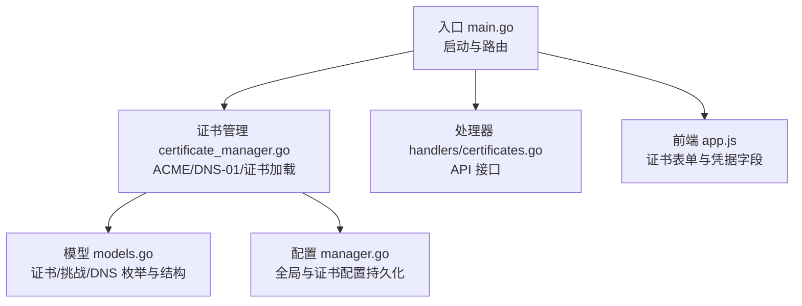
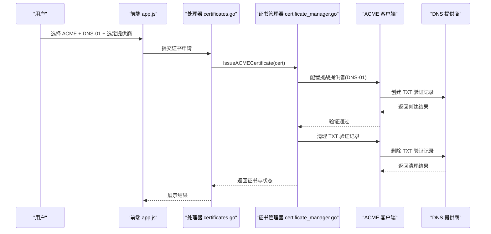
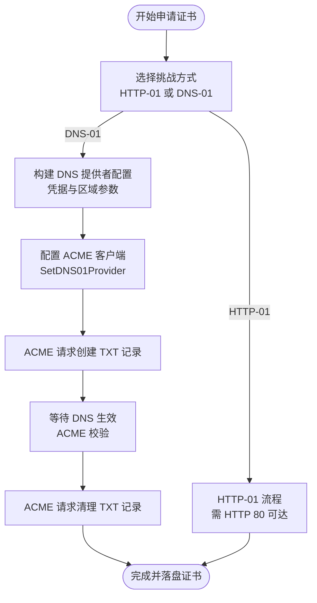
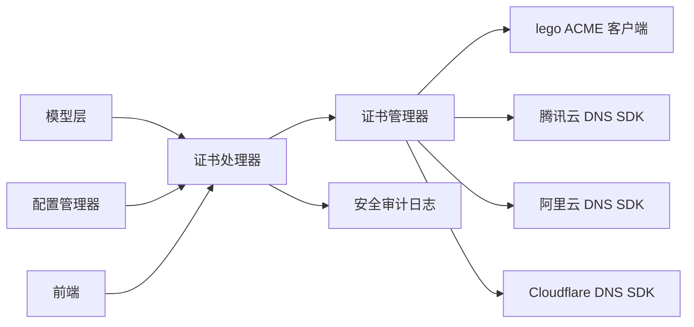

# DNS 提供商集成

<cite>
**本文引用的文件**
- [src/main.go](file://src/main.go)
- [src/utils/certificate_manager.go](file://src/utils/certificate_manager.go)
- [src/handlers/certificates.go](file://src/handlers/certificates.go)
- [src/models/models.go](file://src/models/models.go)
- [src/config/manager.go](file://src/config/manager.go)
- [README.md](file://README.md)
- [src/static/app.js](file://src/static/app.js)
</cite>

## 目录
1. [简介](#简介)
2. [项目结构](#项目结构)
3. [核心组件](#核心组件)
4. [架构总览](#架构总览)
5. [详细组件分析](#详细组件分析)
6. [依赖关系分析](#依赖关系分析)
7. [性能考量](#性能考量)
8. [故障排除指南](#故障排除指南)
9. [结论](#结论)
10. [附录](#附录)

## 简介
本文件面向 DNS 提供商集成功能，围绕 DNS-01 验证方式展开，系统性阐述 TXT 记录的创建、验证与清理流程，以及对腾讯云、阿里云、Cloudflare 等主流 DNS 提供商的 API 集成方式。文档还覆盖凭证安全存储与管理、API 限制与配额策略、错误处理与重试、配置示例与故障排除，以及证书记录的生命周期与清理策略。

## 项目结构
该项目采用模块化设计，核心与证书管理相关的模块如下：
- 入口与路由：主程序负责启动与路由挂载
- 证书管理：封装 ACME 申请、DNS-01 验证、证书加载与续签
- 模型定义：证书来源、挑战类型、DNS 提供商枚举及 DNS 凭据结构
- 配置管理：全局配置、证书配置持久化与读取
- 前端交互：证书申请/编辑界面，动态渲染 DNS 凭据字段

图表来源
- [src/main.go:1-516](file://src/main.go#L1-L516)
- [src/utils/certificate_manager.go:1-1288](file://src/utils/certificate_manager.go#L1-L1288)
- [src/handlers/certificates.go:1-285](file://src/handlers/certificates.go#L1-L285)
- [src/models/models.go:1-394](file://src/models/models.go#L1-L394)
- [src/config/manager.go:1-791](file://src/config/manager.go#L1-L791)
- [src/static/app.js:2070-2269](file://src/static/app.js#L2070-L2269)

章节来源
- [src/main.go:1-516](file://src/main.go#L1-L516)
- [README.md:198-207](file://README.md#L198-L207)

## 核心组件
- 证书管理器：负责 ACME 申请、DNS-01 验证提供者配置、证书文件写入与加载、自动续签与错误状态记录
- 证书处理器：对外暴露证书增删改查与续签的 API 接口
- 模型层：定义证书来源、挑战类型、DNS 提供商枚举与 DNS 凭据结构
- 配置管理器：负责全局配置与证书配置的持久化与读取
- 前端应用：提供证书申请/编辑界面，动态渲染 DNS 凭据字段

章节来源
- [src/utils/certificate_manager.go:126-151](file://src/utils/certificate_manager.go#L126-L151)
- [src/handlers/certificates.go:32-149](file://src/handlers/certificates.go#L32-L149)
- [src/models/models.go:165-254](file://src/models/models.go#L165-L254)
- [src/config/manager.go:35-72](file://src/config/manager.go#L35-L72)
- [src/static/app.js:2074-2146](file://src/static/app.js#L2074-L2146)

## 架构总览
DNS-01 验证的核心流程：
- 用户在前端选择 ACME 证书、挑战方式为 DNS-01，并选择 DNS 提供商
- 后端根据所选提供商构造对应的 DNS 提供者配置
- ACME 客户端在申请过程中调用 DNS 提供者的 TXT 记录创建接口
- 验证完成后，ACME 客户端触发清理流程，移除临时 TXT 记录
- 成功后证书文件与账户信息落盘，进入自动续签周期

图表来源
- [src/static/app.js:2266-2269](file://src/static/app.js#L2266-L2269)
- [src/handlers/certificates.go:55-94](file://src/handlers/certificates.go#L55-L94)
- [src/utils/certificate_manager.go:840-882](file://src/utils/certificate_manager.go#L840-L882)

## 详细组件分析

### DNS-01 验证技术原理与实现
- 挑战类型：支持 HTTP-01 与 DNS-01。DNS-01 适用于通配符证书与跨域场景
- 验证流程：ACME 客户端在申请证书时，请求 DNS 提供商创建特定的 TXT 记录；验证通过后，客户端请求清理该记录
- 提供者配置：根据所选 DNS 提供商，填充对应凭据并初始化提供者对象

图表来源
- [src/utils/certificate_manager.go:840-882](file://src/utils/certificate_manager.go#L840-L882)
- [src/utils/certificate_manager.go:840-853](file://src/utils/certificate_manager.go#L840-L853)
- [src/utils/certificate_manager.go:884-907](file://src/utils/certificate_manager.go#L884-L907)

章节来源
- [src/utils/certificate_manager.go:840-882](file://src/utils/certificate_manager.go#L840-L882)
- [src/utils/certificate_manager.go:884-907](file://src/utils/certificate_manager.go#L884-L907)

### 支持的 DNS 提供商与 API 集成
- 腾讯云：使用 SecretID/SecretKey/SessionToken/Region 配置
- 阿里云：使用 AccessKey/SecretKey/SecurityToken/RegionID/RAMRole 配置
- Cloudflare：使用 Email/API Key 或 DNS API Token/Zone Token 配置

前端动态渲染对应凭据字段，后端通过模型结构接收并传递给对应的 DNS 提供者初始化函数。

章节来源
- [src/models/models.go:202-219](file://src/models/models.go#L202-L219)
- [src/utils/certificate_manager.go:855-882](file://src/utils/certificate_manager.go#L855-L882)
- [src/static/app.js:2074-2146](file://src/static/app.js#L2074-L2146)

### 凭证安全存储与管理
- 前端：敏感字段使用密码输入框，避免明文泄露
- 后端：证书配置结构中包含 DNS 凭据字段；在返回给前端时进行掩码处理，避免敏感信息泄露
- 存储：证书与账户密钥落盘，路径由运行时目录统一管理

章节来源
- [src/handlers/certificates.go:151-162](file://src/handlers/certificates.go#L151-L162)
- [src/utils/certificate_manager.go:40-42](file://src/utils/certificate_manager.go#L40-L42)

### API 限制与配额管理
- 项目未内置针对各 DNS 提供商的速率限制与配额管理逻辑，实际限制取决于各提供商的 API 限额与生效策略
- 建议在生产环境中：
  - 控制并发申请数量
  - 合理设置重试间隔
  - 使用稳定的网络与 DNS 生效时间窗口
  - 对频繁变更的域名申请进行排队与去重

[本节为通用指导，不直接分析具体文件]

### DNS 记录生命周期与清理策略
- 创建：ACME 客户端在验证阶段调用 DNS 提供者创建 TXT 记录
- 验证：等待 DNS 生效并通过 ACME 校验
- 清理：验证通过后，客户端请求清理临时 TXT 记录
- 异常：若验证失败或中断，清理逻辑仍应保证最终一致性，避免遗留记录

章节来源
- [src/utils/certificate_manager.go:840-853](file://src/utils/certificate_manager.go#L840-L853)

### 配置示例与最佳实践
- 在前端选择“ACME 自动签发/续签”，挑战方式选择“DNS 校验（DNS-01）”
- 选择对应 DNS 提供商并填写凭据
- 域名列表支持多行或逗号分隔，系统会进行标准化处理
- 自动续签天数可配置，默认 30 天

章节来源
- [src/static/app.js:2148-2175](file://src/static/app.js#L2148-L2175)
- [src/static/app.js:2266-2269](file://src/static/app.js#L2266-L2269)

## 依赖关系分析
- 证书管理器依赖 lego ACME 客户端与各 DNS 提供商 SDK
- 处理器依赖证书管理器与安全审计日志
- 模型层定义了证书来源、挑战类型与 DNS 提供商枚举
- 配置管理器负责全局与证书配置的持久化
- 前端依赖模型与处理器提供的 API

图表来源
- [src/utils/certificate_manager.go:30-37](file://src/utils/certificate_manager.go#L30-L37)
- [src/handlers/certificates.go:12-16](file://src/handlers/certificates.go#L12-L16)
- [src/models/models.go:165-254](file://src/models/models.go#L165-L254)
- [src/config/manager.go:35-72](file://src/config/manager.go#L35-L72)
- [src/static/app.js:2074-2146](file://src/static/app.js#L2074-L2146)

章节来源
- [src/utils/certificate_manager.go:30-37](file://src/utils/certificate_manager.go#L30-L37)
- [src/handlers/certificates.go:12-16](file://src/handlers/certificates.go#L12-L16)
- [src/models/models.go:165-254](file://src/models/models.go#L165-L254)
- [src/config/manager.go:35-72](file://src/config/manager.go#L35-L72)

## 性能考量
- 证书申请与续签为 IO 密集型操作，建议合理设置同步周期与并发度
- DNS 生效时间受 DNS 传播影响，建议预留足够等待时间
- 对频繁变更的域名申请进行去重与排队，避免重复请求
- 将证书与账户密钥文件权限设置为只读，防止被意外修改

[本节为通用指导，不直接分析具体文件]

## 故障排除指南
常见问题与排查要点：
- HTTP-01 无法通过：确认存在启用且端口为 80 的监听器
- DNS-01 失败：检查 DNS 凭据是否正确、区域参数是否匹配、DNS 生效时间是否充足
- 权限不足：确保所用凭据具备创建/删除 TXT 记录的权限
- 配置未持久化：检查运行时目录权限与配置文件写入情况
- 前端显示敏感信息泄露：确认后端返回时已对敏感字段进行掩码处理

章节来源
- [src/utils/certificate_manager.go:459-461](file://src/utils/certificate_manager.go#L459-L461)
- [src/handlers/certificates.go:151-162](file://src/handlers/certificates.go#L151-L162)
- [src/config/manager.go:96-107](file://src/config/manager.go#L96-L107)

## 结论
本项目通过 lego ACME 客户端与各 DNS 提供商 SDK，实现了对腾讯云、阿里云、Cloudflare 的 DNS-01 集成。前端提供直观的凭据配置界面，后端负责证书申请、验证、清理与自动续签，并对敏感信息进行掩码处理。建议在生产环境中结合各 DNS 提供商的 API 限制与生效时间，合理规划申请节奏与重试策略，确保验证流程稳定可靠。

[本节为总结性内容，不直接分析具体文件]

## 附录
- 启动参数与运行目录：通过 `-config_path` 指定运行时根目录，便于集中管理证书与配置
- 管理后台：支持状态查询、指标查看与安全日志审计

章节来源
- [README.md:105-136](file://README.md#L105-L136)
- [README.md:156-166](file://README.md#L156-L166)