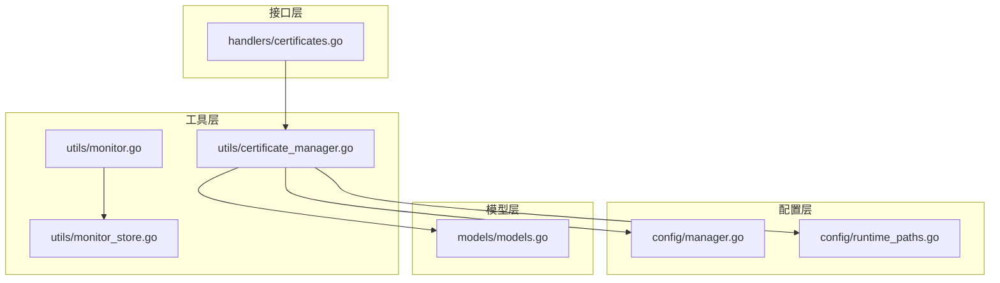
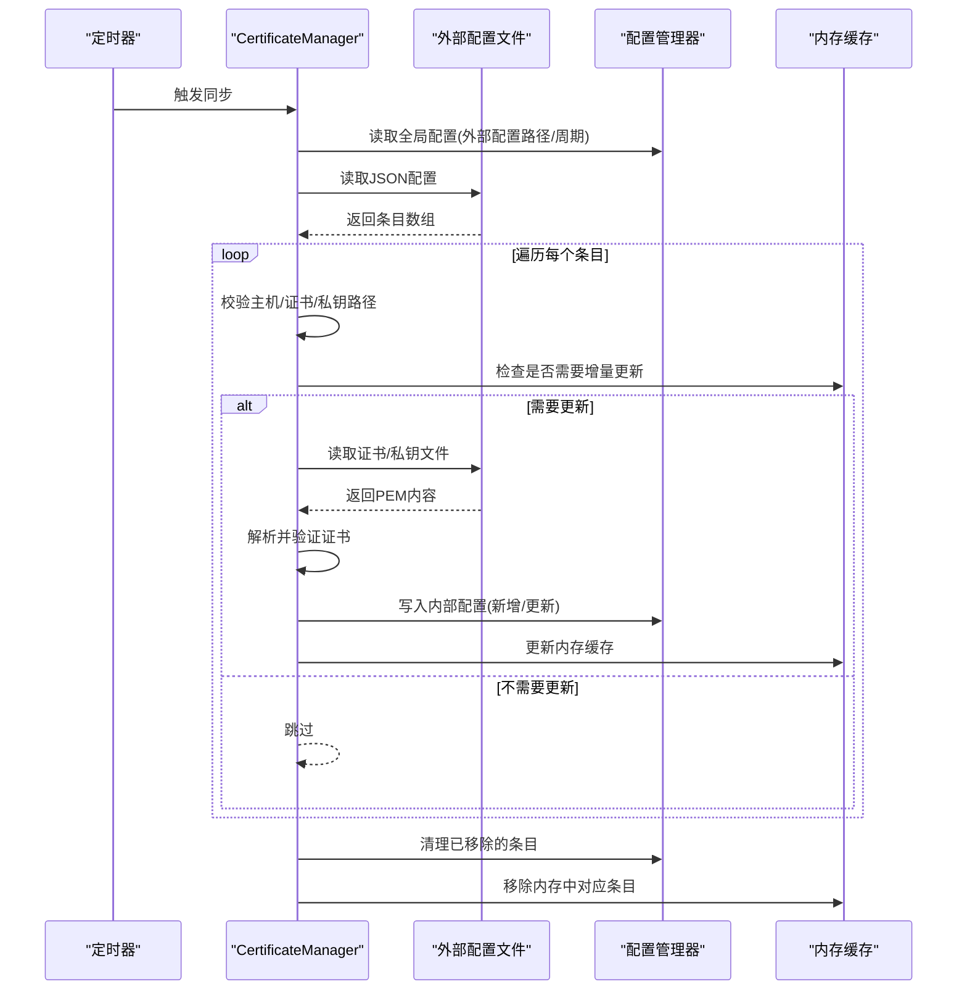
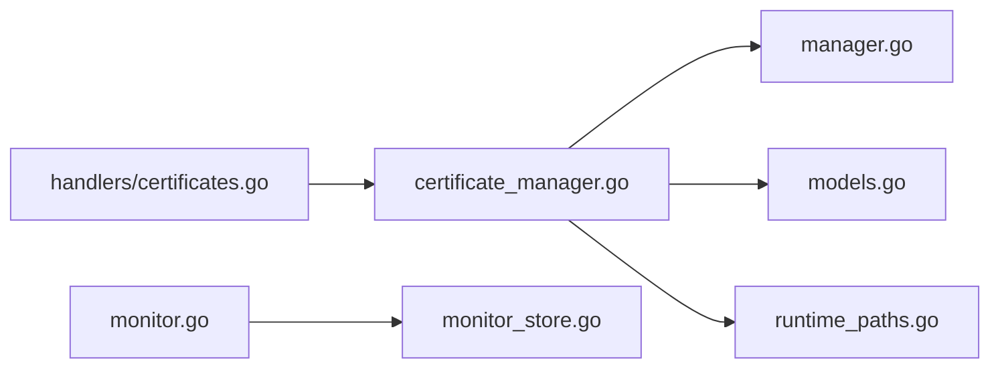

# 外部配置同步

<cite>
**本文引用的文件**
- [certificate_manager.go](file://src/utils/certificate_manager.go)
- [monitor.go](file://src/utils/monitor.go)
- [monitor_store.go](file://src/utils/monitor_store.go)
- [certificates.go](file://src/handlers/certificates.go)
- [models.go](file://src/models/models.go)
- [manager.go](file://src/config/manager.go)
- [runtime_paths.go](file://src/config/runtime_paths.go)
- [certificate_manager_test.go](file://src/utils/certificate_manager_test.go)
</cite>

## 目录
1. [简介](#简介)
2. [项目结构](#项目结构)
3. [核心组件](#核心组件)
4. [架构总览](#架构总览)
5. [详细组件分析](#详细组件分析)
6. [依赖分析](#依赖分析)
7. [性能考量](#性能考量)
8. [故障排查指南](#故障排查指南)
9. [结论](#结论)
10. [附录](#附录)

## 简介
本文档围绕“外部配置同步”能力进行系统性说明，重点覆盖以下方面：
- 外部证书配置文件的格式与 JSON 结构设计
- 同步机制的实现原理：文件监控、变更检测、增量更新与清理
- 错误处理策略：文件读取失败、格式解析错误、证书加载异常
- 生命周期管理：新增证书的自动创建、删除证书的清理、配置变更的更新
- 与内部配置系统的集成与数据一致性保障
- 外部配置文件编写示例与最佳实践（含权限、路径与备份建议）

## 项目结构
该功能位于工具层（utils），通过配置管理层（config）与模型层（models）协作，对外提供 HTTP 接口（handlers）以供管理端调用。

图表来源
- [manager.go:35-72](file://src/config/manager.go#L35-L72)
- [runtime_paths.go:85-115](file://src/config/runtime_paths.go#L85-L115)
- [models.go:221-254](file://src/models/models.go#L221-L254)
- [certificate_manager.go:127-151](file://src/utils/certificate_manager.go#L127-L151)
- [monitor.go:53-65](file://src/utils/monitor.go#L53-L65)
- [monitor_store.go:30-54](file://src/utils/monitor_store.go#L30-L54)
- [certificates.go:32-94](file://src/handlers/certificates.go#L32-L94)

章节来源
- [manager.go:35-72](file://src/config/manager.go#L35-L72)
- [runtime_paths.go:85-115](file://src/config/runtime_paths.go#L85-L115)
- [models.go:221-254](file://src/models/models.go#L221-L254)
- [certificate_manager.go:127-151](file://src/utils/certificate_manager.go#L127-L151)
- [monitor.go:53-65](file://src/utils/monitor.go#L53-L65)
- [monitor_store.go:30-54](file://src/utils/monitor_store.go#L30-L54)
- [certificates.go:32-94](file://src/handlers/certificates.go#L32-L94)

## 核心组件
- 外部证书同步器（CertificateManager）：负责读取外部 JSON 配置、解析条目、检测变更、增量同步、错误上报与清理过期条目。
- 配置管理器（Manager）：提供全局配置（含外部证书配置文件路径与同步周期）、持久化与规范化。
- 运行时路径解析（runtime_paths）：统一解析相对路径到绝对路径，确保证书与账户文件落盘位置一致。
- 模型（models）：定义证书来源、状态、字段与全局配置项（包含外部证书配置路径与同步周期）。
- HTTP 处理器（handlers）：提供证书增删改查接口，其中新增/更新导入证书接口与外部同步密切相关。

章节来源
- [certificate_manager.go:127-151](file://src/utils/certificate_manager.go#L127-L151)
- [manager.go:35-72](file://src/config/manager.go#L35-L72)
- [runtime_paths.go:74-83](file://src/config/runtime_paths.go#L74-L83)
- [models.go:165-254](file://src/models/models.go#L165-L254)
- [certificates.go:55-94](file://src/handlers/certificates.go#L55-L94)

## 架构总览
外部配置同步采用“定时轮询 + 文件变更检测”的模式：
- 定时器按全局配置的同步周期触发
- 读取外部 JSON 配置文件
- 解析为条目数组，逐条比对是否需要同步
- 对于新增/变更的条目，尝试加载证书与私钥，写入内部配置并缓存到内存
- 清理不再存在于外部配置中的旧条目
- 发生错误时记录错误状态与时间，便于诊断

图表来源
- [certificate_manager.go:595-629](file://src/utils/certificate_manager.go#L595-L629)
- [certificate_manager.go:648-659](file://src/utils/certificate_manager.go#L648-L659)
- [certificate_manager.go:666-746](file://src/utils/certificate_manager.go#L666-L746)
- [certificate_manager.go:779-795](file://src/utils/certificate_manager.go#L779-L795)
- [manager.go:227-241](file://src/config/manager.go#L227-L241)

## 详细组件分析

### 外部证书配置文件格式与 JSON 结构
- 文件路径由全局配置项提供，默认值指向系统路径；可通过配置中心下发或本地文件挂载。
- 文件内容为 JSON 数组，数组元素为对象，包含以下键：
  - host：主机名或域名（将被标准化为小写并去除首尾点）
  - cert：证书文件路径（PEM）
  - key：私钥文件路径（PEM）
- 字段校验：三者均不能为空；空条目会被忽略。
- ID 生成：基于“外部配置文件路径 + 主机名”做哈希，形成稳定且唯一的内部 ID，避免重复与冲突。

章节来源
- [models.go:299-310](file://src/models/models.go#L299-L310)
- [certificate_manager.go:50-54](file://src/utils/certificate_manager.go#L50-L54)
- [certificate_manager.go:613-626](file://src/utils/certificate_manager.go#L613-L626)
- [certificate_manager.go:661-664](file://src/utils/certificate_manager.go#L661-L664)

### 同步机制实现原理
- 文件监控与变更检测
  - 读取外部配置文件后，逐条解析并标准化主机名
  - 通过比较内部配置与外部条目的路径、文件修改时间戳、域名集合等，判断是否需要增量更新
- 增量更新
  - 若需要更新，则读取证书与私钥文件，解析为 TLS 证书并提取元数据（签发者、有效期、域名等）
  - 将条目写入内部配置（新增或更新），并更新内存缓存
- 清理机制
  - 在同步开始前，清理“非当前活动配置路径”的外部同步证书
  - 在同步结束后，清理“在当前配置中不存在但曾存在”的外部同步证书，并解除其与服务的绑定

章节来源
- [certificate_manager.go:612-629](file://src/utils/certificate_manager.go#L612-L629)
- [certificate_manager.go:666-746](file://src/utils/certificate_manager.go#L666-L746)
- [certificate_manager.go:631-646](file://src/utils/certificate_manager.go#L631-L646)
- [certificate_manager.go:779-795](file://src/utils/certificate_manager.go#L779-L795)

### 错误处理策略
- 文件读取失败：当证书或私钥文件无法读取时，记录错误状态与错误信息，并保持上次有效状态，等待下次同步修复
- 格式解析错误：外部 JSON 解析失败时，打印错误日志并跳过本次同步
- 证书加载异常：证书/私钥解析失败或链路为空时，同样记录错误状态与时间
- 删除保护：外部同步证书在被服务绑定时不允许直接删除，需先解除绑定

章节来源
- [certificate_manager.go:602-609](file://src/utils/certificate_manager.go#L602-L609)
- [certificate_manager.go:669-676](file://src/utils/certificate_manager.go#L669-L676)
- [certificate_manager.go:692-695](file://src/utils/certificate_manager.go#L692-L695)
- [certificate_manager.go:748-777](file://src/utils/certificate_manager.go#L748-L777)
- [certificate_manager.go:567-573](file://src/utils/certificate_manager.go#L567-L573)

### 生命周期管理
- 新增：当外部条目首次出现或发生变更时，写入内部配置并加载到内存
- 更新：当条目存在但需要更新（路径、时间戳、域名或状态变化）时，重新加载并更新
- 删除：当条目从外部配置中移除时，清理内部配置并解除服务绑定
- 清理过期：若外部配置路径为空或切换，清理不属于当前路径的所有外部同步证书

章节来源
- [certificate_manager.go:623-626](file://src/utils/certificate_manager.go#L623-L626)
- [certificate_manager.go:719-735](file://src/utils/certificate_manager.go#L719-L735)
- [certificate_manager.go:631-646](file://src/utils/certificate_manager.go#L631-L646)
- [certificate_manager.go:779-795](file://src/utils/certificate_manager.go#L779-L795)

### 与内部配置系统的集成与一致性
- 集成点
  - 外部配置路径与同步周期来自全局配置（GlobalConfig）
  - 证书来源标记为 file_sync，便于区分与导入/ACME证书
  - 证书元数据（issuer、expires_at、status）由解析结果填充
- 数据一致性
  - 使用内部配置管理器进行原子写入（新增/更新/删除）
  - 内存缓存与持久化配置保持一致，避免脏读
  - 删除外部同步证书时，自动解除服务绑定，防止悬挂引用

章节来源
- [models.go:299-310](file://src/models/models.go#L299-L310)
- [models.go:221-254](file://src/models/models.go#L221-L254)
- [manager.go:472-496](file://src/config/manager.go#L472-L496)
- [certificate_manager.go:1167-1176](file://src/utils/certificate_manager.go#L1167-L1176)

### 外部配置文件编写示例与最佳实践
- 示例结构
  - JSON 数组，每项包含 host、cert、key 三个字段
  - host 建议使用标准域名，避免通配符与多级通配
  - cert/key 路径建议使用绝对路径，或通过运行时路径解析规则确保可解析
- 最佳实践
  - 文件权限：证书与私钥文件建议 0600，外部配置文件建议 0644
  - 路径配置：优先使用绝对路径，或通过运行时路径解析统一管理
  - 备份策略：外部配置文件建议保留历史版本，便于回滚
  - 同步周期：根据变更频率设置合理周期（默认 3600 秒），避免过于频繁导致资源消耗
  - 错误定位：关注错误状态与 LastError 字段，结合日志定位问题

章节来源
- [models.go:299-310](file://src/models/models.go#L299-L310)
- [runtime_paths.go:74-83](file://src/config/runtime_paths.go#L74-L83)
- [certificate_manager.go:748-777](file://src/utils/certificate_manager.go#L748-L777)

## 依赖分析
- 组件耦合
  - CertificateManager 依赖配置管理器与运行时路径解析，以确保路径正确与配置持久化
  - 证书来源与状态枚举定义于模型层，统一了外部同步与其他证书类型的语义
- 外部依赖
  - JSON 解析：标准库 json
  - 文件系统：标准库 os、path/filepath
  - TLS 证书解析：标准库 crypto/tls、crypto/x509
- 潜在循环依赖
  - 当前模块间为单向依赖，未发现循环

图表来源
- [certificate_manager.go:127-151](file://src/utils/certificate_manager.go#L127-L151)
- [manager.go:35-72](file://src/config/manager.go#L35-L72)
- [models.go:165-254](file://src/models/models.go#L165-L254)
- [runtime_paths.go:74-83](file://src/config/runtime_paths.go#L74-L83)
- [certificates.go:55-94](file://src/handlers/certificates.go#L55-L94)
- [monitor.go:53-65](file://src/utils/monitor.go#L53-L65)
- [monitor_store.go:30-54](file://src/utils/monitor_store.go#L30-L54)

## 性能考量
- 同步周期：默认 3600 秒，可根据实际变更频率调整，避免频繁 IO
- 增量更新：通过文件修改时间戳与路径对比减少不必要的解析与写入
- 内存缓存：仅缓存有效证书，避免加载无效或错误证书
- 并发安全：使用互斥锁保护内存缓存与配置写入，避免竞态

[本节为通用指导，无需特定文件来源]

## 故障排查指南
- 外部配置文件读取失败
  - 检查路径是否正确、文件是否存在、权限是否足够
  - 关注日志输出与 LastError 字段
- JSON 格式解析错误
  - 使用在线 JSON 校验工具确认格式
  - 确保数组元素为对象且包含 host/cert/key
- 证书/私钥加载异常
  - 确认 PEM 内容完整、格式正确
  - 检查证书链是否完整、私钥匹配
- 删除失败
  - 若证书被服务绑定，需先解除绑定再删除
- 服务未生效
  - 确认同步周期已触发，或手动触发一次同步

章节来源
- [certificate_manager.go:602-609](file://src/utils/certificate_manager.go#L602-L609)
- [certificate_manager.go:648-659](file://src/utils/certificate_manager.go#L648-L659)
- [certificate_manager.go:669-676](file://src/utils/certificate_manager.go#L669-L676)
- [certificate_manager.go:692-695](file://src/utils/certificate_manager.go#L692-L695)
- [certificate_manager.go:567-573](file://src/utils/certificate_manager.go#L567-L573)

## 结论
外部配置同步通过“定时轮询 + 变更检测 + 增量更新 + 清理”的闭环机制，实现了与外部证书配置文件的高可靠对接。配合完善的错误处理与生命周期管理，能够在复杂场景下保持内部配置与外部文件的一致性。建议在生产环境中合理设置同步周期、严格控制文件权限与备份策略，并通过日志与错误状态快速定位问题。

[本节为总结，无需特定文件来源]

## 附录
- 相关测试用例参考：证书域匹配、PEM 解析与回退证书有效性校验，有助于理解证书加载与校验流程

章节来源
- [certificate_manager_test.go:16-40](file://src/utils/certificate_manager_test.go#L16-L40)
- [certificate_manager_test.go:42-75](file://src/utils/certificate_manager_test.go#L42-L75)