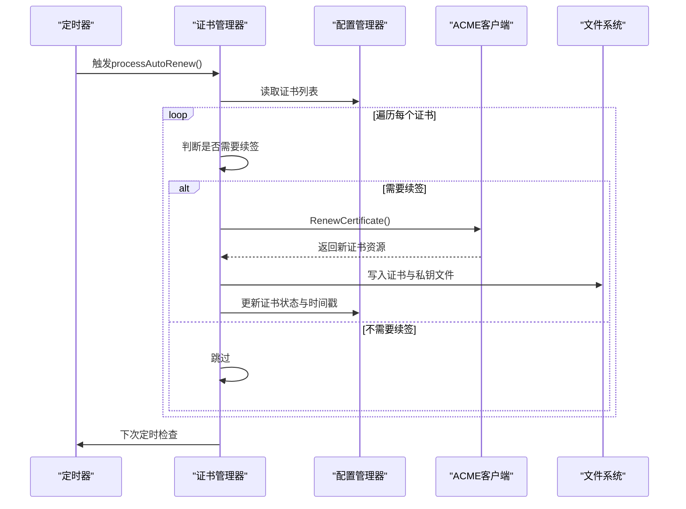
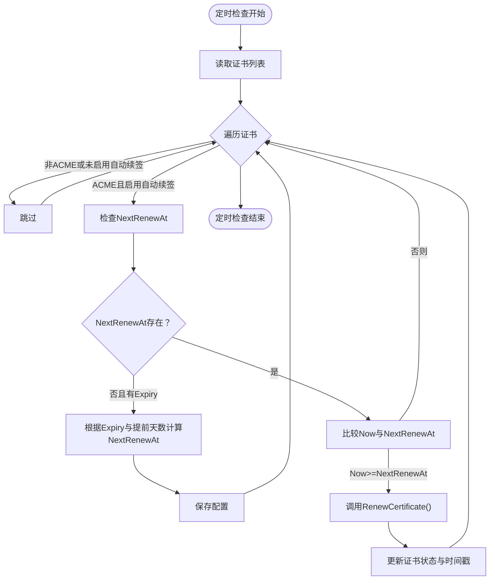
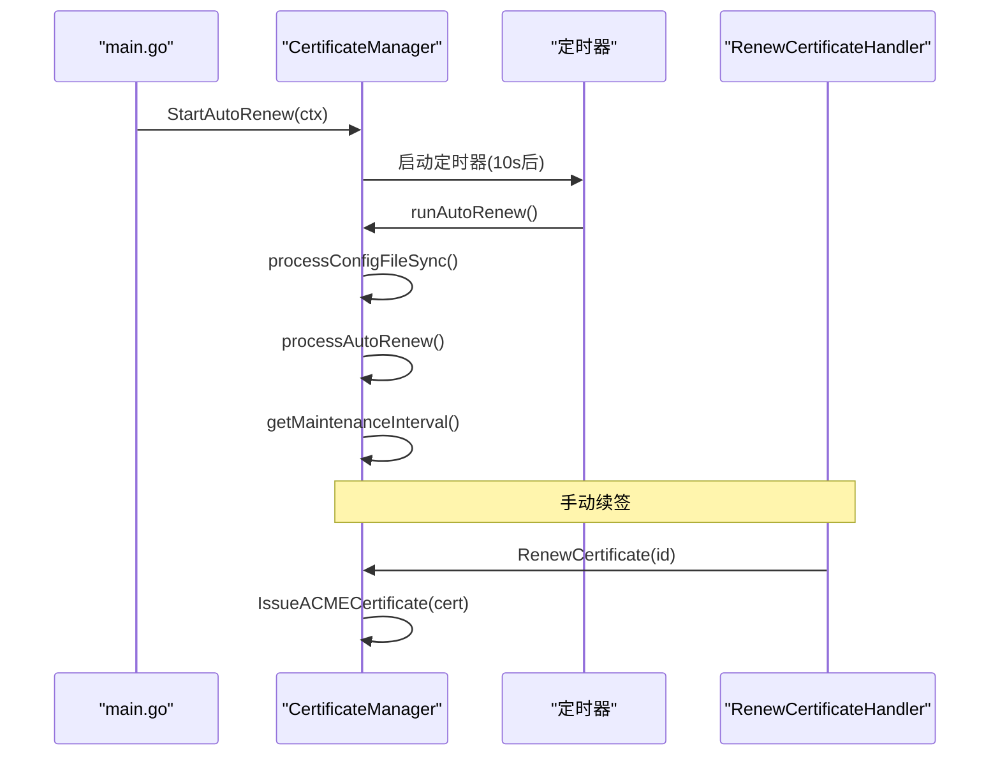
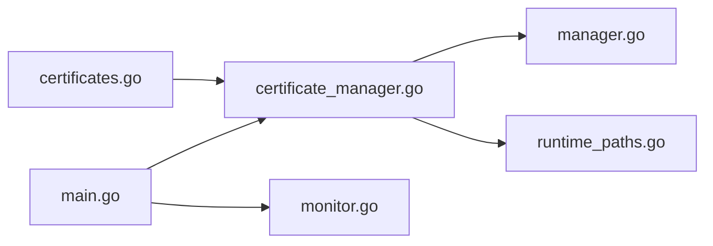

# 自动续期机制

<cite>
**本文档引用的文件**
- [certificate_manager.go](file://src/utils/certificate_manager.go)
- [certificates.go](file://src/handlers/certificates.go)
- [models.go](file://src/models/models.go)
- [manager.go](file://src/config/manager.go)
- [runtime_paths.go](file://src/config/runtime_paths.go)
- [main.go](file://src/main.go)
- [monitor.go](file://src/utils/monitor.go)
- [certificate_manager_test.go](file://src/utils/certificate_manager_test.go)
</cite>

## 目录
1. [简介](#简介)
2. [项目结构](#项目结构)
3. [核心组件](#核心组件)
4. [架构概览](#架构概览)
5. [详细组件分析](#详细组件分析)
6. [依赖关系分析](#依赖关系分析)
7. [性能考量](#性能考量)
8. [故障排查指南](#故障排查指南)
9. [结论](#结论)
10. [附录](#附录)

## 简介
本文档深入解析系统的自动续期机制，涵盖证书续期的触发条件与判断逻辑、到期时间计算、提前续期天数配置、续期窗口管理、自动续期任务的执行流程、失败处理机制、续期间隔配置与性能优化、最佳实践以及手动续期与自动续期的区别。

## 项目结构
系统围绕证书管理器（CertificateManager）构建，负责证书的申请、导入、续签与运行时加载，并通过定时任务实现自动续期。配置管理器（Manager）提供全局配置与证书配置的持久化与读取。API处理器（handlers）提供证书相关的REST接口，主程序（main.go）负责启动HTTP服务与自动续期任务。

```mermaid
graph TB
subgraph "应用入口"
MAIN["main.go<br/>启动HTTP服务与自动续期"]
end
subgraph "API层"
HANDLERS["handlers/certificates.go<br/>证书API处理器"]
end
subgraph "业务逻辑层"
CM["utils/certificate_manager.go<br/>证书管理器"]
CFG["config/manager.go<br/>配置管理器"]
end
subgraph "模型与配置"
MODELS["models/models.go<br/>数据模型"]
PATHS["config/runtime_paths.go<br/>运行时路径"]
end
subgraph "监控"
MONITOR["utils/monitor.go<br/>运行时监控"]
end
MAIN --> HANDLERS
HANDLERS --> CM
CM --> CFG
CM --> PATHS
CFG --> MODELS
MAIN --> MONITOR
```

图表来源
- [main.go:478-480](file://src/main.go#L478-L480)
- [certificates.go:55-94](file://src/handlers/certificates.go#L55-L94)
- [certificate_manager.go:127-166](file://src/utils/certificate_manager.go#L127-L166)
- [manager.go:35-72](file://src/config/manager.go#L35-L72)

章节来源
- [main.go:478-480](file://src/main.go#L478-L480)
- [certificates.go:55-94](file://src/handlers/certificates.go#L55-L94)
- [certificate_manager.go:127-166](file://src/utils/certificate_manager.go#L127-L166)
- [manager.go:35-72](file://src/config/manager.go#L35-L72)

## 核心组件
- 证书管理器（CertificateManager）：负责证书的加载、续签、状态更新与HTTP挑战响应。
- 配置管理器（Manager）：提供全局配置（含证书同步间隔）与证书配置的持久化。
- API处理器（handlers）：提供证书查询、创建、更新、删除与手动续签接口。
- 数据模型（models）：定义证书状态、来源、挑战类型等枚举与证书配置结构。
- 运行时路径（runtime_paths）：提供证书与账户密钥的存储路径解析。

章节来源
- [certificate_manager.go:127-166](file://src/utils/certificate_manager.go#L127-L166)
- [manager.go:35-72](file://src/config/manager.go#L35-L72)
- [certificates.go:18-30](file://src/handlers/certificates.go#L18-L30)
- [models.go:165-254](file://src/models/models.go#L165-L254)
- [runtime_paths.go:105-111](file://src/config/runtime_paths.go#L105-L111)

## 架构概览
自动续期通过定时器驱动，周期性检查证书状态并触发续签流程。系统支持两种续签模式：
- 自动续签：由定时任务按配置的续期窗口自动发起。
- 手动续签：通过API接口触发，适用于紧急或特殊场景。

图表来源
- [certificate_manager.go:168-182](file://src/utils/certificate_manager.go#L168-L182)
- [certificate_manager.go:192-216](file://src/utils/certificate_manager.go#L192-L216)
- [certificate_manager.go:535-559](file://src/utils/certificate_manager.go#L535-L559)

## 详细组件分析

### 自动续期触发条件与判断逻辑
- 触发条件
  - 定时器到期：基于全局配置的证书同步间隔（秒），默认1小时。
  - 任务启动：应用启动后立即执行一次维护任务，随后按间隔循环。
- 判断逻辑
  - 仅处理来源为ACME且启用自动续签的证书。
  - 若证书首次加载且存在到期时间，则根据到期时间与提前续期天数计算下次续签时间。
  - 当前时间到达或超过“下次续签时间”时，触发续签。
  - 续签成功后，根据新证书的到期时间重新计算“下次续签时间”。

图表来源
- [certificate_manager.go:168-182](file://src/utils/certificate_manager.go#L168-L182)
- [certificate_manager.go:192-216](file://src/utils/certificate_manager.go#L192-L216)
- [manager.go:109-137](file://src/config/manager.go#L109-L137)

章节来源
- [certificate_manager.go:168-182](file://src/utils/certificate_manager.go#L168-L182)
- [certificate_manager.go:192-216](file://src/utils/certificate_manager.go#L192-L216)
- [manager.go:109-137](file://src/config/manager.go#L109-L137)

### 到期时间计算与提前续期天数配置
- 到期时间计算
  - 证书状态解析时，若当前时间晚于证书到期时间，则标记为过期。
  - 自动续签时，以证书到期时间为基准，减去“提前续期天数”（最小值为30天）得到“下次续签时间”。
- 提前续期天数配置
  - 全局配置项：CertificateSyncIntervalSeconds（证书同步/检查间隔，默认3600秒）。
  - 证书配置项：RenewBeforeDays（提前续期天数，若<=0则默认30天）。
  - 代码中使用max(RenewBeforeDays, 30)，确保最小提前30天。

章节来源
- [models.go:299-310](file://src/models/models.go#L299-L310)
- [models.go:221-254](file://src/models/models.go#L221-L254)
- [manager.go:109-137](file://src/config/manager.go#L109-L137)
- [certificate_manager.go:236-239](file://src/utils/certificate_manager.go#L236-L239)
- [certificate_manager.go:503-506](file://src/utils/certificate_manager.go#L503-L506)

### 续期窗口管理
- 窗口边界：以“到期时间 - 提前续期天数”作为窗口边界。
- 窗口内触发：当当前时间达到或超过窗口边界时，进入续签流程。
- 窗口外跳过：未达边界则跳过本次续签，等待下次定时检查。

章节来源
- [certificate_manager.go:201-209](file://src/utils/certificate_manager.go#L201-L209)
- [certificate_manager.go:503-506](file://src/utils/certificate_manager.go#L503-L506)

### 自动续期任务执行流程
- 启动与调度
  - 应用启动后，创建上下文并调用StartAutoRenew启动定时任务。
  - 定时器初始延迟10秒，随后按配置的间隔循环执行。
- 维护任务
  - processConfigFileSync：同步外部证书配置文件，清理过期或移除的证书。
  - processAutoRenew：遍历证书并触发续签。
- 续签流程
  - RenewCertificate：将证书状态设为“续签中”，调用IssueACMECertificate申请新证书。
  - IssueACMECertificate：配置ACME客户端、挑战提供商，完成证书申请与文件写入，更新配置与内存缓存。

图表来源
- [main.go:478-480](file://src/main.go#L478-L480)
- [certificate_manager.go:153-182](file://src/utils/certificate_manager.go#L153-L182)
- [certificates.go:136-149](file://src/handlers/certificates.go#L136-L149)

章节来源
- [main.go:478-480](file://src/main.go#L478-L480)
- [certificate_manager.go:153-182](file://src/utils/certificate_manager.go#L153-L182)
- [certificates.go:136-149](file://src/handlers/certificates.go#L136-L149)

### 续期失败处理机制
- 错误记录
  - 续签失败时，将证书状态更新为“错误”，记录LastError与更新时间。
  - 外部证书同步失败时，同样更新状态与错误信息。
- 重试策略
  - 系统未实现自动重试机制，需人工干预或等待下次定时检查。
- 通知机制
  - 代码中打印错误信息，未发现专门的通知模块或告警推送。

章节来源
- [certificate_manager.go:545-558](file://src/utils/certificate_manager.go#L545-L558)
- [certificate_manager.go:748-777](file://src/utils/certificate_manager.go#L748-L777)

### 续期间隔配置与性能优化
- 续期间隔
  - 全局配置：CertificateSyncIntervalSeconds（默认3600秒），用于控制定时检查频率。
  - 代码中若配置<=0，回退为3600秒。
- 性能优化
  - 单线程定时器：自动续签在单个goroutine中执行，避免并发竞争。
  - 批量处理：每次定时检查遍历所有证书，但未实现并发批量续签。
  - I/O优化：证书与账户密钥文件写入采用原子写入，减少文件损坏风险。

章节来源
- [manager.go:128-133](file://src/config/manager.go#L128-L133)
- [certificate_manager.go:184-190](file://src/utils/certificate_manager.go#L184-L190)
- [certificate_manager.go:68-74](file://src/utils/certificate_manager.go#L68-L74)

### 手动续期与自动续期的区别
- 自动续期
  - 由定时任务自动触发，无需人工干预。
  - 适合常规、稳定的证书续期场景。
- 手动续期
  - 通过API接口触发，适用于紧急修复、测试或特殊需求。
  - 适合需要立即续期或排除自动续期异常的情况。

章节来源
- [certificates.go:136-149](file://src/handlers/certificates.go#L136-L149)
- [certificate_manager.go:535-559](file://src/utils/certificate_manager.go#L535-L559)

## 依赖关系分析
- 证书管理器依赖配置管理器进行证书与全局配置的读取与更新。
- 证书管理器依赖运行时路径解析证书与账户密钥的存储位置。
- API处理器依赖证书管理器执行证书操作。
- 主程序负责启动HTTP服务与自动续期任务。

图表来源
- [certificate_manager.go:56-66](file://src/utils/certificate_manager.go#L56-L66)
- [certificates.go:62-63](file://src/handlers/certificates.go#L62-L63)
- [main.go:109-109](file://src/main.go#L109-L109)

章节来源
- [certificate_manager.go:56-66](file://src/utils/certificate_manager.go#L56-L66)
- [certificates.go:62-63](file://src/handlers/certificates.go#L62-L63)
- [main.go:109-109](file://src/main.go#L109-L109)

## 性能考量
- 定时器开销：单线程定时器简单可靠，但在大量证书场景下可能成为瓶颈。
- I/O开销：证书与私钥文件的读写操作较为频繁，建议使用SSD与合理的文件系统。
- 并发控制：当前未实现并发续签，建议在不影响稳定性的前提下引入轻量并发队列。
- 监控与日志：结合运行时监控与安全日志，及时发现续期异常。

[本节为通用指导，无需特定文件来源]

## 故障排查指南
- 续签失败
  - 检查证书状态是否为“错误”，查看LastError字段。
  - 确认ACME挑战提供商配置正确（HTTP-01或DNS-01）。
  - 检查HTTP-80监听器是否启用（HTTP-01需要）。
- 外部证书同步失败
  - 检查外部配置文件路径与权限。
  - 查看同步错误日志与LastSyncedAt时间戳。
- 续期未触发
  - 检查全局配置的CertificateSyncIntervalSeconds。
  - 确认证书的AutoRenew与RenewBeforeDays配置。
  - 验证NextRenewAt是否正确计算。

章节来源
- [certificate_manager.go:545-558](file://src/utils/certificate_manager.go#L545-L558)
- [certificate_manager.go:748-777](file://src/utils/certificate_manager.go#L748-L777)
- [manager.go:128-133](file://src/config/manager.go#L128-L133)

## 结论
该自动续期机制通过定时任务与状态判断实现了可靠的证书续签流程，具备清晰的触发条件与错误处理。建议在大规模部署中引入并发控制与重试策略，并完善通知与监控体系，以提升稳定性与可观测性。

[本节为总结，无需特定文件来源]

## 附录

### 最佳实践
- 续期时间设置
  - 将RenewBeforeDays设置为30天以上，确保充足的续期窗口。
  - 根据业务SLA调整CertificateSyncIntervalSeconds，平衡及时性与系统负载。
- 错误处理
  - 建立定期检查机制，关注证书状态与LastError。
  - 对于HTTP-01挑战，确保HTTP-80监听器正常运行。
- 监控告警
  - 结合运行时监控与安全日志，建立续期失败与过期告警。
  - 对外部证书同步失败进行告警与自动恢复尝试。

[本节为通用指导，无需特定文件来源]