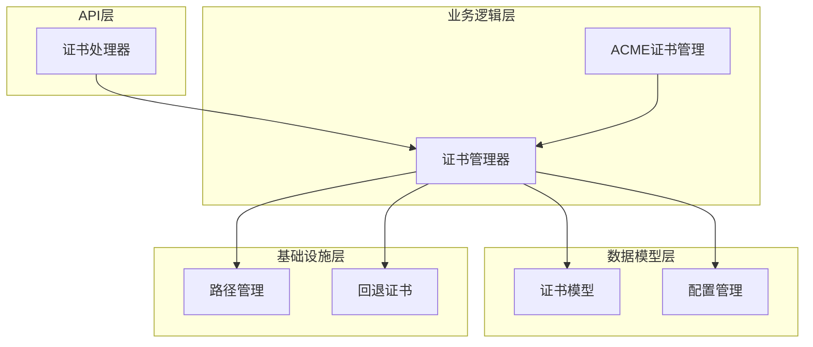
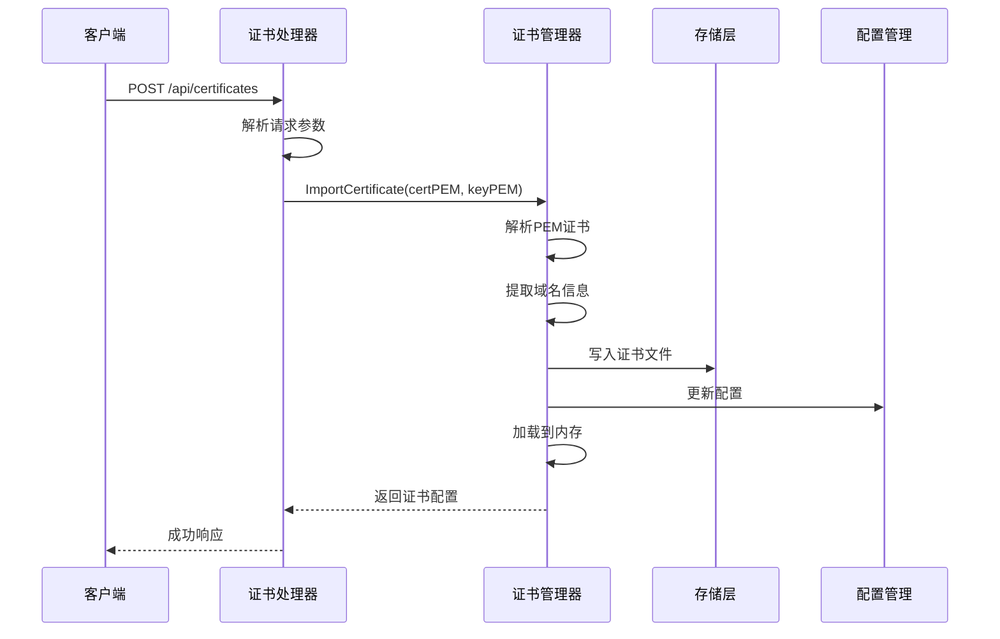
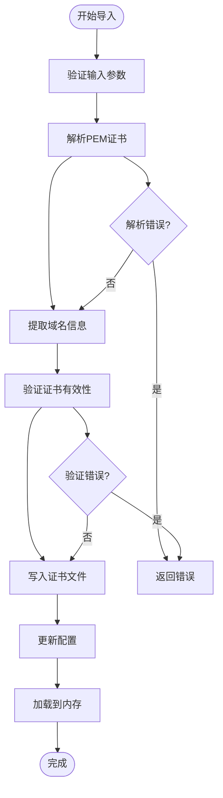
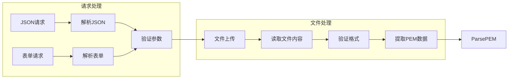
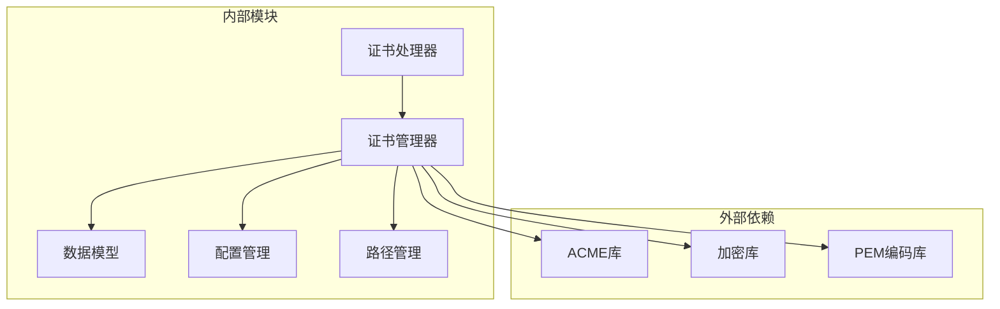

# 证书导入功能

<cite>
**本文档引用的文件**
- [src/handlers/certificates.go](file://src/handlers/certificates.go)
- [src/utils/certificate_manager.go](file://src/utils/certificate_manager.go)
- [src/models/models.go](file://src/models/models.go)
- [src/config/manager.go](file://src/config/manager.go)
- [src/config/runtime_paths.go](file://src/config/runtime_paths.go)
- [src/utils/default_fallback_certificate.go](file://src/utils/default_fallback_certificate.go)
</cite>

## 目录
1. [简介](#简介)
2. [项目结构](#项目结构)
3. [核心组件](#核心组件)
4. [架构概览](#架构概览)
5. [详细组件分析](#详细组件分析)
6. [依赖关系分析](#依赖关系分析)
7. [性能考虑](#性能考虑)
8. [故障排除指南](#故障排除指南)
9. [结论](#结论)

## 简介

本文档详细介绍了系统中的证书导入功能，重点解释了PEM格式证书和私钥文件的解析过程，包括证书链验证和域名提取机制。文档涵盖了导入流程的完整步骤：文件读取、格式验证、证书解析、存储写入和配置更新。同时分析了不同证书格式的支持情况，包括单证书、证书链和多域名证书的处理方式，并解释了导入后的证书状态管理和元数据提取，包括颁发者信息、有效期和域名列表。

## 项目结构

证书导入功能涉及以下关键模块：

**图表来源**
- [src/handlers/certificates.go:1-285](file://src/handlers/certificates.go#L1-L285)
- [src/utils/certificate_manager.go:126-151](file://src/utils/certificate_manager.go#L126-L151)
- [src/models/models.go:165-254](file://src/models/models.go#L165-L254)

**章节来源**
- [src/handlers/certificates.go:1-285](file://src/handlers/certificates.go#L1-L285)
- [src/utils/certificate_manager.go:126-151](file://src/utils/certificate_manager.go#L126-L151)
- [src/models/models.go:165-254](file://src/models/models.go#L165-L254)

## 核心组件

### 证书处理器 (Certificate Handler)

证书处理器负责接收和处理证书相关的HTTP请求，支持JSON和multipart/form-data两种请求格式。主要功能包括：

- **请求解析**：支持JSON和表单上传两种格式
- **证书导入**：处理导入证书的创建和更新请求
- **ACME证书**：处理ACME证书的申请和管理
- **安全审计**：记录所有证书操作的安全日志

### 证书管理器 (Certificate Manager)

证书管理器是核心业务逻辑组件，负责：

- **证书导入**：解析PEM格式证书和私钥
- **证书验证**：验证证书格式和有效性
- **域名提取**：从证书中提取域名信息
- **状态管理**：跟踪证书状态和生命周期
- **存储管理**：管理证书文件的持久化存储

### 数据模型 (Models)

定义了完整的证书数据结构：

- **CertificateConfig**：证书配置信息
- **CertificateSource**：证书来源类型
- **CertificateStatus**：证书状态枚举
- **CertificateDNSConfig**：DNS验证配置

**章节来源**
- [src/handlers/certificates.go:18-30](file://src/handlers/certificates.go#L18-L30)
- [src/utils/certificate_manager.go:127-133](file://src/utils/certificate_manager.go#L127-L133)
- [src/models/models.go:221-254](file://src/models/models.go#L221-L254)

## 架构概览

证书导入功能采用分层架构设计，确保职责分离和可维护性：

**图表来源**
- [src/handlers/certificates.go:55-94](file://src/handlers/certificates.go#L55-L94)
- [src/utils/certificate_manager.go:309-373](file://src/utils/certificate_manager.go#L309-L373)

## 详细组件分析

### PEM证书解析流程

证书管理器实现了完整的PEM格式解析流程：

**图表来源**
- [src/utils/certificate_manager.go:309-373](file://src/utils/certificate_manager.go#L309-L373)
- [src/utils/certificate_manager.go:962-991](file://src/utils/certificate_manager.go#L962-L991)

#### PEM格式支持

系统支持多种PEM格式的证书和私钥：

- **证书格式**：支持标准PEM格式的X.509证书
- **私钥格式**：支持PKCS#1、PKCS#8和EC私钥格式
- **证书链**：支持包含完整证书链的PEM文件
- **多域名**：支持SAN扩展的多域名证书

#### 域名提取机制

域名提取过程遵循以下规则：

1. **主域名**：从CommonName字段提取
2. **附加域名**：从DNSNames字段提取
3. **标准化**：去除空白字符和大小写转换
4. **去重**：移除重复的域名
5. **验证**：确保域名格式有效

**章节来源**
- [src/utils/certificate_manager.go:962-991](file://src/utils/certificate_manager.go#L962-L991)
- [src/utils/certificate_manager.go:1003-1020](file://src/utils/certificate_manager.go#L1003-L1020)

### 证书导入步骤详解

#### 步骤1：文件读取和格式验证

**图表来源**
- [src/handlers/certificates.go:190-235](file://src/handlers/certificates.go#L190-L235)
- [src/handlers/certificates.go:237-249](file://src/handlers/certificates.go#L237-L249)

#### 步骤2：证书解析和验证

证书解析过程包括多个验证步骤：

1. **PEM解码**：使用标准PEM解码器解析证书和私钥
2. **证书链验证**：验证证书链的完整性
3. **私钥匹配**：验证私钥与证书的匹配关系
4. **域名验证**：提取并验证域名列表

#### 步骤3：存储写入

证书文件采用严格的权限控制：

- **证书文件权限**：0600（仅所有者可读写）
- **私钥文件权限**：0600（仅所有者可读写）
- **目录权限**：0755（读写执行权限）

#### 步骤4：配置更新

配置更新包括：

- **数据库持久化**：将证书配置保存到应用配置
- **内存缓存**：更新运行时内存中的证书缓存
- **状态同步**：同步证书状态到所有相关组件

**章节来源**
- [src/handlers/certificates.go:55-94](file://src/handlers/certificates.go#L55-L94)
- [src/utils/certificate_manager.go:344-372](file://src/utils/certificate_manager.go#L344-L372)

### 不同证书格式的支持情况

系统对不同证书格式提供了全面的支持：

#### 单证书格式
- **支持**：标准的单个证书文件
- **特点**：包含完整的证书链信息
- **用途**：适用于大多数场景

#### 证书链格式
- **支持**：包含中间证书的完整链
- **特点**：确保浏览器正确验证证书链
- **用途**：生产环境推荐使用

#### 多域名证书
- **支持**：SAN扩展的多域名证书
- **特点**：支持通配符域名
- **用途**：支持多个子域的统一管理

#### 私钥格式兼容性

系统支持多种私钥格式：

| 私钥格式 | 支持情况 | 说明 |
|---------|---------|------|
| PKCS#1 RSA | ✅ 完全支持 | 标准RSA私钥格式 |
| PKCS#8 | ✅ 完全支持 | 标准私钥容器格式 |
| ECDSA | ✅ 完全支持 | 椭圆曲线私钥 |
| PKCS#1 EC | ❌ 不支持 | 椭圆曲线PKCS#1格式 |

**章节来源**
- [src/utils/certificate_manager.go:919-935](file://src/utils/certificate_manager.go#L919-L935)
- [src/utils/certificate_manager.go:962-991](file://src/utils/certificate_manager.go#L962-L991)

### 证书状态管理和元数据提取

#### 状态管理

证书状态管理系统包括：

- **Pending**：证书导入完成但尚未验证
- **Valid**：证书验证通过且有效
- **Renewing**：证书正在续期过程中
- **Error**：证书处理出现错误
- **Expired**：证书已过期

#### 元数据提取

系统从证书中提取的关键元数据：

- **颁发者信息**：从Issuer字段提取
- **有效期**：从NotBefore和NotAfter提取
- **域名列表**：从CommonName和DNSNames提取
- **序列号**：从SerialNumber提取
- **签名算法**：从SignatureAlgorithm提取

**章节来源**
- [src/utils/certificate_manager.go:954-960](file://src/utils/certificate_manager.go#L954-L960)
- [src/utils/certificate_manager.go:977-990](file://src/utils/certificate_manager.go#L977-L990)

### ACME证书与导入证书的区别

#### 自动续签功能差异

| 特性 | ACME证书 | 导入证书 |
|------|----------|----------|
| 自动续签 | ✅ 支持 | ❌ 不支持 |
| 证书状态 | ✅ 动态更新 | ❌ 静态状态 |
| 续期策略 | ✅ 可配置 | ❌ 需手动更新 |
| DNS验证 | ✅ 支持 | ❌ 不适用 |
| HTTP验证 | ✅ 支持 | ❌ 不适用 |

#### 限制说明

导入证书的自动续签功能被禁用的原因：

1. **无ACME账户**：导入证书没有关联的ACME账户
2. **无DNS配置**：导入证书缺少DNS提供商配置
3. **无自动验证**：导入证书无法进行自动域名验证
4. **手动管理**：需要手动监控和更新证书

**章节来源**
- [src/utils/certificate_manager.go:309-314](file://src/utils/certificate_manager.go#L309-L314)
- [src/utils/certificate_manager.go:197-216](file://src/utils/certificate_manager.go#L197-L216)

## 依赖关系分析

证书导入功能的依赖关系如下：

**图表来源**
- [src/utils/certificate_manager.go:3-37](file://src/utils/certificate_manager.go#L3-L37)
- [src/handlers/certificates.go:3-16](file://src/handlers/certificates.go#L3-L16)

### 关键依赖关系

1. **ACME库依赖**：用于ACME证书的申请和管理
2. **加密库依赖**：用于证书和私钥的解析和验证
3. **配置管理依赖**：用于证书配置的持久化存储
4. **路径管理依赖**：用于证书文件的路径解析和管理

**章节来源**
- [src/utils/certificate_manager.go:3-37](file://src/utils/certificate_manager.go#L3-L37)
- [src/config/manager.go:18-21](file://src/config/manager.go#L18-L21)

## 性能考虑

### 内存管理

- **证书缓存**：运行时内存中缓存已加载的证书
- **内存限制**：避免加载过多证书导致内存溢出
- **垃圾回收**：定期清理不再使用的证书引用

### 文件系统优化

- **批量写入**：减少文件系统的I/O操作
- **权限设置**：确保文件权限正确设置
- **目录结构**：合理的目录组织提高访问效率

### 并发处理

- **读写锁**：使用读写锁保护并发访问
- **异步处理**：长耗时操作采用异步处理
- **超时控制**：防止长时间阻塞操作

## 故障排除指南

### 常见错误类型

#### PEM格式错误

**症状**：
- 证书解析失败
- 私钥格式不支持

**解决方案**：
1. 验证PEM文件格式正确性
2. 确认私钥与证书匹配
3. 检查文件编码格式

#### 域名验证失败

**症状**：
- 域名提取为空
- 证书无效

**解决方案**：
1. 检查证书是否包含有效的域名信息
2. 验证域名格式正确性
3. 确认域名未被过滤

#### 文件权限问题

**症状**：
- 证书文件写入失败
- 权限不足

**解决方案**：
1. 检查目标目录权限
2. 确保有足够的磁盘空间
3. 验证文件系统权限设置

### 调试建议

1. **启用详细日志**：查看证书处理过程的详细信息
2. **验证配置**：检查证书配置的正确性
3. **测试连接**：验证证书与私钥的匹配关系
4. **监控状态**：观察证书状态的变化

**章节来源**
- [src/utils/certificate_manager.go:327-330](file://src/utils/certificate_manager.go#L327-L330)
- [src/utils/certificate_manager.go:920-935](file://src/utils/certificate_manager.go#L920-L935)

## 结论

证书导入功能提供了完整的PEM格式证书处理能力，包括格式解析、域名提取、状态管理和持久化存储。系统支持多种证书格式和私钥格式，能够处理复杂的证书链和多域名场景。虽然导入证书不支持自动续签功能，但提供了灵活的手动管理方式。

通过合理的架构设计和严格的错误处理机制，该功能确保了证书导入过程的可靠性和安全性。建议在生产环境中遵循最佳实践，包括正确的文件权限设置、路径配置和错误处理策略。