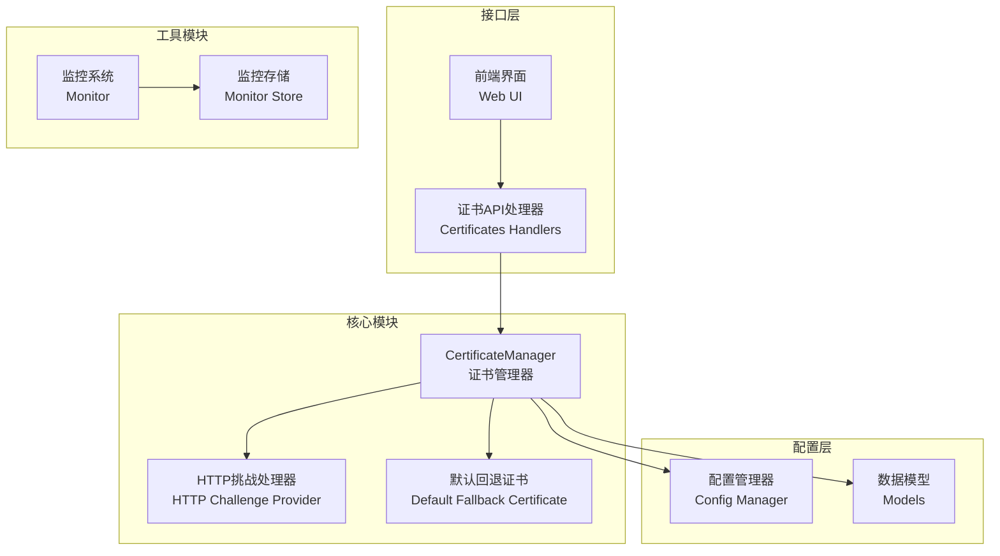
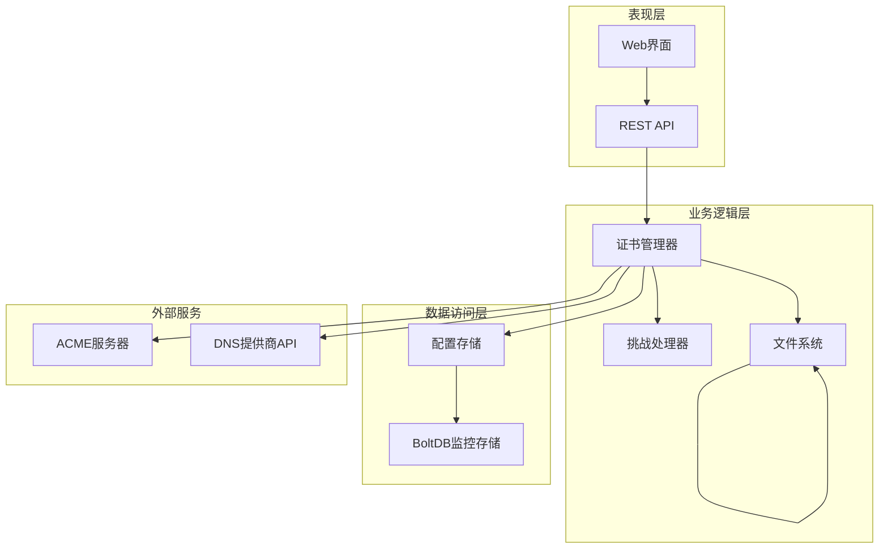
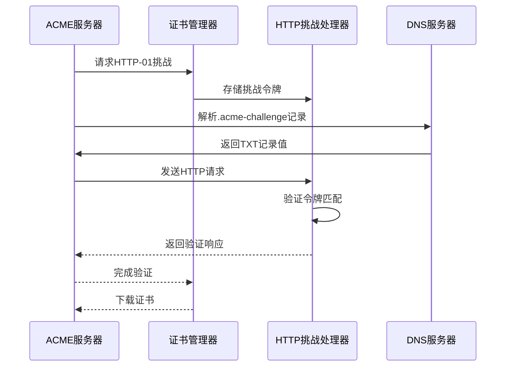
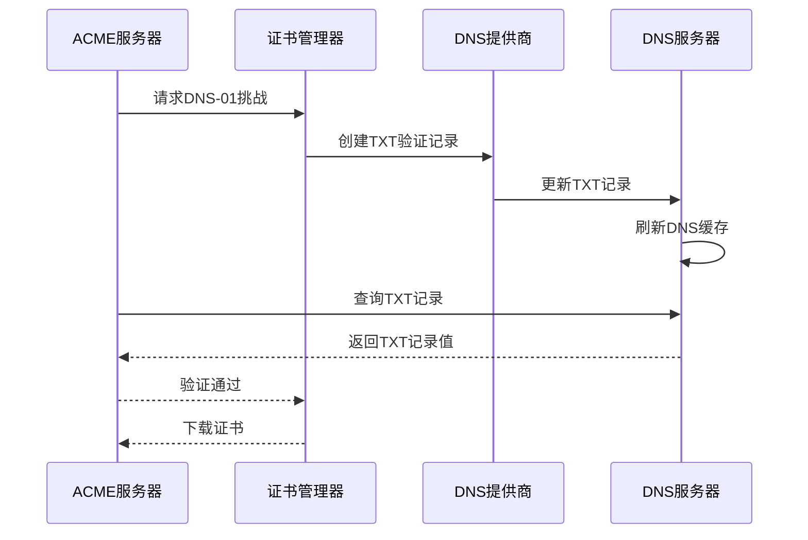
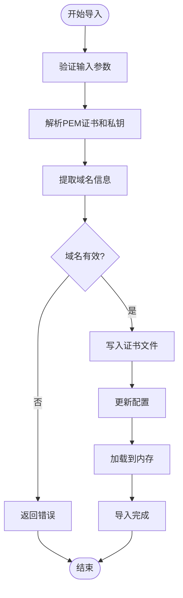
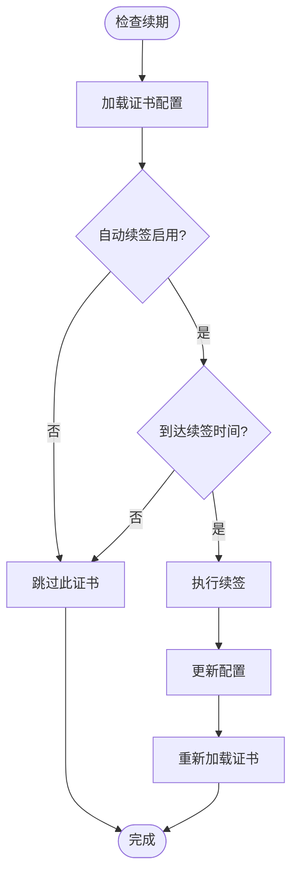
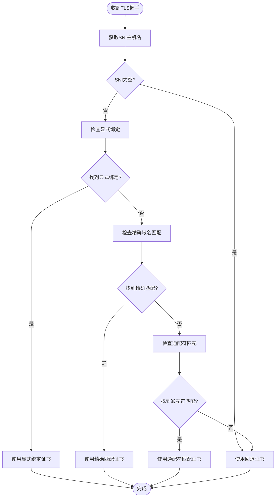
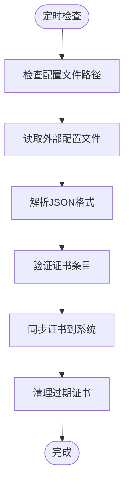

# 证书管理系统

<cite>
**本文档引用的文件**
- [certificate_manager.go](file://src/utils/certificate_manager.go)
- [certificates.go](file://src/handlers/certificates.go)
- [default_fallback_certificate.go](file://src/utils/default_fallback_certificate.go)
- [models.go](file://src/models/models.go)
- [manager.go](file://src/config/manager.go)
- [monitor.go](file://src/utils/monitor.go)
- [monitor_store.go](file://src/utils/monitor_store.go)
- [certificate_manager_test.go](file://src/utils/certificate_manager_test.go)
- [app.js](file://src/static/app.js)
</cite>

## 目录
1. [简介](#简介)
2. [项目结构](#项目结构)
3. [核心组件](#核心组件)
4. [架构概览](#架构概览)
5. [详细组件分析](#详细组件分析)
6. [依赖关系分析](#依赖关系分析)
7. [性能考量](#性能考量)
8. [故障排除指南](#故障排除指南)
9. [结论](#结论)
10. [附录](#附录)

## 简介

Caddy Panel 的证书管理系统是一个完整的自动化证书生命周期管理解决方案，集成了 ACME 协议自动申请、证书导入、自动续签和动态证书选择等功能。该系统支持多种验证方式，包括 HTTP-01 和 DNS-01 验证，并提供了与多个主流 DNS 服务提供商的集成能力。

系统的核心特性包括：
- 自动化的 ACME 证书申请和续签
- 支持 PEM 格式的证书导入和证书链处理
- 动态证书选择算法，支持精确匹配和通配符匹配
- 外部配置文件同步功能
- 完整的证书状态管理和错误处理
- 内置回退证书机制

## 项目结构

证书管理系统主要分布在以下模块中：



**图表来源**
- [certificate_manager.go:126-151](file://src/utils/certificate_manager.go#L126-L151)
- [certificates.go:32-94](file://src/handlers/certificates.go#L32-L94)
- [models.go:165-254](file://src/models/models.go#L165-L254)

**章节来源**
- [certificate_manager.go:1-1288](file://src/utils/certificate_manager.go#L1-L1288)
- [certificates.go:1-285](file://src/handlers/certificates.go#L1-L285)
- [models.go:1-394](file://src/models/models.go#L1-L394)

## 核心组件

### 证书管理器 (CertificateManager)

证书管理器是整个系统的核心组件，负责证书的全生命周期管理。它实现了以下关键功能：

- **证书申请和续签**：通过 ACME 协议自动申请 SSL/TLS 证书
- **证书导入**：支持 PEM 格式的证书和私钥导入
- **动态证书选择**：根据 SNI 主机名动态选择匹配的证书
- **自动续签**：定期检查证书到期时间并自动续签
- **外部配置同步**：监控外部证书配置文件的变化

### HTTP-01 挑战处理器

系统内置了一个内存中的 HTTP-01 挑战处理器，用于处理 ACME 服务器的 HTTP-01 验证请求：

- **内存存储**：使用线程安全的内存映射存储挑战令牌
- **自动清理**：在验证完成后自动清理过期的挑战记录
- **并发安全**：支持高并发的挑战验证请求

### 默认回退证书

系统提供了内置的默认回退证书，确保在没有找到匹配证书时仍能正常提供 HTTPS 服务：

- **嵌入式证书**：包含预生成的自签名证书和私钥
- **自动降级**：当找不到匹配证书时自动使用回退证书
- **安全保证**：即使在证书配置错误的情况下也能保持服务可用性

**章节来源**
- [certificate_manager.go:126-151](file://src/utils/certificate_manager.go#L126-L151)
- [certificate_manager.go:94-124](file://src/utils/certificate_manager.go#L94-L124)
- [default_fallback_certificate.go:1-55](file://src/utils/default_fallback_certificate.go#L1-L55)

## 架构概览

证书管理系统采用分层架构设计，各层职责明确，耦合度低：



**图表来源**
- [certificate_manager.go:797-838](file://src/utils/certificate_manager.go#L797-L838)
- [certificates.go:55-94](file://src/handlers/certificates.go#L55-L94)
- [monitor_store.go:30-54](file://src/utils/monitor_store.go#L30-L54)

## 详细组件分析

### ACME 自动申请流程

系统实现了完整的 ACME 协议支持，包括两种验证方式：

#### HTTP-01 验证流程



**图表来源**
- [certificate_manager.go:253-269](file://src/utils/certificate_manager.go#L253-L269)
- [certificate_manager.go:105-117](file://src/utils/certificate_manager.go#L105-L117)

#### DNS-01 验证流程



**图表来源**
- [certificate_manager.go:840-853](file://src/utils/certificate_manager.go#L840-L853)
- [certificate_manager.go:855-882](file://src/utils/certificate_manager.go#L855-L882)

#### 支持的DNS提供商

系统集成了三个主流 DNS 服务提供商：

| 服务商 | 支持的认证方式 | 配置参数 |
|--------|----------------|----------|
| 腾讯云 | SecretID/SecretKey | SecretID, SecretKey, SessionToken, Region |
| 阿里云 | AccessKey/SecretKey | AccessKey, SecretKey, SecurityToken, RegionID, RAMRole |
| Cloudflare | API Token | DNS API Token, Zone Token, Email |

**章节来源**
- [certificate_manager.go:855-882](file://src/utils/certificate_manager.go#L855-L882)
- [models.go:202-219](file://src/models/models.go#L202-L219)

### 证书导入功能

系统支持从 PEM 格式文件导入现有证书：

#### 导入流程



**图表来源**
- [certificate_manager.go:308-373](file://src/utils/certificate_manager.go#L308-L373)

#### PEM 格式支持

系统支持多种 PEM 格式的证书和私钥：

- **证书格式**：支持标准的 PEM 格式证书文件
- **私钥格式**：支持 PKCS#1、PKCS#8 和 ECDSA 私钥格式
- **证书链处理**：自动处理完整的证书链，包括中间证书

**章节来源**
- [certificate_manager.go:962-991](file://src/utils/certificate_manager.go#L962-L991)
- [certificate_manager.go:919-940](file://src/utils/certificate_manager.go#L919-L940)

### 自动续期机制

系统实现了智能的自动续期机制：

#### 续期策略



**图表来源**
- [certificate_manager.go:192-216](file://src/utils/certificate_manager.go#L192-L216)

#### 续签配置选项

- **续签间隔**：可配置的续签提前天数（默认30天）
- **续签频率**：基于配置文件的同步间隔进行检查
- **错误处理**：续签失败时记录错误状态但不影响服务运行

**章节来源**
- [certificate_manager.go:184-190](file://src/utils/certificate_manager.go#L184-L190)
- [manager.go:48-50](file://src/config/manager.go#L48-L50)

### 动态证书选择算法

系统实现了复杂的证书选择算法，支持多种匹配策略：

#### 证书选择流程



**图表来源**
- [certificate_manager.go:271-306](file://src/utils/certificate_manager.go#L271-L306)
- [certificate_manager.go:1022-1057](file://src/utils/certificate_manager.go#L1022-L1057)

#### 匹配算法细节

系统支持三种匹配级别：

1. **显式绑定**：服务配置中直接指定的证书ID
2. **精确匹配**：完全相同的域名匹配
3. **通配符匹配**：支持 `*.example.com` 格式的通配符证书

**章节来源**
- [certificate_manager.go:1059-1097](file://src/utils/certificate_manager.go#L1059-L1097)
- [certificate_manager.go:1222-1243](file://src/utils/certificate_manager.go#L1222-L1243)

### DNS 提供商集成指南

系统提供了完整的 DNS 服务提供商集成：

#### 腾讯云配置

```javascript
// 腾讯云 DNS 配置示例
{
  "tencent_secret_id": "your_secret_id",
  "tencent_secret_key": "your_secret_key", 
  "tencent_session_token": "optional_session_token",
  "tencent_region": "ap-guangzhou"
}
```

#### 阿里云配置

```javascript
// 阿里云 DNS 配置示例  
{
  "ali_access_key": "your_access_key",
  "ali_secret_key": "your_secret_key",
  "ali_security_token": "optional_sts_token",
  "ali_region_id": "cn-hangzhou",
  "ali_ram_role": "optional_ram_role"
}
```

#### Cloudflare 配置

```javascript
// Cloudflare DNS 配置示例
{
  "cloudflare_dns_api_token": "your_dns_api_token",
  "cloudflare_zone_token": "optional_zone_token",
  "cloudflare_email": "your_email"
}
```

**章节来源**
- [models.go:202-219](file://src/models/models.go#L202-L219)
- [app.js:2071-2303](file://src/static/app.js#L2071-L2303)

### 证书同步功能

系统支持外部证书配置文件的实时同步：

#### 同步机制



**图表来源**
- [certificate_manager.go:595-629](file://src/utils/certificate_manager.go#L595-L629)

#### 配置文件格式

外部配置文件采用 JSON 格式，每个证书条目包含：

```json
[
  {
    "host": "example.com",
    "cert": "/path/to/certificate.pem",
    "key": "/path/to/private.key"
  }
]
```

**章节来源**
- [certificate_manager.go:648-659](file://src/utils/certificate_manager.go#L648-L659)
- [certificate_manager.go:666-746](file://src/utils/certificate_manager.go#L666-L746)

## 依赖关系分析

证书管理系统的主要依赖关系如下：

```mermaid
graph TB
subgraph "外部依赖"
LEGO[go-acme/lego v4]
ETCD[bolt (go.etcd.io/bbolt)]
GOPSUTIL[github.com/shirou/gopsutil]
end
subgraph "内部模块"
CM[CertificateManager]
CFG[Config Manager]
MODELS[Data Models]
HANDLERS[HTTP Handlers]
end
CM --> LEGO
CM --> MODELS
CM --> CFG
HANDLERS --> CM
HANDLERS --> MODELS
CFG --> MODELS
CFG --> ETCD
```

**图表来源**
- [certificate_manager.go:30-37](file://src/utils/certificate_manager.go#L30-L37)
- [monitor_store.go:13](file://src/utils/monitor_store.go#L13)

### 关键依赖说明

- **go-acme/lego v4**：提供 ACME 协议实现和 DNS 提供商集成
- **bolt**：轻量级数据库，用于存储监控数据
- **gopsutil**：系统信息收集，用于网络监控

**章节来源**
- [certificate_manager.go:30-37](file://src/utils/certificate_manager.go#L30-L37)
- [monitor_store.go:13](file://src/utils/monitor_store.go#L13)

## 性能考量

### 内存优化

- **证书缓存**：所有已加载的证书都缓存在内存中，避免重复读取
- **线程安全**：使用读写锁确保并发访问的安全性
- **延迟初始化**：证书管理器采用单例模式，避免重复创建

### I/O 优化

- **批量操作**：支持批量证书导入和更新操作
- **异步处理**：自动续签和配置同步采用异步方式
- **文件系统优化**：证书文件采用 0600 权限，确保安全性

### 网络优化

- **HTTP-01 缓存**：挑战令牌存储在内存中，避免磁盘 I/O
- **DNS 查询缓存**：DNS 提供商查询结果进行缓存
- **连接复用**：ACME 服务器连接进行复用

## 故障排除指南

### 常见问题及解决方案

#### ACME 申请失败

**症状**：证书申请过程中出现错误

**可能原因**：
- DNS 验证记录未生效
- HTTP-01 挑战文件未正确放置
- ACME 服务器连接超时

**解决步骤**：
1. 检查 DNS 提供商的 API 凭证配置
2. 验证 HTTP-01 挑战文件是否可达
3. 检查防火墙和网络连接
4. 查看系统日志获取详细错误信息

#### 证书不匹配

**症状**：浏览器显示证书不匹配警告

**可能原因**：
- SNI 主机名与证书域名不匹配
- 通配符证书匹配规则不正确
- 证书链不完整

**解决步骤**：
1. 检查服务配置中的域名设置
2. 验证证书包含的域名列表
3. 确认证书链的完整性
4. 测试证书选择算法

#### 自动续签失败

**症状**：证书到期但未自动续签

**可能原因**：
- 续签时间配置错误
- DNS 提供商凭证失效
- 文件权限问题

**解决步骤**：
1. 检查续签配置参数
2. 验证 DNS 提供商凭证
3. 检查证书文件权限
4. 手动触发续签测试

**章节来源**
- [certificate_manager.go:212-215](file://src/utils/certificate_manager.go#L212-L215)
- [certificates.go:136-149](file://src/handlers/certificates.go#L136-L149)

## 结论

Caddy Panel 的证书管理系统是一个功能完整、架构清晰的自动化证书管理解决方案。系统通过集成 ACME 协议、支持多种验证方式、提供智能的证书选择算法和完善的错误处理机制，为用户提供了可靠的 SSL/TLS 证书管理体验。

主要优势包括：
- **自动化程度高**：从申请到续签全程自动化
- **扩展性强**：支持多种 DNS 提供商和验证方式
- **可靠性高**：内置回退证书和完善的错误处理
- **易用性好**：提供直观的 Web 界面和 API 接口

## 附录

### 配置示例

#### 基本配置

```json
{
  "global": {
    "certificate_config_path": "/usr/trim/etc/network_gateway_cert.conf",
    "certificate_sync_interval_seconds": 3600
  },
  "certs": [
    {
      "id": "cert-1640995200000000000",
      "name": "example.com",
      "domains": ["example.com", "*.example.com"],
      "source": "acme",
      "challenge_type": "dns01",
      "dns_provider": "cloudflare",
      "auto_renew": true,
      "renew_before_days": 30,
      "cert_path": "certs/managed/cert-1640995200000000000.crt",
      "key_path": "certs/managed/cert-1640995200000000000.key"
    }
  ]
}
```

### 最佳实践建议

1. **备份策略**：定期备份证书和私钥文件
2. **监控告警**：设置证书到期提醒和续签失败告警
3. **权限控制**：严格控制证书文件的访问权限
4. **测试验证**：定期测试证书选择算法和回退机制
5. **日志审计**：启用详细的证书管理日志记录