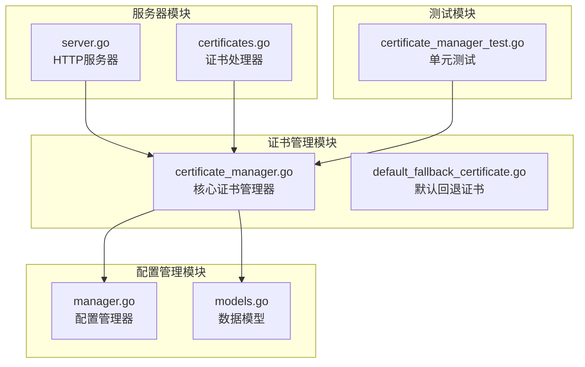
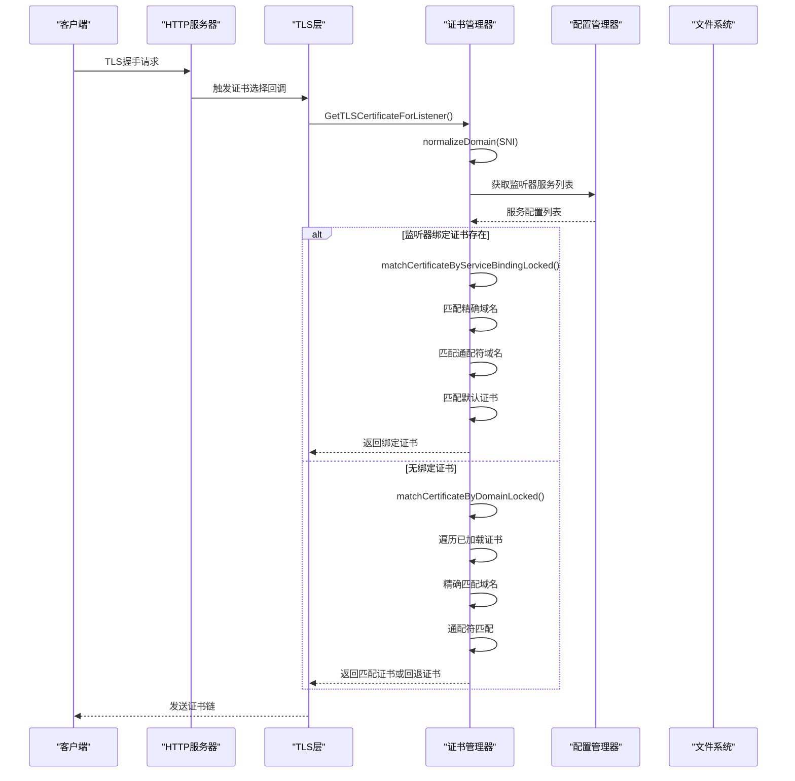
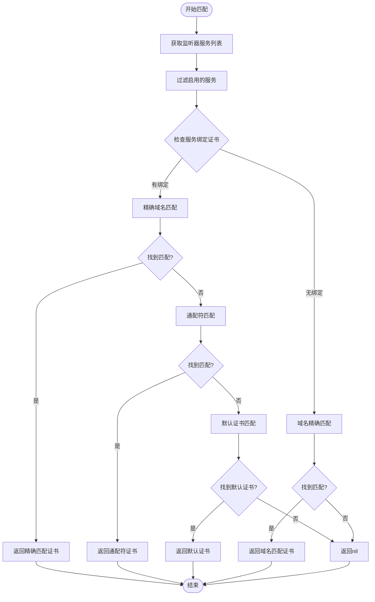
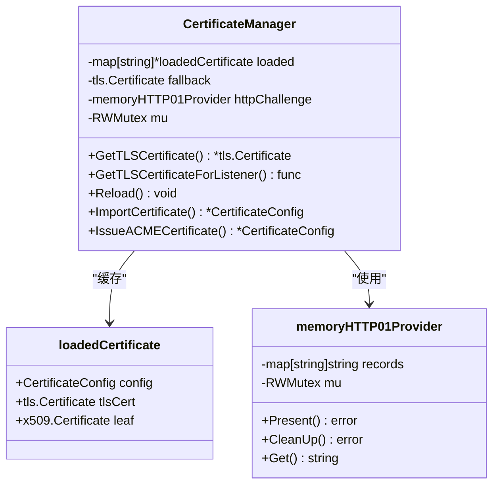
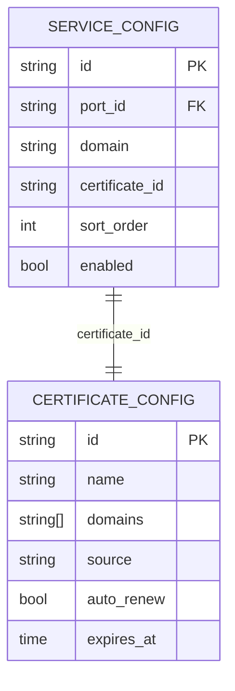
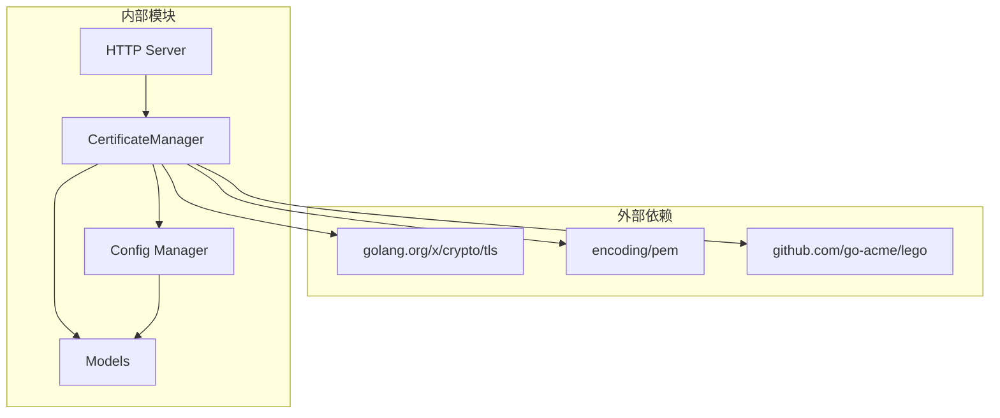

# 证书选择算法

<cite>
**本文档引用的文件**
- [certificate_manager.go](file://src/utils/certificate_manager.go)
- [default_fallback_certificate.go](file://src/utils/default_fallback_certificate.go)
- [models.go](file://src/models/models.go)
- [manager.go](file://src/config/manager.go)
- [server.go](file://src/fnproxy/server.go)
- [certificates.go](file://src/handlers/certificates.go)
- [certificate_manager_test.go](file://src/utils/certificate_manager_test.go)
</cite>

## 目录
1. [简介](#简介)
2. [项目结构](#项目结构)
3. [核心组件](#核心组件)
4. [架构概览](#架构概览)
5. [详细组件分析](#详细组件分析)
6. [依赖关系分析](#依赖关系分析)
7. [性能考虑](#性能考虑)
8. [故障排除指南](#故障排除指南)
9. [结论](#结论)

## 简介

本文档详细阐述了 Caddy Panel 中的证书选择算法，这是一个在 TLS 握手过程中根据 SNI（Server Name Indication）进行证书匹配的完整系统。该算法实现了严格的优先级顺序：监听器绑定证书 > 域名精确匹配 > 默认回退证书，并提供了完整的域名匹配算法，包括通配符匹配、子域名处理和大小写不敏感规则。

## 项目结构

该项目采用模块化设计，证书管理系统位于 `src/utils/` 目录下，主要包含以下关键文件：

**图表来源**
- [certificate_manager.go:1-1288](file://src/utils/certificate_manager.go#L1-L1288)
- [manager.go:1-791](file://src/config/manager.go#L1-L791)

**章节来源**
- [certificate_manager.go:1-1288](file://src/utils/certificate_manager.go#L1-L1288)
- [manager.go:1-791](file://src/config/manager.go#L1-L791)

## 核心组件

### 证书管理器 (CertificateManager)

证书管理器是整个证书选择算法的核心组件，负责：

- **内存证书缓存**：使用 `sync.RWMutex` 实现线程安全的证书缓存
- **证书加载**：从文件系统加载证书并对元数据进行解析
- **证书匹配**：实现复杂的域名匹配算法
- **回退机制**：提供默认的回退证书确保连接安全性

### 证书选择算法

算法实现了三层优先级匹配：

1. **监听器绑定证书**：优先匹配服务显式绑定的证书
2. **域名精确匹配**：匹配完全相同的域名
3. **通配符匹配**：匹配通配符证书
4. **默认回退证书**：最后使用内置的回退证书

**章节来源**
- [certificate_manager.go:127-151](file://src/utils/certificate_manager.go#L127-L151)
- [certificate_manager.go:271-306](file://src/utils/certificate_manager.go#L271-L306)

## 架构概览

**图表来源**
- [server.go:335-338](file://src/fnproxy/server.go#L335-L338)
- [certificate_manager.go:287-306](file://src/utils/certificate_manager.go#L287-L306)
- [certificate_manager.go:1022-1057](file://src/utils/certificate_manager.go#L1022-L1057)

## 详细组件分析

### 证书选择算法实现

#### 监听器绑定证书匹配

**图表来源**
- [certificate_manager.go:1022-1057](file://src/utils/certificate_manager.go#L1022-L1057)

#### 域名匹配算法

域名匹配算法实现了严格的规则：

1. **大小写不敏感**：所有域名都转换为小写进行比较
2. **空白字符处理**：去除首尾空白字符
3. **通配符规则**：仅支持单层通配符匹配（*.example.com）
4. **标签数量验证**：确保通配符匹配的标签数量正确

**章节来源**
- [certificate_manager.go:1218-1243](file://src/utils/certificate_manager.go#L1218-L1243)

### 内存缓存机制

证书管理器使用内存缓存来提高性能：

**图表来源**
- [certificate_manager.go:88-133](file://src/utils/certificate_manager.go#L88-L133)
- [certificate_manager.go:94-124](file://src/utils/certificate_manager.go#L94-L124)

### 并发访问控制

系统使用读写锁 (`sync.RWMutex`) 实现高效的并发控制：

- **读操作**：多个 goroutine 可以同时读取证书缓存
- **写操作**：证书重新加载时独占访问
- **HTTP-01挑战**：独立的内存提供者使用互斥锁保护

**章节来源**
- [certificate_manager.go:127-133](file://src/utils/certificate_manager.go#L127-L133)
- [certificate_manager.go:94-124](file://src/utils/certificate_manager.go#L94-L124)

### 证书绑定配置

服务配置支持显式证书绑定：

**图表来源**
- [models.go:94-107](file://src/models/models.go#L94-L107)
- [models.go:222-254](file://src/models/models.go#L222-L254)

**章节来源**
- [models.go:94-107](file://src/models/models.go#L94-L107)
- [models.go:222-254](file://src/models/models.go#L222-L254)

### 证书选择失败处理

当证书选择失败时，系统采用渐进式的回退策略：

1. **监听器绑定失败**：尝试域名精确匹配
2. **域名匹配失败**：尝试通配符匹配
3. **所有匹配失败**：使用内置回退证书
4. **日志记录**：记录详细的错误信息

**章节来源**
- [certificate_manager.go:271-306](file://src/utils/certificate_manager.go#L271-L306)
- [certificate_manager.go:1245-1283](file://src/utils/certificate_manager.go#L1245-L1283)

## 依赖关系分析

**图表来源**
- [certificate_manager.go:3-37](file://src/utils/certificate_manager.go#L3-L37)
- [server.go:335-338](file://src/fnproxy/server.go#L335-L338)

**章节来源**
- [certificate_manager.go:3-37](file://src/utils/certificate_manager.go#L3-L37)
- [server.go:335-338](file://src/fnproxy/server.go#L335-L338)

## 性能考虑

### 缓存策略

- **内存缓存**：所有证书都缓存在内存中，避免重复磁盘 I/O
- **只读锁**：读操作使用 RWMutex 的读锁，允许多个并发读取
- **批量加载**：支持批量证书加载和重新加载

### 匹配算法优化

- **早期退出**：找到精确匹配后立即返回
- **通配符优先**：通配符匹配作为备选方案
- **标签计数**：通过标签数量快速排除无效匹配

### 内存管理

- **证书元数据**：缓存证书的元数据以避免重复解析
- **域名规范化**：预处理域名以减少重复计算
- **自动清理**：支持证书过期检测和自动清理

## 故障排除指南

### 常见问题及解决方案

1. **证书选择失败**
   - 检查服务是否正确绑定了证书
   - 验证域名是否在证书的 SAN 列表中
   - 确认证书是否已过期

2. **通配符证书不生效**
   - 确认通配符格式正确（*.example.com）
   - 检查通配符证书的实际域名包含情况
   - 验证子域名层级是否正确

3. **并发访问问题**
   - 确保使用最新的证书管理器实例
   - 避免在证书重新加载期间进行并发操作

**章节来源**
- [certificate_manager_test.go:16-40](file://src/utils/certificate_manager_test.go#L16-L40)

### 日志记录

系统会在以下情况下记录日志：
- 证书加载失败
- 证书续期失败
- 证书选择算法执行过程
- 外部证书配置同步状态

## 结论

Caddy Panel 的证书选择算法设计精良，实现了完整的 TLS 证书匹配流程。通过三层优先级匹配、智能的域名处理算法和高效的内存缓存机制，系统能够在保证安全性的同时提供高性能的证书选择服务。算法的可扩展性设计使得未来可以轻松添加新的匹配规则和证书来源支持。

该实现为类似场景提供了优秀的参考模板，特别是在需要处理复杂证书管理和域名匹配的生产环境中。