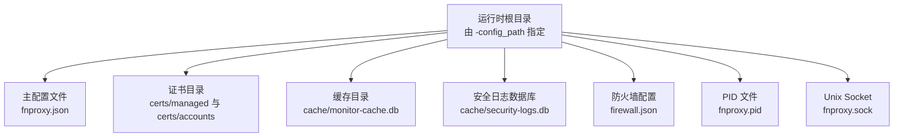
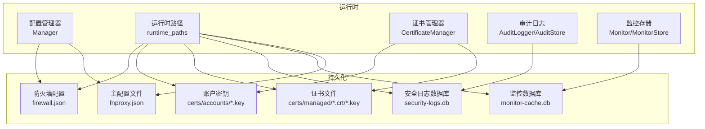
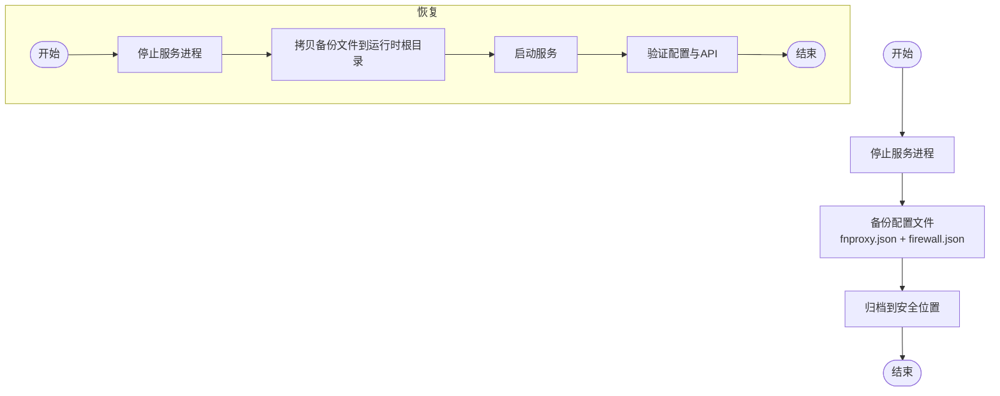
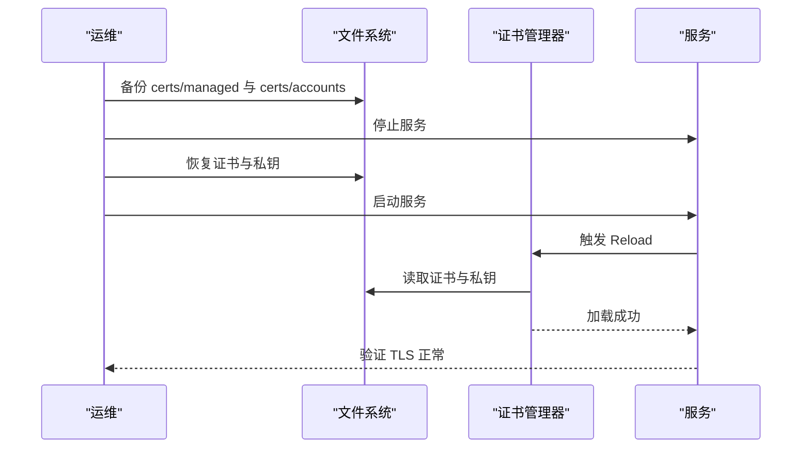
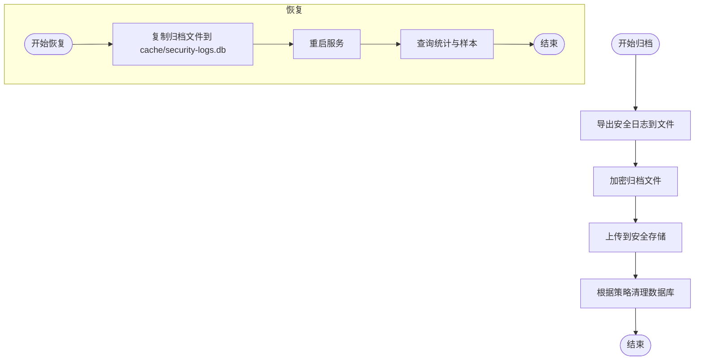
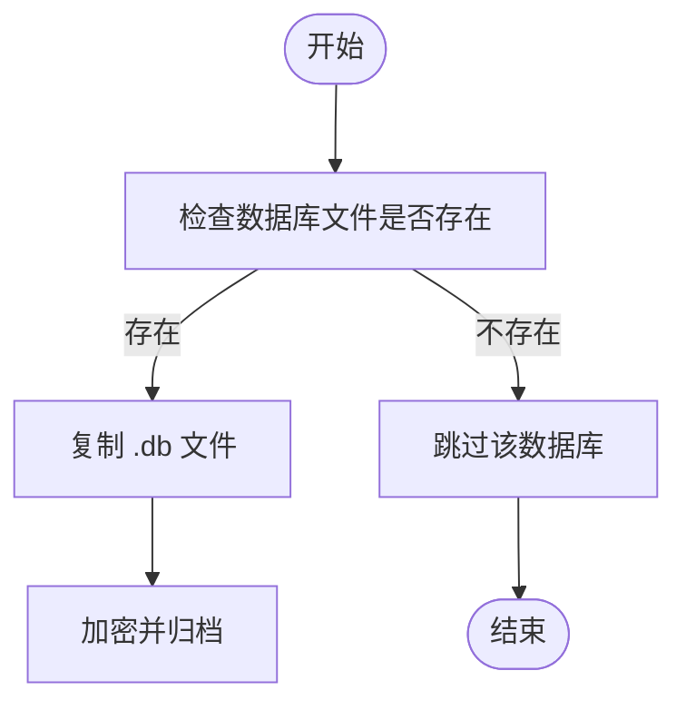
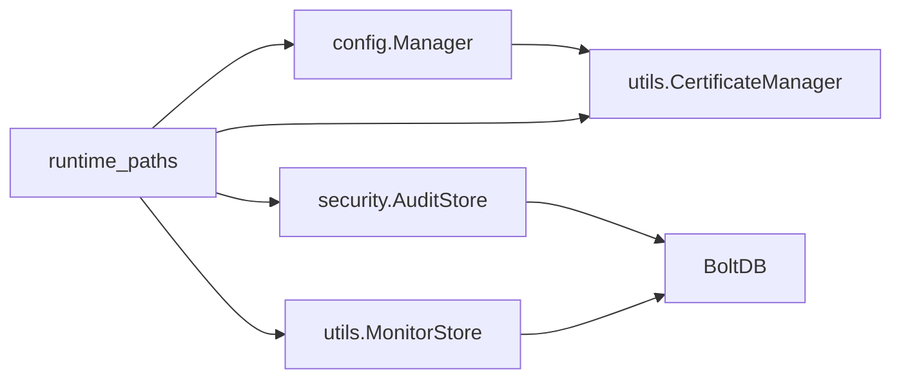

# 备份与恢复

<cite>
**本文引用的文件**
- [src/main.go](file://src/main.go)
- [src/config/manager.go](file://src/config/manager.go)
- [src/config/runtime_paths.go](file://src/config/runtime_paths.go)
- [src/utils/certificate_manager.go](file://src/utils/certificate_manager.go)
- [src/security/audit_log.go](file://src/security/audit_log.go)
- [src/security/audit_store.go](file://src/security/audit_store.go)
- [src/utils/monitor_store.go](file://src/utils/monitor_store.go)
- [src/utils/monitor.go](file://src/utils/monitor.go)
- [src/models/models.go](file://src/models/models.go)
- [README.md](file://README.md)
</cite>

## 目录
1. [简介](#简介)
2. [项目结构](#项目结构)
3. [核心组件](#核心组件)
4. [架构总览](#架构总览)
5. [详细组件分析](#详细组件分析)
6. [依赖分析](#依赖分析)
7. [性能考虑](#性能考虑)
8. [故障排查指南](#故障排查指南)
9. [结论](#结论)
10. [附录](#附录)

## 简介
本文件面向运维与平台管理员，提供 Caddy Panel 的系统化备份与恢复策略文档。重点覆盖以下方面：
- 配置文件的备份与恢复：主配置文件、防火墙配置文件、运行时路径与权限。
- 证书数据的备份与恢复：ACME 证书与账户密钥、导入证书与私钥、外部配置同步证书。
- 审计日志的归档与备份：基于 BoltDB 的安全日志存储与清理策略。
- 数据库文件（BoltDB）的备份策略与恢复流程：监控日志与安全日志数据库。
- 灾难恢复计划：数据恢复、服务重建、业务连续性保障。
- 自动化备份脚本与定期备份任务配置建议。
- 备份数据的加密与安全传输。
- 恢复测试与验证流程。

## 项目结构
围绕备份与恢复的关键目录与文件如下：
- 运行时根目录：由启动参数 -config_path 指定，统一存放配置、缓存、证书、PID、Unix Socket。
- 主配置文件：fnproxy.json，保存全局配置、监听器、服务、证书、用户、SSH、防火墙等。
- 证书目录：
  - managed：由系统管理的证书与私钥（含 ACME 账户密钥）。
  - accounts：ACME 账户密钥存储。
- 安全日志数据库：security-logs.db（BoltDB），记录 OAuth 登录、代理错误、SSH 连接、系统操作等。
- 监控日志数据库：monitor-cache.db（BoltDB），记录网络采样与访问日志。
- 防火墙配置：firewall.json，独立 JSON 文件。

图示来源
- [src/config/runtime_paths.go:85-115](file://src/config/runtime_paths.go#L85-L115)
- [README.md:156-166](file://README.md#L156-L166)

章节来源
- [src/config/runtime_paths.go:12-115](file://src/config/runtime_paths.go#L12-L115)
- [README.md:156-166](file://README.md#L156-L166)

## 核心组件
- 配置管理器（Manager）：负责主配置文件的加载、规范化与持久化，提供并发安全的读写接口。
- 运行时路径工具：统一解析与生成运行时文件路径，确保备份范围完整。
- 证书管理器（CertificateManager）：负责 ACME 证书申请/续期、导入证书、外部配置同步证书、内存缓存与落盘。
- 审计日志（AuditLogger/AuditStore）：基于 BoltDB 的安全日志存储，支持查询、清理与统计。
- 监控存储（MonitorStore/Monitor）：基于 BoltDB 的访问日志与网络采样存储，支持保留期与条数限制。
- 模型（models）：定义配置、证书、日志、防火墙等数据结构。

章节来源
- [src/config/manager.go:35-107](file://src/config/manager.go#L35-L107)
- [src/config/runtime_paths.go:85-115](file://src/config/runtime_paths.go#L85-L115)
- [src/utils/certificate_manager.go:126-151](file://src/utils/certificate_manager.go#L126-L151)
- [src/security/audit_log.go:25-51](file://src/security/audit_log.go#L25-L51)
- [src/security/audit_store.go:22-44](file://src/security/audit_store.go#L22-L44)
- [src/utils/monitor_store.go:21-54](file://src/utils/monitor_store.go#L21-L54)
- [src/utils/monitor.go:53-65](file://src/utils/monitor.go#L53-L65)
- [src/models/models.go:384-394](file://src/models/models.go#L384-L394)

## 架构总览
下图展示了备份与恢复涉及的核心模块交互与数据流向：

图示来源
- [src/config/manager.go:74-107](file://src/config/manager.go#L74-L107)
- [src/config/runtime_paths.go:85-115](file://src/config/runtime_paths.go#L85-L115)
- [src/utils/certificate_manager.go:56-74](file://src/utils/certificate_manager.go#L56-L74)
- [src/security/audit_store.go:22-44](file://src/security/audit_store.go#L22-L44)
- [src/utils/monitor_store.go:21-54](file://src/utils/monitor_store.go#L21-L54)

## 详细组件分析

### 配置文件备份与恢复
- 备份范围
  - 主配置文件：fnproxy.json
  - 防火墙配置：firewall.json
  - 运行时路径解析：统一由 runtime_paths 提供绝对路径，确保备份包含全部子目录与文件。
- 备份策略
  - 增量与全量结合：首次全量，之后按天增量（可基于文件时间戳或哈希）。
  - 版本化命名：如 fnproxy-config-YYYYMMDD-HHMMSS.tar.gz。
  - 保留周期：建议至少保留最近 30 天的快照，满足快速回滚需求。
- 恢复流程
  - 停止服务进程（使用 PID 文件与 -action=stop）。
  - 将备份的 fnproxy.json 与 firewall.json 恢复至运行时根目录。
  - 启动服务，确认配置生效。
- 错误处理
  - 若配置损坏，保留上次有效快照；恢复后进行健康检查与 API 测试。

图示来源
- [src/main.go:46-72](file://src/main.go#L46-L72)
- [src/config/manager.go:74-107](file://src/config/manager.go#L74-L107)
- [src/config/runtime_paths.go:85-115](file://src/config/runtime_paths.go#L85-L115)

章节来源
- [src/config/manager.go:74-107](file://src/config/manager.go#L74-L107)
- [src/config/runtime_paths.go:85-115](file://src/config/runtime_paths.go#L85-L115)
- [src/main.go:46-72](file://src/main.go#L46-L72)

### 证书数据备份与恢复
- 备份范围
  - managed 目录：系统管理的证书与私钥（*.crt/*.key）。
  - accounts 目录：ACME 账户密钥（*.key）。
  - 外部同步证书：由外部配置文件同步的证书，需同步其物理文件。
- 备份策略
  - 证书与私钥权限：建议 0600；目录 0755。
  - 与主配置文件联动：当配置文件中存在证书路径时，必须保证对应物理文件存在。
  - 增量备份：基于文件时间戳或哈希，减少重复传输。
- 恢复流程
  - 停止服务。
  - 将 *.crt 与 *.key 恢复到 certs/managed 与 certs/accounts 对应路径。
  - 启动服务，触发证书重载（Reload），验证 TLS 正常。
- 注意事项
  - ACME 账户密钥丢失将影响续期；需同时备份 accounts 目录。
  - 外部同步证书：恢复后由证书管理器自动同步，无需手动导入。

图示来源
- [src/utils/certificate_manager.go:218-251](file://src/utils/certificate_manager.go#L218-L251)
- [src/utils/certificate_manager.go:595-629](file://src/utils/certificate_manager.go#L595-L629)

章节来源
- [src/utils/certificate_manager.go:56-74](file://src/utils/certificate_manager.go#L56-L74)
- [src/utils/certificate_manager.go:218-251](file://src/utils/certificate_manager.go#L218-L251)
- [src/utils/certificate_manager.go:595-629](file://src/utils/certificate_manager.go#L595-L629)

### 审计日志归档与备份
- 存储机制
  - 使用 BoltDB（go.etcd.io/bbolt）存储，表名为 security_logs。
  - 默认最大条数 5000，可通过配置调整。
- 归档策略
  - 周期性导出：将 security-logs.db 中数据导出为结构化日志文件，便于长期归档与检索。
  - 清理策略：超过最大条数时自动裁剪，保留最新记录。
- 备份与恢复
  - 备份：直接复制 security-logs.db 文件。
  - 恢复：将备份文件放回 cache/security-logs.db，服务启动后自动打开数据库。
- 查询与统计
  - 支持按类型、级别、关键词过滤与分页查询；支持统计总数与各类别数量。

图示来源
- [src/security/audit_store.go:22-44](file://src/security/audit_store.go#L22-L44)
- [src/security/audit_store.go:69-129](file://src/security/audit_store.go#L69-L129)
- [src/security/audit_store.go:131-162](file://src/security/audit_store.go#L131-L162)

章节来源
- [src/security/audit_log.go:33-51](file://src/security/audit_log.go#L33-L51)
- [src/security/audit_store.go:22-44](file://src/security/audit_store.go#L22-L44)
- [src/security/audit_store.go:69-129](file://src/security/audit_store.go#L69-L129)

### 数据库文件（BoltDB）备份与恢复
- 监控数据库（monitor-cache.db）
  - 包含 network_samples 与 access_logs 两个桶。
  - 保留策略：按天数与最大条数裁剪。
- 安全日志数据库（security-logs.db）
  - 包含 security_logs 桶。
  - 保留策略：按最大条数裁剪。
- 备份与恢复
  - 备份：直接复制对应的 .db 文件。
  - 恢复：将备份文件放回原路径，服务启动后自动打开数据库。
- 一致性与锁
  - BoltDB 采用文件级锁，备份时需确保服务处于只读或已停止状态，避免锁冲突。

图示来源
- [src/utils/monitor_store.go:30-54](file://src/utils/monitor_store.go#L30-L54)
- [src/security/audit_store.go:26-44](file://src/security/audit_store.go#L26-L44)

章节来源
- [src/utils/monitor_store.go:30-54](file://src/utils/monitor_store.go#L30-L54)
- [src/utils/monitor_store.go:102-125](file://src/utils/monitor_store.go#L102-L125)
- [src/utils/monitor_store.go:157-186](file://src/utils/monitor_store.go#L157-L186)
- [src/security/audit_store.go:26-44](file://src/security/audit_store.go#L26-L44)
- [src/security/audit_store.go:202-221](file://src/security/audit_store.go#L202-L221)

### 灾难恢复计划
- 数据恢复
  - 配置：恢复 fnproxy.json 与 firewall.json。
  - 证书：恢复 certs/managed 与 certs/accounts。
  - 日志：恢复 monitor-cache.db 与 security-logs.db。
- 服务重建
  - 使用 -config_path 指定恢复后的运行时根目录。
  - 启动服务，触发配置与证书重载。
- 业务连续性
  - 预留备用节点：提前准备镜像与备份，缩短切换时间。
  - 降级策略：在证书不可用时，使用回退证书维持基础服务。

章节来源
- [src/main.go:35-94](file://src/main.go#L35-L94)
- [src/utils/certificate_manager.go:218-251](file://src/utils/certificate_manager.go#L218-L251)

### 自动化备份脚本与定期任务
- 建议脚本内容（步骤说明）
  - 停止服务（-action=stop）。
  - 备份运行时根目录下所有文件（fnproxy.json、firewall.json、certs/*、cache/*）。
  - 压缩与加密（建议使用 GPG 或 OpenSSL）。
  - 上传到对象存储或远端服务器。
  - 启动服务（-action=start）。
- 定时任务
  - 使用 cron 或系统计划任务，每日固定时间执行。
  - 建议保留 30 天快照，每周全量、其余增量。

章节来源
- [src/main.go:24-72](file://src/main.go#L24-L72)
- [src/config/runtime_paths.go:85-115](file://src/config/runtime_paths.go#L85-L115)

### 备份数据的加密与安全传输
- 加密
  - 使用对称加密（如 OpenSSL）或非对称加密（GPG）对压缩包加密。
  - 密钥管理：使用硬件安全模块（HSM）或密钥管理系统（KMS）。
- 传输
  - 使用 SFTP/SCP 或加密通道（TLS）传输到远端存储。
  - 传输完成后删除本地临时文件。

章节来源
- [README.md:105-130](file://README.md#L105-L130)

### 恢复测试与验证流程
- 恢复测试
  - 在隔离环境中还原备份，启动服务，验证配置与证书加载。
  - 执行 API 健康检查与典型操作（如列出监听器、证书列表）。
- 验证流程
  - TLS 连接测试：访问 HTTPS 端口，确认证书链与域名匹配。
  - 审计日志：查询登录与操作日志，确认完整性。
  - 监控日志：查询访问日志与网络采样，确认数据存在。

章节来源
- [src/security/audit_log.go:168-183](file://src/security/audit_log.go#L168-L183)
- [src/utils/monitor.go:357-380](file://src/utils/monitor.go#L357-L380)

## 依赖分析
- 组件耦合
  - 配置管理器依赖运行时路径工具，确保文件路径正确解析。
  - 证书管理器依赖配置管理器与运行时路径工具，负责证书文件落盘与加载。
  - 审计日志与监控存储均依赖 BoltDB，分别维护不同的桶。
- 外部依赖
  - BoltDB：提供键值存储与事务能力。
  - ACME 客户端：用于证书申请与续期。

图示来源
- [src/config/runtime_paths.go:74-115](file://src/config/runtime_paths.go#L74-L115)
- [src/config/manager.go:35-72](file://src/config/manager.go#L35-L72)
- [src/utils/certificate_manager.go:126-151](file://src/utils/certificate_manager.go#L126-L151)
- [src/security/audit_store.go:22-44](file://src/security/audit_store.go#L22-L44)
- [src/utils/monitor_store.go:21-54](file://src/utils/monitor_store.go#L21-L54)

章节来源
- [src/config/runtime_paths.go:74-115](file://src/config/runtime_paths.go#L74-L115)
- [src/config/manager.go:35-72](file://src/config/manager.go#L35-L72)
- [src/utils/certificate_manager.go:126-151](file://src/utils/certificate_manager.go#L126-L151)
- [src/security/audit_store.go:22-44](file://src/security/audit_store.go#L22-L44)
- [src/utils/monitor_store.go:21-54](file://src/utils/monitor_store.go#L21-L54)

## 性能考虑
- BoltDB 写入
  - 批量写入与事务合并可降低写放大。
  - 合理设置保留天数与最大条数，避免数据库膨胀。
- 证书加载
  - 重载时仅加载有效证书，避免频繁 IO。
- 日志查询
  - 使用索引键（时间+ID）进行高效遍历与裁剪。

## 故障排查指南
- 配置文件损坏
  - 使用最近一次备份恢复；检查权限与格式。
- 证书加载失败
  - 检查证书与私钥路径、权限；确认 ACME 账户密钥存在。
- 数据库无法打开
  - 确认服务已停止；检查文件权限与磁盘空间。
- 审计日志缺失
  - 检查最大条数限制与裁剪逻辑；确认数据库文件存在。

章节来源
- [src/config/manager.go:74-107](file://src/config/manager.go#L74-L107)
- [src/utils/certificate_manager.go:218-251](file://src/utils/certificate_manager.go#L218-L251)
- [src/security/audit_store.go:47-67](file://src/security/audit_store.go#L47-L67)
- [src/utils/monitor_store.go:102-125](file://src/utils/monitor_store.go#L102-L125)

## 结论
通过统一的运行时根目录、完善的配置与证书备份策略、基于 BoltDB 的日志归档与清理机制，以及标准化的灾难恢复流程，Caddy Panel 可实现高可靠的数据保护与快速恢复能力。建议结合自动化脚本与定期演练，持续优化备份与恢复策略。

## 附录
- 启动参数与运行时文件
  - -config_path：指定运行时根目录。
  - -secure：安全参数，用于加密与解密。
  - -port：管理端口或使用 Unix Socket。
- 常用路径
  - fnproxy.json、firewall.json、certs/managed、certs/accounts、cache/security-logs.db、cache/monitor-cache.db、fnproxy.pid、fnproxy.sock。

章节来源
- [README.md:105-166](file://README.md#L105-L166)
- [src/config/runtime_paths.go:85-115](file://src/config/runtime_paths.go#L85-L115)