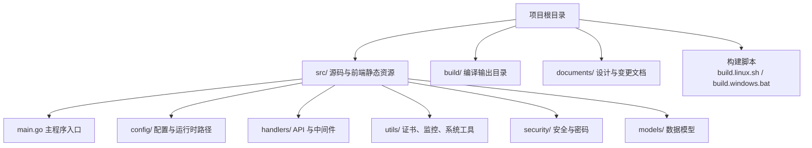
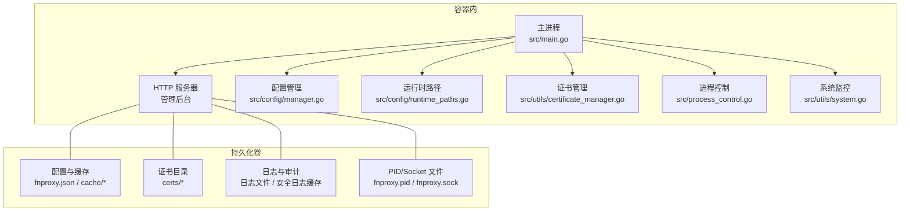
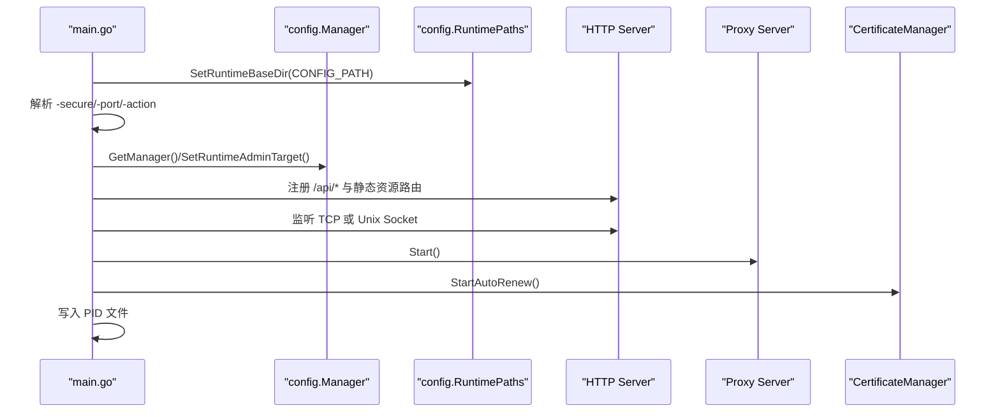
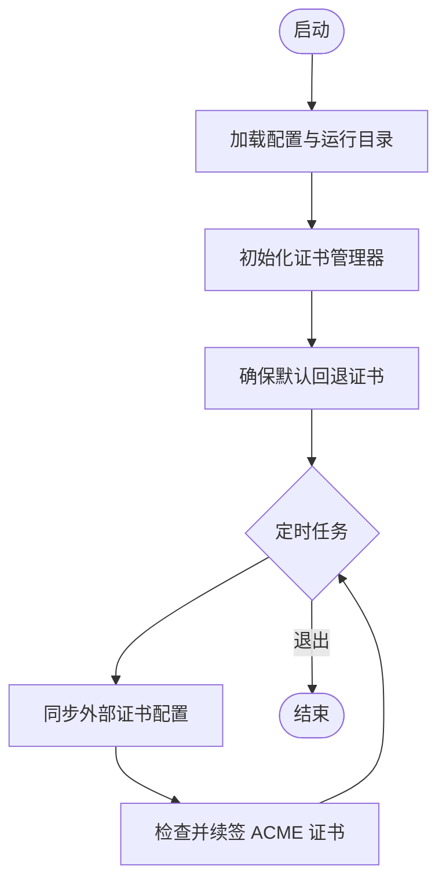
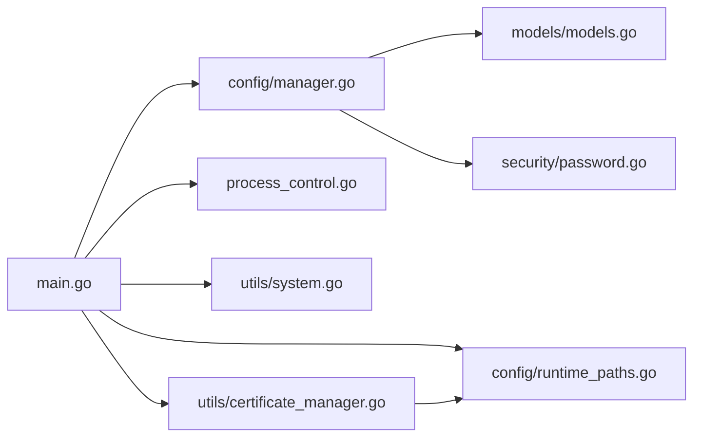

# 容器化部署

<cite>
**本文引用的文件**
- [README.md](file://README.md)
- [main.go](file://src/main.go)
- [runtime_paths.go](file://src/config/runtime_paths.go)
- [manager.go](file://src/config/manager.go)
- [process_control.go](file://src/process_control.go)
- [system.go](file://src/utils/system.go)
- [models.go](file://src/models/models.go)
- [certificate_manager.go](file://src/utils/certificate_manager.go)
- [password.go](file://src/security/password.go)
- [build.linux.sh](file://build.linux.sh)
- [build.windows.bat](file://build.windows.bat)
</cite>

## 目录
1. [简介](#简介)
2. [项目结构](#项目结构)
3. [核心组件](#核心组件)
4. [架构总览](#架构总览)
5. [详细组件分析](#详细组件分析)
6. [依赖关系分析](#依赖关系分析)
7. [性能考量](#性能考量)
8. [故障排查指南](#故障排查指南)
9. [结论](#结论)
10. [附录](#附录)

## 简介
本指南面向将 Caddy Panel（服务管理面板）进行容器化部署的工程团队，提供从 Docker 镜像构建到 Kubernetes 部署的完整方案。文档覆盖以下关键主题：
- Dockerfile 编写与多阶段构建思路
- 容器运行参数与环境变量设计
- 端口映射、Unix Socket 与卷挂载策略
- 健康检查与重启策略
- 持久化存储（配置、缓存、证书、日志、PID/Socket 文件）
- 容器网络、安全上下文与资源限制
- Kubernetes 部署清单（Deployment、Service、ConfigMap）
- 容器编排最佳实践与常见问题排查

## 项目结构
Caddy Panel 的核心运行逻辑集中在 src/ 目录，包含主程序入口、配置管理、运行时路径解析、进程控制、系统监控、证书管理、安全与模型定义等模块。构建产物位于 build/ 目录，支持跨平台编译。

图表来源
- [main.go:1-516](file://src/main.go#L1-L516)
- [runtime_paths.go:1-160](file://src/config/runtime_paths.go#L1-L160)
- [build.linux.sh:1-13](file://build.linux.sh#L1-L13)
- [build.windows.bat:1-21](file://build.windows.bat#L1-L21)

章节来源
- [README.md:20-42](file://README.md#L20-L42)
- [main.go:24-120](file://src/main.go#L24-L120)
- [runtime_paths.go:31-83](file://src/config/runtime_paths.go#L31-L83)
- [build.linux.sh:9-12](file://build.linux.sh#L9-L12)
- [build.windows.bat:12-13](file://build.windows.bat#L12-L13)

## 核心组件
- 主程序入口与路由：负责解析启动参数、初始化配置、注册 API 与静态资源路由、启动管理后台 HTTP 服务器、启动代理服务与证书自动续签。
- 配置管理与运行时路径：集中管理运行时根目录、管理端口/Unix Socket、配置文件、PID/Socket、缓存与证书目录等路径。
- 进程控制：支持 status/stop/restart 动作，单实例保护，PID 文件管理。
- 证书管理：支持 ACME 自动申请/续签、外部证书同步、默认回退证书。
- 安全与密码：安全参数（secure）用于加密与 OAuth 解密，提供默认安全值与哈希比较。
- 系统监控：提供 CPU、内存、网络 IO、主机信息等运行状态指标。

章节来源
- [main.go:24-120](file://src/main.go#L24-L120)
- [manager.go:35-72](file://src/config/manager.go#L35-L72)
- [runtime_paths.go:31-160](file://src/config/runtime_paths.go#L31-L160)
- [process_control.go:17-139](file://src/process_control.go#L17-L139)
- [certificate_manager.go:126-151](file://src/utils/certificate_manager.go#L126-L151)
- [password.go:30-71](file://src/security/password.go#L30-L71)
- [system.go:19-82](file://src/utils/system.go#L19-L82)

## 架构总览
下图展示了容器内主进程如何启动与对外暴露服务，以及持久化卷挂载的关键位置。

图表来源
- [main.go:432-465](file://src/main.go#L432-L465)
- [runtime_paths.go:85-115](file://src/config/runtime_paths.go#L85-L115)
- [manager.go:74-107](file://src/config/manager.go#L74-L107)

## 详细组件分析

### Docker 镜像构建方案
- 基础镜像：建议使用官方 distroless 或 gcr.io/distroless/base:nonroot 作为最终运行镜像，以最小化攻击面。
- 多阶段构建：
  - 第一阶段：使用 golang:alpine 编译，CGO_ENABLED=0，GOOS=linux，GOARCH=amd64，输出二进制至 build/。
  - 第二阶段：将编译产物复制到 distroless 镜像，设置非 root 用户与只读根文件系统。
- 可选：在第一阶段使用 build.linux.sh 或 build.windows.bat 的思路，统一编译流程。
- 运行用户：以非 root 用户运行，UID/GID 由镜像层指定。
- 健康检查：通过 HTTP GET /api/status 或 /api/metrics/listeners 等接口探测，结合探针超时与重试策略。
- 环境变量：通过环境变量传递安全参数（secure）、运行目录（config_path）、管理端口（port）等，便于在 K8s 中注入。

章节来源
- [build.linux.sh:9-12](file://build.linux.sh#L9-L12)
- [build.windows.bat:12-13](file://build.windows.bat#L12-L13)
- [main.go:24-34](file://src/main.go#L24-L34)
- [runtime_paths.go:31-59](file://src/config/runtime_paths.go#L31-L59)

### 容器运行参数与环境变量
- 启动参数映射到环境变量：
  - -secure → 环境变量 SECURE_SECRET
  - -config_path → 环境变量 CONFIG_PATH
  - -port → 环境变量 ADMIN_PORT 或 ADMIN_SOCKET（sock）
- 单实例保护：容器内仅允许单个实例运行，PID 文件位于运行目录。
- 管理端口模式：
  - TCP 端口：ADMIN_PORT=8080
  - Unix Socket：ADMIN_SOCKET=sock，容器内通过 socket 文件通信（需挂载 socket 目录）

章节来源
- [main.go:24-34](file://src/main.go#L24-L34)
- [runtime_paths.go:117-141](file://src/config/runtime_paths.go#L117-L141)
- [process_control.go:129-139](file://src/process_control.go#L129-L139)

### 端口映射与网络配置
- 管理后台监听：
  - TCP：容器内监听 :8080（或 ADMIN_PORT），K8s Service 暴露对应端口。
  - Unix Socket：容器内监听 /run/fnproxy.sock（需挂载宿主机目录共享），适用于与反向代理在同一 Pod 场景。
- 业务监听：由代理服务根据配置动态启动，容器暴露所需端口或通过 Unix Socket 与上游通信。
- 网络策略：建议限制出站访问，仅放行必要的证书申请域名（如 acme-v02.api.letsencrypt.org）。

章节来源
- [main.go:432-465](file://src/main.go#L432-L465)
- [runtime_paths.go:93-95](file://src/config/runtime_paths.go#L93-L95)

### 卷挂载与持久化存储
- 运行目录（推荐挂载）：CONFIG_PATH=/data/fnproxy-panel
  - 配置文件：fnproxy.json
  - 缓存：cache/monitor-cache.db、cache/security-logs.db
  - 证书：certs/managed、certs/accounts
  - PID/Socket：fnproxy.pid、fnproxy.sock
- 日志与审计：日志文件与安全日志缓存位于运行目录，建议单独挂载日志卷以便采集与归档。
- 外部证书同步：如使用文件同步方式，需挂载包含证书与密钥的宿主机目录。

章节来源
- [README.md:156-167](file://README.md#L156-L167)
- [runtime_paths.go:85-115](file://src/config/runtime_paths.go#L85-L115)
- [manager.go:74-107](file://src/config/manager.go#L74-L107)

### 健康检查与重启策略
- 健康检查：
  - HTTP 探针：GET /api/status 或 /api/metrics/listeners，期望 200。
  - 初始延迟：10s，探针间隔：10s，超时：3s，不健康阈值：3。
- 就绪检查：与健康检查一致，或针对 /api/status 的响应体做更细粒度判断。
- 重启策略：K8s Deployment 使用 RestartPolicy=Always，容器异常退出自动重启；配合 liveness/readiness 探针提升恢复效率。
- 优雅退出：容器终止信号由 K8s 发送，主程序监听 SIGTERM 并优雅关闭 HTTP 服务器与代理服务。

章节来源
- [main.go:482-514](file://src/main.go#L482-L514)

### 安全上下文与资源限制
- 安全上下文：
  - runAsUser/runAsGroup：非 root 用户（如 65532）
  - fsGroup：65532
  - readOnlyRootFilesystem：true
  - allowPrivilegeEscalation：false
  - capabilities：drop ALL
- 资源限制：
  - requests/limits：CPU 与内存根据业务峰值设定，建议初始 250m/256Mi，逐步调优。
- 证书与密钥权限：确保 certs/managed 与 certs/accounts 目录权限为 0755，文件权限为 0644。

章节来源
- [runtime_paths.go:51-53](file://src/config/runtime_paths.go#L51-L53)
- [certificate_manager.go:68-74](file://src/utils/certificate_manager.go#L68-L74)

### Kubernetes 部署清单（示例字段）
- Deployment：
  - replicas：1（或根据高可用需求）
  - template.spec：
    - containers[].env：SECURE_SECRET、CONFIG_PATH、ADMIN_PORT/ADMIN_SOCKET
    - containers[].volumeMounts：挂载运行目录、日志目录、可选 socket 目录
    - livenessProbe/readinessProbe：HTTP 探针
    - resources：requests/limits
    - securityContext：非 root、只读根文件系统、capabilities
  - volumes：EmptyDir 或 PVC（推荐 PVC）
- Service：
  - ClusterIP：8080（或 ADMIN_PORT 对应值）
  - NodePort/LoadBalancer：按需暴露
- ConfigMap：
  - 存放静态配置（如默认管理员账户、日志级别等），通过 envFrom 注入。

章节来源
- [main.go:24-34](file://src/main.go#L24-L34)
- [runtime_paths.go:31-59](file://src/config/runtime_paths.go#L31-L59)

### API 流程与关键路由（序列图）
以下序列图展示管理后台启动与 API 路由注册的关键步骤。

图表来源
- [main.go:24-120](file://src/main.go#L24-L120)
- [main.go:432-465](file://src/main.go#L432-L465)
- [manager.go:35-72](file://src/config/manager.go#L35-L72)
- [runtime_paths.go:31-141](file://src/config/runtime_paths.go#L31-L141)

### 证书管理流程（流程图）
证书管理器负责加载、续签与回退证书。

图表来源
- [certificate_manager.go:140-151](file://src/utils/certificate_manager.go#L140-L151)
- [certificate_manager.go:168-190](file://src/utils/certificate_manager.go#L168-L190)
- [runtime_paths.go:105-111](file://src/config/runtime_paths.go#L105-L111)

## 依赖关系分析
- 主程序依赖配置管理、运行时路径、证书管理、进程控制与系统监控模块。
- 配置管理依赖模型定义与安全模块。
- 证书管理依赖 ACME 库与运行时路径解析。
- 进程控制依赖 PID 文件与信号处理。

图表来源
- [main.go:16-22](file://src/main.go#L16-L22)
- [manager.go:3-14](file://src/config/manager.go#L3-L14)
- [runtime_paths.go:3-10](file://src/config/runtime_paths.go#L3-L10)
- [certificate_manager.go:3-37](file://src/utils/certificate_manager.go#L3-L37)
- [models.go:1-6](file://src/models/models.go#L1-L6)
- [password.go:3-10](file://src/security/password.go#L3-L10)

章节来源
- [main.go:16-22](file://src/main.go#L16-L22)
- [manager.go:3-14](file://src/config/manager.go#L3-L14)
- [runtime_paths.go:3-10](file://src/config/runtime_paths.go#L3-L10)
- [certificate_manager.go:3-37](file://src/utils/certificate_manager.go#L3-L37)
- [models.go:1-6](file://src/models/models.go#L1-L6)
- [password.go:3-10](file://src/security/password.go#L3-L10)

## 性能考量
- 编译优化：CGO_ENABLED=0，剥离符号与调试信息，减小二进制体积。
- 运行时优化：合理设置日志级别与日志保留天数，避免磁盘 IO 抖动。
- 证书轮询：证书同步间隔可在全局配置中调整，默认 3600 秒。
- 网络监控：网络 IO 速率计算基于 gopsutil，建议在高并发场景下降低采样频率。

章节来源
- [build.linux.sh:10](file://build.linux.sh#L10)
- [manager.go:48-50](file://src/config/manager.go#L48-L50)
- [system.go:19-82](file://src/utils/system.go#L19-L82)

## 故障排查指南
- 单实例冲突：若启动时报“检测到程序已在运行”，检查 PID 文件是否存在且进程是否仍在运行，必要时清理失效 PID 文件。
- 端口占用：TCP 模式下确认 ADMIN_PORT 未被占用；Unix Socket 模式下确认 socket 文件权限与路径正确。
- 证书问题：检查 certs/managed 与 certs/accounts 目录权限；确认 ACME DNS 提供商凭据配置正确。
- 日志定位：查看运行目录下的日志文件与安全日志缓存，结合 /api/security-logs 接口定位问题。
- 优雅退出：若容器频繁重启，检查 K8s 事件与探针配置，确保主程序能正确处理 SIGTERM。

章节来源
- [process_control.go:84-109](file://src/process_control.go#L84-L109)
- [process_control.go:111-127](file://src/process_control.go#L111-L127)
- [main.go:482-514](file://src/main.go#L482-L514)
- [runtime_paths.go:105-111](file://src/config/runtime_paths.go#L105-L111)

## 结论
通过多阶段构建与 distroless 镜像，结合合理的卷挂载与健康检查策略，Caddy Panel 可以稳定地在容器环境中运行。建议在生产环境中显式设置 -secure 参数与持久化存储，配合 K8s 的资源限制与安全上下文，确保安全性与可靠性。

## 附录
- 快速开始（本地构建）：参考构建脚本与 README 中的构建命令。
- 默认登录信息：首次部署后请立即修改默认管理员密码并启用 -secure 参数。

章节来源
- [README.md:50-96](file://README.md#L50-L96)
- [build.linux.sh:9-12](file://build.linux.sh#L9-L12)
- [build.windows.bat:12-13](file://build.windows.bat#L12-L13)