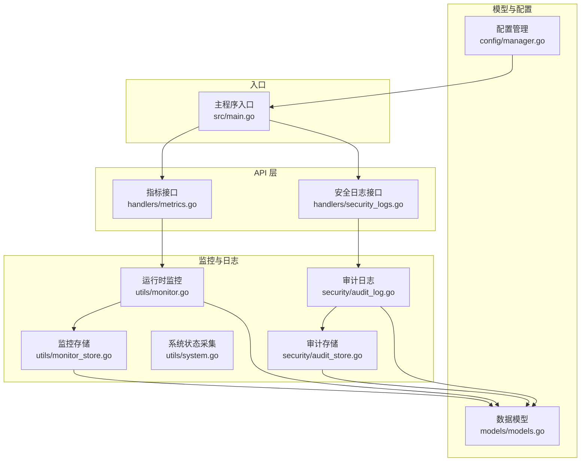
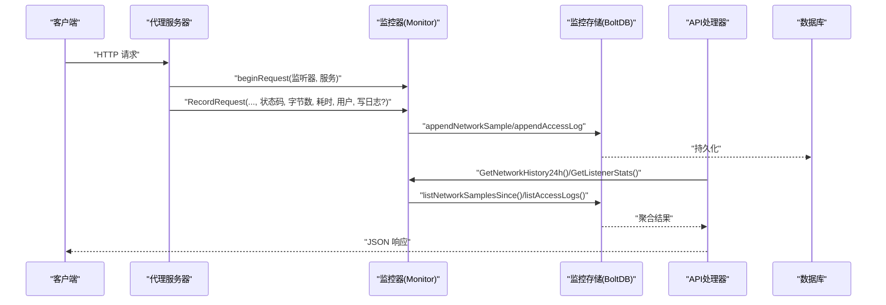
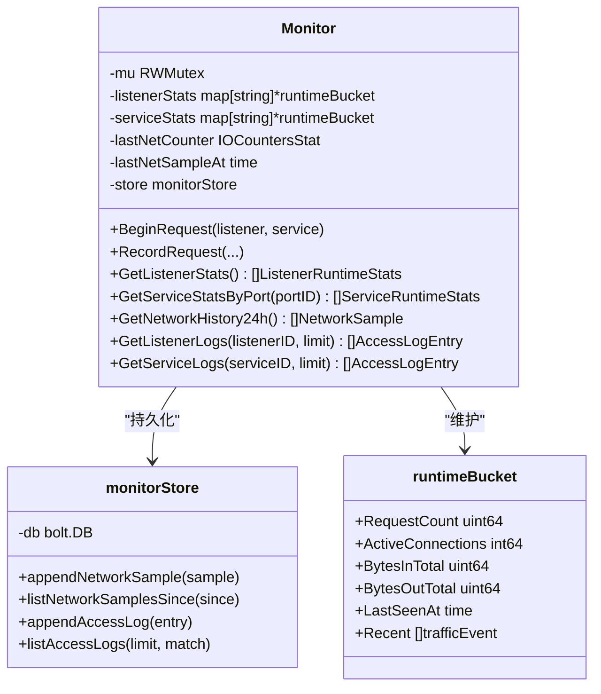
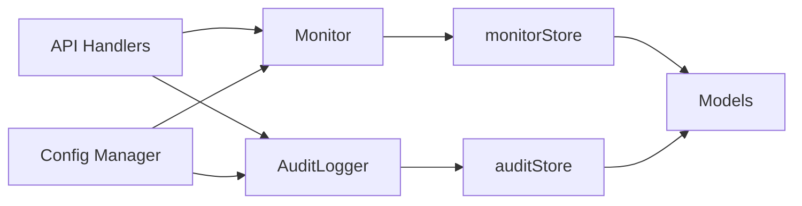

# 监控与告警

<cite>
**本文引用的文件**
- [src/main.go](file://src/main.go)
- [src/utils/monitor.go](file://src/utils/monitor.go)
- [src/utils/monitor_store.go](file://src/utils/monitor_store.go)
- [src/utils/system.go](file://src/utils/system.go)
- [src/handlers/metrics.go](file://src/handlers/metrics.go)
- [src/handlers/security_logs.go](file://src/handlers/security_logs.go)
- [src/security/audit_log.go](file://src/security/audit_log.go)
- [src/security/audit_store.go](file://src/security/audit_store.go)
- [src/models/models.go](file://src/models/models.go)
- [src/config/manager.go](file://src/config/manager.go)
- [README.md](file://README.md)
</cite>

## 目录
1. [简介](#简介)
2. [项目结构](#项目结构)
3. [核心组件](#核心组件)
4. [架构总览](#架构总览)
5. [详细组件分析](#详细组件分析)
6. [依赖关系分析](#依赖关系分析)
7. [性能考量](#性能考量)
8. [故障排查指南](#故障排查指南)
9. [结论](#结论)
10. [附录](#附录)

## 简介
本指南面向运维与开发人员，系统性说明 Caddy Panel 的监控与告警配置方法，覆盖系统资源监控（CPU、内存、磁盘、网络）、应用性能监控（请求响应时间、吞吐量、错误率）、日志监控（访问日志与审计日志）、告警规则设计与可视化展示，以及监控系统的扩展与集成能力。文档基于仓库源码进行分析，确保配置与实现一一对应。

## 项目结构
监控相关能力主要分布在以下模块：
- 运行时监控与存储：utils/monitor.go、utils/monitor_store.go、utils/system.go
- API 接口：handlers/metrics.go、handlers/security_logs.go
- 审计日志：security/audit_log.go、security/audit_store.go
- 数据模型：models/models.go
- 配置与入口：config/manager.go、src/main.go
- 项目说明：README.md

图表来源
- [src/main.go:112-429](file://src/main.go#L112-L429)
- [src/utils/monitor.go:38-386](file://src/utils/monitor.go#L38-L386)
- [src/utils/monitor_store.go:26-208](file://src/utils/monitor_store.go#L26-L208)
- [src/utils/system.go:19-124](file://src/utils/system.go#L19-L124)
- [src/handlers/metrics.go:11-53](file://src/handlers/metrics.go#L11-L53)
- [src/handlers/security_logs.go:10-65](file://src/handlers/security_logs.go#L10-L65)
- [src/security/audit_log.go:15-224](file://src/security/audit_log.go#L15-L224)
- [src/security/audit_store.go:22-222](file://src/security/audit_store.go#L22-L222)
- [src/models/models.go:7-394](file://src/models/models.go#L7-L394)
- [src/config/manager.go:35-72](file://src/config/manager.go#L35-L72)

章节来源
- [src/main.go:112-429](file://src/main.go#L112-L429)
- [README.md:1-256](file://README.md#L1-L256)

## 核心组件
- 运行时监控器（Monitor）：负责记录请求、连接、流量等运行时指标，维护监听器与服务维度的统计，并持久化网络采样与访问日志。
- 监控存储（monitorStore）：基于 BoltDB 的轻量存储，分别维护网络采样与访问日志，支持按时间窗口聚合与上限裁剪。
- 系统状态采集（GetServerStatus）：采集 CPU、内存、网络 IO、主机信息等基础系统指标。
- 审计日志（AuditLogger）：集中记录 OAuth 登录、代理错误、SSH 连接/断开、系统操作等安全事件，支持查询、统计与清理。
- 审计存储（auditStore）：基于 BoltDB 的审计日志存储，支持类型/级别/关键词过滤与分页。
- API 接口：提供网络历史、监听/服务统计、访问日志、安全日志查询等接口。
- 配置与入口：全局配置项（日志保留、最大条数等）由配置管理器提供，主程序注册路由并初始化监控与审计存储。

章节来源
- [src/utils/monitor.go:38-386](file://src/utils/monitor.go#L38-L386)
- [src/utils/monitor_store.go:26-208](file://src/utils/monitor_store.go#L26-L208)
- [src/utils/system.go:19-124](file://src/utils/system.go#L19-L124)
- [src/security/audit_log.go:15-224](file://src/security/audit_log.go#L15-L224)
- [src/security/audit_store.go:22-222](file://src/security/audit_store.go#L22-L222)
- [src/handlers/metrics.go:11-53](file://src/handlers/metrics.go#L11-L53)
- [src/handlers/security_logs.go:10-65](file://src/handlers/security_logs.go#L10-L65)
- [src/models/models.go:7-394](file://src/models/models.go#L7-L394)
- [src/config/manager.go:35-72](file://src/config/manager.go#L35-L72)
- [src/main.go:112-429](file://src/main.go#L112-L429)

## 架构总览
监控与日志的数据流如下：
- 请求进入代理层后，调用监控器记录请求开始与结束，更新连接数、累计字节数与最近事件队列。
- 网络采样定时器周期性读取系统网卡 IO，计算速率并持久化。
- 访问日志在请求完成后按需写入访问日志表，受全局配置限制。
- 审计日志在安全事件发生时写入审计表，支持查询与统计。
- API 层提供指标与日志查询接口，供前端或外部系统消费。

图表来源
- [src/utils/monitor.go:119-189](file://src/utils/monitor.go#L119-L189)
- [src/utils/monitor_store.go:56-155](file://src/utils/monitor_store.go#L56-L155)
- [src/handlers/metrics.go:11-53](file://src/handlers/metrics.go#L11-L53)

## 详细组件分析

### 运行时监控器（Monitor）
- 职责
  - 记录请求生命周期：开始/结束、活跃连接数变化、累计字节输入/输出、最近事件队列。
  - 采集系统网络 IO 并计算速率，周期性写入网络采样表。
  - 提供监听器与服务维度的运行时统计（请求数、活跃连接、累计字节、速率、最后出现时间）。
  - 提供访问日志查询（按监听器/服务维度），支持限制数量。
- 关键数据结构
  - runtimeBucket：按监听器/服务维度维护请求计数、活跃连接、累计字节、最近事件队列与最后出现时间。
  - NetworkSample：网络采样点（时间戳、入/出速率）。
  - AccessLogEntry：访问日志条目（含监听器/服务标识、主机、方法、路径、状态码、耗时、字节数、远端地址、用户名）。
- 时间窗口与裁剪
  - 近期事件窗口：默认 1 分钟，用于计算速率。
  - 网络采样保留：默认 24 小时，按 10 分钟聚合。
  - 访问日志保留：由全局配置决定（默认 7 天），同时限制最大条数（默认 10000）。
- 速率计算
  - 使用最近一次采样的差分与时间间隔计算入/出速率，单位为字节/秒。
- 线程安全
  - 采用读写锁保护内部状态，避免并发竞争。

图表来源
- [src/utils/monitor.go:38-386](file://src/utils/monitor.go#L38-L386)
- [src/utils/monitor_store.go:26-208](file://src/utils/monitor_store.go#L26-L208)
- [src/models/models.go:25-70](file://src/models/models.go#L25-L70)

章节来源
- [src/utils/monitor.go:38-386](file://src/utils/monitor.go#L38-L386)
- [src/utils/monitor_store.go:26-208](file://src/utils/monitor_store.go#L26-L208)
- [src/models/models.go:25-70](file://src/models/models.go#L25-L70)

### 监控存储（monitorStore）
- 存储结构
  - 网络采样桶：按时间戳键存储，键格式为纳秒时间戳字符串，自动裁剪早于保留期的数据。
  - 访问日志桶：按“时间戳+ID”复合键存储，自动裁剪早于保留期的数据，并限制最大条数。
- 保留策略
  - 网络采样：默认保留 24 小时。
  - 访问日志：由全局配置决定保留天数与最大条数。
- 查询与聚合
  - 网络历史：按 10 分钟窗口聚合速率。
  - 访问日志：支持按监听器/服务过滤与限制数量。

章节来源
- [src/utils/monitor_store.go:26-208](file://src/utils/monitor_store.go#L26-L208)
- [src/config/manager.go:109-137](file://src/config/manager.go#L109-L137)

### 系统状态采集（GetServerStatus）
- 指标
  - 运行时长、内存使用与总量、内存占比、CPU 使用率、网络入/出总量与瞬时速率、主机名、OS、平台。
- 速率计算
  - 通过两次系统网卡 IO 采样差分与时间间隔计算瞬时速率。
- 用途
  - 作为系统层面的健康度与容量评估依据，可用于仪表盘展示。

章节来源
- [src/utils/system.go:19-124](file://src/utils/system.go#L19-L124)

### 审计日志（AuditLogger）
- 能力
  - 记录 OAuth 登录、代理错误、SSH 连接/断开、系统操作等事件。
  - 支持按类型、级别、关键词过滤与分页查询。
  - 支持统计各类事件总数。
  - 支持清空审计日志。
- 存储
  - 基于 BoltDB 的审计日志桶，按“时间戳+ID”复合键存储，支持裁剪至最大条数。
- 配置
  - 最大条数由全局配置提供回调函数动态获取。

章节来源
- [src/security/audit_log.go:15-224](file://src/security/audit_log.go#L15-L224)
- [src/security/audit_store.go:22-222](file://src/security/audit_store.go#L22-L222)
- [src/config/manager.go:109-137](file://src/config/manager.go#L109-L137)

### API 接口
- 指标接口
  - GET /api/metrics/network-history：返回 24 小时网络历史（按 10 分钟聚合）。
  - GET /api/metrics/listeners：返回所有监听器运行时统计。
  - GET /api/metrics/services?port_id=：返回指定端口下服务运行时统计。
- 日志接口
  - GET /api/logs/listeners/{id}?limit=N：返回监听器访问日志，limit 默认 100，最大 500。
  - GET /api/logs/services/{id}?limit=N：返回服务访问日志，limit 默认 100，最大 500。
- 安全日志接口
  - GET /api/security-logs?type=&level=&keyword=&page=&page_size=：分页查询安全日志。
  - GET /api/security-logs/stats：获取安全日志统计。
  - DELETE /api/security-logs：清空安全日志。

章节来源
- [src/handlers/metrics.go:11-53](file://src/handlers/metrics.go#L11-L53)
- [src/handlers/security_logs.go:10-65](file://src/handlers/security_logs.go#L10-L65)

### 数据模型
- ServerStatus：系统状态指标。
- NetworkSample：网络采样点。
- RuntimeStats：运行时统计（请求数、活跃连接、累计字节、速率、最后出现时间）。
- ListenerRuntimeStats、ServiceRuntimeStats：监听器与服务维度的运行时统计。
- AccessLogEntry：访问日志条目。
- SecurityLogEntry：审计日志条目（类型、级别、用户名、来源 IP、目标、动作、消息、成功与否、附加信息）。

章节来源
- [src/models/models.go:7-394](file://src/models/models.go#L7-L394)

## 依赖关系分析
- 组件耦合
  - Monitor 依赖 monitorStore 进行持久化，依赖配置管理器获取监听器与服务列表。
  - AuditLogger 依赖 auditStore 进行持久化，依赖配置管理器获取最大条数。
  - API 层仅依赖 Monitor/AuditLogger 的公共接口，不直接访问存储细节。
- 外部依赖
  - 网络采样使用第三方库读取系统 IO。
  - 存储使用 BoltDB。
- 循环依赖
  - 未发现循环依赖，模块职责清晰。

图表来源
- [src/utils/monitor.go:38-386](file://src/utils/monitor.go#L38-L386)
- [src/utils/monitor_store.go:26-208](file://src/utils/monitor_store.go#L26-L208)
- [src/security/audit_log.go:15-224](file://src/security/audit_log.go#L15-L224)
- [src/security/audit_store.go:22-222](file://src/security/audit_store.go#L22-L222)
- [src/handlers/metrics.go:11-53](file://src/handlers/metrics.go#L11-L53)
- [src/handlers/security_logs.go:10-65](file://src/handlers/security_logs.go#L10-L65)
- [src/config/manager.go:35-72](file://src/config/manager.go#L35-L72)

章节来源
- [src/utils/monitor.go:38-386](file://src/utils/monitor.go#L38-L386)
- [src/utils/monitor_store.go:26-208](file://src/utils/monitor_store.go#L26-L208)
- [src/security/audit_log.go:15-224](file://src/security/audit_log.go#L15-L224)
- [src/security/audit_store.go:22-222](file://src/security/audit_store.go#L22-L222)
- [src/handlers/metrics.go:11-53](file://src/handlers/metrics.go#L11-L53)
- [src/handlers/security_logs.go:10-65](file://src/handlers/security_logs.go#L10-L65)
- [src/config/manager.go:35-72](file://src/config/manager.go#L35-L72)

## 性能考量
- 存储与查询
  - BoltDB 为单文件数据库，读写性能稳定；按时间键顺序存储，查询效率高。
  - 网络历史聚合在服务端完成，避免前端复杂计算。
- 内存与并发
  - Monitor 使用读写锁保护内部状态，避免频繁加锁带来的阻塞。
  - 近期事件队列按时间窗口裁剪，避免无限增长。
- 限制与裁剪
  - 访问日志与审计日志均支持按天数与条数裁剪，防止无限增长导致磁盘压力。
- I/O 与采样
  - 网络采样周期为 1 分钟，兼顾实时性与系统开销。
  - 系统状态采集使用短周期采样计算瞬时速率，避免长时间等待。

[本节为通用性能讨论，不直接分析具体文件]

## 故障排查指南
- 网络历史为空
  - 检查网络采样是否正常写入与保留期设置。
  - 确认 API 查询时间范围是否覆盖采样数据。
- 访问日志缺失
  - 确认服务配置中是否启用访问日志记录。
  - 检查日志保留天数与最大条数限制。
- 审计日志异常
  - 检查审计存储初始化是否成功。
  - 确认最大条数回调是否正确返回配置值。
- API 400/404
  - 确认请求参数（如 port_id、limit、分页参数）是否符合接口规范。
- 存储空间不足
  - 调整日志保留天数与最大条数，或清理历史数据。

章节来源
- [src/utils/monitor_store.go:56-155](file://src/utils/monitor_store.go#L56-L155)
- [src/security/audit_store.go:47-129](file://src/security/audit_store.go#L47-L129)
- [src/handlers/metrics.go:23-52](file://src/handlers/metrics.go#L23-L52)
- [src/handlers/security_logs.go:14-64](file://src/handlers/security_logs.go#L14-L64)

## 结论
Caddy Panel 的监控与日志体系以轻量、可扩展为核心设计原则：运行时监控器与审计日志分别覆盖应用性能与安全事件，配合 BoltDB 存储与简洁的 API 接口，满足中小规模场景下的可观测性需求。通过合理的保留策略与裁剪机制，系统在保证数据可用性的同时控制了资源占用。对于更复杂的监控与告警需求，可在现有 API 基础上接入外部监控平台或自定义告警规则。

[本节为总结性内容，不直接分析具体文件]

## 附录

### 系统监控指标收集与展示
- CPU、内存、磁盘、网络
  - 系统状态采集提供 CPU 使用率、内存使用与总量、网络入/出总量与瞬时速率、主机信息等指标，可用于仪表盘展示。
  - 展示建议：折线图（CPU/内存/网络速率）、柱状图（磁盘使用）、卡片（主机信息）。
- 网络历史
  - 通过 /api/metrics/network-history 获取 24 小时按 10 分钟聚合的入/出速率，适合绘制趋势图。
- 监听器与服务统计
  - 通过 /api/metrics/listeners 与 /api/metrics/services?port_id= 获取请求数、活跃连接、累计字节与速率，适合按监听器/服务维度对比展示。

章节来源
- [src/utils/system.go:19-124](file://src/utils/system.go#L19-L124)
- [src/handlers/metrics.go:11-29](file://src/handlers/metrics.go#L11-L29)

### 应用性能监控（请求响应时间、吞吐量、错误率）
- 请求响应时间
  - 访问日志条目包含耗时字段，可用于计算 P50/P95/P99 响应时间。
- 吞吐量
  - 通过请求数与时间窗口计算 QPS；通过累计字节与时间计算吞吐量。
- 错误率
  - 通过状态码分布统计错误比例（如 5xx/4xx）。
- 实现要点
  - 监控器已提供速率计算与时间窗口裁剪，API 层提供聚合后的网络历史与统计接口。

章节来源
- [src/utils/monitor.go:231-251](file://src/utils/monitor.go#L231-L251)
- [src/models/models.go:53-70](file://src/models/models.go#L53-L70)

### 日志监控配置
- 访问日志
  - 服务配置中可启用访问日志记录；日志保留天数与最大条数由全局配置控制。
  - 查询接口支持按监听器/服务过滤与限制数量。
- 日志级别与过滤
  - 访问日志为结构化记录，可通过状态码、路径、主机等字段过滤。
  - 审计日志支持按类型、级别、关键词过滤。
- 实时查看
  - 通过 API 接口拉取最新日志，结合前端轮询或 WebSocket 实现实时展示。

章节来源
- [src/models/models.go:109-130](file://src/models/models.go#L109-L130)
- [src/utils/monitor_store.go:102-155](file://src/utils/monitor_store.go#L102-L155)
- [src/handlers/metrics.go:31-52](file://src/handlers/metrics.go#L31-L52)
- [src/handlers/security_logs.go:14-64](file://src/handlers/security_logs.go#L14-L64)

### 审计日志监控与分析
- 事件类型
  - OAuth 登录、代理错误、SSH 连接/断开、系统操作。
- 分析维度
  - 按类型统计总数；按级别（信息/警告/错误）分类；按关键词检索用户名、来源 IP、目标、动作、消息。
- 清理策略
  - 支持清空审计日志，避免长期积累导致存储压力。

章节来源
- [src/security/audit_log.go:82-166](file://src/security/audit_log.go#L82-L166)
- [src/security/audit_store.go:69-129](file://src/security/audit_store.go#L69-L129)

### 告警规则配置（设计建议）
- 阈值设置
  - CPU 使用率持续超过阈值（如 80%）一段时间触发告警。
  - 网络入/出速率异常升高或骤降。
  - 错误率（5xx/4xx）超过阈值。
  - 活跃连接数异常增长。
- 告警级别
  - 信息：低风险提示。
  - 警告：需要关注但暂不影响业务。
  - 错误：影响业务，需紧急处理。
- 通知渠道
  - 邮件、Webhook、IM（如企业微信/钉钉）等。
- 执行流程
  - 通过 API 定时拉取指标与日志，结合规则引擎判断是否触发告警，并推送通知。

[本节为概念性设计，不直接分析具体文件]

### 监控数据可视化展示方案
- 指标面板
  - CPU 使用率、内存使用率、网络速率、请求数、活跃连接、错误率。
- 日志面板
  - 访问日志列表（支持过滤与排序）、审计日志统计与详情。
- 交互建议
  - 时间范围选择（近 1 小时/6 小时/24 小时）。
  - 实时刷新与导出功能。

[本节为概念性设计，不直接分析具体文件]

### 监控系统的扩展性与集成能力
- 扩展性
  - 新增监控指标：在 Monitor 中扩展统计维度，增加存储桶与聚合逻辑。
  - 新增日志类型：在 auditStore 中扩展存储桶与查询条件。
- 集成能力
  - 通过 API 接口对接 Prometheus/Grafana、ELK、Zabbix 等外部监控平台。
  - 支持将审计日志导出为标准格式，供 SIEM 系统分析。

章节来源
- [src/main.go:112-429](file://src/main.go#L112-L429)
- [src/utils/monitor.go:38-386](file://src/utils/monitor.go#L38-L386)
- [src/security/audit_log.go:15-224](file://src/security/audit_log.go#L15-L224)