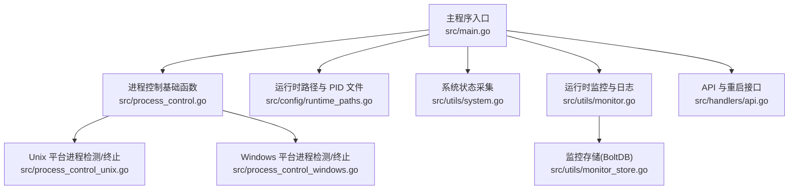
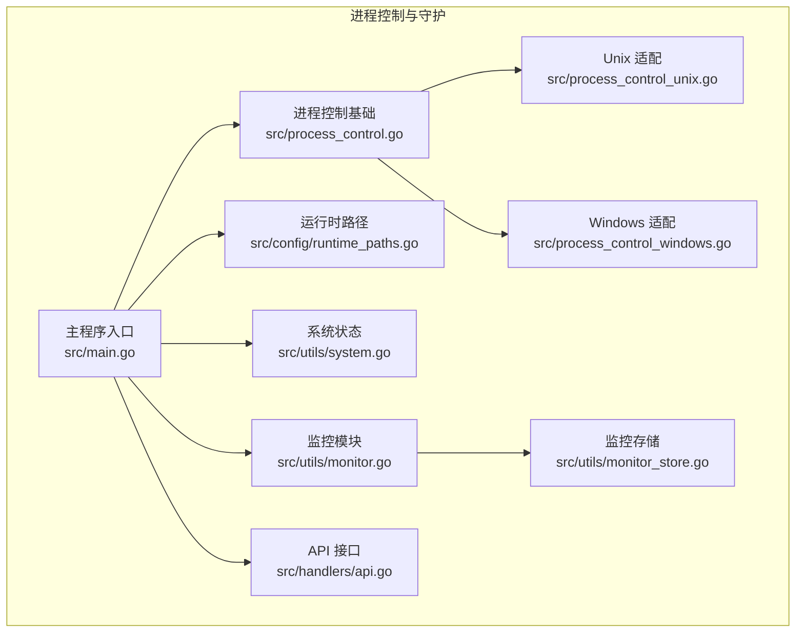
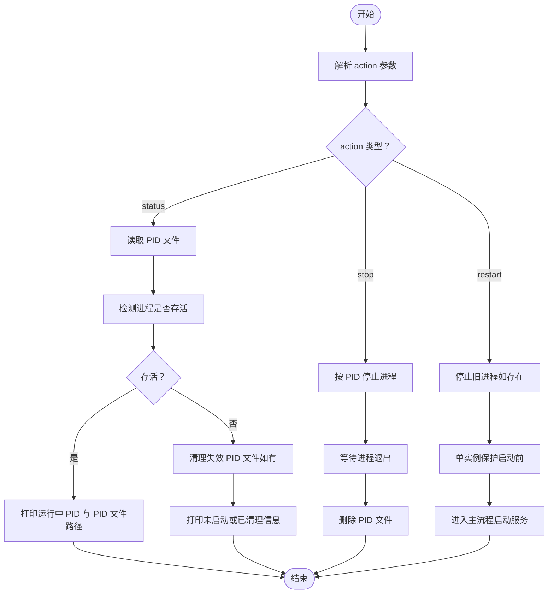
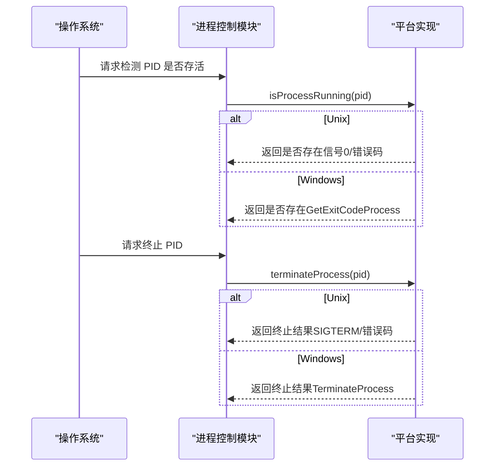
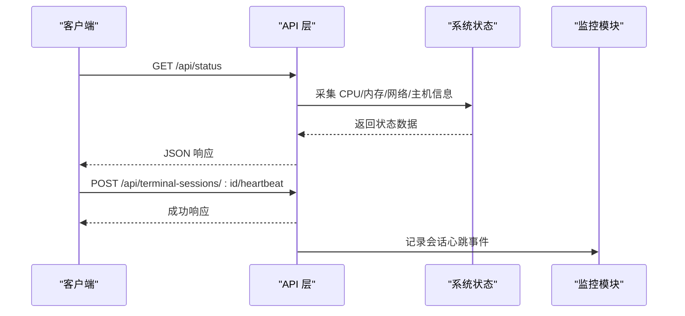
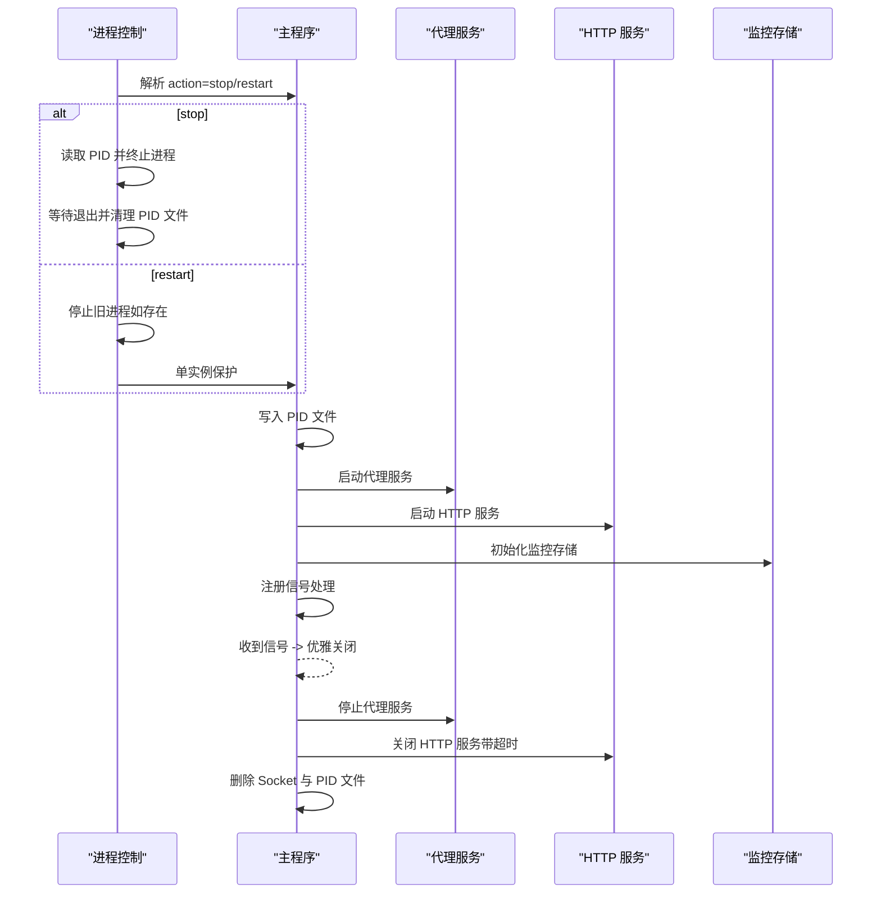
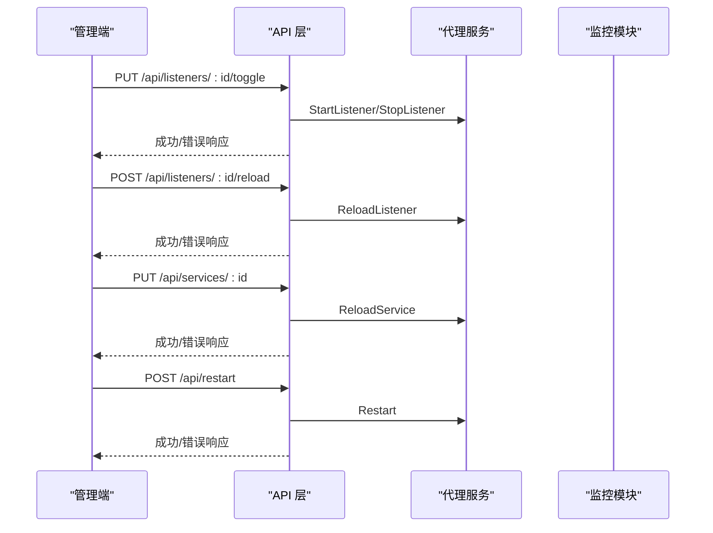
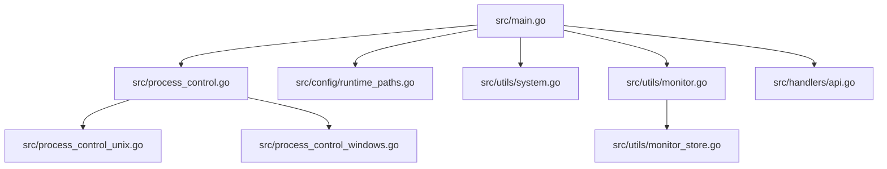

# 进程控制与守护

<cite>
**本文引用的文件**
- [src/main.go](file://src/main.go)
- [src/process_control.go](file://src/process_control.go)
- [src/process_control_unix.go](file://src/process_control_unix.go)
- [src/process_control_windows.go](file://src/process_control_windows.go)
- [src/config/runtime_paths.go](file://src/config/runtime_paths.go)
- [src/utils/system.go](file://src/utils/system.go)
- [src/utils/monitor.go](file://src/utils/monitor.go)
- [src/utils/monitor_store.go](file://src/utils/monitor_store.go)
- [src/handlers/api.go](file://src/handlers/api.go)
- [README.md](file://README.md)
- [build.linux.bat](file://build.linux.bat)
- [build.windows.bat](file://build.windows.bat)
- [debug.bat](file://debug.bat)
</cite>

## 目录
1. [简介](#简介)
2. [项目结构](#项目结构)
3. [核心组件](#核心组件)
4. [架构总览](#架构总览)
5. [详细组件分析](#详细组件分析)
6. [依赖分析](#依赖分析)
7. [性能考虑](#性能考虑)
8. [故障排查指南](#故障排查指南)
9. [结论](#结论)
10. [附录](#附录)

## 简介
本文件聚焦 Caddy Panel 的进程控制与守护机制，围绕单实例保护、进程状态检查、健康与心跳监控、优雅重启、跨平台差异、进程监控与日志、以及进程间通信与生命周期管理进行系统化说明。文档同时给出面向运维与开发的实践建议与可视化图示。

## 项目结构
- 进程控制入口与主流程集中在主程序入口，负责解析参数、单实例保护、PID 文件写入、监听与优雅关闭。
- 平台特定的进程检测与终止逻辑分别在 Unix 与 Windows 平台文件中实现。
- 运行期路径与 PID 文件位置由运行时配置模块统一管理。
- 运行时监控与日志持久化由监控模块与存储模块协同完成，支撑健康与状态查询。

**图表来源**
- [src/main.go:24-515](file://src/main.go#L24-L515)
- [src/process_control.go:17-138](file://src/process_control.go#L17-L138)
- [src/process_control_unix.go:11-34](file://src/process_control_unix.go#L11-L34)
- [src/process_control_windows.go:14-48](file://src/process_control_windows.go#L14-L48)
- [src/config/runtime_paths.go:89-91](file://src/config/runtime_paths.go#L89-L91)
- [src/utils/system.go:19-82](file://src/utils/system.go#L19-L82)
- [src/utils/monitor.go:38-65](file://src/utils/monitor.go#L38-L65)
- [src/utils/monitor_store.go:30-54](file://src/utils/monitor_store.go#L30-L54)
- [src/handlers/api.go:777-784](file://src/handlers/api.go#L777-L784)

**章节来源**
- [src/main.go:24-515](file://src/main.go#L24-L515)
- [src/process_control.go:17-138](file://src/process_control.go#L17-L138)
- [src/process_control_unix.go:11-34](file://src/process_control_unix.go#L11-L34)
- [src/process_control_windows.go:14-48](file://src/process_control_windows.go#L14-L48)
- [src/config/runtime_paths.go:89-91](file://src/config/runtime_paths.go#L89-L91)
- [src/utils/system.go:19-82](file://src/utils/system.go#L19-L82)
- [src/utils/monitor.go:38-65](file://src/utils/monitor.go#L38-L65)
- [src/utils/monitor_store.go:30-54](file://src/utils/monitor_store.go#L30-L54)
- [src/handlers/api.go:777-784](file://src/handlers/api.go#L777-L784)

## 核心组件
- 单实例保护与 PID 文件管理：解析 action 参数，读取/校验 PID 文件，确保同一时刻仅有一个实例运行。
- 平台特定进程检测与终止：Unix 使用信号检测与终止；Windows 使用 Win32 API 查询与终止进程。
- 进程状态检查：通过 PID 文件与进程存活检测组合，提供 status、stop、restart 等控制能力。
- 优雅重启与关闭：捕获系统信号，有序关闭代理、HTTP 服务、清理 socket 与 PID 文件。
- 运行时路径与 PID 文件：集中管理运行目录、PID 文件、Socket 文件等路径。
- 运行时监控与日志：周期性采样网络指标，持久化访问日志与网络采样，支持历史查询。
- API 与心跳：提供状态、指标、监听/服务统计、终端心跳等接口，支撑健康检查与异常恢复。

**章节来源**
- [src/process_control.go:17-138](file://src/process_control.go#L17-L138)
- [src/process_control_unix.go:11-34](file://src/process_control_unix.go#L11-L34)
- [src/process_control_windows.go:14-48](file://src/process_control_windows.go#L14-L48)
- [src/main.go:467-514](file://src/main.go#L467-L514)
- [src/config/runtime_paths.go:89-91](file://src/config/runtime_paths.go#L89-L91)
- [src/utils/monitor.go:78-117](file://src/utils/monitor.go#L78-L117)
- [src/utils/monitor_store.go:56-125](file://src/utils/monitor_store.go#L56-L125)
- [src/handlers/api.go:129-137](file://src/handlers/api.go#L129-L137)

## 架构总览
下图展示了进程控制与守护的关键交互：主程序负责启动、写入 PID、注册信号处理；进程控制模块负责状态查询与停止；平台适配层提供进程检测与终止；监控模块提供健康与指标；API 层提供状态与重启接口。

**图表来源**
- [src/main.go:24-515](file://src/main.go#L24-L515)
- [src/process_control.go:17-138](file://src/process_control.go#L17-L138)
- [src/process_control_unix.go:11-34](file://src/process_control_unix.go#L11-L34)
- [src/process_control_windows.go:14-48](file://src/process_control_windows.go#L14-L48)
- [src/config/runtime_paths.go:89-91](file://src/config/runtime_paths.go#L89-L91)
- [src/utils/system.go:19-82](file://src/utils/system.go#L19-L82)
- [src/utils/monitor.go:38-65](file://src/utils/monitor.go#L38-L65)
- [src/utils/monitor_store.go:30-54](file://src/utils/monitor_store.go#L30-L54)
- [src/handlers/api.go:129-137](file://src/handlers/api.go#L129-L137)

## 详细组件分析

### 单实例保护与 PID 文件管理
- 解析 action 参数：支持 status、stop、restart，若未提供则按参数列表首个值处理。
- PID 文件读取与校验：读取 PID 文件内容，转换为整数；若为空或无效则报错；若文件不存在则忽略。
- 进程存活检测：根据平台调用不同方法判断进程是否存在；若进程不存在则清理失效 PID 文件。
- 单实例保护：在启动前检查 PID 文件对应的进程是否运行，若运行则直接退出并提示 PID 与文件路径。
- 停止流程：读取 PID，尝试终止进程；若进程已结束则返回“进程已完成”；等待进程退出并清理 PID 文件；超时则报错。

**图表来源**
- [src/process_control.go:17-138](file://src/process_control.go#L17-L138)
- [src/process_control_unix.go:11-34](file://src/process_control_unix.go#L11-L34)
- [src/process_control_windows.go:14-48](file://src/process_control_windows.go#L14-L48)

**章节来源**
- [src/process_control.go:17-138](file://src/process_control.go#L17-L138)
- [src/process_control_unix.go:11-34](file://src/process_control_unix.go#L11-L34)
- [src/process_control_windows.go:14-48](file://src/process_control_windows.go#L14-L48)

### 平台特定进程控制差异（Unix 与 Windows）
- Unix 实现：
  - 存活检测：向目标 PID 发送信号 0，若返回 ESRCH 则不存在，EPERM 视为存在。
  - 终止：发送 SIGTERM；若返回 ESRCH 视为进程已完成。
- Windows 实现：
  - 存活检测：OpenProcess 获取退出码，仍为“仍在运行”常量则视为存活。
  - 终止：OpenProcess 获取终止权限后调用 TerminateProcess，返回无效参数则视为进程已完成。

**图表来源**
- [src/process_control_unix.go:11-34](file://src/process_control_unix.go#L11-L34)
- [src/process_control_windows.go:14-48](file://src/process_control_windows.go#L14-L48)

**章节来源**
- [src/process_control_unix.go:11-34](file://src/process_control_unix.go#L11-L34)
- [src/process_control_windows.go:14-48](file://src/process_control_windows.go#L14-L48)

### 进程状态检查与健康监控
- 状态查询：通过 PID 文件与进程存活检测组合，返回“运行中/未启动/已清理”三态。
- 健康检查：提供 /api/status 接口，聚合 CPU、内存、网络 IO、主机信息等。
- 心跳监控：提供终端会话心跳接口，用于保持会话活跃；监控模块记录请求量、连接数、流量速率与最近事件。

**图表来源**
- [src/handlers/api.go:129-137](file://src/handlers/api.go#L129-L137)
- [src/utils/system.go:19-82](file://src/utils/system.go#L19-L82)
- [src/utils/monitor.go:119-189](file://src/utils/monitor.go#L119-L189)

**章节来源**
- [src/handlers/api.go:129-137](file://src/handlers/api.go#L129-L137)
- [src/utils/system.go:19-82](file://src/utils/system.go#L19-L82)
- [src/utils/monitor.go:119-189](file://src/utils/monitor.go#L119-L189)

### 优雅重启与进程生命周期管理
- 启动阶段：
  - 解析参数与运行目录，设置管理端监听（TCP 或 Unix Socket），写入 PID 文件。
  - 初始化代理、监控、证书管理器，挂载路由与中间件，启动 HTTP 服务。
- 优雅关闭：
  - 注册系统信号（INT/TERM），收到信号后取消证书自动续期、关闭所有终端会话。
  - 有序停止代理服务与 HTTP 服务（带超时），删除 Unix Socket 与 PID 文件。
- 重启流程：
  - restart 动作先停止旧进程（若存在），再执行单实例保护与启动新进程。

**图表来源**
- [src/process_control.go:84-109](file://src/process_control.go#L84-L109)
- [src/main.go:467-514](file://src/main.go#L467-L514)

**章节来源**
- [src/process_control.go:84-109](file://src/process_control.go#L84-L109)
- [src/main.go:467-514](file://src/main.go#L467-L514)

### 进程间通信与配置热加载
- 进程内通信：API 层通过路由与中间件协调各子系统；监控模块通过单例与存储模块进行数据交换。
- 配置热加载：
  - 监听器启停与重载：通过 API 更新监听器状态并调用代理服务相应方法。
  - 服务规则热更新：更新服务配置后触发对应端口的规则重载。
  - 服务器重启：通过 API 触发代理服务整体重启，实现配置热替换。

**图表来源**
- [src/handlers/api.go:304-375](file://src/handlers/api.go#L304-L375)
- [src/handlers/api.go:416-417](file://src/handlers/api.go#L416-L417)
- [src/handlers/api.go:777-784](file://src/handlers/api.go#L777-L784)

**章节来源**
- [src/handlers/api.go:304-375](file://src/handlers/api.go#L304-L375)
- [src/handlers/api.go:416-417](file://src/handlers/api.go#L416-L417)
- [src/handlers/api.go:777-784](file://src/handlers/api.go#L777-L784)

### 进程监控脚本与自动化管理
- 构建脚本：提供 Windows 与 Linux 的一键构建脚本，便于在 CI/CD 中集成。
- 调试脚本：在 debug 目录启动，隔离运行期配置与证书文件，便于本地验证。
- 进程控制脚本：通过命令行参数 status/stop/restart 与 PID 文件配合，实现自动化管理。

**章节来源**
- [build.linux.bat:1-21](file://build.linux.bat#L1-L21)
- [build.windows.bat:1-21](file://build.windows.bat#L1-L21)
- [debug.bat:1-27](file://debug.bat#L1-L27)
- [README.md:121-154](file://README.md#L121-L154)

## 依赖分析
- 组件耦合：
  - 主程序依赖进程控制模块与运行时路径模块；进程控制模块依赖平台适配层。
  - 监控模块依赖配置模块与 BoltDB 存储；API 层依赖监控模块与代理服务。
- 外部依赖：
  - gopsutil 用于系统状态采集。
  - BoltDB 用于监控数据持久化。
  - golang.org/x/sys/windows 用于 Windows 平台进程控制。

**图表来源**
- [src/main.go:24-515](file://src/main.go#L24-L515)
- [src/process_control.go:17-138](file://src/process_control.go#L17-L138)
- [src/process_control_unix.go:11-34](file://src/process_control_unix.go#L11-L34)
- [src/process_control_windows.go:14-48](file://src/process_control_windows.go#L14-L48)
- [src/config/runtime_paths.go:89-91](file://src/config/runtime_paths.go#L89-L91)
- [src/utils/system.go:19-82](file://src/utils/system.go#L19-L82)
- [src/utils/monitor.go:38-65](file://src/utils/monitor.go#L38-L65)
- [src/utils/monitor_store.go:30-54](file://src/utils/monitor_store.go#L30-L54)
- [src/handlers/api.go:129-137](file://src/handlers/api.go#L129-L137)

**章节来源**
- [src/main.go:24-515](file://src/main.go#L24-L515)
- [src/process_control.go:17-138](file://src/process_control.go#L17-L138)
- [src/process_control_unix.go:11-34](file://src/process_control_unix.go#L11-L34)
- [src/process_control_windows.go:14-48](file://src/process_control_windows.go#L14-L48)
- [src/config/runtime_paths.go:89-91](file://src/config/runtime_paths.go#L89-L91)
- [src/utils/system.go:19-82](file://src/utils/system.go#L19-L82)
- [src/utils/monitor.go:38-65](file://src/utils/monitor.go#L38-L65)
- [src/utils/monitor_store.go:30-54](file://src/utils/monitor_store.go#L30-L54)
- [src/handlers/api.go:129-137](file://src/handlers/api.go#L129-L137)

## 性能考虑
- 监控采样频率：网络采样按固定间隔进行，避免高频 IO；速率计算基于时间窗口内的增量，降低计算开销。
- 日志与存储：访问日志与网络采样采用 BoltDB，按时间与条数裁剪，防止无限增长。
- 优雅关闭：HTTP 服务关闭带超时，避免长时间阻塞；代理服务与证书任务取消后尽快释放资源。

[本节为通用指导，无需列出具体文件来源]

## 故障排查指南
- 单实例冲突：
  - 症状：启动时报“检测到程序已在运行，PID=...，PID 文件：...”。
  - 排查：确认 PID 文件是否存在且有效；若进程不存在则清理 PID 文件；检查是否有残留进程。
- 停止失败或超时：
  - 症状：stop/restart 后进程未退出或超时。
  - 排查：检查平台适配层错误码；确认进程是否被外部终止；适当延长等待时间。
- PID 文件异常：
  - 症状：PID 文件为空或内容无效。
  - 排查：确认写入权限与目录存在；检查写入时机与异常处理。
- 优雅关闭失败：
  - 症状：HTTP 服务关闭失败或 Socket 未清理。
  - 排查：确认关闭超时设置；检查监听类型（TCP/Unix Socket）与路径权限。

**章节来源**
- [src/process_control.go:30-64](file://src/process_control.go#L30-L64)
- [src/process_control.go:84-109](file://src/process_control.go#L84-L109)
- [src/process_control_unix.go:11-34](file://src/process_control_unix.go#L11-L34)
- [src/process_control_windows.go:14-48](file://src/process_control_windows.go#L14-L48)
- [src/main.go:499-512](file://src/main.go#L499-L512)

## 结论
本项目通过清晰的进程控制模块、平台适配层与运行时路径管理，实现了可靠的单实例保护与跨平台进程控制；结合健康检查、心跳监控与优雅关闭，保障了服务的稳定性与可观测性；通过 API 提供的热加载与重启能力，满足生产环境的动态运维需求。建议在生产环境中显式指定安全参数与运行目录，配合自动化脚本实现标准化部署与运维。

[本节为总结性内容，无需列出具体文件来源]

## 附录
- 运行期文件与路径：
  - 主配置文件、监控缓存、证书目录、PID 文件、Unix Socket 文件均落于运行时根目录。
- 启动参数与示例：
  - 支持 -secure、-config_path、-port、status/stop/restart 等参数与示例。

**章节来源**
- [README.md:156-166](file://README.md#L156-L166)
- [README.md:105-154](file://README.md#L105-L154)
- [src/config/runtime_paths.go:85-115](file://src/config/runtime_paths.go#L85-L115)