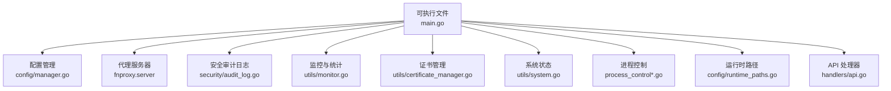
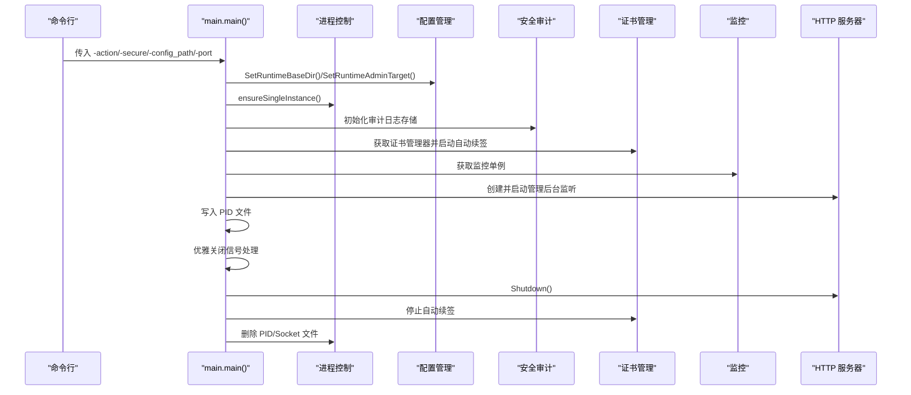
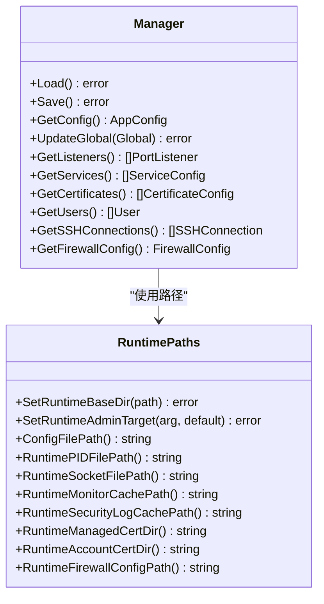
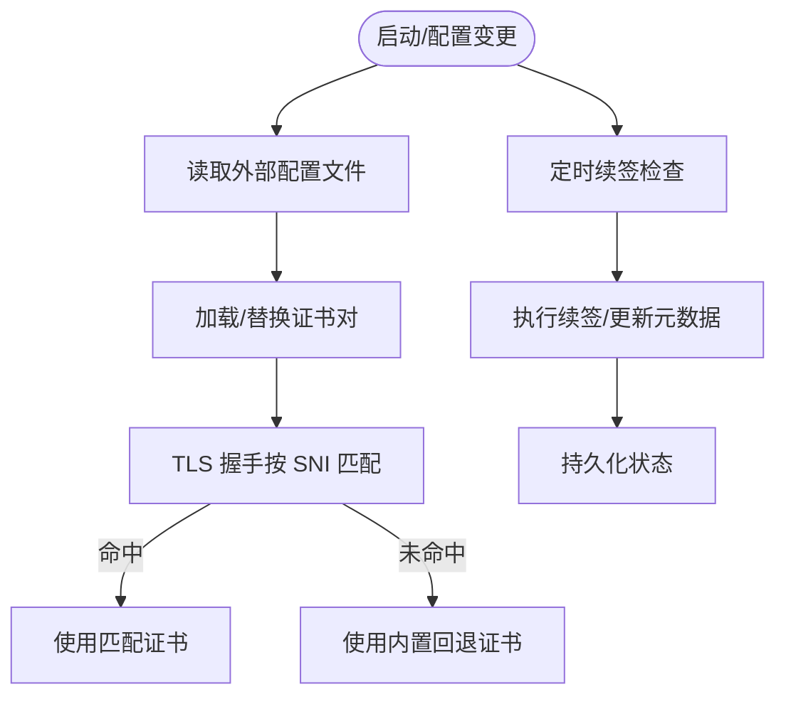
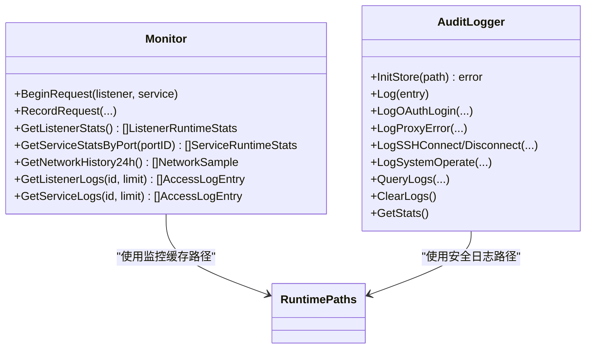
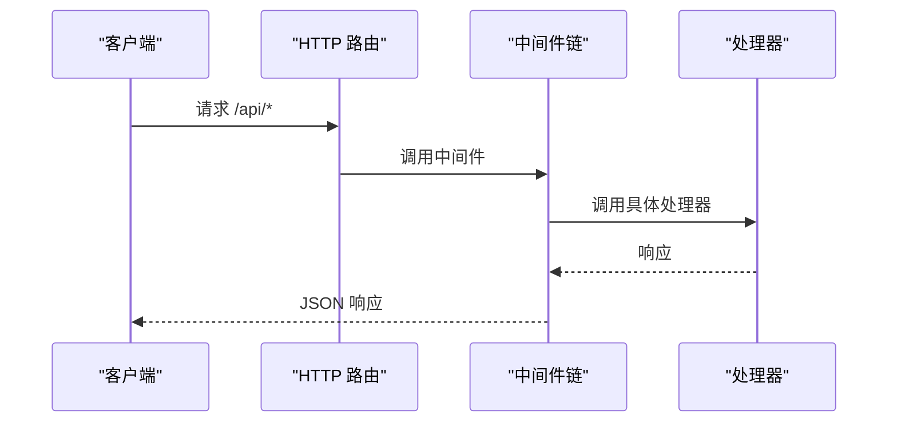
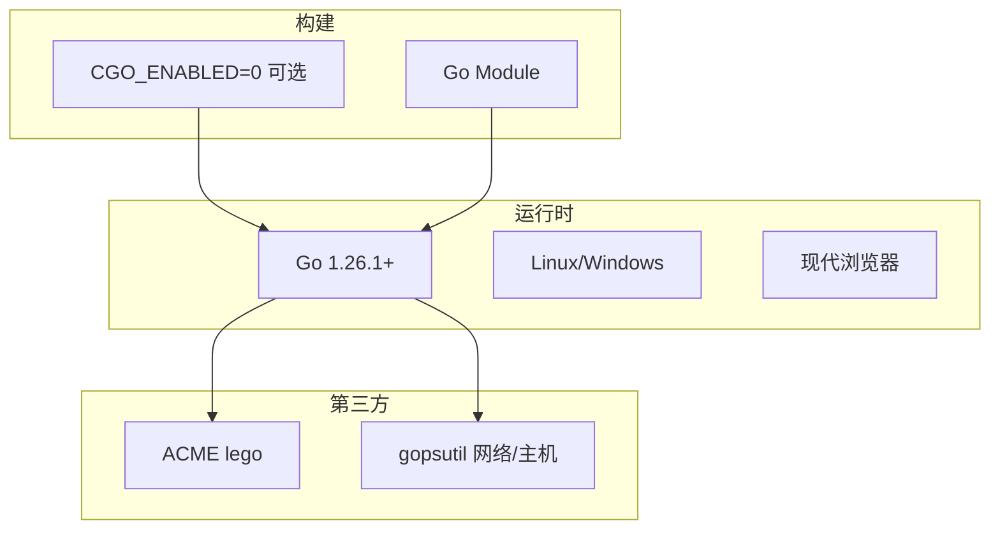

# 部署与运维

<cite>
**本文引用的文件**
- [src/main.go](file://src/main.go)
- [src/process_control.go](file://src/process_control.go)
- [src/process_control_unix.go](file://src/process_control_unix.go)
- [src/process_control_windows.go](file://src/process_control_windows.go)
- [src/config/manager.go](file://src/config/manager.go)
- [src/config/runtime_paths.go](file://src/config/runtime_paths.go)
- [src/utils/monitor.go](file://src/utils/monitor.go)
- [src/utils/system.go](file://src/utils/system.go)
- [src/utils/certificate_manager.go](file://src/utils/certificate_manager.go)
- [src/handlers/api.go](file://src/handlers/api.go)
- [src/security/audit_log.go](file://src/security/audit_log.go)
- [README.md](file://README.md)
- [build.linux.sh](file://build.linux.sh)
- [build.windows.bat](file://build.windows.bat)
- [debug.bat](file://debug.bat)
</cite>

## 目录
1. [简介](#简介)
2. [项目结构](#项目结构)
3. [核心组件](#核心组件)
4. [架构总览](#架构总览)
5. [详细组件分析](#详细组件分析)
6. [依赖分析](#依赖分析)
7. [性能考虑](#性能考虑)
8. [故障排查指南](#故障排查指南)
9. [结论](#结论)
10. [附录](#附录)

## 简介
本指南面向生产环境部署与运维，围绕 Caddy Panel 的系统要求、依赖安装、环境配置、容器化部署、进程控制、配置管理、日志与监控、备份与灾难恢复、性能优化以及运维脚本进行系统性说明。目标是帮助读者在 Linux/Windows 平台安全、稳定地交付与长期维护该服务。

## 项目结构
项目采用 Go Module 结构，前端静态资源内嵌至二进制，运行期配置、缓存、证书与 PID/Socket 文件可统一落盘到指定运行目录，便于隔离与备份。



图示来源
- [src/main.go:1-516](file://src/main.go#L1-L516)
- [src/config/manager.go:1-791](file://src/config/manager.go#L1-L791)
- [src/utils/monitor.go:1-386](file://src/utils/monitor.go#L1-L386)
- [src/utils/certificate_manager.go:1-800](file://src/utils/certificate_manager.go#L1-L800)
- [src/security/audit_log.go:1-224](file://src/security/audit_log.go#L1-L224)
- [src/utils/system.go:1-124](file://src/utils/system.go#L1-L124)
- [src/process_control.go:1-139](file://src/process_control.go#L1-L139)
- [src/config/runtime_paths.go:1-160](file://src/config/runtime_paths.go#L1-L160)
- [src/handlers/api.go:1-785](file://src/handlers/api.go#L1-L785)

章节来源
- [README.md:20-42](file://README.md#L20-L42)
- [README.md:156-166](file://README.md#L156-L166)

## 核心组件
- 进程控制与单实例保护：支持 status/stop/restart，PID 文件与平台差异化的进程存活/终止判定。
- 配置管理：全局配置、监听器、服务、证书、用户、SSH 连接、防火墙配置的持久化与规范化。
- 证书管理：导入、ACME 申请/续期、外部配置文件同步、运行时按 SNI 匹配证书。
- 监控与日志：访问日志、网络历史、连接数、CPU/内存/网络 IO、安全审计日志。
- API 与中间件：认证、CORS、防火墙、日志中间件串联，提供 REST 接口。
- 运行时路径：统一管理配置、缓存、证书、PID、Socket 文件路径。

章节来源
- [src/process_control.go:129-139](file://src/process_control.go#L129-L139)
- [src/config/manager.go:35-72](file://src/config/manager.go#L35-L72)
- [src/utils/certificate_manager.go:140-151](file://src/utils/certificate_manager.go#L140-L151)
- [src/utils/monitor.go:53-65](file://src/utils/monitor.go#L53-L65)
- [src/handlers/api.go:129-137](file://src/handlers/api.go#L129-L137)
- [src/config/runtime_paths.go:31-59](file://src/config/runtime_paths.go#L31-L59)

## 架构总览
下图展示了主流程：启动参数解析、单实例保护、配置与安全初始化、代理与管理后台启动、优雅关闭与资源清理。



图示来源
- [src/main.go:24-110](file://src/main.go#L24-L110)
- [src/process_control.go:129-139](file://src/process_control.go#L129-L139)
- [src/config/manager.go:35-72](file://src/config/manager.go#L35-L72)
- [src/utils/certificate_manager.go:153-160](file://src/utils/certificate_manager.go#L153-L160)
- [src/utils/monitor.go:53-65](file://src/utils/monitor.go#L53-L65)

## 详细组件分析

### 进程控制与单实例保护
- 支持的动作：status、stop、restart；支持从参数或位置参数解析。
- 单实例保护：通过 PID 文件判断进程是否存在并存活，避免重复启动。
- 平台差异：Unix 使用信号判定进程存在；Windows 使用进程句柄与退出码判定。
- 停止流程：终止进程、等待退出、清理 PID 文件；超时则报错。

```mermaid
flowchart TD
Start(["入口"]) --> Parse["解析 action 参数"]
Parse --> Action{"action 类型？"}
Action --> |status| ReadPID["读取 PID 文件"]
ReadPID --> Check["检测进程是否运行"]
Check --> |运行中| PrintOK["打印 PID 与状态"]
Check --> |未运行| CleanPID["清理无效 PID 文件"]
Action --> |stop| StopProc["根据 PID 停止进程"]
StopProc --> WaitExit["等待进程退出"]
WaitExit --> Cleanup["删除 PID 文件"]
Action --> |restart| StopOld["停止旧进程"]
StopOld --> StartNew["启动新进程"]
Action --> |""| SingleInst["单实例保护"]
SingleInst --> Start
PrintOK --> End(["结束"])
CleanPID --> End
Cleanup --> End
StartNew --> End
```

图示来源
- [src/process_control.go:17-28](file://src/process_control.go#L17-L28)
- [src/process_control.go:46-65](file://src/process_control.go#L46-L65)
- [src/process_control.go:84-109](file://src/process_control.go#L84-L109)
- [src/process_control.go:111-127](file://src/process_control.go#L111-L127)
- [src/process_control_unix.go:11-23](file://src/process_control_unix.go#L11-L23)
- [src/process_control_windows.go:14-32](file://src/process_control_windows.go#L14-L32)

章节来源
- [src/process_control.go:129-139](file://src/process_control.go#L129-L139)
- [src/process_control_unix.go:1-35](file://src/process_control_unix.go#L1-L35)
- [src/process_control_windows.go:1-49](file://src/process_control_windows.go#L1-L49)

### 配置管理与热重载
- 配置文件：统一在运行目录下持久化，含监听器、服务、证书、用户、SSH、防火墙等。
- 规范化：缺失字段自动补默认值；服务排序与默认规则处理；证书来源与续期参数标准化。
- 热重载：监听器启停、服务启停与重载、证书导入/更新/续签均支持在线生效。
- 运行时路径：支持 -config_path 指定运行目录，-port 指定 TCP 端口或 Unix Socket。



图示来源
- [src/config/manager.go:35-72](file://src/config/manager.go#L35-L72)
- [src/config/manager.go:74-107](file://src/config/manager.go#L74-L107)
- [src/config/manager.go:227-232](file://src/config/manager.go#L227-L232)
- [src/config/runtime_paths.go:31-59](file://src/config/runtime_paths.go#L31-L59)
- [src/config/runtime_paths.go:85-115](file://src/config/runtime_paths.go#L85-L115)
- [src/config/runtime_paths.go:117-141](file://src/config/runtime_paths.go#L117-L141)

章节来源
- [src/config/manager.go:109-137](file://src/config/manager.go#L109-L137)
- [src/config/manager.go:158-210](file://src/config/manager.go#L158-L210)
- [src/config/manager.go:227-232](file://src/config/manager.go#L227-L232)
- [src/config/runtime_paths.go:117-141](file://src/config/runtime_paths.go#L117-L141)

### 证书管理与 HTTPS
- 支持导入 PEM 证书、外部配置文件同步、ACME 自动申请与续期（HTTP-01/DNS-01，含多家 DNS 提供商）。
- 运行时按 SNI 匹配证书，未命中使用内置回退证书。
- 维护任务：定时同步、续签调度、错误记录与清理。



图示来源
- [src/utils/certificate_manager.go:153-160](file://src/utils/certificate_manager.go#L153-L160)
- [src/utils/certificate_manager.go:192-216](file://src/utils/certificate_manager.go#L192-L216)
- [src/utils/certificate_manager.go:218-251](file://src/utils/certificate_manager.go#L218-L251)
- [src/utils/certificate_manager.go:271-285](file://src/utils/certificate_manager.go#L271-L285)
- [src/utils/certificate_manager.go:595-629](file://src/utils/certificate_manager.go#L595-L629)

章节来源
- [src/utils/certificate_manager.go:140-151](file://src/utils/certificate_manager.go#L140-L151)
- [src/utils/certificate_manager.go:271-285](file://src/utils/certificate_manager.go#L271-L285)
- [src/utils/certificate_manager.go:595-629](file://src/utils/certificate_manager.go#L595-L629)

### 监控与日志
- 访问日志：记录请求耗时、字节数、状态码、用户、远端地址等，支持按监听器/服务过滤。
- 网络历史：按 10 分钟窗口聚合近 24 小时入/出速率。
- 系统状态：运行时 CPU/内存/网络 IO、主机信息、运行时长。
- 安全审计：OAuth 登录、代理错误、SSH 连接/断开、系统操作等。



图示来源
- [src/utils/monitor.go:38-65](file://src/utils/monitor.go#L38-L65)
- [src/utils/monitor.go:131-189](file://src/utils/monitor.go#L131-L189)
- [src/utils/monitor.go:253-321](file://src/utils/monitor.go#L253-L321)
- [src/utils/monitor.go:323-355](file://src/utils/monitor.go#L323-L355)
- [src/utils/monitor.go:357-380](file://src/utils/monitor.go#L357-L380)
- [src/security/audit_log.go:25-31](file://src/security/audit_log.go#L25-L31)
- [src/security/audit_log.go:62-80](file://src/security/audit_log.go#L62-L80)
- [src/security/audit_log.go:168-183](file://src/security/audit_log.go#L168-L183)

章节来源
- [src/utils/monitor.go:19-21](file://src/utils/monitor.go#L19-L21)
- [src/utils/system.go:19-82](file://src/utils/system.go#L19-L82)
- [src/security/audit_log.go:168-183](file://src/security/audit_log.go#L168-L183)

### API 与中间件
- 中间件链：防火墙、认证、CORS、日志。
- 管理后台：登录、登出、用户、监听器、服务、证书、防火墙、安全日志、状态与指标等接口。
- 重启代理：触发代理层热重载或重启。



图示来源
- [src/main.go:421-430](file://src/main.go#L421-L430)
- [src/handlers/api.go:129-137](file://src/handlers/api.go#L129-L137)
- [src/handlers/api.go:777-784](file://src/handlers/api.go#L777-L784)

章节来源
- [src/main.go:112-430](file://src/main.go#L112-L430)
- [src/handlers/api.go:129-137](file://src/handlers/api.go#L129-L137)
- [src/handlers/api.go:777-784](file://src/handlers/api.go#L777-L784)

## 依赖分析
- 运行时依赖：Go 1.26.1+，Linux/Windows，现代浏览器。
- 构建依赖：Go Module，CGO 可禁用（静态链接）。
- 第三方库：ACME 客户端、网络统计、主机信息等。



图示来源
- [README.md:44-48](file://README.md#L44-L48)
- [build.linux.sh:10](file://build.linux.sh#L10)
- [build.windows.bat:13](file://build.windows.bat#L13)

章节来源
- [README.md:44-48](file://README.md#L44-L48)
- [build.linux.sh:10](file://build.linux.sh#L10)
- [build.windows.bat:13](file://build.windows.bat#L13)

## 性能考虑
- 静态链接与裁剪：构建时使用 -trimpath，CGO 可禁用以减小体积与提升可移植性。
- 监控采样：网络采样周期与速率窗口固定，避免高频 IO；访问日志按需写入。
- 证书续签：定时器与间隔可配置，默认约 1 小时；仅在到期前窗口触发续签。
- 日志容量：访问日志与安全日志上限可配置，防止无限增长。

章节来源
- [build.linux.sh:10](file://build.linux.sh#L10)
- [build.windows.bat:13](file://build.windows.bat#L13)
- [src/utils/monitor.go:16-21](file://src/utils/monitor.go#L16-L21)
- [src/utils/certificate_manager.go:184-190](file://src/utils/certificate_manager.go#L184-L190)
- [src/config/manager.go:109-137](file://src/config/manager.go#L109-L137)

## 故障排查指南
- 启动失败（单实例保护）：检查 PID 文件是否存在与进程是否存活；使用 status 查看状态；必要时手动清理 PID 文件。
- 端口占用：监听器创建/更新时若端口被占用，系统会保存为未启用状态；确认端口可用后再启用。
- 证书问题：外部配置文件同步失败或证书文件变更未生效，检查配置路径与文件权限；查看最近错误日志。
- 优雅关闭：SIGINT/SIGTERM 触发关闭流程，确保代理与 HTTP 服务有序关闭，清理 Socket/PID 文件。
- 安全日志：通过查询接口定位异常事件，结合系统操作日志核对行为轨迹。

章节来源
- [src/process_control.go:111-127](file://src/process_control.go#L111-L127)
- [src/process_control.go:84-109](file://src/process_control.go#L84-L109)
- [src/handlers/api.go:166-180](file://src/handlers/api.go#L166-L180)
- [src/utils/certificate_manager.go:595-629](file://src/utils/certificate_manager.go#L595-L629)
- [src/main.go:482-514](file://src/main.go#L482-L514)
- [src/security/audit_log.go:168-183](file://src/security/audit_log.go#L168-L183)

## 结论
通过统一的运行目录、完善的进程控制、可热重载的配置与证书管理、可观测的日志与监控体系，Caddy Panel 能够满足生产环境的稳定性与可维护性需求。配合本文提供的部署与运维建议，可在多平台上实现安全、可控、可追溯的长期运营。

## 附录

### 生产环境部署最佳实践
- 系统要求与依赖
  - Go 版本：1.26.1+
  - 操作系统：Linux/Windows
  - 浏览器：现代浏览器
- 依赖安装
  - 使用官方 Go 发行版；如需静态链接，构建时设置 CGO_ENABLED=0。
- 环境配置
  - 使用 -config_path 指定统一运行目录，包含配置、缓存、证书、PID、Socket。
  - 使用 -port 指定 TCP 端口或 sock（Unix Socket），避免与监听器端口冲突。
  - 显式设置 -secure 参数，避免使用默认密钥。

章节来源
- [README.md:44-48](file://README.md#L44-L48)
- [README.md:105-130](file://README.md#L105-L130)
- [README.md:156-166](file://README.md#L156-L166)

### 容器化部署方案
- Docker
  - 基础镜像：官方最小化基础镜像（如 alpine 或 distroless）。
  - 构建产物：使用 build.linux.sh 或 build.windows.bat 产出二进制，拷贝至容器。
  - 挂载卷：将 -config_path 指定的目录映射为持久卷。
  - 健康检查：暴露管理端口，使用 /api/status 健康探针。
  - 安全：以非 root 用户运行；限制资源配额；只开放必要端口。
- Kubernetes
  - Deployment/StatefulSet：StatefulSet 更适合需要稳定存储的场景。
  - ConfigMap：存放初始配置（如默认用户、监听器模板）。
  - Secret：存放 -secure 参数与敏感配置。
  - Service/Ingress：对外暴露管理端口或通过 Ingress 管理。
  - PodDisruptionBudget：保证高可用滚动升级。
  - Liveness/Readiness Probe：基于 /api/status。

[本节为概念性部署建议，不直接映射具体源文件]

### 进程控制、状态检查与优雅重启
- 使用 -action=status/stop/restart 或位置参数调用。
- 单实例保护：PID 文件存在且进程存活时拒绝二次启动。
- 优雅关闭：捕获 SIGINT/SIGTERM，依次关闭代理、HTTP 服务、清理 Socket/PID 文件。

章节来源
- [src/main.go:24-77](file://src/main.go#L24-L77)
- [src/process_control.go:129-139](file://src/process_control.go#L129-L139)
- [src/process_control.go:84-109](file://src/process_control.go#L84-L109)
- [src/main.go:482-514](file://src/main.go#L482-L514)

### 配置管理策略
- 配置文件组织：统一在运行目录下持久化，便于备份与迁移。
- 环境变量：建议通过容器/系统服务注入 -secure 与 -config_path。
- 热重载：监听器启停、服务启停与重载、证书导入/更新/续签均支持在线生效。

章节来源
- [src/config/runtime_paths.go:85-115](file://src/config/runtime_paths.go#L85-L115)
- [src/handlers/api.go:377-379](file://src/handlers/api.go#L377-L379)
- [src/handlers/api.go:406-411](file://src/handlers/api.go#L406-L411)
- [src/utils/certificate_manager.go:153-160](file://src/utils/certificate_manager.go#L153-L160)

### 日志管理方案
- 日志级别：通过全局配置 LogLevel 控制。
- 轮转策略：日志文件名与保留天数可配置；访问日志与安全日志上限可配置。
- 集中化收集：建议将运行目录挂载到集中日志系统；安全日志与访问日志分别采集。

章节来源
- [src/config/manager.go:109-137](file://src/config/manager.go#L109-L137)
- [src/utils/monitor.go:357-380](file://src/utils/monitor.go#L357-L380)
- [src/security/audit_log.go:168-183](file://src/security/audit_log.go#L168-L183)

### 监控告警配置
- 关键指标：CPU/内存/网络 IO、活动连接数、请求量、字节入/出速率、24 小时网络历史。
- 告警建议：CPU/内存使用率阈值、网络 IO 异常、代理错误率、证书即将过期、安全事件告警。

章节来源
- [src/utils/system.go:19-82](file://src/utils/system.go#L19-L82)
- [src/utils/monitor.go:253-321](file://src/utils/monitor.go#L253-L321)
- [src/utils/monitor.go:323-355](file://src/utils/monitor.go#L323-L355)

### 备份策略与灾难恢复
- 备份对象：运行目录（配置、缓存、证书、PID、Socket）。
- 备份频率：增量备份证书与配置，定期全量备份。
- 灾难恢复：在新节点上恢复运行目录，验证 PID/Socket 文件与证书有效性，启动服务并检查 /api/status。

章节来源
- [README.md:156-166](file://README.md#L156-L166)
- [src/config/runtime_paths.go:85-115](file://src/config/runtime_paths.go#L85-L115)

### 运维脚本与自动化工具
- 构建脚本：build.linux.sh、build.windows.bat、debug.bat。
- 使用建议：CI/CD 中集成构建脚本，产出二进制后进行容器化打包与部署。

章节来源
- [build.linux.sh:1-13](file://build.linux.sh#L1-L13)
- [build.windows.bat:1-21](file://build.windows.bat#L1-L21)
- [debug.bat:1-27](file://debug.bat#L1-L27)