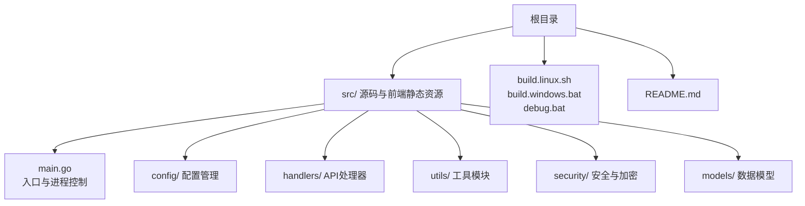
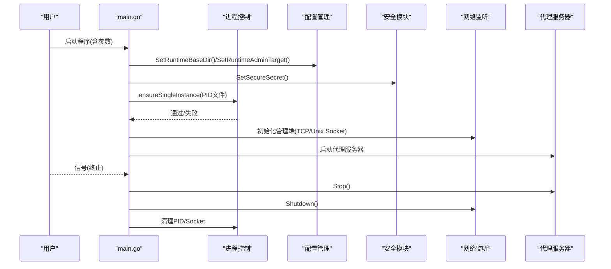
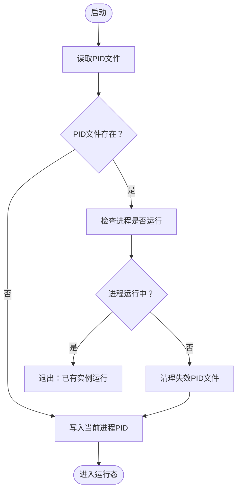
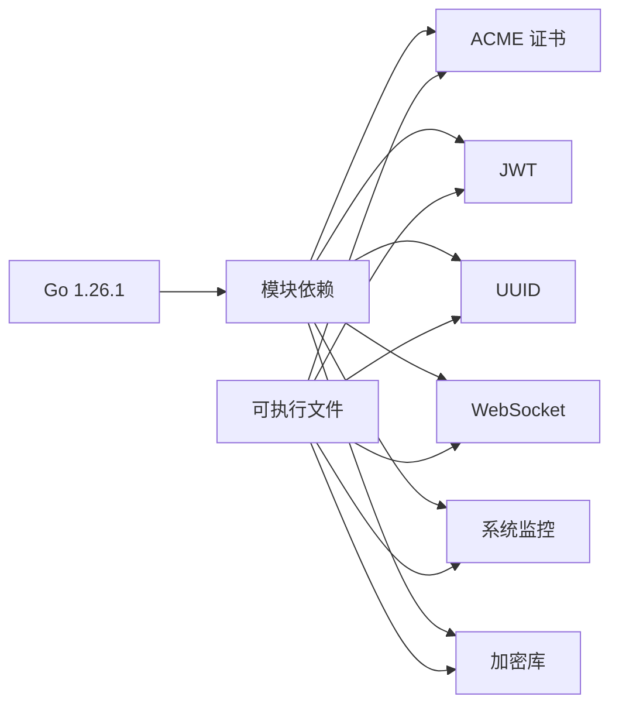

# 部署环境准备

<cite>
**本文引用的文件**
- [README.md](file://README.md)
- [src/go.mod](file://src/go.mod)
- [src/main.go](file://src/main.go)
- [src/process_control.go](file://src/process_control.go)
- [src/process_control_unix.go](file://src/process_control_unix.go)
- [src/process_control_windows.go](file://src/process_control_windows.go)
- [src/config/runtime_paths.go](file://src/config/runtime_paths.go)
- [src/config/manager.go](file://src/config/manager.go)
- [src/security/secret.go](file://src/security/secret.go)
- [src/models/models.go](file://src/models/models.go)
- [build.linux.sh](file://build.linux.sh)
- [build.windows.bat](file://build.windows.bat)
- [debug.bat](file://debug.bat)
</cite>

## 目录
1. [简介](#简介)
2. [项目结构](#项目结构)
3. [核心组件](#核心组件)
4. [架构总览](#架构总览)
5. [详细组件分析](#详细组件分析)
6. [依赖关系分析](#依赖关系分析)
7. [性能考虑](#性能考虑)
8. [故障排查指南](#故障排查指南)
9. [结论](#结论)
10. [附录](#附录)

## 简介
本指南面向 Caddy Panel（fnproxy-panel）的部署与运维团队，提供从系统要求、编译环境配置、跨平台构建脚本使用，到单实例保护机制、环境变量与权限、网络端口、以及容器化部署前准备的完整说明。文档严格依据仓库内的实际实现与说明文件编写，确保可操作性与准确性。

## 项目结构
项目采用 Go Module 结构，源码位于 src/ 目录，顶层提供跨平台构建脚本与调试脚本。运行时配置、缓存、证书与 PID 文件可统一落盘至由 -config_path 指定的目录，便于集中管理与备份。

图表来源
- [README.md:20-42](file://README.md#L20-L42)
- [src/main.go:1-50](file://src/main.go#L1-L50)

章节来源
- [README.md:20-42](file://README.md#L20-L42)
- [src/main.go:1-50](file://src/main.go#L1-L50)

## 核心组件
- 入口与进程控制：负责解析启动参数、单实例保护、PID 文件写入、管理端监听（TCP/Unix Socket）、优雅关闭与信号处理。
- 配置管理：提供全局配置、监听器、服务、证书、用户、SSH、防火墙等配置的加载、保存与规范化。
- 运行时路径：统一管理运行时根目录、配置文件、PID 文件、Socket 文件、缓存与证书目录的解析与创建。
- 安全与加密：提供基于安全参数的敏感数据加解密能力，兼容历史明文以保证平滑升级。
- 数据模型：定义应用配置、监听器、服务、证书、用户、SSH、防火墙、安全日志等核心实体。

章节来源
- [src/main.go:24-127](file://src/main.go#L24-L127)
- [src/config/manager.go:35-72](file://src/config/manager.go#L35-L72)
- [src/config/runtime_paths.go:31-160](file://src/config/runtime_paths.go#L31-L160)
- [src/security/secret.go:16-81](file://src/security/secret.go#L16-L81)
- [src/models/models.go:72-394](file://src/models/models.go#L72-L394)

## 架构总览
下图展示了从启动到运行的关键流程：参数解析、单实例保护、安全参数加载、配置初始化、管理端监听、代理服务器启动与优雅关闭。

图表来源
- [src/main.go:24-127](file://src/main.go#L24-L127)
- [src/process_control.go:129-138](file://src/process_control.go#L129-L138)
- [src/config/runtime_paths.go:117-160](file://src/config/runtime_paths.go#L117-L160)
- [src/security/secret.go:16-40](file://src/security/secret.go#L16-L40)

章节来源
- [src/main.go:24-127](file://src/main.go#L24-L127)

## 详细组件分析

### 系统要求与环境变量
- 操作系统兼容性：支持 Windows 与 Linux。
- Go 版本要求：1.26.1 或更高版本。
- 现代浏览器：用于访问管理后台。
- 环境变量（构建阶段）：
  - CGO_ENABLED=0：禁用 CGO，确保纯静态二进制，提升可移植性。
  - GOOS、GOARCH：用于交叉编译目标平台与架构。
- 运行时参数（启动阶段）：
  - -secure：用于密码摘要、OAuth 登录加解密、SSH 密码加密等安全相关逻辑。未指定时使用默认值，生产环境建议显式指定。
  - -config_path：指定运行时根目录，配置文件、缓存、证书、PID 文件、Socket 文件均落于此目录。
  - -port：设置管理端监听方式。传数字表示 TCP 端口；传 sock 表示使用 Unix Socket。
  - -action=status/stop/restart：进程控制动作，结合 PID 文件进行状态查询、停止与重启。

章节来源
- [README.md:44-48](file://README.md#L44-L48)
- [src/go.mod:3](file://src/go.mod#L3)
- [README.md:105-129](file://README.md#L105-L129)
- [src/main.go:24-29](file://src/main.go#L24-L29)

### 编译环境配置与交叉编译
- 构建参数要点：
  - -trimpath：移除构建路径，便于分发与审计。
  - CGO_ENABLED=0：禁用 CGO，避免链接系统 C 库，确保二进制可移植。
  - GOOS/GOARCH：指定目标平台与架构（示例为 amd64）。
- 跨平台构建脚本：
  - Linux：build.linux.sh 使用 CGO_ENABLED=0、GOOS=linux、GOARCH=amd64 执行构建。
  - Windows：build.windows.bat 使用 CGO_ENABLED=0、GOOS=windows、GOARCH=amd64 执行构建。
  - 调试：debug.bat 同样设置 CGO_ENABLED=0 并在 debug/ 目录启动，便于隔离运行期配置与证书文件。

章节来源
- [README.md:50-96](file://README.md#L50-L96)
- [build.linux.sh:10](file://build.linux.sh#L10)
- [build.windows.bat:8-13](file://build.windows.bat#L8-L13)
- [debug.bat:9-22](file://debug.bat#L9-L22)

### 单实例保护机制
- 实现原理：
  - 启动时根据 PID 文件判断是否已有实例运行；若存在且进程仍在运行，则直接退出，避免多实例冲突。
  - 进程控制函数族负责读取 PID 文件、判断进程是否存在、终止进程、等待退出、清理 PID 文件等。
  - 平台差异：Unix 使用 syscall.Kill(pid, 0) 判断进程存在性与权限；Windows 使用 Windows API 查询进程状态与终止进程。
- 配置方法：
  - 通过 -config_path 指定运行时根目录，PID 文件将写入该目录。
  - 使用 -action=status/stop/restart 可配合 PID 文件进行进程生命周期管理。

图表来源
- [src/process_control.go:30-65](file://src/process_control.go#L30-L65)
- [src/process_control.go:129-138](file://src/process_control.go#L129-L138)
- [src/process_control_unix.go:11-23](file://src/process_control_unix.go#L11-L23)
- [src/process_control_windows.go:14-32](file://src/process_control_windows.go#L14-L32)

章节来源
- [src/process_control.go:17-138](file://src/process_control.go#L17-L138)
- [src/process_control_unix.go:11-34](file://src/process_control_unix.go#L11-L34)
- [src/process_control_windows.go:14-48](file://src/process_control_windows.go#L14-L48)
- [README.md:18](file://README.md#L18)

### 环境变量、权限与网络端口
- 环境变量（构建）：
  - CGO_ENABLED=0：禁用 CGO。
  - GOOS、GOARCH：交叉编译目标平台与架构。
- 权限配置：
  - 运行时根目录与子目录（如 cache、certs）需具备读写权限，以便持久化配置、缓存与证书。
  - PID 文件与 Unix Socket 文件所在目录需具备写权限，以便写入与删除。
- 网络端口：
  - 管理后台默认端口：8080（可通过配置覆盖）。
  - -port 参数支持：
    - 数字：绑定 TCP 端口。
    - sock：使用 Unix Socket（路径位于运行时根目录）。
  - 代理监听：由代理服务器根据配置动态启动，可能占用多个端口；若部分端口启动失败，程序会记录告警但仍继续运行。

章节来源
- [src/config/manager.go:40-50](file://src/config/manager.go#L40-L50)
- [src/config/runtime_paths.go:117-160](file://src/config/runtime_paths.go#L117-L160)
- [src/main.go:433-458](file://src/main.go#L433-L458)

### 安全参数与加密
- -secure 参数：
  - 用于密码摘要、OAuth 登录加解密、SSH 密码加密等安全相关逻辑。
  - 未指定时使用默认值，仅适合开发调试；生产环境必须显式指定。
- 敏感数据加解密：
  - 基于 AES-GCM 的对称加密，使用安全参数派生密钥，生成随机 Nonce 并进行加解密。
  - 兼容历史明文存储，避免升级导致的连接失效。

章节来源
- [README.md:109-111](file://README.md#L109-L111)
- [src/security/secret.go:16-81](file://src/security/secret.go#L16-L81)

### 运行期文件与路径
- 运行时根目录（-config_path）：
  - 主配置文件、监控缓存、证书目录、PID 文件、Unix Socket 文件均落于此目录。
- 路径解析与创建：
  - 若目录不存在，运行时会自动创建；绝对/相对路径均可，最终解析为绝对路径。
- 管理端监听路径：
  - TCP：":端口"
  - Unix Socket："unix://路径"

章节来源
- [README.md:156-166](file://README.md#L156-L166)
- [src/config/runtime_paths.go:31-83](file://src/config/runtime_paths.go#L31-L83)
- [src/config/runtime_paths.go:117-160](file://src/config/runtime_paths.go#L117-L160)

### 容器化部署前准备
- 镜像构建建议：
  - 使用官方 Go 基础镜像进行构建，确保 Go 版本满足要求。
  - 在构建阶段设置 CGO_ENABLED=0，以获得更佳的可移植性。
- 依赖准备：
  - 由于禁用 CGO，无需安装系统 C 库依赖。
  - 确保容器内具备写权限的目录用于挂载 -config_path 指定的运行时根目录。
- 运行时注意事项：
  - 明确指定 -config_path，避免运行时文件散落。
  - 如需 Unix Socket，请在容器内正确映射 Socket 文件所在目录。
  - 生产环境务必显式设置 -secure 参数。

章节来源
- [README.md:44-48](file://README.md#L44-L48)
- [build.linux.sh:10](file://build.linux.sh#L10)
- [build.windows.bat:8-13](file://build.windows.bat#L8-L13)
- [README.md:113-114](file://README.md#L113-L114)

## 依赖关系分析
- 模块与工具链：
  - Go 版本：1.26.1
  - 第三方依赖：ACME 证书、JWT、UUID、WebSocket、系统监控、加密库等。
- 运行时依赖：
  - 无系统 C 库依赖（CGO 禁用），可在多数 Linux 发行版与 Windows 上直接运行。
- 进程控制与平台差异：
  - Unix 与 Windows 分别实现进程存在性判断与终止逻辑，确保跨平台一致性。

图表来源
- [src/go.mod:5-13](file://src/go.mod#L5-L13)

章节来源
- [src/go.mod:3-48](file://src/go.mod#L3-L48)

## 性能考虑
- 禁用 CGO 的收益：减少二进制体积与运行时依赖，提升跨平台可移植性。
- 纯内存缓存：监控与安全日志采用内存数据库（bbolt）持久化，注意 -config_path 目录的磁盘 I/O 性能。
- 优雅关闭：通过信号处理与上下文超时，确保代理与 HTTP 服务有序关闭，降低数据丢失风险。

## 故障排查指南
- 启动失败（已有实例运行）：
  - 检查 PID 文件是否存在且对应进程仍在运行；使用 -action=stop 或手动清理 PID 文件后重试。
- 管理端无法访问：
  - 确认 -port 参数与防火墙策略；TCP 模式下检查端口占用；Unix Socket 模式下确认 Socket 文件路径与权限。
- 安全参数问题：
  - 若更改 -secure 参数，请确保配置文件与缓存未被旧密钥污染；必要时迁移配置。
- 证书相关：
  - 检查证书目录权限与外部证书同步配置；关注自动续期日志与错误信息。

章节来源
- [src/process_control.go:111-127](file://src/process_control.go#L111-L127)
- [src/main.go:433-458](file://src/main.go#L433-L458)
- [src/config/manager.go:654-698](file://src/config/manager.go#L654-L698)

## 结论
Caddy Panel 提供了简洁可靠的部署体验：通过禁用 CGO 与统一的运行时根目录，显著降低了部署复杂度；内置的单实例保护与优雅关闭机制提升了运行稳定性。遵循本文档的系统要求、构建参数与权限配置，即可在 Windows 与 Linux 环境中快速完成部署，并为容器化运行做好充分准备。

## 附录
- 快速开始命令示例（来自项目说明）：
  - 开发构建：在项目根目录执行构建命令。
  - Windows 构建脚本：build.windows.bat。
  - Linux 构建脚本：build.linux.sh。
  - 本地调试：debug.bat。
  - 直接运行：分别在 Windows 与 Linux 平台运行对应可执行文件。
- 启动参数与示例：详见 README 中的“启动参数”与“示例”。

章节来源
- [README.md:50-96](file://README.md#L50-L96)
- [README.md:105-154](file://README.md#L105-L154)