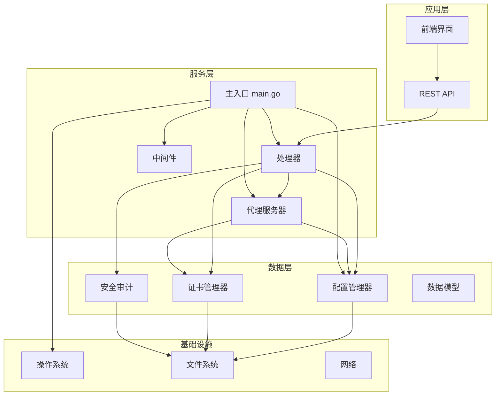
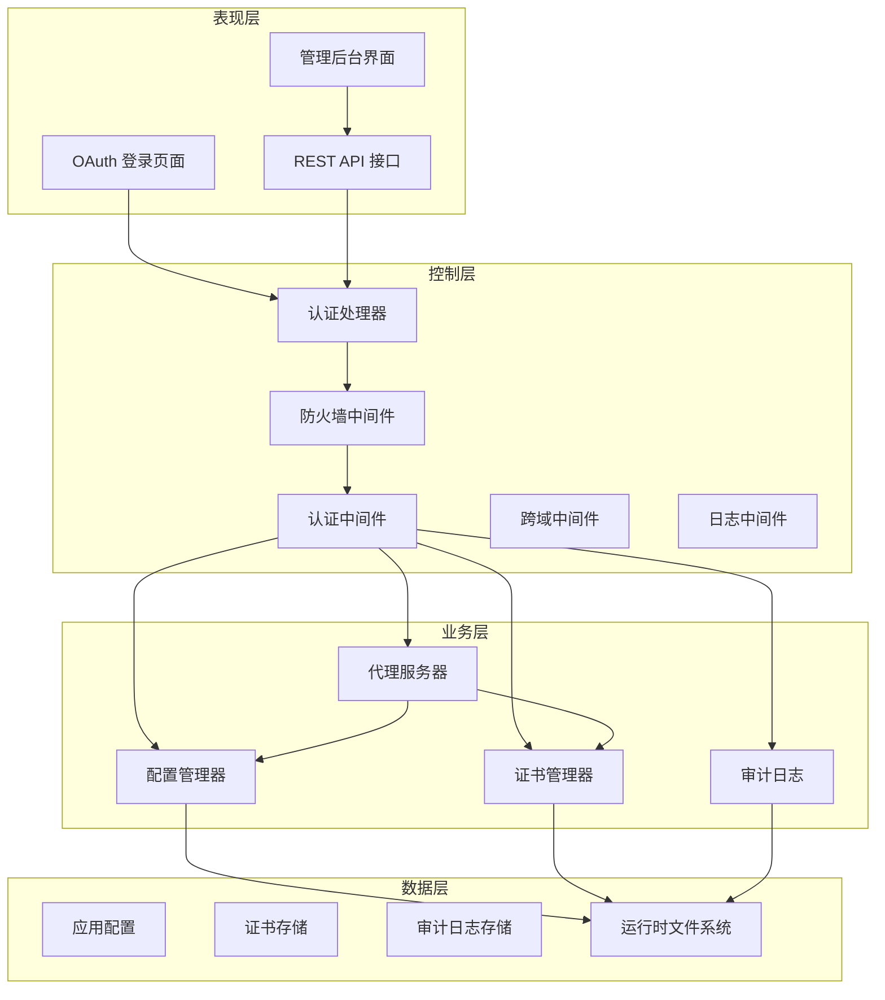
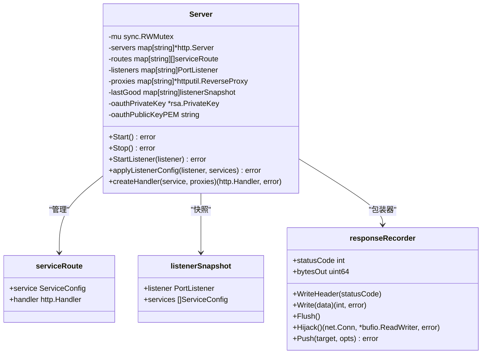
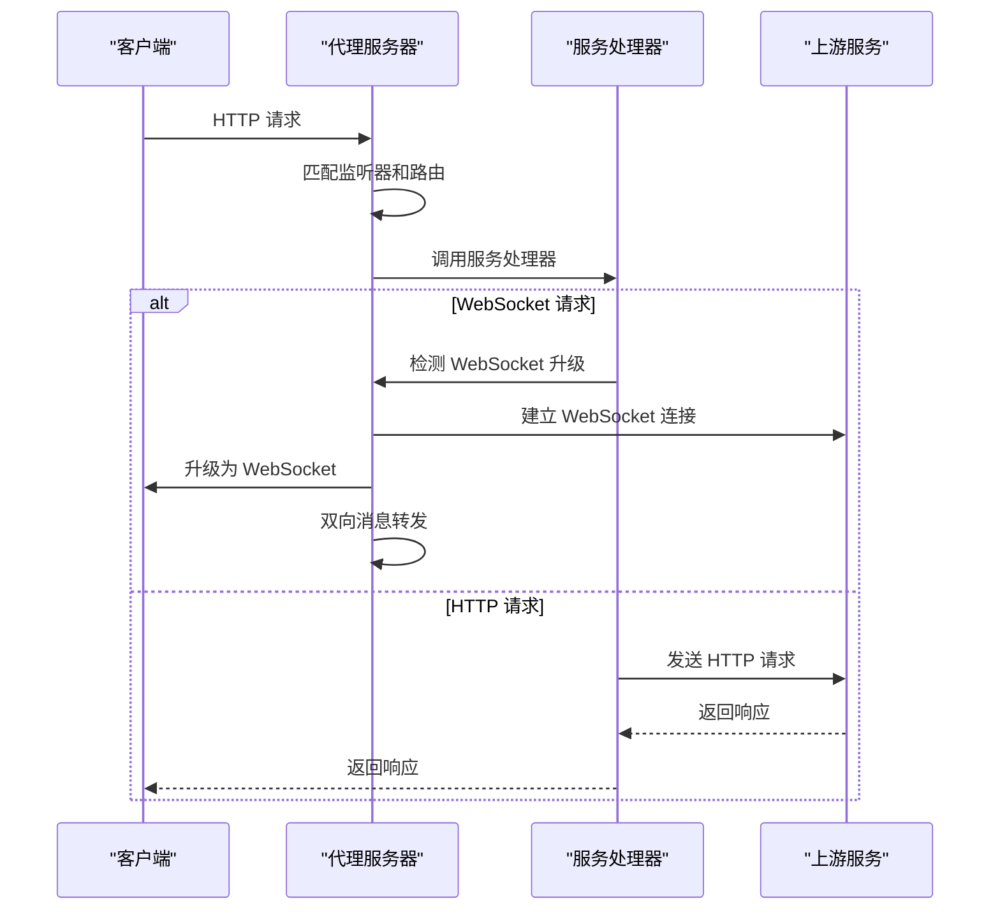
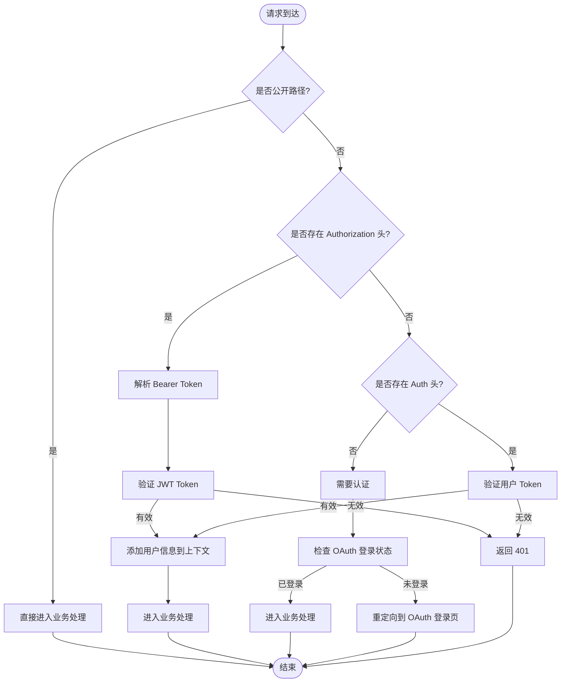
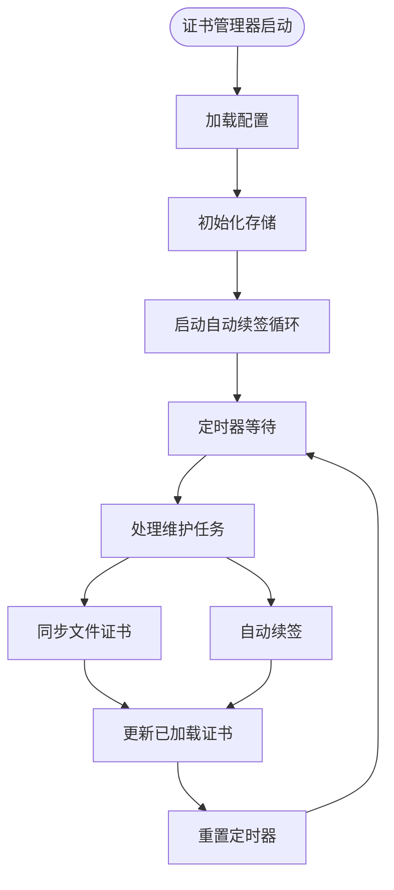
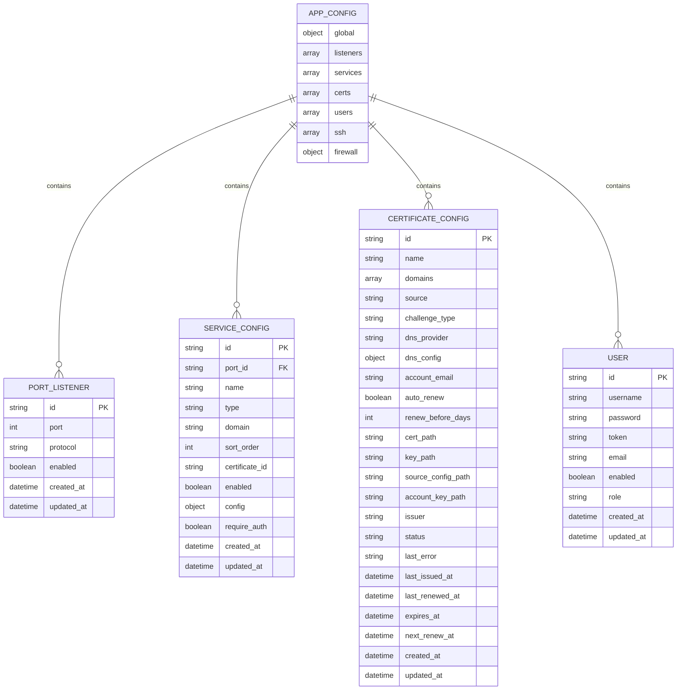
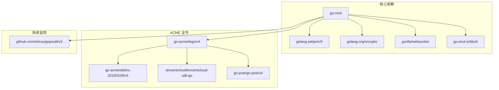

# 技术架构概览

<cite>
**本文档引用的文件**
- [main.go](file://src/main.go)
- [go.mod](file://src/go.mod)
- [README.md](file://README.md)
- [process_control.go](file://src/process_control.go)
- [server.go](file://src/fnproxy/server.go)
- [manager.go](file://src/config/manager.go)
- [auth.go](file://src/handlers/auth.go)
- [auth_middleware.go](file://src/middleware/auth.go)
- [certificate_manager.go](file://src/utils/certificate_manager.go)
- [audit_log.go](file://src/security/audit_log.go)
- [models.go](file://src/models/models.go)
- [page.go](file://src/pkg/oauth/page.go)
- [system.go](file://src/utils/system.go)
- [static_embed.go](file://src/static_embed.go)
</cite>

## 目录
1. [简介](#简介)
2. [项目结构](#项目结构)
3. [核心组件](#核心组件)
4. [架构总览](#架构总览)
5. [详细组件分析](#详细组件分析)
6. [依赖关系分析](#依赖关系分析)
7. [性能考虑](#性能考虑)
8. [故障排查指南](#故障排查指南)
9. [结论](#结论)

## 简介
Caddy Panel 是一个基于 Go 1.26.1+ 的轻量级服务管理面板，提供统一的网站管理、反向代理、静态站点、跳转规则、证书管理、OAuth 访问控制、用户管理、SSH 终端和运行状态监控能力。项目采用模块化设计，支持单文件部署、无外部依赖、进程控制等功能特性，适合在生产环境中进行快速部署和运维管理。

## 项目结构
项目采用模块化分层组织，主要目录结构如下：
- src：Go 模块根目录，包含所有源代码
  - config：配置管理模块
  - fnproxy：代理服务器核心实现
  - handlers：HTTP 请求处理器
  - middleware：中间件层
  - models：数据模型定义
  - security：安全审计模块
  - utils：工具类库
  - pkg/oauth：OAuth 登录页面渲染
  - static：前端静态资源（内嵌到可执行文件）
- documents：设计与变更文档
- 构建脚本：跨平台构建与调试脚本

**图表来源**
- [main.go:24-516](file://src/main.go#L24-L516)
- [server.go:37-181](file://src/fnproxy/server.go#L37-L181)
- [manager.go:18-72](file://src/config/manager.go#L18-L72)

**章节来源**
- [README.md:20-42](file://README.md#L20-L42)
- [go.mod:1-48](file://src/go.mod#L1-L48)

## 核心组件
项目采用分层架构和中间件模式，核心组件包括：

### 1. 应用入口与进程控制
- main.go：应用主入口，负责参数解析、进程控制、服务启动与优雅关闭
- process_control.go：进程控制模块，支持 status、stop、restart 操作

### 2. 代理服务器核心
- fnproxy/server.go：代理服务器实现，支持动态路由、热重载、WebSocket 代理
- 支持 HTTP/HTTPS 监听，动态证书选择，服务级 OAuth 控制

### 3. 配置管理系统
- config/manager.go：配置管理器，负责应用配置的加载、保存、热更新
- 支持监听器、服务规则、证书、用户、SSH 连接等配置管理

### 4. 认证与授权
- handlers/auth.go：认证处理器，支持 JWT 登录、OAuth 登录、用户管理
- middleware/auth.go：认证中间件，支持 Header Token 鉴权和管理员权限控制
- pkg/oauth/page.go：OAuth 登录页面渲染，支持浏览器端加密传输

### 5. 证书管理
- utils/certificate_manager.go：ACME 证书管理，支持自动申请、续签、文件同步
- 支持 HTTP-01/DNS-01 校验，多 DNS 服务商集成

### 6. 安全审计
- security/audit_log.go：安全审计日志，记录 OAuth 登录、代理错误、SSH 连接等事件
- 支持日志查询、统计、清理功能

**章节来源**
- [main.go:24-110](file://src/main.go#L24-L110)
- [server.go:37-181](file://src/fnproxy/server.go#L37-L181)
- [manager.go:18-72](file://src/config/manager.go#L18-L72)
- [auth.go:37-76](file://src/handlers/auth.go#L37-L76)
- [auth_middleware.go:14-55](file://src/middleware/auth.go#L14-L55)

## 架构总览
项目采用典型的三层架构设计，结合中间件模式和模块化思想：

**图表来源**
- [main.go:112-430](file://src/main.go#L112-L430)
- [server.go:370-425](file://src/fnproxy/server.go#L370-L425)
- [manager.go:35-72](file://src/config/manager.go#L35-L72)
- [certificate_manager.go:126-151](file://src/utils/certificate_manager.go#L126-L151)

## 详细组件分析

### 代理服务器组件分析
代理服务器是系统的核心组件，实现了动态路由、热重载、证书管理等功能。

**图表来源**
- [server.go:37-114](file://src/fnproxy/server.go#L37-L114)

#### 代理服务器工作流程

**图表来源**
- [server.go:576-781](file://src/fnproxy/server.go#L576-L781)

**章节来源**
- [server.go:183-425](file://src/fnproxy/server.go#L183-L425)

### 认证系统组件分析
系统采用多层认证机制，支持 JWT 登录、OAuth 登录和 Header Token 鉴权。

**图表来源**
- [auth_middleware.go:14-55](file://src/middleware/auth.go#L14-L55)
- [auth.go:124-198](file://src/handlers/auth.go#L124-L198)

**章节来源**
- [auth.go:37-115](file://src/handlers/auth.go#L37-L115)
- [auth_middleware.go:14-91](file://src/middleware/auth.go#L14-L91)

### 证书管理组件分析
证书管理器支持多种证书来源和自动续签功能。

**图表来源**
- [certificate_manager.go:153-182](file://src/utils/certificate_manager.go#L153-L182)

**章节来源**
- [certificate_manager.go:126-251](file://src/utils/certificate_manager.go#L126-L251)

### 数据模型组件分析
系统使用统一的数据模型定义，确保各模块间的数据一致性。

**图表来源**
- [models.go:384-394](file://src/models/models.go#L384-L394)

**章节来源**
- [models.go:72-281](file://src/models/models.go#L72-L281)

## 依赖关系分析
项目使用 Go 1.26.1 作为开发语言，依赖以下关键库：

**图表来源**
- [go.mod:5-13](file://src/go.mod#L5-L13)

**章节来源**
- [go.mod:1-48](file://src/go.mod#L1-L48)

## 性能考虑
系统在多个层面进行了性能优化：

### 1. 连接复用与缓存
- 使用共享的 HTTP Transport，启用连接复用，减少连接建立开销
- 配置合理的连接池参数，支持最大空闲连接数和超时设置

### 2. 动态路由与热重载
- 支持监听器级别的热重载，无需重启整个服务
- 使用快照机制保证配置更新的原子性和可回滚性

### 3. 证书管理优化
- 内存缓存已加载的证书，避免重复读取磁盘
- 异步自动续签，不影响主线程性能

### 4. 日志与监控
- 限流的日志记录，避免日志过多影响性能
- 系统状态监控，提供实时的性能指标

## 故障排查指南
常见问题及解决方案：

### 1. 进程控制问题
- 检查 PID 文件是否存在和有效性
- 使用 `status` 查看进程状态
- 使用 `stop` 正常停止进程

### 2. 证书申请失败
- 检查 DNS 配置和网络连通性
- 验证 ACME 账户信息
- 查看证书状态和错误日志

### 3. 认证问题
- 检查 JWT 密钥配置
- 验证用户权限和角色
- 查看安全审计日志

### 4. 代理连接问题
- 检查上游服务可达性
- 验证代理配置
- 查看代理错误日志

**章节来源**
- [process_control.go:17-127](file://src/process_control.go#L17-L127)
- [audit_log.go:82-113](file://src/security/audit_log.go#L82-L113)

## 结论
Caddy Panel 项目展现了优秀的软件工程实践，采用了现代化的 Go 语言技术栈和成熟的架构设计模式。项目具有以下特点：

1. **技术先进性**：使用 Go 1.26.1+ 最新特性，充分利用语言优势
2. **架构清晰性**：分层架构、模块化设计、中间件模式应用得当
3. **功能完整性**：涵盖现代 Web 服务所需的核心功能
4. **部署友好性**：单文件部署、无外部依赖、进程控制完善
5. **安全性保障**：多层认证、安全审计、证书管理等安全措施

该项目为初学者提供了良好的学习范例，为有经验的开发者提供了实用的生产级参考实现。通过合理的架构设计和代码组织，项目在功能复杂度和可维护性之间取得了良好平衡。