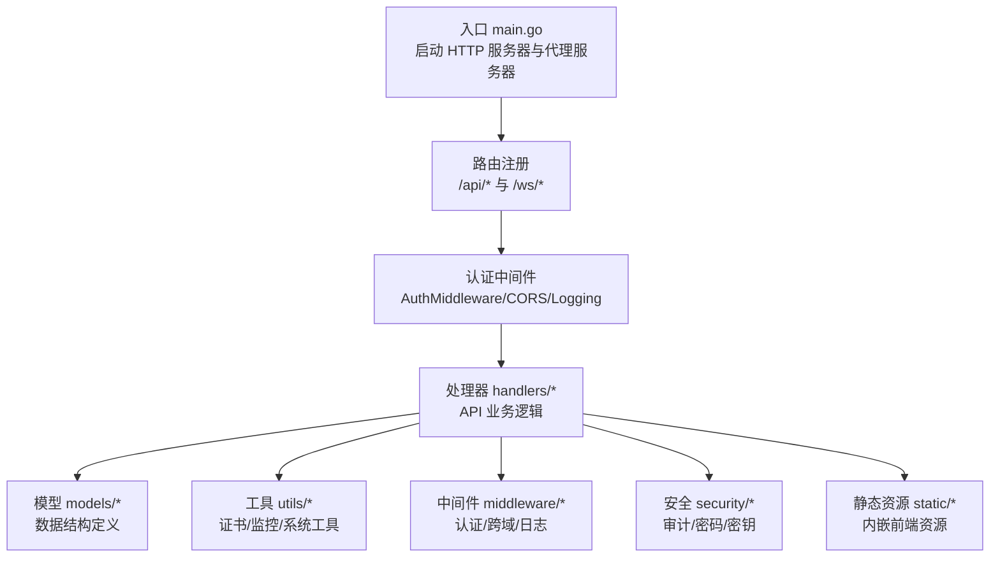
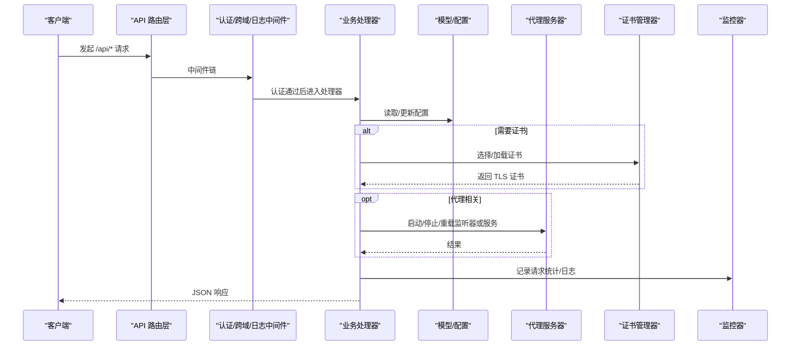
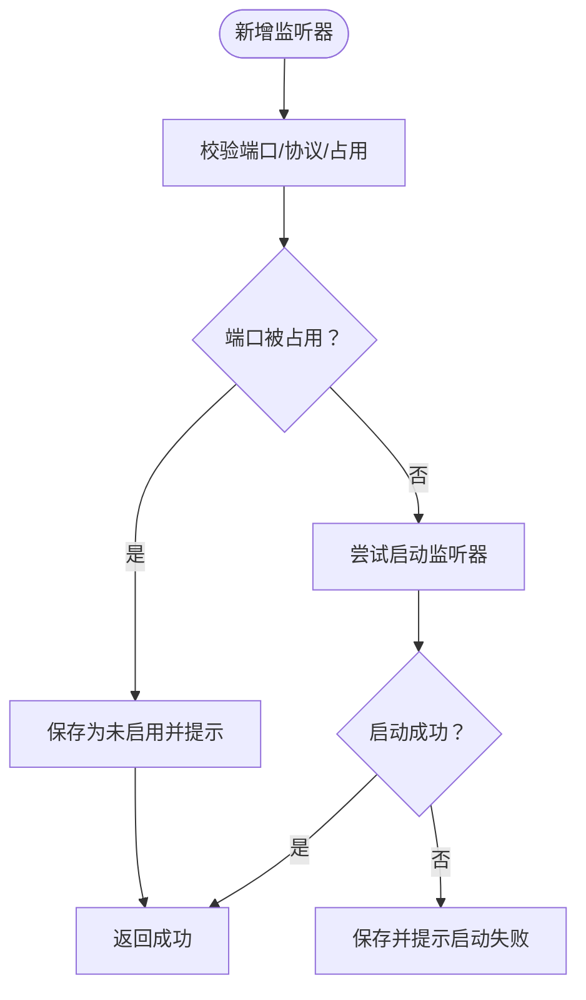
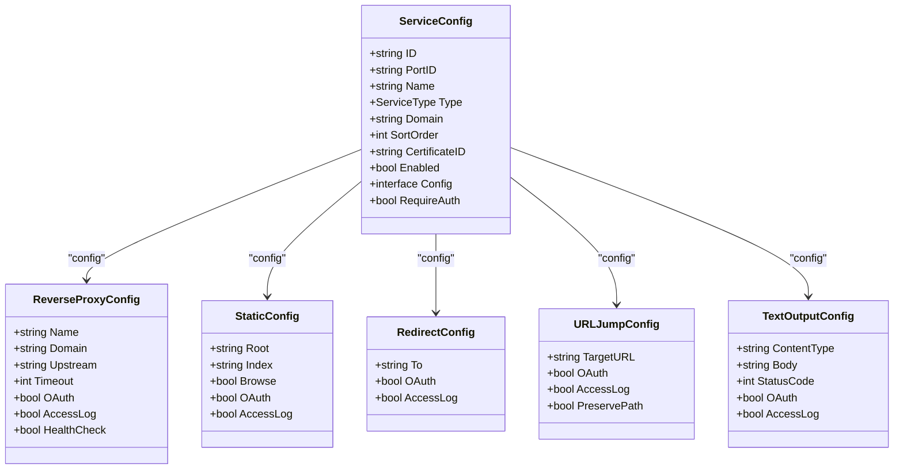
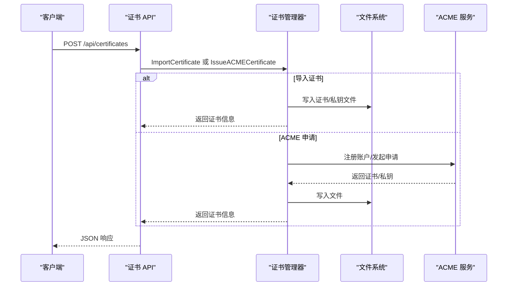
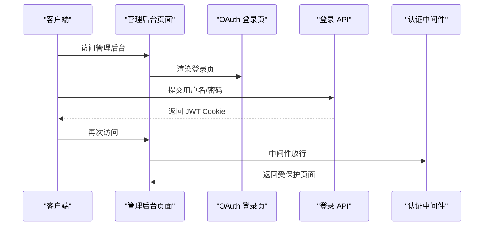
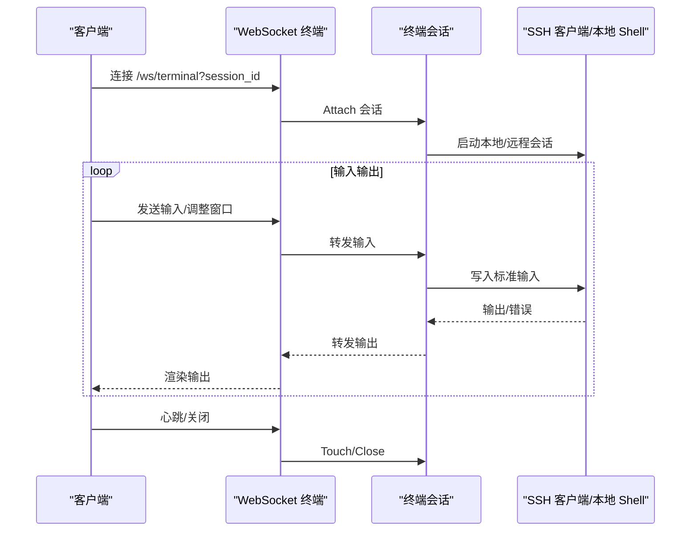
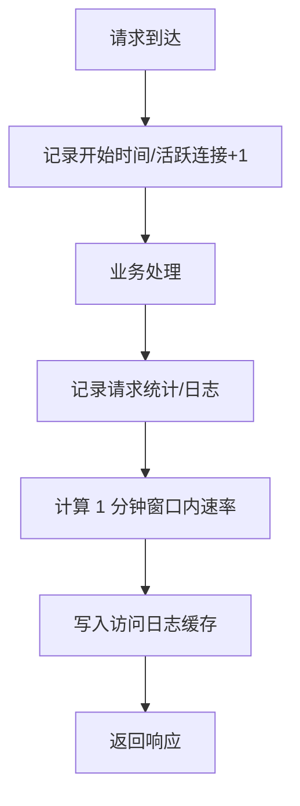
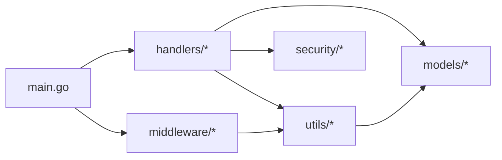

# 核心功能特性

<cite>
**本文引用的文件**
- [main.go](file://src/main.go)
- [api.go](file://src/handlers/api.go)
- [models.go](file://src/models/models.go)
- [certificate_manager.go](file://src/utils/certificate_manager.go)
- [auth.go](file://src/handlers/auth.go)
- [certificates.go](file://src/handlers/certificates.go)
- [terminal.go](file://src/handlers/terminal.go)
- [monitor.go](file://src/utils/monitor.go)
- [auth_middleware.go](file://src/middleware/auth.go)
- [README.md](file://README.md)
</cite>

## 目录
1. [简介](#简介)
2. [项目结构](#项目结构)
3. [核心组件](#核心组件)
4. [架构总览](#架构总览)
5. [详细组件分析](#详细组件分析)
6. [依赖分析](#依赖分析)
7. [性能考虑](#性能考虑)
8. [故障排查指南](#故障排查指南)
9. [结论](#结论)

## 简介
本文件面向 Caddy Panel 项目，系统性梳理其八大核心功能特性：网站管理、服务规则管理、HTTPS 证书管理、动态证书选择、OAuth 访问控制、用户管理、Token 鉴权、SSH/终端管理、运行监控。每个功能均给出简要说明、典型使用场景与对应的实现要点，帮助读者快速理解与上手。

## 项目结构
项目采用 Go Module 结构，入口为 main.go，API 路由在主函数中集中注册，业务处理集中在 handlers 包，模型定义在 models 包，工具类与监控在 utils 包，中间件在 middleware 包，安全与审计在 security 包，前端静态资源内嵌在 static 目录。

图表来源
- [main.go:112-430](file://src/main.go#L112-L430)

章节来源
- [main.go:1-516](file://src/main.go#L1-L516)
- [README.md:20-42](file://README.md#L20-L42)

## 核心组件
- 网站管理：监听器（端口/协议/启停/热重载/状态），与代理服务器集成，支持端口占用检测与启动失败回退。
- 服务规则管理：支持反向代理、静态文件、重定向、URL 跳转、文本输出五种类型，支持启用/禁用、排序、热重载。
- HTTPS 证书管理：导入证书、外部配置文件同步、ACME 自动申请与续期，支持多种 DNS 提供商与挑战方式。
- 动态证书选择：按域名自动匹配证书，未命中时使用默认回退证书。
- OAuth 访问控制：服务级启用认证，未登录跳转到服务内的 OAuth 登录页。
- 用户管理：新增/编辑/启停/删除用户，支持独立 token 鉴权。
- Token 鉴权：支持 Authorization: Bearer 或 Auth 请求头携带用户 token 直接登录。
- SSH/终端管理：本机终端、远程 SSH、连接测试、会话恢复与心跳保活。
- 运行监控：状态、流量、连接数、访问日志，含 24 小时网络历史与实时统计。

章节来源
- [README.md:7-18](file://README.md#L7-L18)

## 架构总览
下图展示从客户端请求到业务处理与代理转发的整体流程，以及关键组件之间的交互。

图表来源
- [main.go:112-430](file://src/main.go#L112-L430)
- [auth_middleware.go:14-55](file://src/middleware/auth.go#L14-L55)
- [api.go:129-137](file://src/handlers/api.go#L129-L137)
- [certificate_manager.go:271-285](file://src/utils/certificate_manager.go#L271-L285)
- [monitor.go:131-189](file://src/utils/monitor.go#L131-L189)

## 详细组件分析

### 网站管理（监听器）
- 功能要点
  - 支持 http/https 监听，端口范围校验与占用检测。
  - 支持启停、热重载、状态查看。
  - 新增/更新时自动尝试启动，失败时保存为未启用并提示。
- 典型使用场景
  - 新增一个 443 端口监听器并启用，自动启动失败时保持未启用状态以便后续排查。
  - 对已启用监听器进行热重载，应用最新配置。
- 关键实现
  - 路由注册与方法分发：[main.go:140-184](file://src/main.go#L140-L184)
  - 监听器启停与热重载：[api.go:304-375](file://src/handlers/api.go#L304-L375)
  - 端口占用与协议校验：[api.go:64-93](file://src/handlers/api.go#L64-L93)
  - 代理服务器对接：[api.go:202-207](file://src/handlers/api.go#L202-L207)

图表来源
- [api.go:156-218](file://src/handlers/api.go#L156-L218)
- [api.go:64-93](file://src/handlers/api.go#L64-L93)

章节来源
- [main.go:140-184](file://src/main.go#L140-L184)
- [api.go:156-218](file://src/handlers/api.go#L156-L218)
- [api.go:304-375](file://src/handlers/api.go#L304-L375)

### 服务规则管理（反向代理/静态/重定向/URL跳转/文本输出）
- 功能要点
  - 支持五种服务类型：反向代理、静态文件、重定向、URL 跳转、文本输出。
  - 支持启用/禁用、排序、热重载。
  - 支持服务级 OAuth 与访问日志。
- 典型使用场景
  - 在同一端口下配置多个服务，按排序匹配域名与路径。
  - 为特定服务开启 OAuth，实现细粒度访问控制。
- 关键实现
  - 路由注册与方法分发：[main.go:186-227](file://src/main.go#L186-L227)
  - 服务启停与热重载：[api.go:496-519](file://src/handlers/api.go#L496-L519)
  - 排序与热重载：[api.go:471-494](file://src/handlers/api.go#L471-L494)
  - 服务配置模型：[models.go:93-163](file://src/models/models.go#L93-L163)

图表来源
- [models.go:93-163](file://src/models/models.go#L93-L163)

章节来源
- [main.go:186-227](file://src/main.go#L186-L227)
- [api.go:377-519](file://src/handlers/api.go#L377-L519)
- [models.go:93-163](file://src/models/models.go#L93-L163)

### HTTPS 证书管理（导入/外部同步/ACME 申请与续期）
- 功能要点
  - 导入 PEM 证书与私钥，自动解析域名并入库。
  - 外部配置文件同步（JSON 格式），定时扫描并同步有效证书。
  - ACME 自动申请与续期，支持 HTTP-01/DNS-01，多 DNS 提供商。
- 典型使用场景
  - 从外部系统导入证书，或通过 ACME 自动获取 Let’s Encrypt 证书。
  - 配置外部证书文件，实现证书集中管理与自动同步。
- 关键实现
  - 证书 API 路由：[main.go:274-307](file://src/main.go#L274-L307)
  - 证书导入与 ACME 申请：[certificates.go:55-94](file://src/handlers/certificates.go#L55-L94)，[certificate_manager.go:440-533](file://src/utils/certificate_manager.go#L440-L533)
  - 外部同步与清理：[certificate_manager.go:595-795](file://src/utils/certificate_manager.go#L595-L795)
  - 自动续期与维护：[certificate_manager.go:162-182](file://src/utils/certificate_manager.go#L162-L182)，[certificate_manager.go:192-216](file://src/utils/certificate_manager.go#L192-L216)

图表来源
- [certificates.go:55-94](file://src/handlers/certificates.go#L55-L94)
- [certificate_manager.go:440-533](file://src/utils/certificate_manager.go#L440-L533)

章节来源
- [main.go:274-307](file://src/main.go#L274-L307)
- [certificates.go:55-149](file://src/handlers/certificates.go#L55-L149)
- [certificate_manager.go:440-533](file://src/utils/certificate_manager.go#L440-L533)
- [certificate_manager.go:595-795](file://src/utils/certificate_manager.go#L595-L795)

### 动态证书选择（按域名自动匹配）
- 功能要点
  - TLS 握手时根据 SNI 自动匹配证书，优先遵循服务显式绑定，其次按域名匹配，最后回退到默认证书。
- 典型使用场景
  - 多域名共用同一监听器，按域名自动选择正确证书。
- 关键实现
  - TLS 证书选择回调：[certificate_manager.go:271-285](file://src/utils/certificate_manager.go#L271-L285)
  - 监听器级证书选择：[certificate_manager.go:287-306](file://src/utils/certificate_manager.go#L287-L306)

章节来源
- [certificate_manager.go:271-306](file://src/utils/certificate_manager.go#L271-L306)

### OAuth 访问控制（服务级启用认证）
- 功能要点
  - 管理后台支持用户名密码登录与 OAuth 登录页，登录成功写入 JWT Cookie。
  - 服务级启用 OAuth 后，未登录访问会跳转到服务内的 OAuth 登录页。
- 典型使用场景
  - 在特定服务启用 OAuth，实现细粒度的访问控制。
- 关键实现
  - 管理后台 OAuth 登录页与中间件：[auth.go:124-198](file://src/handlers/auth.go#L124-L198)，[auth.go:253-265](file://src/handlers/auth.go#L253-L265)
  - 认证中间件与公开路径判定：[auth_middleware.go:14-73](file://src/middleware/auth.go#L14-L73)

图表来源
- [auth.go:124-198](file://src/handlers/auth.go#L124-L198)
- [auth_middleware.go:14-55](file://src/middleware/auth.go#L14-L55)

章节来源
- [auth.go:124-198](file://src/handlers/auth.go#L124-L198)
- [auth_middleware.go:14-73](file://src/middleware/auth.go#L14-L73)

### 用户管理（新增/编辑/启停/删除）
- 功能要点
  - 支持新增/编辑/启停/删除用户，密码加密存储，token 唯一性校验。
  - 禁用用户时确保至少保留一个启用用户。
- 典型使用场景
  - 为运维人员分配独立 token，实现免登录访问。
- 关键实现
  - 用户 API 路由：[main.go:229-260](file://src/main.go#L229-L260)
  - 用户启停与删除校验：[api.go:644-730](file://src/handlers/api.go#L644-L730)
  - 密码解密与唯一 token 校验：[api.go:35-50](file://src/handlers/api.go#L35-L50)

章节来源
- [main.go:229-260](file://src/main.go#L229-L260)
- [api.go:644-730](file://src/handlers/api.go#L644-L730)
- [api.go:35-50](file://src/handlers/api.go#L35-L50)

### Token 鉴权（独立 token 配置）
- 功能要点
  - 用户可配置独立 token，支持 Authorization: Bearer 或 Auth 请求头携带。
  - 若非用户 token，则继续按 JWT 校验，不影响管理后台登录。
- 典型使用场景
  - 第三方系统调用 API 时使用 token 鉴权，无需维护 Cookie。
- 关键实现
  - 认证中间件对 Bearer 与 Auth 头的处理：[auth_middleware.go:23-54](file://src/middleware/auth.go#L23-L54)
  - 用户 token 唯一性校验：[api.go:39-50](file://src/handlers/api.go#L39-L50)

章节来源
- [auth_middleware.go:23-54](file://src/middleware/auth.go#L23-L54)
- [api.go:39-50](file://src/handlers/api.go#L39-L50)

### SSH/终端管理（本机终端/远程 SSH/连接测试/会话恢复）
- 功能要点
  - 支持本机终端与远程 SSH，连接测试，会话心跳保活，断线恢复。
  - SSH 密码前端加密、服务端加密存储。
- 典型使用场景
  - 远程运维通过 Web 终端直连服务器，或在本机进行日常维护。
- 关键实现
  - SSH 连接与测试：[terminal.go:69-275](file://src/handlers/terminal.go#L69-L275)
  - 终端会话生命周期与心跳：[terminal.go:379-444](file://src/handlers/terminal.go#L379-L444)，[terminal.go:341-351](file://src/handlers/terminal.go#L341-L351)
  - WebSocket 终端处理：[terminal.go:353-377](file://src/handlers/terminal.go#L353-L377)

图表来源
- [terminal.go:353-377](file://src/handlers/terminal.go#L353-L377)
- [terminal.go:512-552](file://src/handlers/terminal.go#L512-L552)
- [terminal.go:554-580](file://src/handlers/terminal.go#L554-L580)

章节来源
- [terminal.go:69-275](file://src/handlers/terminal.go#L69-L275)
- [terminal.go:353-377](file://src/handlers/terminal.go#L353-L377)
- [terminal.go:379-444](file://src/handlers/terminal.go#L379-L444)

### 运行监控（状态/流量/连接数/访问日志）
- 功能要点
  - 提供服务器状态、监听器与服务运行时统计、24 小时网络历史、访问日志。
  - 统计窗口为 1 分钟，网络采样间隔 1 分钟。
- 典型使用场景
  - 实时查看流量峰值、连接数变化与访问日志，辅助排障与容量规划。
- 关键实现
  - 监控 API 路由：[main.go:132-138](file://src/main.go#L132-L138)
  - 请求记录与日志写入：[monitor.go:131-189](file://src/utils/monitor.go#L131-L189)
  - 统计聚合与网络历史：[monitor.go:253-355](file://src/utils/monitor.go#L253-L355)

图表来源
- [monitor.go:119-189](file://src/utils/monitor.go#L119-L189)

章节来源
- [main.go:132-138](file://src/main.go#L132-L138)
- [monitor.go:119-189](file://src/utils/monitor.go#L119-L189)
- [monitor.go:253-355](file://src/utils/monitor.go#L253-L355)

## 依赖分析
- 组件耦合
  - main.go 作为入口，集中注册路由与中间件，耦合度较高但职责清晰。
  - handlers 依赖 models 定义的数据结构，依赖 utils 提供的证书与监控能力。
  - middleware 仅依赖 handlers 的公共工具函数与 utils 的鉴权能力。
- 外部依赖
  - ACME 客户端与 DNS 提供商 SDK 用于证书申请与验证。
  - gopsutil 用于网络 IO 采样。
  - gorilla/websocket 用于终端 WebSocket。
- 循环依赖
  - 未发现循环依赖迹象，模块边界清晰。

图表来源
- [main.go:112-430](file://src/main.go#L112-L430)

章节来源
- [main.go:112-430](file://src/main.go#L112-L430)

## 性能考虑
- 监控采样
  - 网络采样与统计窗口均为 1 分钟，兼顾实时性与性能。
  - 最近事件窗口裁剪，避免内存无限增长。
- 证书加载
  - 证书按需加载并缓存，外部同步定时轮询，避免频繁 IO。
- 终端会话
  - 输出缓冲限制与心跳 TTL 控制资源占用，空闲会话定期清理。
- 建议
  - 大规模并发场景下，适当增大日志保留条数与网络采样频率的平衡。
  - 证书同步周期可根据外部证书变更频率调整。

## 故障排查指南
- 端口占用导致监听器无法启动
  - 现象：新增/更新监听器后提示端口被占用，保存为未启用。
  - 处理：检查端口占用情况，修改端口或释放占用进程。
  - 参考：[api.go:64-93](file://src/handlers/api.go#L64-L93)，[api.go:172-180](file://src/handlers/api.go#L172-L180)
- 证书导入失败
  - 现象：导入 PEM 证书时报错。
  - 处理：确认证书与私钥 PEM 格式正确，域名解析正常。
  - 参考：[certificates.go:71-76](file://src/handlers/certificates.go#L71-L76)，[certificate_manager.go:309-373](file://src/utils/certificate_manager.go#L309-L373)
- ACME 申请失败
  - 现象：ACME 申请返回错误。
  - 处理：检查 DNS 提供商配置、HTTP-01 端口是否可达、DNS-01 记录是否生效。
  - 参考：[certificate_manager.go:440-533](file://src/utils/certificate_manager.go#L440-L533)
- 终端连接异常
  - 现象：SSH 连接失败或会话断开。
  - 处理：检查 SSH 密码、主机可达性、超时设置与工作目录权限。
  - 参考：[terminal.go:446-510](file://src/handlers/terminal.go#L446-L510)，[terminal.go:238-275](file://src/handlers/terminal.go#L238-L275)
- 认证失败
  - 现象：登录失败或 Token 无效。
  - 处理：确认用户名/密码或 Token 正确，检查 JWT Cookie 或 Authorization 头格式。
  - 参考：[auth.go:37-76](file://src/handlers/auth.go#L37-L76)，[auth_middleware.go:23-54](file://src/middleware/auth.go#L23-L54)

章节来源
- [api.go:64-93](file://src/handlers/api.go#L64-L93)
- [api.go:172-180](file://src/handlers/api.go#L172-L180)
- [certificates.go:71-76](file://src/handlers/certificates.go#L71-L76)
- [certificate_manager.go:309-373](file://src/utils/certificate_manager.go#L309-L373)
- [certificate_manager.go:440-533](file://src/utils/certificate_manager.go#L440-L533)
- [terminal.go:446-510](file://src/handlers/terminal.go#L446-L510)
- [terminal.go:238-275](file://src/handlers/terminal.go#L238-L275)
- [auth.go:37-76](file://src/handlers/auth.go#L37-L76)
- [auth_middleware.go:23-54](file://src/middleware/auth.go#L23-L54)

## 结论
Caddy Panel 项目围绕“统一管理”目标，提供了从监听器启停、服务规则配置、证书管理、OAuth 访问控制、用户与 Token 鉴权、SSH/终端管理到运行监控的完整能力闭环。通过清晰的模块划分与中间件体系，既保证了易用性，也为扩展与维护提供了良好基础。建议在生产环境中合理配置安全参数、证书策略与监控阈值，以获得更稳定与可观测的运行体验。