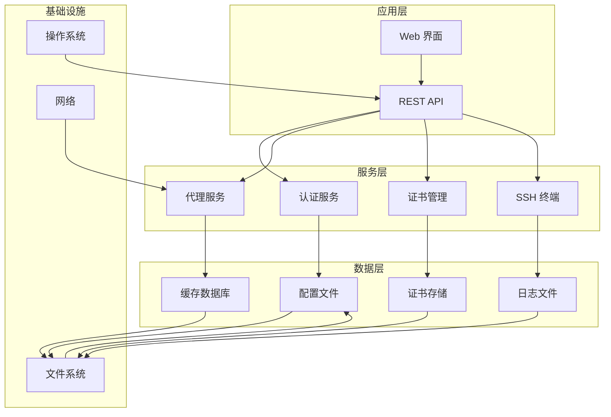
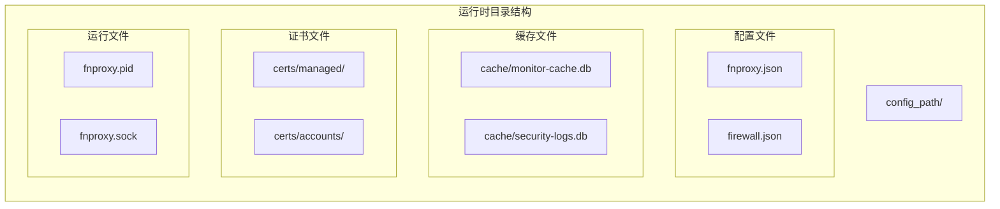
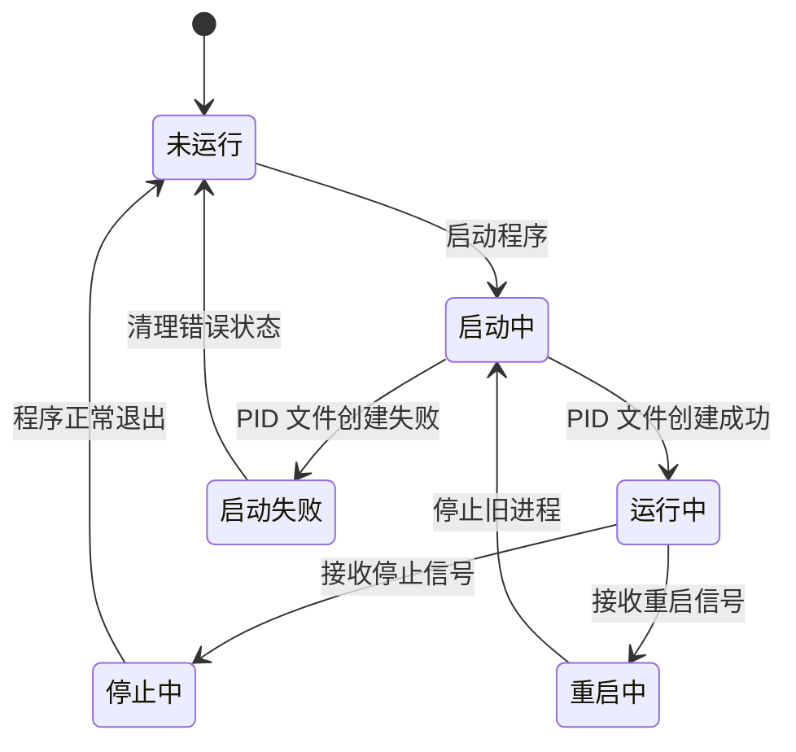
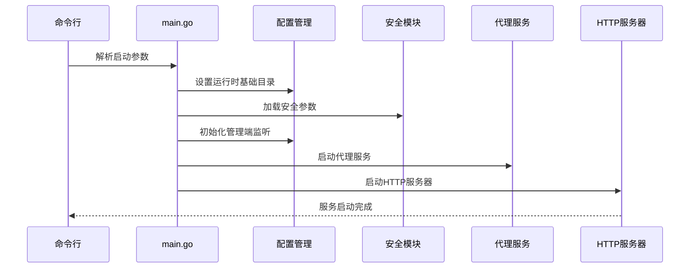
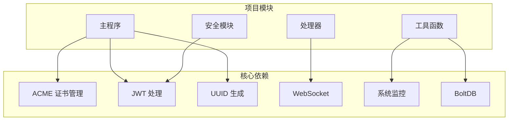

# 部署方式与环境要求

<cite>
**本文引用的文件**
- [README.md](file://README.md)
- [src/main.go](file://src/main.go)
- [src/go.mod](file://src/go.mod)
- [src/config/runtime_paths.go](file://src/config/runtime_paths.go)
- [src/config/manager.go](file://src/config/manager.go)
- [src/process_control.go](file://src/process_control.go)
- [src/process_control_windows.go](file://src/process_control_windows.go)
- [src/process_control_unix.go](file://src/process_control_unix.go)
- [build.linux.sh](file://build.linux.sh)
- [build.linux.bat](file://build.linux.bat)
- [build.windows.bat](file://build.windows.bat)
- [debug.bat](file://debug.bat)
</cite>

## 目录
1. [简介](#简介)
2. [项目结构](#项目结构)
3. [核心组件](#核心组件)
4. [架构概览](#架构概览)
5. [详细组件分析](#详细组件分析)
6. [依赖分析](#依赖分析)
7. [性能考虑](#性能考虑)
8. [故障排除指南](#故障排除指南)
9. [结论](#结论)
10. [附录](#附录)

## 简介

Caddy Panel 是一个基于 Go 的轻量级服务管理面板，用于统一管理网站管理、反向代理、静态站点、跳转规则、证书、OAuth 访问控制、用户、SSH 终端和运行状态。该项目采用现代化的部署方式，支持多种操作系统和部署场景。

## 项目结构

项目采用模块化设计，主要包含以下核心目录结构：

```mermaid
graph TB
subgraph "项目根目录"
SRC[src/] -- Go 源码与前端静态资源
DOC[documents/] -- 设计与变更文档
BUILD[build/] -- 编译输出目录
CACHE[cache/] -- 运行缓存目录
SCRIPTS[构建脚本]
end
subgraph "src/ 目录结构"
SRC_MAIN[main.go] -- 程序入口点
SRC_CONFIG[config/] -- 配置管理
SRC_HANDLERS[handlers/] -- HTTP 处理器
SRC_MIDDLEWARE[middleware/] -- 中间件层
SRC_MODELS[models/] -- 数据模型
SRC_SECURITY[security/] -- 安全相关
SRC_STATIC[static/] -- 前端静态资源
SRC_UTILS[utils/] -- 工具函数
end
```

**图表来源**
- [README.md:20-42](file://README.md#L20-L42)
- [src/main.go:1-516](file://src/main.go#L1-L50)

**章节来源**
- [README.md:20-42](file://README.md#L20-L42)

## 核心组件

### 环境要求

项目对运行环境有明确的要求：

- **Go 版本**: 1.26.1 或更高版本
- **操作系统**: Windows / Linux
- **浏览器**: 现代浏览器
- **网络**: 需要网络访问能力

这些要求确保了项目的兼容性和稳定性。

**章节来源**
- [README.md:44-48](file://README.md#L44-L48)
- [src/go.mod:3](file://src/go.mod#L3)

### 启动参数配置

程序支持以下启动参数：

- **-secure**: 用于密码摘要、OAuth 登录加解密、SSH 密码加密等安全相关逻辑
- **-config_path**: 指定运行时根目录
- **-port**: 设置管理端监听方式
- **status/stop/restart**: 进程控制操作

**章节来源**
- [README.md:105-129](file://README.md#L105-L129)
- [src/main.go:24-29](file://src/main.go#L24-L29)

## 架构概览

系统采用分层架构设计，主要包含以下层次：



**图表来源**
- [src/main.go:112-431](file://src/main.go#L112-L431)
- [src/config/manager.go:35-72](file://src/config/manager.go#L35-L72)

## 详细组件分析

### 部署方式

#### 开发构建

支持直接使用 Go 命令进行开发构建：

```bash
go -C src build -trimpath -o ../build/fnproxy-panel.exe .
```

这种构建方式适用于开发环境，能够快速生成可执行文件。

**章节来源**
- [README.md:52-58](file://README.md#L52-L58)

#### 预编译二进制文件直接运行

项目提供了预编译的二进制文件，可以直接运行：

```bash
./build/fnproxy-panel-windows-amd64.exe
./build/fnproxy-panel-linux-amd64
```

这种方式最简单快捷，适合生产环境部署。

**章节来源**
- [README.md:86-96](file://README.md#L86-L96)

#### 跨平台编译

项目支持跨平台编译，可以在 Windows 上编译 Linux 可执行文件：

```batch
build.linux.bat
```

或者使用 Shell 脚本在 Linux 上编译：

```bash
sh build.linux.sh
```

**章节来源**
- [README.md:72-76](file://README.md#L72-L76)
- [build.linux.sh:10](file://build.linux.sh#L10)
- [build.linux.bat:13](file://build.linux.bat#L13)

### 运行期文件组织

当设置 `-config_path` 后，以下内容会统一放到该目录下：

- **主配置文件**: `fnproxy.json`
- **监控缓存文件**: `cache/monitor-cache.db`
- **安全日志缓存**: `cache/security-logs.db`
- **证书目录**: `certs/managed` 和 `certs/accounts`
- **PID 文件**: `fnproxy.pid`
- **Unix Socket 文件**: `fnproxy.sock`



**图表来源**
- [src/config/runtime_paths.go:12-21](file://src/config/runtime_paths.go#L12-L21)
- [src/config/runtime_paths.go:85-115](file://src/config/runtime_paths.go#L85-L115)

**章节来源**
- [README.md:156-166](file://README.md#L156-L166)
- [src/config/runtime_paths.go:12-21](file://src/config/runtime_paths.go#L12-L21)

### 进程控制机制

系统实现了完整的进程控制机制，包括单实例保护：



**图表来源**
- [src/process_control.go:129-139](file://src/process_control.go#L129-L139)
- [src/process_control.go:84-109](file://src/process_control.go#L84-L109)

**章节来源**
- [src/process_control.go:17-28](file://src/process_control.go#L17-L28)
- [src/process_control.go:129-139](file://src/process_control.go#L129-L139)

### 启动流程

应用程序的启动流程如下：



**图表来源**
- [src/main.go:24-94](file://src/main.go#L24-L94)
- [src/main.go:432-465](file://src/main.go#L432-L465)

**章节来源**
- [src/main.go:24-94](file://src/main.go#L24-L94)

## 依赖分析

### 外部依赖

项目的主要外部依赖包括：

- **ACME 证书管理**: github.com/go-acme/lego/v4
- **JWT 处理**: github.com/golang-jwt/jwt/v5
- **UUID 生成**: github.com/google/uuid
- **WebSocket 支持**: github.com/gorilla/websocket
- **系统监控**: github.com/shirou/gopsutil/v3
- **数据库存储**: go.etcd.io/bbolt



**图表来源**
- [src/go.mod:5-13](file://src/go.mod#L5-L13)

**章节来源**
- [src/go.mod:5-13](file://src/go.mod#L5-L13)

### 构建脚本分析

项目提供了多种构建脚本以支持不同的部署场景：

| 脚本名称 | 目标平台 | 构建特性 | 使用场景 |
|---------|---------|---------|---------|
| build.linux.sh | Linux | CGO_ENABLED=0, amd64 | Linux 生产部署 |
| build.linux.bat | Linux | CGO_ENABLED=0, amd64 | Windows 跨编译 |
| build.windows.bat | Windows | CGO_ENABLED=0, amd64 | Windows 开发/测试 |
| debug.bat | Windows | 调试版本 | 开发环境调试 |

**章节来源**
- [build.linux.sh:10](file://build.linux.sh#L10)
- [build.linux.bat:13](file://build.linux.bat#L13)
- [build.windows.bat:13](file://build.windows.bat#L13)
- [debug.bat:14](file://debug.bat#L14)

## 性能考虑

### 内存管理

系统采用了内存友好的设计：

- 所有构建都使用 `CGO_ENABLED=0`，确保纯 Go 实现
- 使用嵌入式数据库减少内存占用
- 实现了优雅的关闭机制，避免资源泄漏

### 并发处理

- 使用 goroutine 处理并发请求
- 实现了信号处理机制，支持优雅关闭
- 采用互斥锁保证配置读写的线程安全

### 磁盘 I/O

- 将运行时文件集中到单一目录，便于备份和管理
- 使用数据库文件存储缓存数据，提高读写效率
- 实现了文件权限控制，确保安全性

## 故障排除指南

### 常见问题及解决方案

#### 启动失败

**问题**: 程序无法启动
**可能原因**: 
- 端口被占用
- 权限不足
- 配置文件损坏

**解决方法**:
1. 检查端口使用情况：`netstat -an | grep :8080`
2. 确认运行目录权限：`chmod 755 /path/to/config_path`
3. 检查配置文件格式：`cat /path/to/config_path/fnproxy.json`

#### 进程控制问题

**问题**: 进程无法停止
**解决方法**:
1. 检查 PID 文件：`cat /path/to/config_path/fnproxy.pid`
2. 手动终止进程：`kill -9 $(cat /path/to/config_path/fnproxy.pid)`
3. 清理僵尸进程：`rm /path/to/config_path/fnproxy.pid`

#### 证书问题

**问题**: HTTPS 证书加载失败
**解决方法**:
1. 检查证书文件权限
2. 验证证书格式正确性
3. 确认证书链完整性

**章节来源**
- [src/process_control.go:111-127](file://src/process_control.go#L111-L127)
- [src/config/runtime_paths.go:31-59](file://src/config/runtime_paths.go#L31-L59)

## 结论

Caddy Panel 提供了完整且灵活的部署方案，支持多种部署场景和平台。其设计特点包括：

1. **多平台支持**: 同时支持 Windows 和 Linux 系统
2. **灵活部署**: 支持开发构建、预编译运行和跨平台编译
3. **安全可靠**: 实现了单实例保护和安全参数配置
4. **易于维护**: 集中的运行时文件管理和备份策略
5. **性能优化**: 纯 Go 实现和优雅的关闭机制

推荐在生产环境中使用预编译的二进制文件，并显式指定安全参数和运行目录，以确保系统的安全性和可维护性。

## 附录

### 最佳实践

1. **生产环境部署**
   - 使用预编译二进制文件
   - 显式指定 `-secure` 参数
   - 使用独立的运行目录
   - 配置防火墙规则

2. **开发环境部署**
   - 使用开发构建方式
   - 利用调试脚本进行测试
   - 在临时目录运行

3. **备份策略**
   - 定期备份运行时目录
   - 备份配置文件和证书
   - 记录安全日志

4. **监控建议**
   - 监控进程状态
   - 定期检查磁盘空间
   - 监控证书到期时间