# 项目概述

<cite>
**本文档引用的文件**
- [README.md](file://README.md)
- [main.go](file://src/main.go)
- [go.mod](file://src/go.mod)
- [models.go](file://src/models/models.go)
- [server.go](file://src/fnproxy/server.go)
- [manager.go](file://src/config/manager.go)
- [certificate_manager.go](file://src/utils/certificate_manager.go)
- [auth.go](file://src/middleware/auth.go)
- [auth.go](file://src/handlers/auth.go)
- [auth.go](file://src/utils/auth.go)
- [page.go](file://src/pkg/oauth/page.go)
- [terminal.go](file://src/handlers/terminal.go)
- [index.html](file://src/static/index.html)
</cite>

## 目录
1. [简介](#简介)
2. [项目结构](#项目结构)
3. [核心组件](#核心组件)
4. [架构总览](#架构总览)
5. [详细组件分析](#详细组件分析)
6. [依赖关系分析](#依赖关系分析)
7. [性能考虑](#性能考虑)
8. [故障排查指南](#故障排查指南)
9. [结论](#结论)

## 简介

Caddy Panel 是一个基于 Go 语言开发的轻量级服务管理面板，专为统一管理网站管理、反向代理、静态站点、跳转规则、证书、OAuth 访问控制、用户、SSH 终端和运行状态而设计。该项目具有以下核心价值：

### 核心价值
- **一体化管理**：提供统一的 Web 界面管理所有网络服务
- **企业级安全**：内置 JWT 认证、OAuth 访问控制、SSH 密码加密等安全机制
- **自动化运维**：支持 ACME 证书自动申请与续期，动态配置热更新
- **实时监控**：提供运行状态、流量、连接数、访问日志等监控数据
- **跨平台部署**：支持 Windows 和 Linux 平台，单文件部署无需外部依赖

### 主要功能特性
- **网站管理**：支持 HTTP/HTTPS 监听，启停、热重载、状态查看
- **服务规则管理**：反向代理、静态文件、重定向、URL 跳转、文本输出
- **证书管理**：导入证书、外部证书文件同步、ACME 自动申请与自动续期
- **OAuth 访问控制**：服务级启用认证，未登录时跳转到当前服务下的 `/OAuth`
- **用户管理**：新增、编辑、启停、删除用户，密码加密存储
- **SSH 终端管理**：本机终端、远程 SSH、连接测试、会话恢复
- **进程控制**：status、stop、restart，带 PID 单实例保护

### 技术架构概览
项目采用模块化设计，包含以下关键技术栈：
- **Go 1.26.1**：核心开发语言，提供高性能和并发能力
- **JWT 认证**：基于 golang-jwt/jwt/v5 的无状态认证机制
- **ACME 证书协议**：使用 go-acme/lego/v4 实现 Let's Encrypt 自动化证书管理
- **WebSocket 实时通信**：基于 gorilla/websocket 提供实时终端会话
- **内存数据库**：使用 etcd/bbolt 实现配置持久化存储

## 项目结构

项目采用清晰的模块化组织结构，主要目录和文件如下：

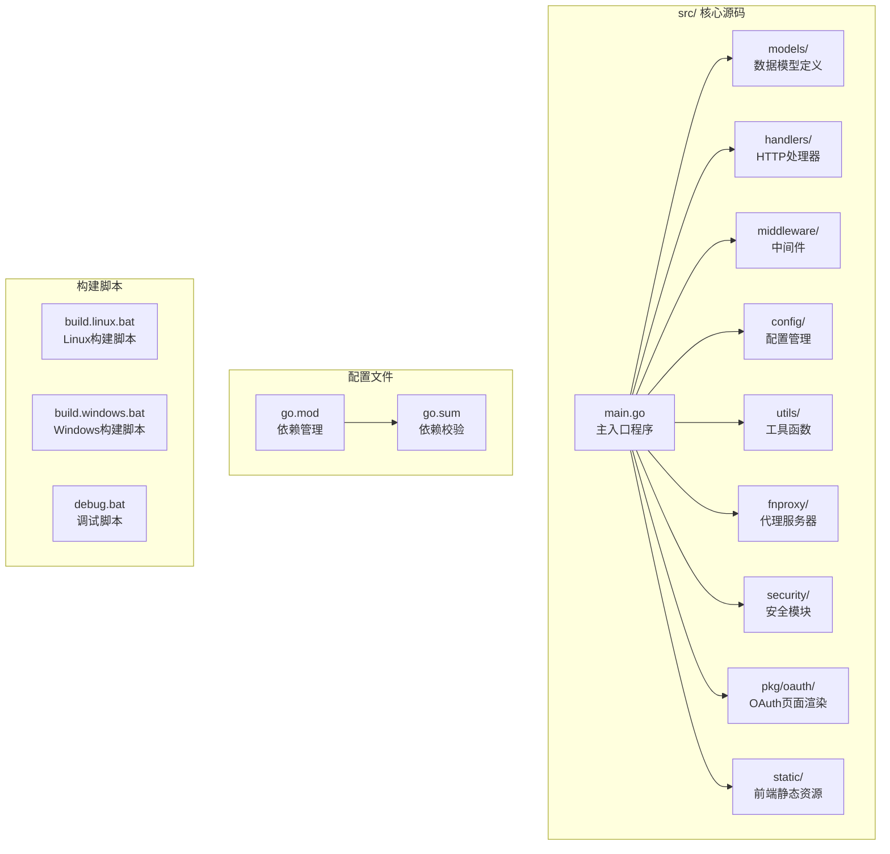

**图表来源**
- [main.go:1-516](file://src/main.go#L1-L516)
- [go.mod:1-48](file://src/go.mod#L1-L48)

### 目录结构详解

**核心模块划分**：
- **fnproxy/**：代理服务器核心实现，负责 HTTP/HTTPS 服务监听和请求转发
- **handlers/**：HTTP 请求处理器，实现 RESTful API 接口
- **middleware/**：中间件层，提供认证、授权、CORS、日志等功能
- **config/**：配置管理系统，管理应用配置、监听器、服务规则等
- **utils/**：工具函数库，包含证书管理、监控、系统工具等
- **security/**：安全模块，提供密码加密、审计日志、密钥管理等
- **pkg/oauth/**：OAuth 认证页面渲染和加密处理
- **static/**：前端静态资源，包含 HTML、CSS、JavaScript 文件

**图表来源**
- [README.md:20-42](file://README.md#L20-L42)

**章节来源**
- [README.md:1-256](file://README.md#L1-L256)
- [main.go:1-516](file://src/main.go#L1-L516)

## 核心组件

### 代理服务器组件

代理服务器是整个系统的核心，负责处理所有 HTTP/HTTPS 请求并进行相应的路由和转发。

```mermaid
classDiagram
class Server {
-mu sync.RWMutex
-ctx context.Context
-servers map[string]*http.Server
-routes map[string][]serviceRoute
-listeners map[string]PortListener
-proxies map[string]*httputil.ReverseProxy
-lastGood map[string]listenerSnapshot
+Start() error
+Stop() error
+StartListener(listener) error
+StopListener(listenerID) error
+ReloadListener(listenerID) error
+IsListenerRunning(listenerID) bool
+createHandler(service, proxies) (http.Handler, error)
}
class serviceRoute {
+service ServiceConfig
+handler http.Handler
}
class PortListener {
+string ID
+int Port
+string Protocol
+bool Enabled
+time.Time CreatedAt
+time.Time UpdatedAt
}
class ServiceConfig {
+string ID
+string PortID
+string Name
+ServiceType Type
+string Domain
+int SortOrder
+string CertificateID
+bool Enabled
+interface{} Config
+bool RequireAuth
+time.Time CreatedAt
+time.Time UpdatedAt
}
Server --> serviceRoute : "管理"
serviceRoute --> ServiceConfig : "关联"
Server --> PortListener : "监听"
```

**图表来源**
- [server.go:37-54](file://src/fnproxy/server.go#L37-L54)
- [models.go:72-107](file://src/models/models.go#L72-L107)

### 配置管理系统

配置管理系统提供完整的配置持久化和管理功能，支持动态热更新。

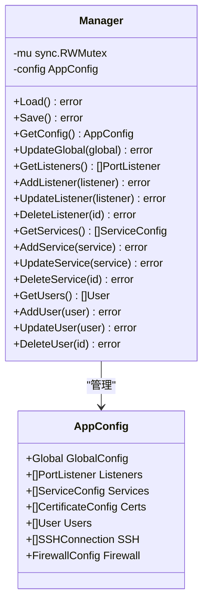

**图表来源**
- [manager.go:18-72](file://src/config/manager.go#L18-L72)
- [models.go:384-394](file://src/models/models.go#L384-L394)

### 证书管理组件

证书管理组件提供完整的 SSL/TLS 证书生命周期管理，包括自动申请、续期和同步。

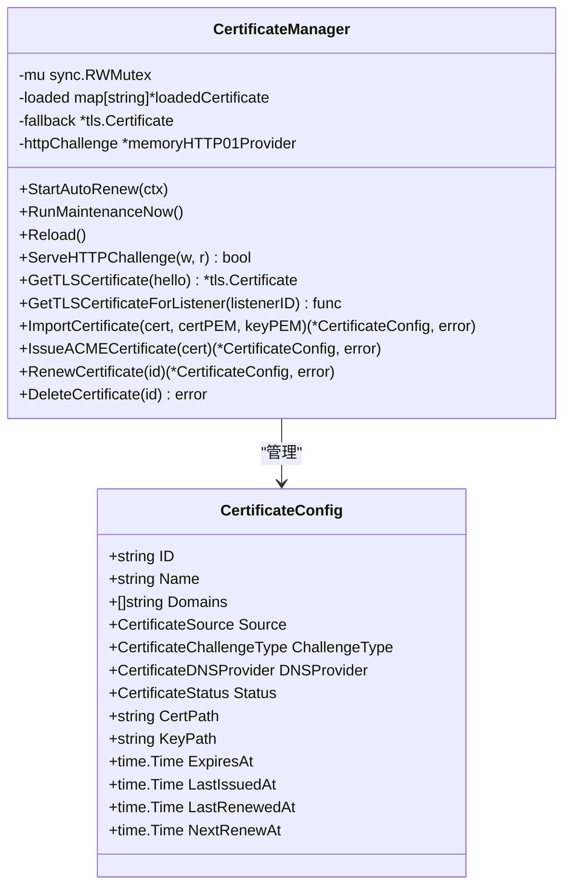

**图表来源**
- [certificate_manager.go:126-151](file://src/utils/certificate_manager.go#L126-L151)
- [models.go:221-254](file://src/models/models.go#L221-L254)

**章节来源**
- [server.go:37-54](file://src/fnproxy/server.go#L37-L54)
- [manager.go:18-72](file://src/config/manager.go#L18-L72)
- [certificate_manager.go:126-151](file://src/utils/certificate_manager.go#L126-L151)

## 架构总览

项目采用分层架构设计，各层职责明确，耦合度低，便于维护和扩展。

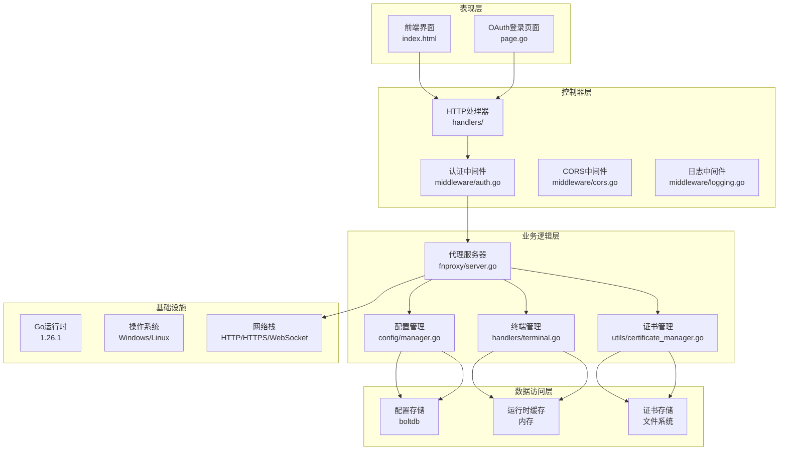

**图表来源**
- [main.go:112-431](file://src/main.go#L112-L431)
- [auth.go:14-55](file://src/middleware/auth.go#L14-L55)

### 数据流分析

系统的核心数据流包括请求处理、配置管理和证书管理三个主要流程：

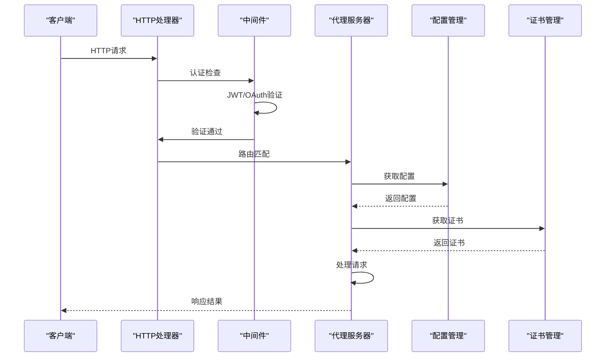

**图表来源**
- [main.go:422-427](file://src/main.go#L422-L427)
- [server.go:293-324](file://src/fnproxy/server.go#L293-L324)

**章节来源**
- [main.go:112-431](file://src/main.go#L112-L431)
- [auth.go:14-55](file://src/middleware/auth.go#L14-L55)

## 详细组件分析

### 认证与授权系统

系统提供多层次的认证和授权机制，确保系统的安全性。

#### JWT 认证机制

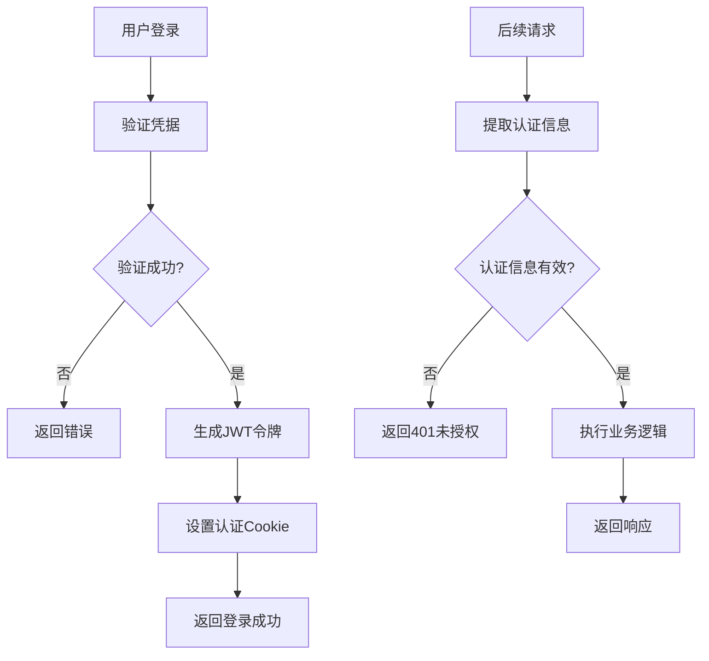

**图表来源**
- [auth.go:37-76](file://src/handlers/auth.go#L37-L76)
- [auth.go:24-53](file://src/utils/auth.go#L24-L53)

#### OAuth 访问控制

OAuth 认证提供服务级别的访问控制，支持浏览器端加密传输。

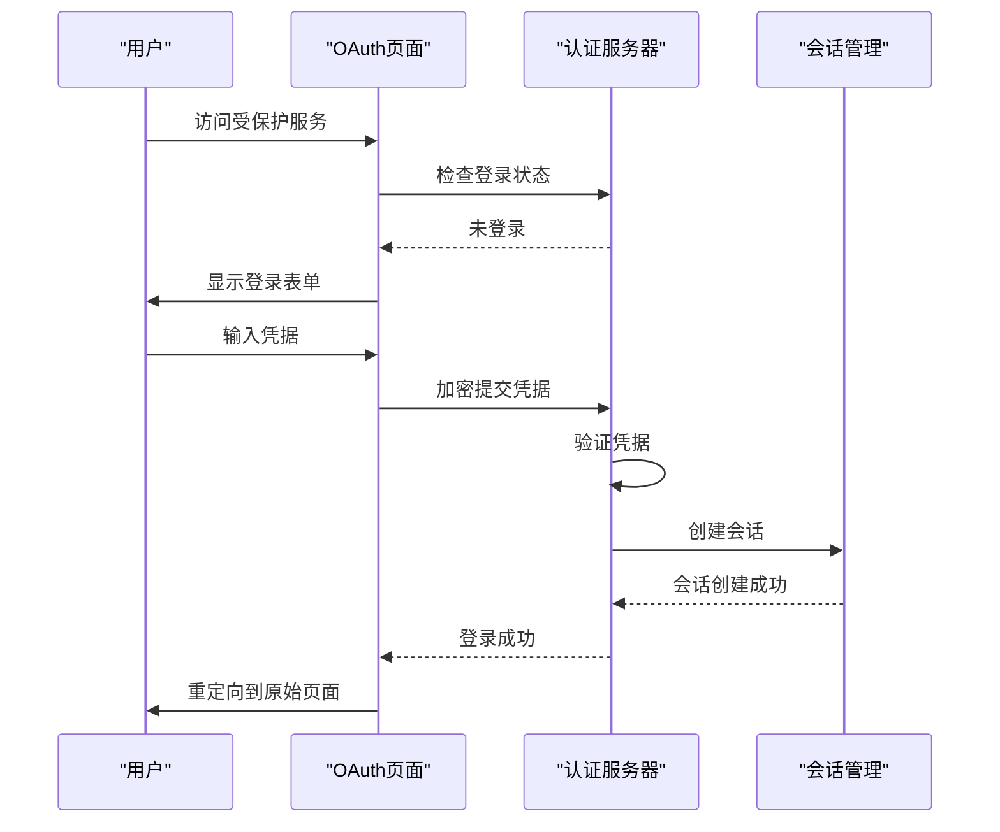

**图表来源**
- [auth.go:124-198](file://src/handlers/auth.go#L124-L198)
- [page.go:15-197](file://src/pkg/oauth/page.go#L15-L197)

**章节来源**
- [auth.go:37-76](file://src/handlers/auth.go#L37-L76)
- [auth.go:24-53](file://src/utils/auth.go#L24-L53)
- [auth.go:124-198](file://src/handlers/auth.go#L124-L198)
- [page.go:15-197](file://src/pkg/oauth/page.go#L15-L197)

### 反向代理与服务路由

代理服务器实现灵活的服务路由和请求转发功能。

#### 服务类型与配置

系统支持多种服务类型，每种类型都有特定的配置选项：

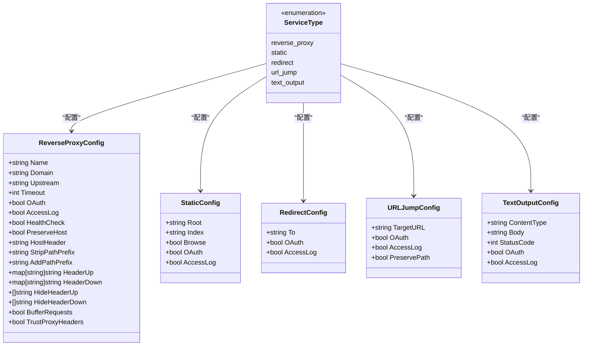

**图表来源**
- [models.go:82-164](file://src/models/models.go#L82-L164)

#### 请求处理流程

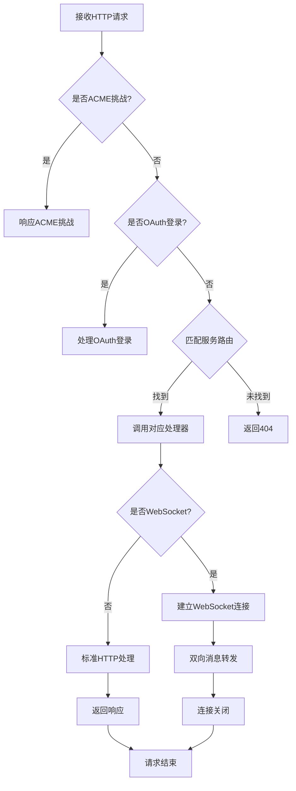

**图表来源**
- [server.go:293-324](file://src/fnproxy/server.go#L293-L324)
- [server.go:586-589](file://src/fnproxy/server.go#L586-L589)

**章节来源**
- [models.go:82-164](file://src/models/models.go#L82-L164)
- [server.go:293-324](file://src/fnproxy/server.go#L293-L324)

### 证书管理与自动续期

系统提供完整的 SSL/TLS 证书管理功能，支持多种证书来源和自动续期。

#### 证书来源与处理

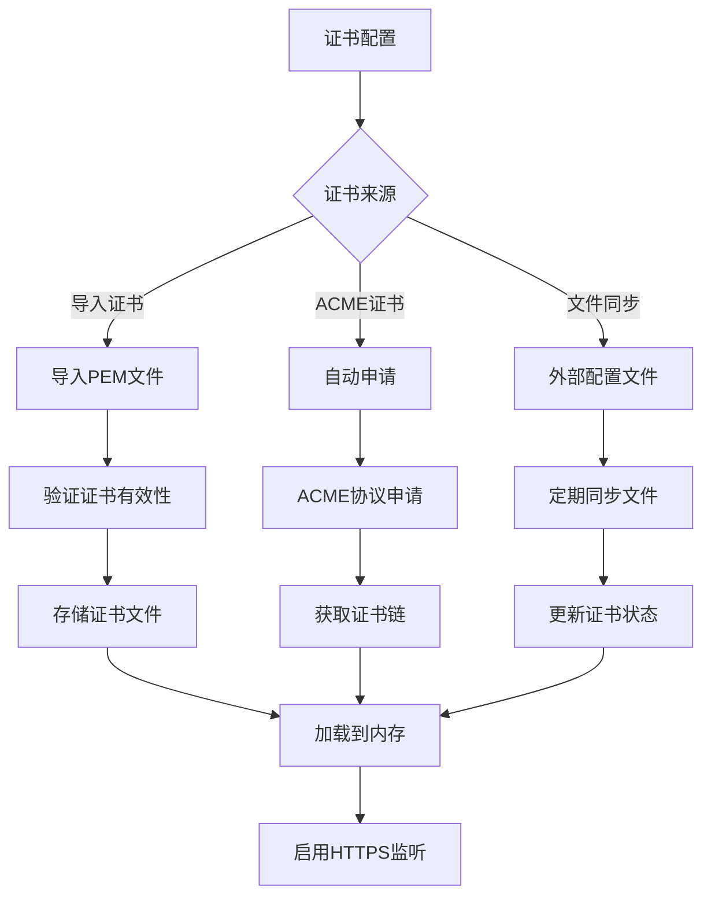

**图表来源**
- [certificate_manager.go:308-373](file://src/utils/certificate_manager.go#L308-L373)
- [certificate_manager.go:440-533](file://src/utils/certificate_manager.go#L440-L533)

#### ACME 自动续期机制

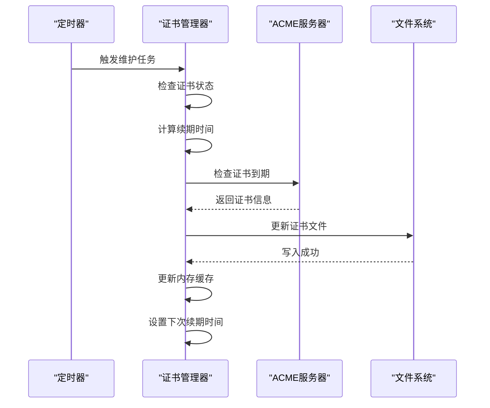

**图表来源**
- [certificate_manager.go:168-182](file://src/utils/certificate_manager.go#L168-L182)
- [certificate_manager.go:192-216](file://src/utils/certificate_manager.go#L192-L216)

**章节来源**
- [certificate_manager.go:308-373](file://src/utils/certificate_manager.go#L308-L373)
- [certificate_manager.go:440-533](file://src/utils/certificate_manager.go#L440-L533)
- [certificate_manager.go:168-182](file://src/utils/certificate_manager.go#L168-L182)

### SSH 终端管理

系统提供完整的 SSH 终端管理功能，支持本地和远程连接。

#### 终端会话生命周期

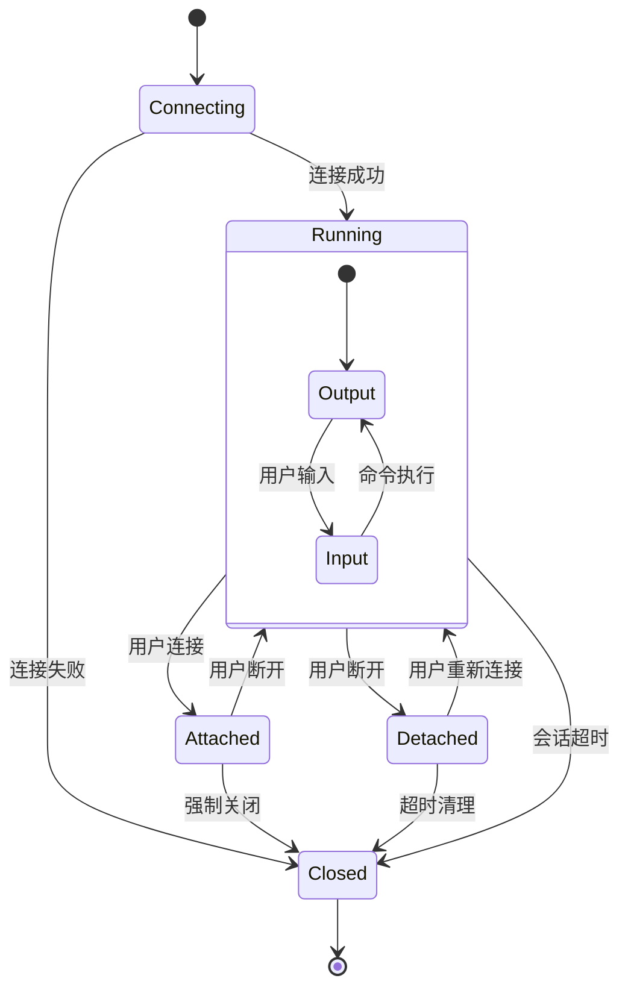

**图表来源**
- [terminal.go:39-61](file://src/handlers/terminal.go#L39-L61)

#### WebSocket 终端通信

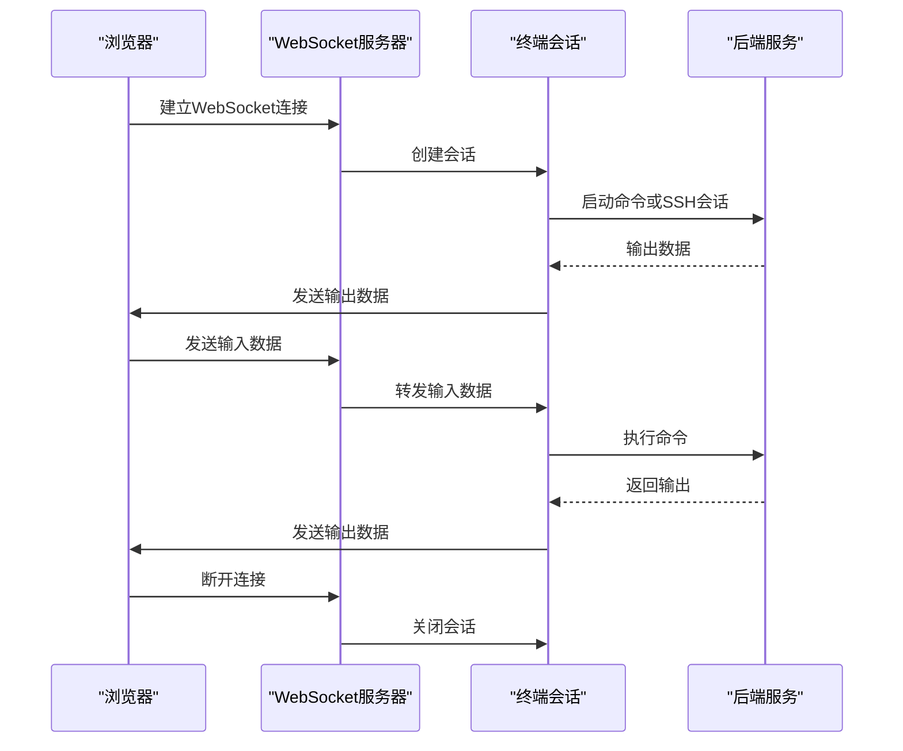

**图表来源**
- [terminal.go:353-377](file://src/handlers/terminal.go#L353-L377)
- [terminal.go:512-552](file://src/handlers/terminal.go#L512-L552)

**章节来源**
- [terminal.go:39-61](file://src/handlers/terminal.go#L39-L61)
- [terminal.go:353-377](file://src/handlers/terminal.go#L353-L377)

## 依赖关系分析

项目采用模块化依赖设计，各模块间依赖关系清晰。

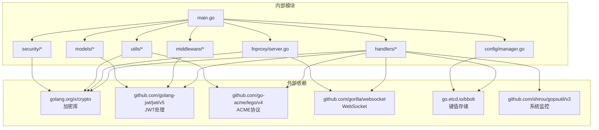

**图表来源**
- [go.mod:5-47](file://src/go.mod#L5-L47)

### 核心依赖说明

**认证相关依赖**：
- `github.com/golang-jwt/jwt/v5`：提供 JWT 令牌生成和验证功能
- `golang.org/x/crypto`：提供密码哈希、RSA 加密等安全功能

**证书管理依赖**：
- `github.com/go-acme/lego/v4`：实现 ACME 协议，支持 Let's Encrypt 等证书颁发机构
- 支持 HTTP-01 和 DNS-01 两种验证方式

**实时通信依赖**：
- `github.com/gorilla/websocket`：提供 WebSocket 支持，实现终端实时通信
- `github.com/shirou/gopsutil/v3`：系统监控，获取 CPU、内存、网络等系统信息

**数据存储依赖**：
- `go.etcd.io/bbolt`：轻量级键值数据库，用于配置持久化存储

**章节来源**
- [go.mod:5-47](file://src/go.mod#L5-L47)

## 性能考虑

系统在设计时充分考虑了性能优化，采用多种技术手段提升系统性能。

### 并发与连接管理

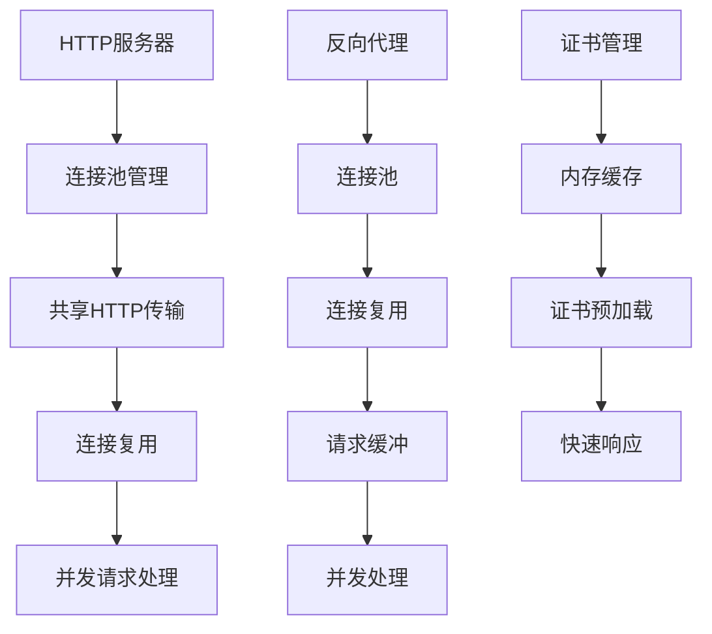

**图表来源**
- [server.go:141-161](file://src/fnproxy/server.go#L141-L161)
- [server.go:574-584](file://src/fnproxy/server.go#L574-L584)

### 性能优化策略

**连接复用**：
- 使用共享的 HTTP Transport 实现连接复用，减少连接建立开销
- 设置合理的连接池大小和超时时间

**内存管理**：
- 证书和配置信息缓存在内存中，避免频繁磁盘 I/O
- 采用内存数据库存储运行时状态

**异步处理**：
- WebSocket 会话采用异步消息处理，避免阻塞
- 终端会话使用独立 goroutine 处理输入输出

**章节来源**
- [server.go:141-161](file://src/fnproxy/server.go#L141-L161)

## 故障排查指南

### 常见问题诊断

#### 启动问题排查

**问题现象**：程序启动失败或无法监听端口

**排查步骤**：
1. 检查端口占用情况
2. 验证配置文件权限
3. 查看系统日志输出
4. 确认安全参数设置

**解决方案**：
- 修改监听端口或释放占用端口
- 确保配置文件目录具有写权限
- 使用 `-secure` 参数设置安全密钥

#### 证书问题排查

**问题现象**：HTTPS 访问失败或证书错误

**排查步骤**：
1. 检查证书文件完整性
2. 验证证书链有效性
3. 确认域名解析正确
4. 检查防火墙设置

**解决方案**：
- 重新申请或导入有效的证书
- 配置正确的 DNS 记录
- 检查 ACME 验证端口是否开放

#### 认证问题排查

**问题现象**：登录失败或会话异常

**排查步骤**：
1. 验证用户名密码
2. 检查 JWT 令牌状态
3. 确认 Cookie 设置
4. 查看认证日志

**解决方案**：
- 重置用户密码
- 清除浏览器 Cookie
- 检查认证中间件配置

**章节来源**
- [main.go:460-465](file://src/main.go#L460-L465)
- [auth.go:14-55](file://src/middleware/auth.go#L14-L55)

### 监控与日志

系统提供完善的监控和日志功能，便于问题诊断和性能分析。

**监控指标**：
- 服务器运行状态（CPU、内存、网络）
- 监听器状态和统计数据
- 服务规则匹配情况
- 访问日志和安全日志

**日志级别**：
- Info：正常运行信息
- Warning：潜在问题警告
- Error：严重错误信息

**章节来源**
- [models.go:7-16](file://src/models/models.go#L7-L16)
- [models.go:53-70](file://src/models/models.go#L53-L70)

## 结论

Caddy Panel 是一个设计精良的企业级服务管理面板，具有以下突出特点：

### 技术优势
- **模块化设计**：清晰的分层架构，便于维护和扩展
- **企业级安全**：多重认证机制，满足企业安全需求
- **自动化运维**：智能证书管理，减少人工干预
- **实时监控**：全面的监控指标，及时发现问题

### 应用场景
- **中小型企业**：统一管理多个 Web 服务
- **开发团队**：开发测试环境的集中管理
- **运维团队**：生产环境的统一监控和管理
- **个人用户**：多服务的便捷管理

### 发展前景
随着微服务架构的普及和容器化技术的发展，Caddy Panel 作为轻量级的服务管理工具，具有良好的发展前景。未来可以在以下方面进一步完善：
- 支持更多的服务类型和协议
- 增强集群管理和高可用支持
- 提供更丰富的监控和告警功能
- 优化用户体验和界面设计

项目采用 Go 语言开发，具有跨平台、高性能的特点，适合在各种环境中部署和使用。通过单文件部署和无外部依赖的设计，大大降低了部署复杂度，提高了系统的可靠性。