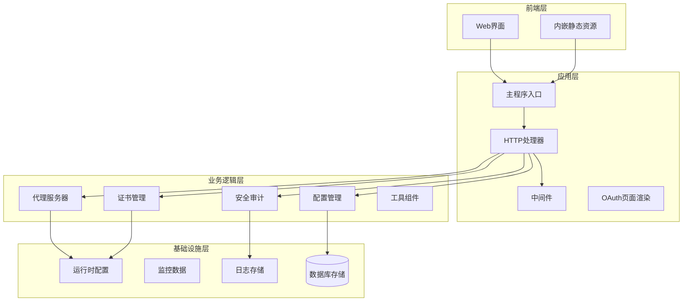
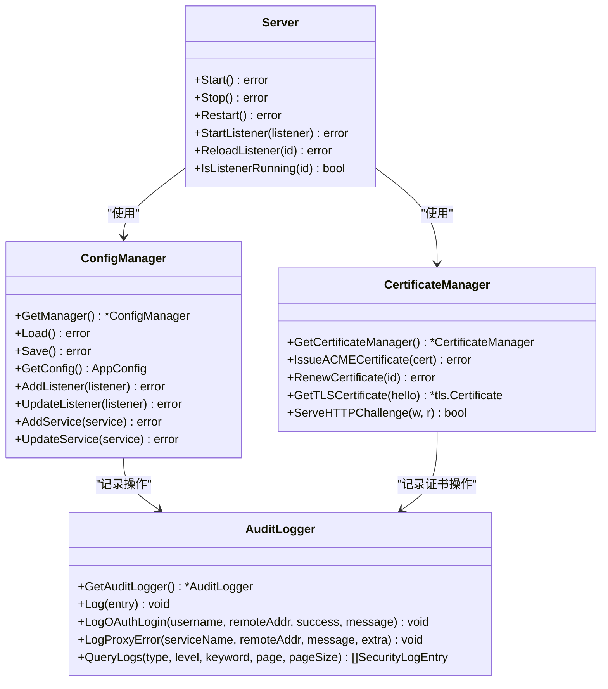
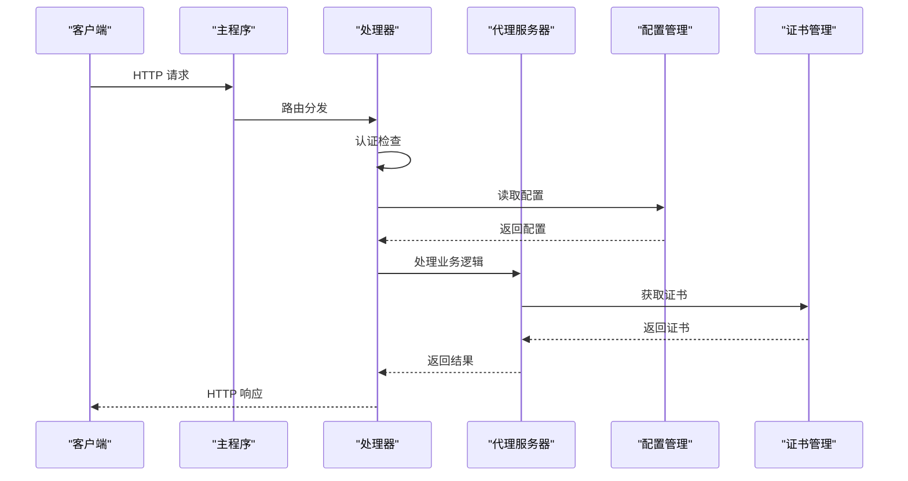

# 项目简介

<cite>
**本文档引用的文件**
- [README.md](file://README.md)
- [main.go](file://src/main.go)
- [models.go](file://src/models/models.go)
- [server.go](file://src/fnproxy/server.go)
- [manager.go](file://src/config/manager.go)
- [certificate_manager.go](file://src/utils/certificate_manager.go)
- [audit_log.go](file://src/security/audit_log.go)
- [auth.go](file://src/handlers/auth.go)
- [api.go](file://src/handlers/api.go)
- [auth_middleware.go](file://src/middleware/auth.go)
- [system.go](file://src/utils/system.go)
- [index.html](file://src/static/index.html)
- [page.go](file://src/pkg/oauth/page.go)
</cite>

## 目录
1. [项目概述](#项目概述)
2. [核心价值主张](#核心价值主张)
3. [设计理念](#设计理念)
4. [主要功能特性](#主要功能特性)
5. [技术架构](#技术架构)
6. [目标用户群体](#目标用户群体)
7. [部署优势](#部署优势)
8. [安全特性](#安全特性)
9. [应用场景](#应用场景)
10. [发展历程与未来规划](#发展历程与未来规划)

## 项目概述

Caddy Panel 是一个基于 Go 语言开发的轻量级服务管理面板，专为统一管理各类网络服务而设计。该项目采用现代化的架构设计，将前端静态资源内嵌到可执行文件中，实现了真正的单文件部署能力，无需额外的静态文件依赖。

项目的核心价值在于提供了一个功能完整、安全可靠的统一管理平台，涵盖了网站管理、反向代理、静态站点、跳转规则、证书管理、OAuth 访问控制、用户管理、SSH 终端和运行状态监控等全方位的管理功能。

## 核心价值主张

### 一体化服务管理
- **统一入口**：通过单一管理界面集中管理所有网络服务
- **实时监控**：提供运行状态、流量、连接数等实时数据
- **热重载支持**：配置变更无需重启即可生效
- **多协议支持**：HTTP/HTTPS、WebSocket、TCP 等多种协议

### 企业级安全保障
- **多层认证**：支持用户名密码、OAuth、Token 多种认证方式
- **加密传输**：所有敏感数据均经过加密处理
- **审计日志**：完整的操作记录和异常追踪
- **防火墙功能**：内置 IP/Country 级别的访问控制

### 开发者友好体验
- **单文件部署**：无需复杂的环境配置
- **跨平台支持**：同时支持 Windows 和 Linux 系统
- **现代化前端**：基于内嵌的静态资源，无需额外部署
- **RESTful API**：完善的接口设计，便于集成和扩展

## 设计理念

### 轻量化设计
项目采用"最小可行产品"理念，专注于核心功能的实现，避免过度复杂化。通过模块化设计，将不同功能拆分为独立的组件，既保证了功能完整性，又保持了系统的简洁性。

### 安全优先
安全是项目设计的核心考量因素。从数据存储到网络传输，从用户认证到访问控制，每个环节都采用了业界标准的安全实践。特别是对敏感信息的加密存储和传输，确保了系统的整体安全性。

### 可靠性保障
通过单实例保护、优雅关闭、健康检查等机制，确保系统在各种异常情况下都能保持稳定运行。同时提供了完善的错误处理和日志记录机制，便于问题排查和系统维护。

### 易用性原则
界面设计简洁直观，操作流程符合用户习惯。通过合理的默认配置和智能的错误提示，降低了用户的使用门槛。

## 主要功能特性

### 网站管理
- **多端口监听**：支持 HTTP/HTTPS 多端口同时监听
- **动态配置**：支持在线添加、修改、删除监听器
- **状态监控**：实时显示监听器运行状态和统计数据
- **热重载**：配置变更后自动应用，无需重启

### 服务规则管理
- **反向代理**：支持 HTTP/HTTPS 反向代理，支持 WebSocket
- **静态文件**：提供静态文件服务，支持目录浏览
- **重定向规则**：支持 301/302 等多种重定向类型
- **URL 跳转**：灵活的 URL 匹配和跳转规则
- **文本输出**：支持自定义文本响应

### 证书管理
- **多源证书**：支持导入、ACME 自动申请、外部文件同步
- **自动续期**：ACME 证书自动续期，无需人工干预
- **动态选择**：按域名自动匹配证书，支持回退机制
- **挑战验证**：支持 HTTP-01 和 DNS-01 两种验证方式

### 认证与授权
- **OAuth 集成**：支持 OAuth 2.0 认证流程
- **多用户支持**：支持多个用户账户，区分管理员和普通用户
- **Token 认证**：支持独立的访问令牌
- **会话管理**：基于 JWT 的无状态会话管理

### SSH 终端管理
- **本地终端**：提供本机命令行访问
- **远程连接**：支持 SSH 远程连接管理
- **连接测试**：内置连接连通性测试
- **会话恢复**：支持断线重连和会话恢复

### 运行监控
- **系统状态**：CPU、内存、网络等系统资源监控
- **服务统计**：各监听器和业务服务的详细统计
- **访问日志**：完整的访问记录和分析
- **安全审计**：所有重要操作的审计日志

## 技术架构

### 整体架构图

**架构图来源**
- [main.go:1-516](file://src/main.go#L1-L516)
- [server.go:1-800](file://src/fnproxy/server.go#L1-L800)
- [manager.go:1-791](file://src/config/manager.go#L1-L791)

### 核心组件关系

**类图来源**
- [server.go:37-50](file://src/fnproxy/server.go#L37-L50)
- [manager.go:18-31](file://src/config/manager.go#L18-L31)
- [certificate_manager.go:126-133](file://src/utils/certificate_manager.go#L126-L133)
- [audit_log.go:15-20](file://src/security/audit_log.go#L15-L20)

### 数据流处理

**序列图来源**
- [main.go:112-431](file://src/main.go#L112-L431)
- [api.go:129-137](file://src/handlers/api.go#L129-L137)
- [server.go:293-324](file://src/fnproxy/server.go#L293-L324)

## 目标用户群体

### 小型团队
- **开发团队**：需要统一管理多个微服务和 API 接口
- **运维团队**：负责多环境部署和监控
- **测试团队**：需要快速搭建测试环境和代理服务

### 个人开发者
- **独立开发者**：需要管理自己的博客、API 服务等
- **开源项目维护者**：需要统一管理项目相关的服务
- **技术爱好者**：希望学习和实践现代 Web 服务架构

### 企业用户
- **中小型企业**：需要统一的 Web 服务管理平台
- **SaaS 服务提供商**：需要管理多租户的代理服务
- **DevOps 团队**：需要自动化部署和监控能力

### 技术栈适配
- **Go 生态系统**：充分利用 Go 语言的优势
- **容器化部署**：支持 Docker 等容器化部署
- **云原生架构**：支持 Kubernetes 等云原生平台

## 部署优势

### 单文件部署能力
项目实现了真正的单文件部署，无需额外的静态文件或配置文件。所有前端资源都通过 Go 的 embed 功能内嵌到可执行文件中，部署时只需要一个可执行文件即可运行。

### 无外部依赖特性
- **零外部依赖**：不依赖任何外部数据库或其他服务
- **自包含运行**：所有功能都在单一进程中完成
- **简化运维**：减少了部署和维护的复杂度

### 跨平台兼容
- **Windows 支持**：完整的 Windows 平台支持
- **Linux 支持**：优化的 Linux 平台性能
- **ARM 支持**：支持 ARM 架构的服务器

### 快速启动
- **启动速度快**：利用 Go 语言的启动优势
- **内存占用低**：优化的内存使用模式
- **资源效率高**：高效的资源利用和管理

## 安全特性

### 多层次安全防护
项目采用了多层次的安全防护机制，从网络传输到数据存储，从用户认证到访问控制，形成了完整的安全体系。

### 加密与认证
- **传输加密**：支持 HTTPS 和 TLS 加密
- **数据加密**：用户密码和敏感数据加密存储
- **认证机制**：支持多种认证方式，包括 OAuth、Token 等
- **会话管理**：基于 JWT 的安全会话管理

### 审计与监控
- **操作审计**：记录所有重要操作的详细信息
- **访问日志**：完整的访问记录和分析
- **异常监控**：实时监控系统异常和安全事件
- **合规支持**：满足基本的企业合规要求

### 防火墙功能
内置的防火墙功能提供了 IP 和国家级别的访问控制，可以有效防止恶意访问和攻击行为。

## 应用场景

### 开发测试环境
- **本地开发**：为开发者提供统一的本地服务管理
- **测试环境**：支持多环境的测试服务管理
- **CI/CD 集成**：可以集成到持续集成和部署流程中

### 生产环境部署
- **Web 服务**：作为 Web 应用的统一入口和代理
- **API 网关**：作为 API 服务的统一管理和路由
- **微服务网关**：支持微服务架构的服务发现和路由

### 特殊用途
- **内网穿透**：支持内网服务的外网访问
- **负载均衡**：作为简单的负载均衡器
- **安全网关**：提供额外的安全防护层

## 发展历程与未来规划

### 当前版本特性
项目目前处于稳定发展阶段，已经实现了核心的功能需求，包括：
- 完整的服务管理功能
- 企业级的安全特性
- 良好的用户体验
- 简化的部署流程

### 技术演进路线
- **性能优化**：持续优化内存使用和处理性能
- **功能扩展**：根据用户反馈增加新的功能特性
- **集成增强**：加强与其他系统的集成能力
- **监控完善**：提升监控和告警功能

### 社区发展
项目致力于建立活跃的社区生态，包括：
- **文档完善**：持续改进文档质量和覆盖面
- **插件系统**：考虑引入插件机制支持功能扩展
- **第三方集成**：支持更多第三方服务的集成
- **开源协作**：欢迎社区贡献和反馈

### 未来展望
随着项目的成熟和技术的发展，计划在以下几个方面进行重点投入：
- **云原生支持**：更好地支持云原生架构和部署
- **AI 辅助**：引入 AI 技术提升用户体验和智能化水平
- **国际化**：支持多语言界面和国际化功能
- **企业服务**：提供更完善的企业级服务和支持

通过持续的技术创新和功能完善，Caddy Panel 旨在成为企业级服务管理的标准解决方案，为用户提供简单、可靠、安全的服务管理体验。